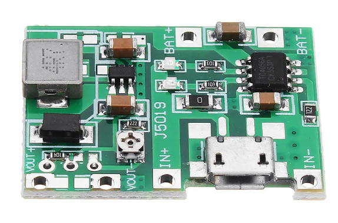
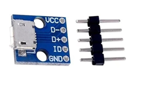

# 555 Fizzle Loop Synth V4

Source: https://www.instructables.com/555-Fizzle-Loop-Synth-V4/

---

## Introduction

I've hit a pretty significant milestone with this Instructable - my 200th! It's been a busy 9 years, building and learning a lot of new skills whist producing these 200 'ibles - and it's been a blast.

Thanks to everyone who has ever voted for me in a competition or given me some positive vibes - you guys make it all the more fun for me.

For the 200th 'ible I present to you my latest synth - the 555 Fizzle Loop Synth. Some of you might recall that I have built and published a few other iterations of this synth but this one really takes it to another level! You can check out the other versions in the below links.

The synth is based around a couple 555 timers along with a 40106 Hex Schmitt trigger and a 4040 Binary Counter. I was over a friends house recently and we were listening to some acid house music and thought it sounded a little like my other fizzle loop synths. I decided to revisit the build and add a few other controls to be able to make beats.

The new version allows touch control modulation and has a built in tone and beat generator via the 4040 and 40106 IC's. The 555 timers create the tones and these can be controlled 3 ways, through a pot, slider and LDR.

It's a really run little synth which has a heap of different beats that can be generated and controlled. I also made a custom PCB to make life a little easier.

Here are the other iterations of the Fizzle Loop Synths

[V1](https://www.instructables.com/Fizzle-Loop-Synth-555-Timer/)

[V2](https://www.instructables.com/Fizzle-Loop-Synth-II/)

[V3](https://www.instructables.com/Fizzle-Loop-Synth-V3/)

## Step 1: The Circuit & Board

I created a schematic and board files in Eagle which makes life a lot easier when putting the PCB together. You can find the schematic and board files along with the gerber files in this [Google Drive link](https://drive.google.com/drive/folders/1L0cG3s8eofmWnCaaOoxGSxFMp1p22EOy?usp=sharing). All you need to do if you want to get one printed is to save the gerber file and send it to someone like [JCLPCB](https://jlcpcb.com/b?utm_source=bing_ads&utm_medium=cpc&utm_campaign=tyc_EU_20200708&msclkid=28a272e339c2140a9f5112a727bc5569) (Not affiliated) and they'll print up the board for you.

If you know how to use Eagle then please take a look at the schematic and board and see if you can make any improvements. If you have never used Eagle before, then I highly recommend the following 2 Sparkfun's tutorials.

[Creating Schematics](https://learn.sparkfun.com/tutorials/using-eagle-schematic/all)

[Creating Boards](https://learn.sparkfun.com/tutorials/using-eagle-board-layout)

You can download Eagle for free [here](https://learn.sparkfun.com/tutorials/how-to-install-and-setup-eagle)

It's actually easier then it seems and a lot of fun as well

I've included a PDF of the schematic along with a parts list. You can also find this information in the Google drive link above.

- [555 Fizzle Loop Synth](pdfs/555 Fizzle Loop Synth.pdf)
- [555 Fizzle Loop Synth](pdfs/555 Fizzle Loop Synth.pdf)
- [Parts List - 555 Fizzle Loop Synth Circuit](pdfs/Parts List - 555 Fizzle Loop Synth Circuit.pdf)

## Step 2: The Rest of the Parts

Along with the circuit, you'll need a few other parts to be able to build this synth.

Parts:

1. Opal Acrylic - [eBay](https://www.ebay.com.au/itm/Coloured-Perspex-Acrylic-Sheets-Cut-Panels-Free-Tracked-Shipping/221974331742?_trkparms=ispr%3D1&hash=item33aeb3815e:g:AGcAAOSwvmNa~SjK&amdata=enc%3AAQAFAAACcBaobrjLl8XobRIiIML1V4Imu%252Fn%252BzU5L90Z278x5ickkgCVySCgrNFPU8Iu85TabMMqb%252FzFiWrwNQbas1nj5sgePqtHbGIEESoeITQLLMNzCN0BvZyosN4vFoRXDn46UR0zt3zLN%252FENLTJ%252FSvjcTUdOCsuKVm2bxl4uHhmFqup2NOyetybAA2qZqnRVPU08skAFQ5XGV%252Fav94SHtZhLQZpX2xqhFm3mc9KF3OIePAlGzugE0%252F2Ykrarf3ODfLb2%252BsDdPho1VFzHZagjc4i9ext9RKar%252F5aKscY%252FdjmWfdgFecdImNJqzVkoaHt8jzJ3N0MsvblLkIF%252FXJKzwWgrDuQN3aIyVHdXN6esifJ4%252BUjAbV9clvEUewXMkrJWxfXi3Ar98U0FVK66I2QiQmYq6r%252FWRah8JVhJKOC53Ry3ffuAXk7PVvHXCd%252FH0%252FLCK3dGc7hFDhbPq75Yt2rNttHbh9QYl2wbFTsWc3QWm%252BrCgvGH7UsDQtR1M8Z5yE019tB4bFh5yxe7B7JV7t%252BWxTqHfJurls5G5Hw2qB3vWqcCJ5oLalXeP74Ux6W0blC6q2sBWA1w%252FNhTvlnmZ1yEsE%252FeFC33inIwHJGV7ouUu4UO56DcyVHv1twQQ7%252BRg%252FDMU%252FMkV0HUkZk894iaDTXGhfvNgfX3uiDcmOBV9l%252FQXleseleUSPwVlCGqKABlG7bdwx%252B7uLGkl2u6bMHSBnb6NiiF9w51EpwBuIJKGaA7I%252BFNwz5Hicf1WyJhnX2XKR1OuR00AwuoFjhBq6dlO2BgNJ%252FjzjMgzDz%252FzEio4ORnp0UjLEnoG8h%252BA0NUXnC4KbbQ9GWsLiw%253D%253D%7Ccksum%3A22197433174214eecebc7cc748f2a6911b601d5bbb4f%7Campid%3APL_CLK%7Cclp%3A2334524). You can use any colour you want

2. 40mm X 80mm X 10mm length of hard wood (for making the case) - Hardware store

3. Potentiometer Knobs x 5 - [eBay](https://www.ebay.com.au/sch/i.html?_from=R40&_trksid=p2047675.m570.l1313&_nkw=potentiometer+knob&_sacat=0)

4. Potentiometer slider Knob - [eBay](https://www.ebay.com.au/sch/i.html?_from=R40&_trksid=p2334524.m570.l1313&_nkw=potentiometer+slider+knob&_sacat=0&LH_TitleDesc=0&_osacat=0&_odkw=potentiometer+knob)

5. Rotary Switch 3 positions - [eBay](https://www.ebay.com.au/itm/SR16MM-Rotary-Switch-2-Pole-3-4-position-1-Pole-5-6-8-Position-Axis-Band-Swi-3C/224257488773?hash=item3436c9b785:g:dTYAAOSwsxNe101N)

6. 2 X SPDT switches - [eBay](https://www.ebay.com.au/sch/i.html?_from=R40&_trksid=p2334524.m570.l1313&_nkw=spdt+toggle+switch+mini&_sacat=0&LH_TitleDesc=0&_osacat=0&_odkw=spdt+toggle+switch)

7. Momentary 'lock' switches - [Ali Express](https://www.aliexpress.com/item/32992258393.html?spm=a2g0s.9042311.0.0.c9cf4c4dAmSR7K). The ones I got have LED's in them but I had issues getting to work.

8. Water Decal - [eBay](https://www.ebay.com.au/itm/up-to-20pcs-A4-Waterslide-Transfer-Decal-Paper-Inkjet-Laser-Printer-Soap-Glass/333684811956?ssPageName=STRK%3AMEBIDX%3AIT&var=542773779046&_trksid=p2060353.m2749.l2649)

9. Voltage regulator and Charger module - [eBay](https://www.ebay.com.au/sch/i.html?_from=R40&_trksid=p2334524.m570.l1313&_nkw=+3.7V+9V+5V+2A+Adjustable+Step+Up+18650+&_sacat=0&LH_TitleDesc=0&_sop=15&_osacat=0&_odkw=voltage+regulator+adjustable+charging)

10. Battery. I like to use mobile batteries as i can usually get them for free from my local e-waste. However, if you can't then you could use any li-po style battery. you could even just use a 9v and you wouldn't need the voltage regulator module

## Step 3: Putting the Circuit Board Together

This is pretty straight forward as all you need to do is to add the components as per what the board has printed on it. However, I've added a bit of a diagram to show where the the parts not soldered onto the board need to go.

Steps:

1. As always, I start with the flattest components which happens to be the resistors

2. Once these are soldered on I start then with the IC sockets. You might notice that there isn't any sockets for the 555 timers. Only reason why is I ran out of them!

3. I usually add the pin connectors next and then the rest of the components like the caps and transistors.

4. Once everything has been soldered I then do a test of the board to make sure everything is working ok. It wasn't! I missed connecting pins 2 and 6 together on the board so had to add a bodge wire to connect them together. For some reason as well, one of the timers wasn't getting positive so I connected the pin to a positive connection via a bodge wire. Don't worry - I have fixed these on the PCB and schematic so you won't have this issue.

5. If the board works then congrats - you are ready to move onto the next step

## Step 4: Making the Front Panel

To design the panels I used [Inkscape](https://inkscape.org/), a vector graphics editor which you can download for free! There's a lot of information available on how to use it and I would suggest you do a couple of the basic tutorials to familiarize yourself with the different features if you haven't used it before

I did a video on how to design knob scales and also make a front panel which I have included above.

T[here](https://inkscape.org/~sincoon/%E2%98%85knob-scale-generator) is even an extension that you can download so you can design knob scales easily and simply which you can download here

However, if you don't want to bother learning how to design your own, you can always just use mine which I have attached as a PDF. I have also included the Inkscape file which can be found in my [Google drive](https://drive.google.com/drive/folders/1cdEKVC5Us2lCTEbqzDl3VlNQ0YUfLifI?usp=sharing) so you can play around with that as well if you want to.

- [555 fizzle loop synth 2](pdfs/555 fizzle loop synth 2.pdf)

## Step 5: Adding the Water Acrylic to the Front Panel

Steps:

1. Once you have your design you should print a few copies of it on normal A4 paper. This will allow you to use it as a template to decide how big to cut the opal acrylic which is what the front panel is made from.

2. Cut the acrylic panel to the right size. I used a band saw to do this but you could do it by hand as well.

3. Next, print the panel design directly onto decal paper and leave to dry for 30 minutes.

4. Add the water decal to the acrylic by placing the decal into some warm water and once it start to lift off, carefully slide it onto the acrylic. Ensure everything is lined up right and remove any excess water.

5. Once fully dried, spray some clear acrylic paint on the panel and repeat 2 to 3 times.

## Step 6: Drilling and Cutting the Front Panel

Most of the drilling is pretty straight forward if you use a stepped drill piece. There is one tricky art though and that is making the slit for the slider potentiometer. I used a demel with a cutting blade to make the initial cut and then had to use some small files to finish it off.

Steps:

1. Before I started to drill any holes, I used a punch first to help ensure I drilled in the centre.

2. Next, use a stepped drill piece to drill out the holes for the pots, switches and speaker grill

3. Once all the holes have been drilled it's time to make the slit for the slider pot. To do this I placed a metal ruler against the panel and aligned it up the the line where the slot needs to go. I then secured it in place with a couple of clamps and carefully made the cut with a cutting wheel on a dremel

4. Once I had the initial cut I then enlarged and cleaned the skit up with some small files

5. Laslty, I drilled a couple small holes for the screws that are used to attched the slider pot to the front panel

## Step 7: Making the Case

I used some strips of hardwood to make the case. It's used for edging and can be brought at any hardware store. The dimensions are 40mm X 10mm X 1000mm

Steps:

1. The first thing you need to do is to cut a groove along the wood in order to secure the panel into. I use a dremel with a router attachment to do this.

2. Secure the wood with some clamps and run the bit near the top of the wood. Take your time and make sure you keep the dremel nice and straight.

3. Measure and cut the wood to size. The best way to do this is to just slip in the front panel into the groove of the wood and measure where to make the cuts

4. Once the wood is cut I like to then round off the edges. The easiest way to do this is to use a belt sander and just round the edges this way. You could do it once the panel as been added but there is a danger that you might sand the front panel (I have done this in the past and its not good)

4. Before you secure the front panel into the case, paint the top edges of the wood. When the panels in place it will make it hard to do and you might get paint on the panel. I used some clear stain to highlight the grain in the wood. The reason why you don't paint it all is you need to sand the wood once the case is complete.

5. Place the front panel into the grooves of the wood and use some PVC to glue it together. If you find the panel is a little big and the wood doesn't right then just remove a little of the acrylic along the edge with a sander.

6. Clamp and leave to dry for 12 hours.

## Step 8: Adding the Components to the Front Panel

Now that you have the front panel secured into the case, it's time to add the components.

Steps:

1. Secure the potentiometers to the front panel. Be careful when tightening the nuts as you don't want to damage the front panel graphics.

2. Next, add the slider pot. You will need to drill a couple small holes if you haven't already for the screws used to hold the slider pot into place. The best way I find to ensure that they holes are drill right is to use a caliper to measure the hole distance. I've used masking tape before to make a template but there is a danger that the tape could lift up the graphics on the front panel

3. Secure all of the switches including the momentary ones

## Step 9: Making the Base for the Case

Steps:

1. The base is pretty straight forward. Just measure and cut a piece of ply wood to fit onto the bottom of the case.

2. Secure the base to the case with some screws

3. Next, to finish off the case and make the base flush with the case, you will need to sand the sides. This is why you secure the base now, so you can sand everything together. I use a belt sander to do the job

4. Once everything is flush you can finish painting the case and remove the base once dried

## Step 10: Adding the Battery

Now that the base has been done, you can now go ahead and add the battery to the base. I used an old mobile battery to run the synth as they are pretty reliable, work well on projects like this even if they are old and can be recharged meaning I don't have to remove the base every time I need to change a battery.

Steps:

1. To be able to charge and set the voltage I use a small module which can do both things. I did an ible on how to use and wire-up one of these modules which can be found [here](https://www.instructables.com/Reuse-Old-Mobile-Phone-Batteries/)

2. Glue or tape the module onto the battery and connect the ground to the battery. If you connect the positive to the module as well, I found that the module will slowly drain the power so it's best to connect the positive to the on/off switch. Check out the wiring diagram I did below for reference

3. You will also need to wire-up a micro USB module as well to the 'in' positive and negative. The reason I don't use the one on the module is it is too recessed on the board (only fault with these modules) and it makes it hard to access.

4. To add a micro USB module to the case, use a small file and make a small cut-out, large enough for the module to sit flush in. Glue into place.

5. You can probably stop there as the rest of the wiring will be done to the front panel which is the next step

## Step 11: Wiring Everything Up

The first image shows you how to wire all of the components up to the circuit board. Whenever I wire something like this I always do 2 things; first, I make sure that I lay the base next to the main section of the case. This will allow you to easily lay everything flat when adding the wires and will help if you ever have to take it apart again. Second, I make the wires as short as I can but ensure that the case and base can lay flat.

Steps:

1. First, wire-up the momentary latching switches. Note that one solder point on the switch needs to be wired to one of the 'key' solder points on the PCB. Wire from left to right. The last solder point (the 7th one) on the PCB needs to be attached to each of the other wire solder points on the switch. The easiest way to do this is to just connect all of the solder points on the momentary switches together and then connect them to the PCB.

2. next, wire up is all of the pots. Take your time and refer to the reference image to make sure you wire them the right way.

3. Wire-up the rest of the switches, LED, LDR and speaker.

4. If you want to be able to plug in an external speaker (recommended) you will need to add an audio socket as well. Use a switching one so when you plug in the jack, the speaker in the synth turns off and only the external speaker can be heard

4. Lastly, connect the PCB to the solder points on the voltage regulator module.

5. before closing, give the synth a test to make sure it is working properly

## Step 12: So What's Next?

I'm really pleased with the way that this little synth turned out! It's a lot of fun to play and the tones produced are actually pertty decent. I think my favourite thing about this build would be the the different beats it can generate and the 'playability' of it.

I think for version 5 I will look at adding an extra vactrol like I did in V2 and see if I can can a couple different filters. Maybe I'll add 2 LDR's as well so you can play 2 different tones at the same time.

There are so many different mods you could do this this synth and I guess that's why I keep on coming back to it and tryig different things out.

## Downloads

- [555 Fizzle Loop Synth](pdfs/555 Fizzle Loop Synth.pdf)
- [555 Fizzle Loop Synth](pdfs/555 Fizzle Loop Synth.pdf)
- [Parts List - 555 Fizzle Loop Synth Circuit](pdfs/Parts List - 555 Fizzle Loop Synth Circuit.pdf)
- [555 fizzle loop synth 2](pdfs/555 fizzle loop synth 2.pdf)

---
*69 images archived*
