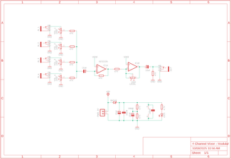
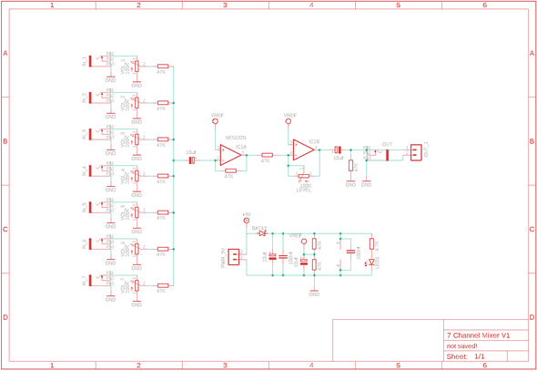
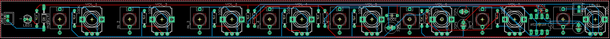

# 7 Channel Mixer (& a 4 Channel Option!)

Source: https://www.instructables.com/7-Channel-Mixer-a-4-Channel-Option/

---

## Introduction

If an oscillator is the heart of a synth, then the mixer is the nervous system that connects everything together.

I’ve tried a whole bunch of different mixers, from passive to multiple IC versions with varying success.However, after discovering Syntherjacks [4 sum portable mixer](https://syntherjack.net/portable-audio-mixer/) I haven’t bothered with anything else!

This mixer works perfectly with my Eurorack set up as I’m using 9V or 5V to power most of the modules and Syntherjacks works on 9V! (there is a diode that reduces the voltage slightly down to 8.3V). You could run this through a normal Eurorack voltage, but you would need to add a step-down converter module and power it down to 9V from 12V

The mixer can use either a TL072 or NE5532 IC. I went with the NE5532 as it works well for audio circuits and is a little less noisy than the TL072. It will consume more power, but I’m not concerned about that due to my Eurorack being rechargeable.

There are 2 versions available of this mixer. The first one is a 7 channel mixer and I use this on my small Eurorack to run the modules.I also designed a 4 channel mixer which will fit in any Eurorack format synth.

All of the files can be found in my GitHub page

## Supplies

I have included a PDF of the parts list with links for all of the parts which you can find on this step in case you want to print it out etc. The PCB and front panel information can be found on the next step

- [Parts List](pdfs/Parts List.pdf)

## Step 1: Getting the PCB & Front Panel Printed

We all have different levels of knowledge, so when it comes to a build like this I want to make sure that I'm providing enough information so anyone with basic soldering skills can make it. That includes ensuring there are instructions on how to get your own PCB's printed (which is super easy!).

So with that said, the first thing you will need to do is to get the front panel and PCB printed. I use [JLCPCB](https://jlcpcb.com/?from=VGS&utm_source=google&utm_medium=cpc&utm_campaign=14177189905&gad_source=1&gbraid=0AAAAABS1QqkiD3-WAMC-R-0N6a2KKPawu&gclid=CjwKCAjwwe2_BhBEEiwAM1I7sfAjCecAjlW7BgEzggjBf0WNDCA4-ZMBy2IrNS7NcwcA4naAhj0_2xoCA-4QAvD_BwE) (not affiliated) to get this done. The front panel is actually just a PCB without any components included! The front design is done in a program called [Inkscape](https://inkscape.org/) (available free) and the panel including the drilled holes is done in [Fusion 360](https://www.autodesk.com/products/fusion-360/personal) (also free!)

The files that you need to build your own Bleep Drum Synth can be found in my [GitHub](https://github.com/lonesoulsurfer/7_Channel_Mixer) page. This includes the parts list, Gerber files for the PCB & front panel, schematic, Arduino script etc. Download the files to your computer

STEPS:

- Send the Gerber files to a PCB manufacturer like [JLCPCB](https://jlcpcb.com/?from=VGBA&gad_source=1&gclid=CjwKCAiAjfyqBhAsEiwA-UdzJCxT2LUX1iS0CvS4HVuZlxetrU2JQNyu0nueQUivgEq7MzfoGlH54RoClQ8QAvD_BwE) who will print the PCB and front panel for you. Download all of the files from my [GitHub](https://github.com/lonesoulsurfer/7_Channel_Mixer) page to your computer and send the zipped Gerber files off to the PCB manufacturer of choice.
- If you have no idea what any of the above means , then check out the Instructable I made on how to get your broads printed which can be found [here](https://www.instructables.com/How-to-Get-a-PCB-Printed-Using-Gerber-Files/).
- NOTE: The manufacture will include an order number on both the PCB and front panel. It doesn't really matter where it is on the PCB but you don't want it on the front on the front panel!
- Over at JLCPCB you can 'specify a location' once the Gerber files have been loaded so click this for the front panel and specify in the comment section that you want the order number on the back of the panel. The manufacturer will add it to the back where indicated.

## Step 2: Adding Components to the Back of the Board

The PCB is 2 sided. one side has the passive components like resistors and capacitors, the other has the active parts like potentiometers and audio sockets. we'll start with adding the passive parts on the reverse of the board

STEPS:

- Always good to start with the lowest profile components which happens to be the resistors.  Check the values with a multimeter before soldering in place so you don't have to check afterwards if you need to troubleshoot
- Next add the Bat 43 diode
- Now you can add the JST male connector which is where you will power the mixer and also add a 8 DIP IC socket.  You can also add the IC now that the socket is soldered into place
- Lastly, you can solder the capacitors into place

## Step 3: Adding Adding Components to the Front of the Borad

Now it is time to add the potentiometers and the rest of the components

STEPS:

- Like the reverse side, start with the lowest profile parts which are the audio sockets.  Solder each into place, making sure that they are seating correctly on the PCB.
- Now you can add the potentiometers.  I usually just solder the legs into place first and then solder the side lugs once I know everything is working right.
- I leave the LED for last.  This is so I can add the front cover to the PCB to work out exactly how high the LED needs to be in order for the top of it to stick out of the front panel.  Bend one of the LED legs once you have the height right so it stays in place and then solder the legs.
- It's always good to now test and make sure that the PCB works.  Connect it to 9V, plug in an amp and connect a module to the mixer.  If you hear sound then you are good. Try the volume and audio connection on each channel to ensure that they work.

## Step 4: Adding the Front Panel & Connecting It to the Eurorack

You may have noticed that I have used Potentiometers that you don't use a nut to secure them to the front panel. As we are using 8 audio sockets that have their own nuts, there isn't any need to also secure the potentiometers.

STEPS:

- Place the font panel on top of the potentiometers and sockets.  The front panel should fit perfectly.  If a component isn't going through one of the holes in the front panel, then you probably have a part soldered on that isn't sitting right.  You can heat up the solder on the pads and endure that the part is sitting right
- Now add the nuts to each of the audio sockets.
- This panel was designed to be used on my Eurorack.  I wanted the ability to connect all audio to the top of the Eurorack.  My Eurorack itself is made from wood and even though all of the modules are in Eurorack format, the mixer has been designed to fit my Eurorack.
- However, I did design a Eurorack format, 4 channel mixer which will fit perfectly in a standard Eurorack case.  The files for both mixers can be found in my GitHub page

## Downloads

- [Parts List](pdfs/Parts List.pdf)

---
*32 images archived*
