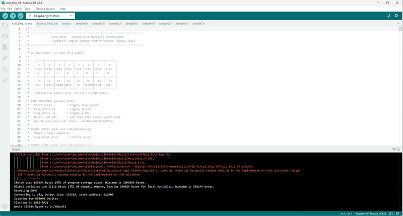

# Acid Drip - a Acid Bassline Synth Running on a Raspberry Pi

Source: https://www.instructables.com/Acid-Drip-a-Acid-Bassline-Synth-Running-on-a-Raspb/

---

## Introduction

Have you ever heard a Roland TB-303 Bassline synth being played? Well if you're listened or danced to house, trance or techno music, then there is a good chance you have heard one before.

I decided I wanted to make my own (you can actually by a Behringer TD3-303 clone for relatively cheap - but why buy when you can make!) using a Raspberry Pi and a handful of components.

The original 303 uses a lot of passive and components like Op amps and matched pairs of transistors to build the classic filters and sound effects you hear. However, I'm a little too lazy these days to have to work with all those components and built the synth on a Raspberry Pi.

Unlike the original, Acid Drip is very easy to play - you can turn it on and start busting out grooves straight away. It has a heap of functions that are intuitive and easy to use (this took ages to get right and I'm still finessing parts of the code!!!), and it also has a sync in so you can connect it to other synths like a drum machine and play along.

I have used every GPIO on the Raspberry pi with the majority going to the 16 switches which are used to interact with the sequencer. As I couldn't add any other connections, I had to be a little canny with how the functions are activated and how the synth is started/stopped etc.

As I had a tonne of room still left on the Raspberry Pi, I decided to add a drum machine as well so you can add beats on top of the acid bassline. I won't go to much into this yet - I'll save the intro to the drum machine until the end of this 'Ible.

Well there is really no use talking about a musical thing - you need to hear it. Check out the vid so see it in action!

Here are a few online features on the Acid Drip

[Noxalmusic](https://noxalmusic.autonomaailab.com/lonesoulsurfer-acid-drip-open-source-groovebox/)

[Hackster.io](https://www.hackster.io/news/a-modern-twist-on-the-synth-that-defined-techno-653653c14b15.amp)

[Synthanatomy](https://synthanatomy.com/2026/06/lonesoulsurfer-acid-drip-open-source-groovebox-with-synth-and-drum-machine.html)

[Matrixsynth](https://www.matrixsynth.com/2026/06/meet-acid-drip-diy-bassline-synth-drum.html)

[Rackears](https://www.rackears.io/products/acid-drip-acid-drip)

## Supplies

Parts

As usual, I have provided the parts list as a PDF which can be found as an attachment on this step. You can then easily print this off if needed or go to the links provided in the PDF and order the parts as required. You can also find the list in excel on my [GitHub](https://github.com/lonesoulsurfer/Acid_Drip_Bassline_and_Drum_Synth) page

Getting the PCB & Front & Back Panel Printed

We all have different levels of knowledge, so when it comes to a build like this I want to make sure that I'm providing enough information so anyone with some basic soldering skills can make it. That includes ensuring there are instructions on how to get your own PCB's printed (which is super easy!)

So with that said, the first thing you will need to do is to get the front panel and PCB printed. I use [JLCPCB](https://jlcpcb.com/?from=VGS&utm_source=google&utm_medium=cpc&utm_campaign=14177189905&gad_source=1&gbraid=0AAAAABS1QqkiD3-WAMC-R-0N6a2KKPawu&gclid=CjwKCAjwwe2_BhBEEiwAM1I7sfAjCecAjlW7BgEzggjBf0WNDCA4-ZMBy2IrNS7NcwcA4naAhj0_2xoCA-4QAvD_BwE) (not affiliated) to get this done. The front panel is actually just a PCB without any components included! The front panel design is done in a program called [Inkscape](https://inkscape.org/) (available free) and the panel including the drilled holes is done in [Fusion 360](https://www.autodesk.com/products/fusion-360/personal) (also free!)

The files that you need to send to [JLCPCB](https://jlcpcb.com/?from=VGBA&gad_source=1&gclid=CjwKCAiAjfyqBhAsEiwA-UdzJCxT2LUX1iS0CvS4HVuZlxetrU2JQNyu0nueQUivgEq7MzfoGlH54RoClQ8QAvD_BwE) can be found in my [GitHub](https://github.com/lonesoulsurfer/Acid_Drip_Bassline_and_Drum_Synth) page. Download the repo to your computer.

STEPS:

Send the Gerber files (keep them zipped) to a PCB manufacturer like [JLCPCB](https://jlcpcb.com/?from=VGBA&gad_source=1&gclid=CjwKCAiAjfyqBhAsEiwA-UdzJCxT2LUX1iS0CvS4HVuZlxetrU2JQNyu0nueQUivgEq7MzfoGlH54RoClQ8QAvD_BwE) who will print the PCB and front panel for you.

1. If you have no idea what any of the above means , then check out the Instructable I made on how to get your broads printed which can be found [here](https://www.instructables.com/How-to-Get-a-PCB-Printed-Using-Gerber-Files/).
2. JLCPCB used to print an order number onto the PCB which was super annoying, especially if you didn't specify where to add it. Now you don't have to worry about it as they no longer do it
3. when choosing the surface finish for the front panel, pick Lead Free HASL as this will ensure that there is no lead in the front panel
4. You can pick whatever colour you want to choose for your front panel and PCB.

- [Acid Drip - Parts List](pdfs/Acid Drip - Parts List.pdf)

## Step 1: Adding the Components to the PCB - Front Side

I started with adding the Cherry MX switches. The reason being, I wanted to make sure that the board didn't have any other components whist soldering them into place so I could get them as straight as possible. Other components can get in the way etc. I found this worked well.

A NOTE ON THE PCB & FRONT PANEL

You may have noticed that your front panel and PCB and the ones int he images are different. That's because I made improvements to version 1 and you guys get the better option. The main change as, the drum machine added was an afterthought and I had to make some running changes to get a mix pot for the acid synth and drums along with a way to be able to add a sync in if required. Since I have used every single GPIO pin on the Raspberry Pi - it needed some clever code workarounds to get it to work.

STEPS:

1. Add key caps to each of the switches. This will ensure that they sit straight whist you solder them into place
2. Add a couple into the PCB (one at each end) and solder one leg of each of the switches first. turn over and make sure that they are straight (they should be as there are plastic legs that help help them straight).
3. Solder the other leg into place. Do this for the rest of the switches
4. Now you can continue to solder the rest of the components to the front side of the panel. start with the audio jacks as these are the lowest profile and work your way up, I did the toggle switches next and then the pots

## Step 2: Adding the Components to the PCB - Back Side

Usually, I would be telling you to add the lowest profile components first which in this case would be the resistors. However, due to the cherry caps, we have left this until the 2nd step!

STEPS:

1. Place each of the resistors into place into the PDC and solder
2. Now do the same for the JST connector. This connector is where you will be providing the 5V's to run everything - more on that later
3. Add the caps to the board and also solder these into place
4. Now you can add the Raspberry Pi. To do this, first add some pin connectors to the Raspberry Pi. this will allow you to easily remove it if required
5. Now push it into place on the PCB and solder each of the pin legs to the solder points

## Step 3: Adding the Screen

The screen is actually attached to the front panel and is connected to the PCB via some male header pins. this way, you can have a great fit to the front panel of the screen and easily remove the front panel if required.

STEPS:

1. First, trim the tops of the header pins where they are soldered. You just want to remove a small bit of the top of the header pin so they won’t interfere with the front panel.
2. In the front panel, there are 4 holes where the TFT screen will be attached. Add a 20mm M2 screw (I like to use hex socket head screws) to each and then add a M2 nut to secure the screws into place
3. Now, place the screen on top of the screws and align it to the front panel. The screen should sit flat to the front panel as the nuts you added earlier act like spacers.
4. Now - you need to add a small M2 spacer (around 7mm) to each of the screws.
5. You can now add the low profile female header pins to the male ones on the TFT screen and do a test fit.
6. If everything fits as it should, you can then solder the female pins on the low profile header to the PCB.

## Step 4: Adding Spacers to Secure the Front Panel Into Place

There are a number of holes around the outside of the PCB that align to the front panel. These are used to add M2 spacers and screws to secure them together.

STEPS:

1. The first thing to do is to adda M2 screw to each of the holes in the front panel and then spacers to secure them into place.
2. The spacer size you might need to experiment with to get them right. What I did was to add a couple spacers which I thought would be the right size to 2 of the M2 screws at the top and placed the front panel and PCB together. I then checked to see if the spacers on the screen were touching the PCB with the panel spacers in place. If they weren't touching, then I reduced the spacer size until they were.
3. Continue to add the rest of the spacers and then place the front panel onto the PCB. secure into place with M2 nuts
4. Now you can add the potentiometer and toggle switch nuts into place and also the audio socket rings. These all help with keeping the front panel secured
5. Lastly, you can add some pot knobs to each of the pots

- [Acid Drip - Parts List (1)](pdfs/Acid Drip - Parts List _1_.pdf)

## Step 5: Loading the Code

Follow the below to load the code up to the Raspberry Pi. I have provided a full step by step guide so anyone can do this.

Step 1: Install Arduino IDE

Download and install Arduino IDE 2.x from [arduino.cc/en/software](https://www.arduino.cc/en/software).

If you already have it installed, make sure it's version 2.0 or later - the older 1.x IDE can cause issues with the RP2040 core.

Step 2: Install the RP2040 Board Core

The Arduino IDE doesn't support RP2040 boards out of the box. You need to add the Earle Philhower RP2040 core.

2a. Open Arduino IDE. Go to File → Preferences (Windows/Linux) or Arduino IDE → Settings (macOS).

2b. Find the "Additional boards manager URLs" field and paste in this URL:

https://github.com/earlephilhower/arduino-pico/releases/download/global/package_rp2040_index.json
Click OK.

2c. Go to Tools → Board → Boards Manager.

2d. Search for RP2040 and install "Raspberry Pi Pico/RP2040" by Earle F. Philhower III. The install may take a minute — it downloads the full toolchain.

Step 3: Install Required Libraries

1. Acid Drip uses four libraries. Install them all via the Library Manager (Sketch → Include Library → Manage Libraries…).
2. Search for and install each of these:
3. MozziSearch "Mozzi" — install version 2.0 or late
4. Mozzi note: When prompted about dependencies, click Install All.
5. Adafruit GFX Library
6. Adafruit ILI9341
7. EEPROM

Step 4: Open the Sketch

4a. Create a new folder on your computer called Acid_Drip_V4.

Important:
The folder name must exactly match the main .ino filename. Arduino requires this.
4b. Place all sketch files into that folder:

1. Acid_Drip_V4.ino
2. BeatMachine2.ino
3. beats.h
4. sample0.h through sample7.h (all 8 sample files)

4c. Double-click Acid_Drip_V4.ino to open it in Arduino IDE. The other files will automatically appear as tabs across the top of the editor.

Step 5: Select the Right Board and Settings

1. Go to Tools and configure these settings:
2. Board -Raspberry Pi Pico / Waveshare RP2040 Zero
3. CPU Speed -133 MHz (default) or 200 MHz
4. Flash Size -2MB (No FS)
5. USB Stack -Pico SDK
6. Optimize -Fast (-O2)
7. Port -(see Step 6)

To select the board: Tools → Board → Raspberry Pi RP2040 Boards → Waveshare RP2040 Zero

If you're using a generic RP2040 board, choose Raspberry Pi Pico instead — the pin assignments may differ.

Step 6: Connect the RP2040 in Bootloader Mode

The RP2040 needs to be put into bootloader mode before the first upload (or after a crash).

6a. Hold down the BOOT button on the RP2040 board.

6b. While holding BOOT, plug the USB-C cable into the board and your computer.

6c. Release the BOOT button. The board will appear as a USB mass storage device called RPI-RP2 — like a USB flash drive appearing on your desktop.

On subsequent uploads after the first successful one, you can usually skip bootloader mode — just plug in normally and upload directly.
6d. Back in Arduino IDE, go to Tools → Port and select the port that appeared. On Windows it will be a COM port (e.g. COM5). On macOS/Linux it will look like /dev/cu.usbmodem... or /dev/ttyACM0.

Step 7: Upload the Sketch

Click the Upload button (the right-facing arrow →) in the Arduino IDE toolbar, or press Ctrl+U (Windows/Linux) / Cmd+U (macOS).

The IDE will:

1. Compile the sketch (this takes 30–60 seconds the first time)
2. Upload the binary to the RP2040
3. The board will reboot automatically and start running

You'll see Done uploading. in the status bar when complete.

Step 8: Verify It's Working

After uploading:

1. The TFT display should light up and show the Acid Drip UI
2. The step grid and pot bars should be visible on screen
3. Pressing pads should toggle steps on and off
4. Pressing pads 1+2 together starts the sequencer
5. 

Troubleshooting

"No port available" / board not detected Try a different USB cable - many USB-C cables are charge-only and won't work for data transfer.

Compile error about Mozzi Make sure you have Mozzi 2.0 or later. Version 1.x has a different API and will not compile with this sketch. Check via Sketch → Include Library → Manage Libraries and update if needed.

"Multiple libraries found for..." This is a warning, not an error - it's safe to ignore. If you have old copies of Adafruit libraries, you can remove duplicates from your Arduino libraries folder.

Board doesn't appear after entering bootloader mode Try a different USB port on your computer. Some front-panel USB ports on desktop PCs don't provide enough power.

Upload fails with "No device found on..." Re-enter bootloader mode (hold BOOT, reconnect USB) and try again.

Sketch compiles but display shows garbage or nothing Re-check SPI wiring. The ILI9341 display is sensitive to pin assignment - GP6/GP7/GP8/GP10/GP13 must match exactly.

## Step 6: Adding Power

We need to drive the Raspberry Pi with 5V's. A normal mobile phone of 18650 Li-Ion battery are 3.7V so we need a way to boost the voltage up to 5V. You can use a cheap module to do this quite easily. If you are going to use a mobile battery - then you can buy these from Ali Express or [find them for free](https://www.instructables.com/Use-Old-Mobile-Batteries-to-Power-Anything-Almost/)

STEPS:

1. The first thing to do is to add the charging module to the battery. I usually just superglue the module directly to the top of the battery – keeps everything nice and neat
2. Align the + and – of the module to the same on the battery and glue down
3. To connect the battery to the module, I just use resistor legs and connect them together.The module I used has a couple solder points for the battery terminals and also a couple for output
4. Next is to add the step up converter. These little converters are great – they have the ability to output 12v, 9v and 5v. to get them to convert to 5v – you need to remove 2 SMD resistors which are circled on the module. Just use a hot soldering iron or an exacto knife
5. It also has a charging and running LED which isn’t needed – this also has a SMD resister indicated on the board – also remove this
6. Now you can connect the output of the charging module to the input of the step up converter with a couple wires.
7. Add a JST connector to the output of the converter – this connects directly to the 5V input on the PCB
8. Lastly, you can add a couple wires to the 2 solder points near the USB C connector on the charging module and add a USB C socket. This will ensure that you can charge the battery when it is inside the case

## Step 7: Making a Case

I made a simple wooden case for my synth but if you are feeling frisky you could easily design and print a 3D one

STEPS:

1. I decided to have my synth on an angle facing me so it is easier to play. to do this I cut the 2 side pieces at an angle
2. Then measure the front and back pieces and nail and glue them all together
3. You will need to sand down the tops of the back and top sections of the case so they follw the angle of the wood if you are also making a case that faces you like I did. I just used my belt sander to do this which worked fine.
4. Place the front panel into the case and make sure it all fits well. if the sides aren't flush with the panel, then just sand them a bit until they are
5. For the base I used some translucent acylic (it is what I had at hand!) which I think works well in a project like this - you can show off the insides and also see the charging LED.
6. Drill some holes and secure it with some screws. You'll need to add some little sticky rubber feet on the bottom as well to stop it from sliding about when playing it
7. make a slot in the back of the case to fit the USB C connector for charging and secure it into place
8. Now give it a coat of stain or varnish or whatever you want and once dry secure the front panel to the case

## Step 8: How to Play the Acid Drip Bassline Synth

Acid Drip has two modes — the Acid Synthesizer and the Beat Machine — which can run simultaneously and lock in sync. Switch between them at any time by pressing pads 9+10 together.

Getting Started

Press pads 1+2 together to start and stop the sequencer and drum machine. Holding down pads 1+2 together for 2 seconds will reset everything and you get back to the starting pattern.

The three pots shape the acid sound in real time — CUT controls the filter cutoff, RES controls resonance, and DCY controls how long each note rings out. These are your main performance controls and respond instantly while the sequencer is running.

Building a Bassline

The 16 pads represent the 16 steps of the sequencer. A short press toggles a step on or off.

A long press cycles through accent and glide — accent hits the step harder with more filter drive, glide slides the pitch into the next note.

To set the note for a step, hold the pad and turn the CUT pot — the note snaps to whatever scale you have selected.

FUNC Mode

Hold pads 7+8 to enter FUNC mode. The bottom row of pads each map to a function — KEY, RIFF, SOUND, WALK, FX, TEMPO, PLEN and PAT> — and the top row selects the value for whichever function is active.

1. KEY — set the root note (C, D, Eb, F, G, Ab, Bb, B)
2. RIFF — load one of 8 preset riff patterns to start a bassline (DFLT, SQNCE, FUNK, MINI, JUMP, RAVE, SYNC, DARK)
3. SOUND — choose from 8 different synth voices
4. WALK — sets an automatic note walk so the pattern evolves over time (up, down, bounce, random, etc.)
5. FX— assign a per-step effect such as octave up/down, retrigger, arpeggio, overdrive or bit crush
6. TEMPO — pick a preset BPM or tap the pad repeatedly to set tempo by ear
7. PLEN — set the pattern length from 1 to 16 steps
8. PAT> — controls playback order (forward, reverse, ping-pong, random, etc.)

Accent Edit

The accent sound itself — how much extra brightness and resonance an accented step gets, and how long that "squelch" rings out — is fully tunable.

Hold pads 15+16 together for 1 second to enter Accent Edit mode. While active, the three pots are repurposed:

1. CUT— sets how much extra filter brightness an accented step gets
2. RES — sets how much extra resonance an accented step gets
3. DCY — sets how long the accent's filter sweep takes to decay back to normal

Your normal CUT/RES/DCY settings are frozen while you're in this mode, so the bassline's base tone won't change while you tune — only accented steps will sound different as you turn the pots.

Play a pattern with some accented steps active so you can hear the changes as you make them. Hold pads 15+16 again for 1 second to exit — your settings are automatically saved and will still be there next time you power on, until you go back in and change them again.

Saving and Loading

Saving — hold pads 7+8, and hold down either pads 3, 4, 5 or 6 for 1 second to save. Loading — hold pads 7+8, and tap either pads 3, 4, 5 or 6 to load one of the four patch slots. The four dots in the top of the screen show which slots have something saved (yellow = saved, grey = empty).

The Beat Machine

I made this as easy as possible to use! Choose from 16 built-in patterns using the pad grid — everything from straight 4/4 and four-on-the-floor house to breakbeats, latin, drum and bass and more. Each pattern is a complete arrangement across all 8 drum tracks and gives you a solid foundation to work from straight away. There are 8 drum instruments — kick, hi-hat, snare, rim, tom, bass, clap and open hat — playing across a 32-step grid (2 bars of 16th notes). Short-tap any pad to load that pattern instantly.

For individual drum sounds, hold any of the first five drum pads (kick through tom) while turning the pots to adjust that drum's pitch, decay length and volume independently. The pitch knob is exponential — centre is natural speed, and every quarter turn is roughly one octave. These settings save with your patch slots.

Beat Machine FUNC Mode

Hold pads 7+8 to enter FUNC mode on the Beat Machine. The bottom row maps to 8 functions and the top row selects the value.

1. PTCH — global pitch, transposes all drums together on top of any per-drum pitch settings
2. DRIV — drive and saturation, pushing the drum bus through a hard-knee saturator for grit; the top end of the knob also adds bit crush for lo-fi crunch
3. FILT — bipolar DJ filter; centre is bypass, turning left sweeps a lowpass down from bright to deep, turning right sweeps a highpass up for that classic DJ sweep effect
4. CHNC — chance; centre plays the pattern as-is, turning left progressively thins hits (the kick and snare stay anchored longest), turning right adds soft ghost hits on empty steps so the groove fills in organically
5. HMNZ — humanize, adding random velocity spread and per-hit micro-timing jitter so the kit drifts off the grid independently and feels less robotic
6. SWNG — swing, delaying every other 16th step to push the groove from straight to swung
7. ACNT— accent depth; centre is flat, turning right puts emphasis on the downbeats, turning left flips it for an off-beat pushed feel
8. FILL— procedural fill engine; choose how often fills happen (every 1, 2, or 4 bars) and what type (HATS, CLAP, SNARE, or KIT). The machine takes over the last few steps before the bar boundary with a building rush, then lands on beat 1 with a kick and open hat. See the Fill Engine section below.

The Fill Engine

Fills are fully automatic once you set the frequency and type. The density accelerates into the landing so it feels like it's rushing into the "1" rather than just stopping.

HATS builds a closed-hat pattern that opens up on the last couple of steps, with a half-time kick anchoring the floor.

CLAP stacks claps over a steady half-time kick.

SNARE runs a snare rush with no kick underneath — the silence makes the landing hit harder.

KITdoes a descending tom roll for about 70% of the window, then switches to snare hits, and adds a clap on the landing beat for a full house-style drop.

While the FILL slot is selected in FUNC mode, the three pots let you dial in the fill voice's own pitch, decay and volume independently of the main drum sounds — useful for making the fill snare or hat sound slightly different from the pattern version.

If the acid synth is playing when you switch to drum mode, you will hear both playing together — this is intentional so you never lose the groove when switching views.

Sync In

If you want to slave Acid Drip to an external clock, flip the SPDT switch to the SYNC position and hold pad 14 while powering on. The device will boot into Sync In mode — a quick "SYNC IN ACTIVE" message confirms it — and the sequencer will follow pulses arriving on GP2 rather than its internal clock.

Easter Egg

Hold down pads 11, 12, 13 and 14 for 1 second to enter a secret pattern mode with classic acid house and synth patterns pre-loaded. You can still use all the FUNC controls and add drums on top. Hold the same four pads again for 1 second to exit. You may also want to reset using pads 1+2 after exiting to clear the pattern.

## Downloads

- [Acid Drip - Parts List](pdfs/Acid Drip - Parts List.pdf)
- [Acid Drip - Parts List (1)](pdfs/Acid Drip - Parts List _1_.pdf)

---
*47 images archived*
