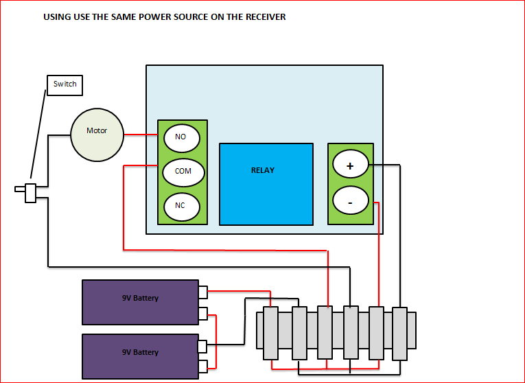

# Add a Remote Control to Just About Anything!

Source: https://www.instructables.com/Add-a-Remote-Control-to-Just-About-Anything/

---

## Introduction

## Step 1: Things to Gather

Part needed:  1. 2 X 9V battery clips 2. Wire 3. Remote control and receiver – try eBay 4. Project box 5. Wire connecting terminal (terminal block) 6. Heat shrink   Tools needed:  1. Soldering iron 2. Wire snips 3. Multimeter 4. Small Phillips head 5. Small Screwdriver

## Step 2: So How Does It Work?

The remote is made up of the (surprise surprise!) a remote (transmitter) and a receiver.  The remote is powered by a small 12v battery and works from a distance of supposedly 100 meters, although I’d be wary of this!  The wireless signal can pass through walls, floors and doors.  Once the button on the remote has been pressed, it activates the receiver which turns on a relay and allows power to flow to whatever you want to turn on. 

The remote control receiver needs to have 12v to enable it to trigger the relay.  I used 2 X 9v batteries to do the job and it works fine but you could potentially use a small, 12v battery; the same used in the remote. 

As the rocket launcher uses 18V to activate the sprinkler valve, I was able to wire up the receiver so when the relay was closed (activated by the remote) it used the power from the 2, 9V batteries to trigger the sprinkler valve.   
If your device that you want to power uses a different voltage then the receiver, then you can also rig it up so it uses a different power source.

## Step 3: Wiring Schematics

The 2 drawings attached show the different ways that the receivers can be wired.  The first is if you want to use the same power source as the receiver, and the second is if you want to use an alternative power source.  For the Compressed Air Rocket I used the first option.

There is also an on/off switch added to the receiver.  I found that the receiver slowly leaks power (it's always on) so you will need to add a switch to make sure you can turn it off when your not using it

Relays:
I have also included a drawing of how the relay works.  For more info check out this website - its really good at explaining how they work.

## Step 4: Getting Started – Wiring the Terminal

Steps:

1. First you need to wire-up your terminal.  The terminal isn’t an essential but I find they make wiring-up something like this very simple.  Wire-up as shown in the image below

2. Next you need to connect the 9v terminals together.  Solder and use heat shrink to make sure all bare wires are covered.  Connect to the terminal.  Don’t add the batteries yet – it hurts if you get shocked by 18 volts!

## Step 5: Wiring the Receiver

Steps:

1. Now connect the power wires from the terminal to the receiver, making sure polarities are correct.

2. Connect the rest of the wires from the terminal to the receiver as shown in the drawing.

3. Check that the receiver is working properly by attaching the batteries and testing with a multimeter.

## Step 6: Adding Everything Into a Project Box

Steps:

1. Once you have tested and everything works ok, add all of the bits into a project box.

2. Drill a hole in the project box and stick the wires out that will join up to the launcher.

3. Connect the project box to your device – in my case it was the launcher.

4. Test.

## Step 7: Finished!

Now you have one fine looking remote control - time to go and take over the world.

Have fun and if you making something cool - post a picture so i can check it out!

---
*29 images archived*
