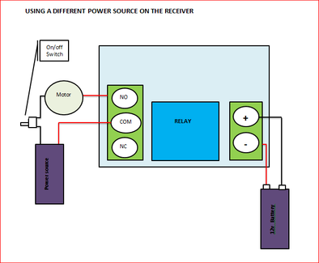
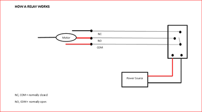

# Add a Remote Control to Just About Anything!

Source: https://www.instructables.com/Add-a-Remote-Control-to-Just-About-Anything/

---

## Introduction

## Step 1: Things to Gather

## Step 2: So How Does It Work?

## Step 3: Wiring Schematics

## Step 4: Getting Started – Wiring the Terminal

## Step 5: Wiring the Receiver

## Step 6: Adding Everything Into a Project Box

## Step 7: Finished!

---
*30 images archived*
