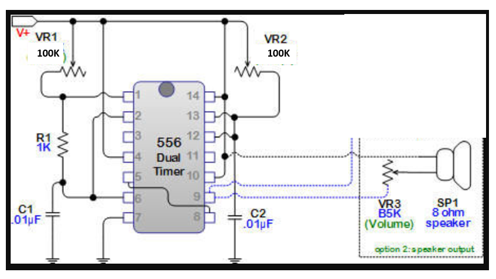
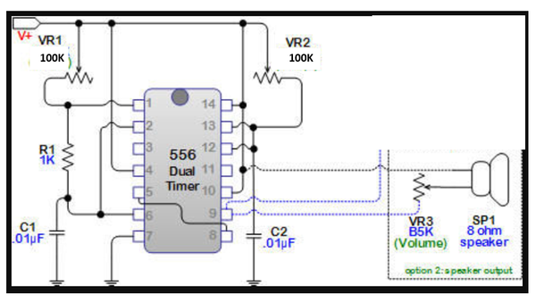
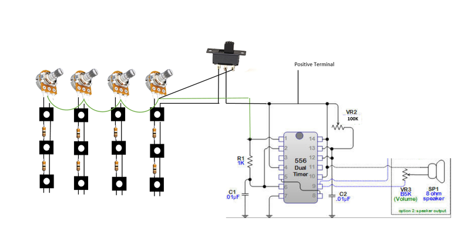

# Atari Punk Calculator Organ 

Source: https://www.instructables.com/Atari-Punk-Calculator-Organ/

---

## Introduction

The Atari Punk Console is a great little circuit that uses either 2 x 555 timers or 1 x 556 timer. 2 potentiometers are used to control the frequency and the width of the pitch and if you listen very carefully, it kinda sounds like an Atari console playing some old school games. It’s also simple to make and a great beginners circuit.

Whilst playing around with the circuit recently I realised that I could use momentary on/off buttons and resistors to change it into an organ. Adding a few more potentiometers allowed me to control the frequency of each row of switches. Now that I had created an organ, I needed a case to put it into. I had a vintage calculator lying around which I couldn’t get working and decided to use this to house the organ.

I also made sure that you could still use the circuit as an Atari Punk Console by adding a switch, which turns off the organ section.

I reckon you could also add this to a small keyboard and add a pot to each key so you could tune it. That’s a project for another ‘ible…

## Step 1: Parts and Tools

Parts:

1. 1K Resistor - eBay

2. 2 X .01 uf Capacitor - eBay

3. 5 X 100K Potentiometers – eBay

4. 5k Potentiometer - eBay

5. 556 IC – eBay

6. Speaker – I used this one from eBay The speaker should be an 8Ohm 2 to 3W one

7. Prototype Board – eBay

8. 12 X Tactile switches – eBay

9. 12K Resistors – eBay

10. 2 X on/off switches – eBay

11. 9 v battery

12. 9 v battery holder – eBay

13. Case to put everything in. I used a vintage calculator which you can find similar ones on eBay

Tools:

1. Soldering Iron

2. Dremel (always comes in handy)

3. Wire snips

4. Usual tools like pliers, screwdrivers etc

5. Superglue

6. Epoxy

## Step 2: The Circuits

There are 2 circuits that you will need to build for this project. One is the Atari Punk Console, and the other is a button matrix for the organ. I won’t be doing a step by step walkthrough on how to make the circuit for the Atari Console for a couple because; they are easy to build, there is plenty of info on-line if you need it, and I already had one done for another project!

As I build the button matrix from scratch, I will do a walkthrough on this.

## Step 3: Atari Punk Console - Circuit

This is a very simple circuit so I didn’t bother doing a step by step walkthrough. Just follow the schematic that I provided and you will be fine. Also, make sure you breadboard first to make sure you have everything working as it should be.

The circuit I put together was the smallest that I could get it. That’s because I was initially going to put it inside a cassette tape but it was still too big to fit. The size you make the circuit will depend on the size of the case that you use.

## Step 4: Pulling Apart the Calculator

As the title of this 'ible indicates, I used an old calculator as the case. You will probably have a different case than me but I'll still go through how I used the calculator to make the organ.

Steps:

1. Pull the calculator apart.

2. There was a couple of circuit boards inside which I removed. I would have liked to have used the buttons from the calculator but it was just to hard to align them with the tactile switches so I left them out.

3. Give the case a clean and remove any gussets or pieces of plastic that aren't needed so you can maximize the space inside the case

## Step 5: Working Out How to Add the Switches

I had to work out how I was going to add the tactile switches so they would align with the button holes. I decided to use a prototype board and used this to attach the switches to.

Steps:

1. Place the prototype board against the back of the section where the buttons are.

2. Start to add the buttons and align them so they fit into the button holes on the calculator.

3. Once you work out a way to align them all 12, solder them into place on the prototype board.

4. Once soldered, check them again against the calculator to make sure they are all fitting through the holes.

## Step 6: Make the Switch Matrix

Now it's time to connect the switches together

Steps:

1. Follow the diagram below when building the matrix.

2. First solder all of the 12K resistors as shown, I used 12k resistors but you could use 10K or even 20K. I would do some experimentation to find out what works best for you. I used 12K but there are probably better valves to use to get more tones out the orhan.

3. Next, solder the legs of the switches together as shown in the diagram.

4. Lastly, attach the prototype board to the calculator. I did this with the screws that originally held the calculator button matrix in place.

## Step 7: Add a Speaker

Next thing to do is to dd a speaker to the case. I went for a rectangle speaker as it was the perfect size to fit where the numbers were displayed.

Steps:

1. Cut out the area for the speaker with a dremel or something similar

2. Clean the edges up and test to make sure that the speaker is a good fit

3. You will need ti secure the speaker into place. if you are able to, screw it into place or if you have to like me, use some epoxy glue to stick it into place

Wiring to the circuit board will come a little later

## Step 8: Add the Potentiometers

Steps:

1. Use the diagram below again to help you work out how they are wired to the switch matrix.

2. I first secured the pots to the calculator. I attached them to the button holes. There are 4 X 100K pots for the frequency, 1 X 100K for the pitch and 1 X 5K for the volume.

3. For each of the frequency potentiometers, you need to do the following.

- Solder the first leg of the pot to the first leg of the switch

- Solder the middle leg of each pot together. I used jumper wires to connect them together.

## Step 9: Wiring-up the Atari Punk Circuit to the Pots, Switches and Battery

Steps:

1. Again, follow the diagram and solder the pots as shown.

2. So you can switch between the organ and using the circuit as an Atari Punk Console, I added a switch so you can switch between them. Again, follow the diagram below.

3. Next solder the pot for the pitch to the circuit board.

4. Attach the battery terminal and solder on the on/off switch.

5. Lastly, attach the speaker to the circuit. If you want to add an output jack, then just solder this to the speaker and add a 10uf capacitor between the positive and ground.

---
*48 images archived*
