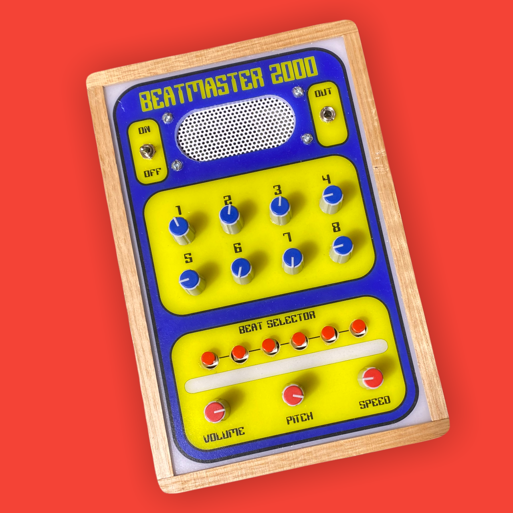
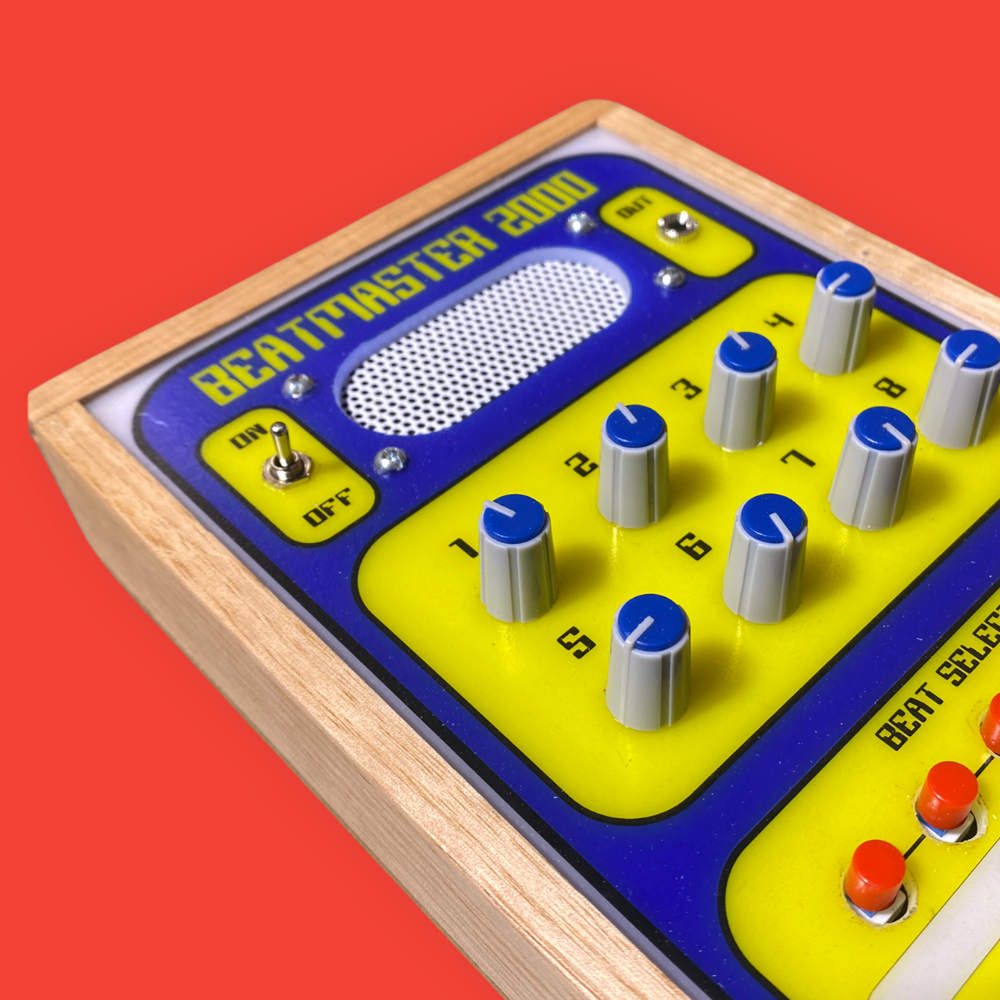
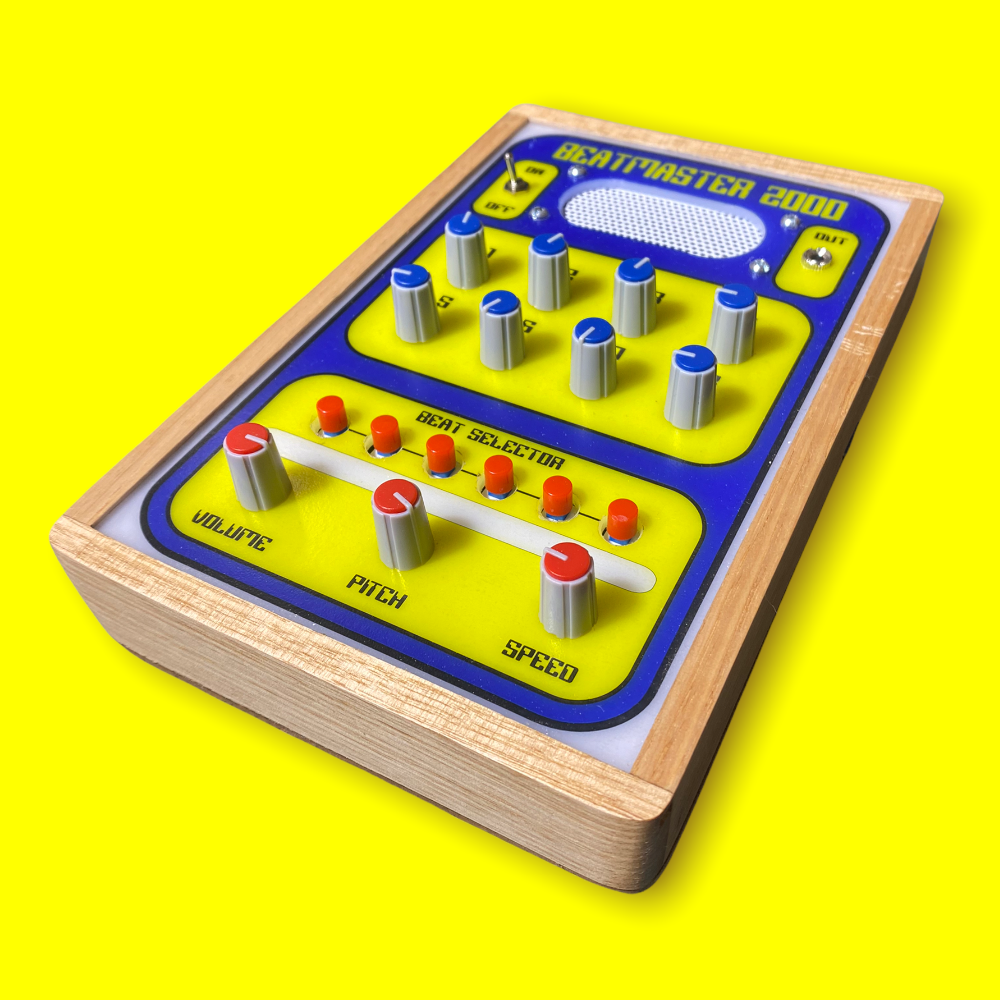
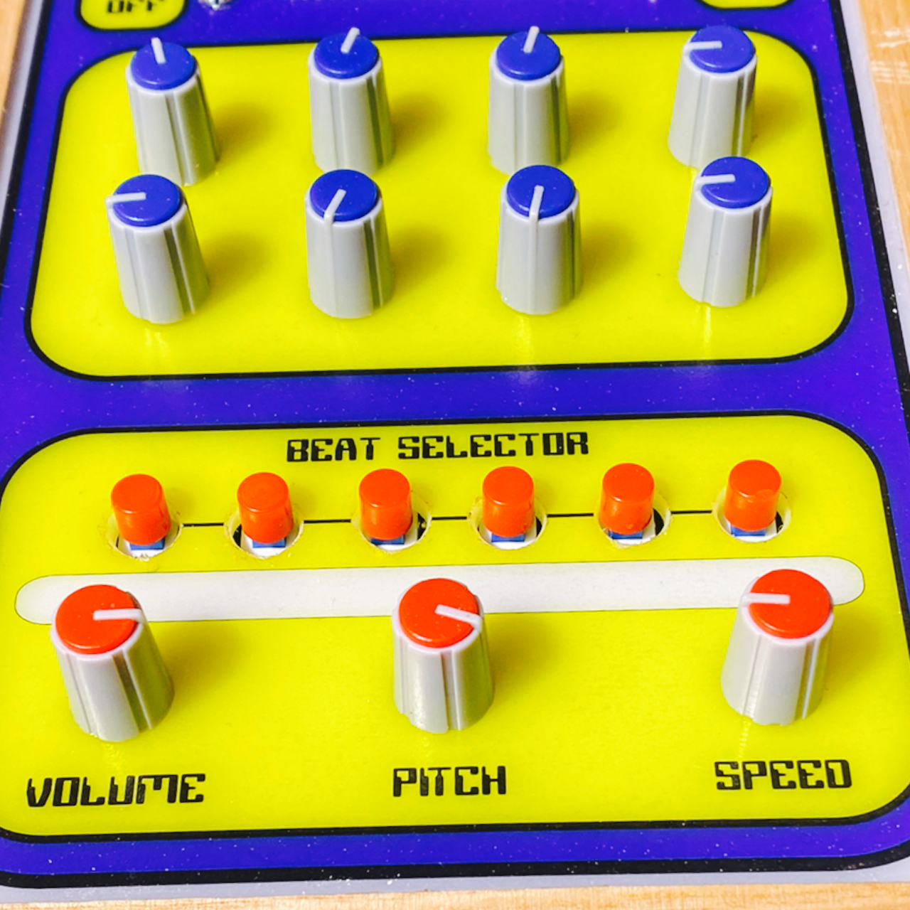
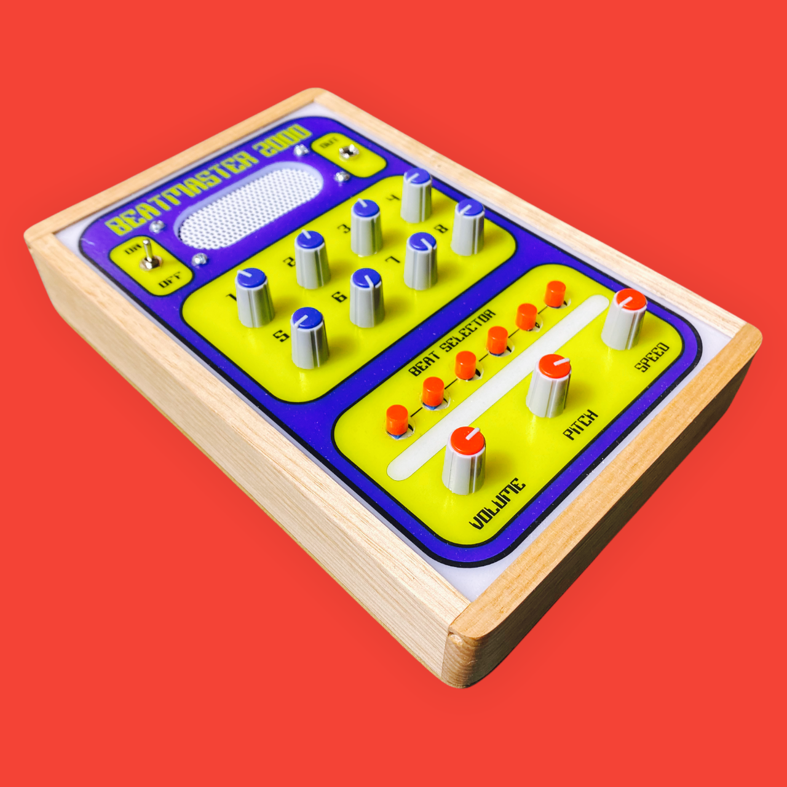

# Beatmaster 2000 - Sequencer & Beat Maker

Source: https://www.instructables.com/Beatmaster-2000-Sequencer-Beat-Maker/

---

## Introduction

The 80's were a heady time of politics, royal weddings, breakdancing, extreme fashion and electronic gadgetry. When I was a kid growing up in those times, a friend of mine went to Hong Kong and came back with a suitcase full of electronic games! Seeing all that amazingness literally blew by little mind

The Beatmaster 2000 isn't a game but it is still a homage to all that is 80's and would have looked right at home in that suitcase full of games.

Built around 4 CMOS chips, the Beatmaster 2000 is a sequencer that includes 6 buttons to create beats, a speed and pitch control and a 386 op amp to give it some volume.

The circuit was inspired by Sebastian Tomaczak's 'Fun with Sea Moss' (see what he did there...) post and in particular the sequencer with amplitude envelope circuit design. The changes I did was to add potentiometers to each gate to control the 8 steps in the sequencer. I also added a pitch control and a op amp for the built in speaker and added some on/off switches to the outputs which allows you to create different melodies and beats.

I incorporated most of the auxiliary parts to the board which reduces the amount of wiring needed and makes adding the front panel simple.

I'm actually kinda blown away with the sound this little synth can produce and it's a heap of fun to play as well!

## Supplies

The next step has all of the parts you'll need for the PCB. I've listed of the other parts you'll need in this step

PARTS:

- Speaker 8 Ohm - Ali Express
- Audio Female socket 3.5mm - Ali Express
- Opal Acrylic - eBay
- Clear, adhesive A4 label - eBay
- Hardwood edging (for the case) 40mm x 8mm x 1M - any hardware store
- Potentiometer knobs X 11. eBay
- Speaker Mesh - Ali Express
POWER

To power the synth I used an old mobile battery, a mini boost Step Up Board, charging module and a micro USB module. This will bring the power up from 3.7v to 9v and also allow me to have a rechargeable battery. You could use a 9v battery if you wanted to but I get sick or replacing them.

- Mobile battery - eBay or visit your local e-waste centre where you should be able to pick them up for free!
- Step up module - Ali Express
- Charging module - eBay To save on parts you could always buy a charging module with a micro USB attached
- Micro USB module - eBay

## Step 1: The PCB, Getting It Printed & Parts

I designed the PCB so the potentiometers are directly attached to the board so less wiring. I have used JST connectors to connect everything else like like power, on/off switch, speakers etc.

A Very Basic Rundown On How It All Works

A hex inverter (40106) is used to create a couple of oscillators - one is connected to the clock in the binary counter (4040) and the other is used as a speed control and that is connected to a multiplexer (4051). The first three outputs of the 4040 are connected to the address pins of the 4051 which 'step through' the eight gates. This gives you the sequencer section of the build.

Another 4051 is used to create the envelope generator and this is also connected to the binary counter (4040). Adding on/off switches between each of the 4051 connections to the 4040 ic, you can get some really interesting sounds and beats.

I have created a folder in my Google drive which can be found in the below link that has the schematic, PCB and Gerber files

Google Drive Files

If you want to get your own board printed, then just save the gerber zip file in the Google Drive Files to your computer and email it to your favourite PCB manufacturer. I use JLCPCB (not affiliated) who do a good job of printing the boards and are quick as well. If you are thinking 'what the hell is a gerber file!', then check this 'ible out which is a step by step guide on how to get a PCB printed.

I've attached is a list of the components and you can find an excel version in the Google drive link too. I've also listed them below and added links to where you can buy them.

PCB Parts List

I've added an attached parts list which you can print off and use. I've also added the parts list below and have added links to where to buy the parts.

- Resistors - Buy them in assorted lots from eBay
- 22K X 7
- 330R X 1
- 4.7K X 2
- 10R X 1
- Capacitor Non Polarized. I like to use Polypropylene Film Capacitors
- 100nf X 5 - eBay
- 47nf X 1 - eBay
- Capacitor Polarized - I like to use high frequency radial capacitors - eBay
- 1uf
- 10uf X 10
- IC's
- 4051 X 2 - eBay
- 4040 - eBay
- 40160 - eBay
- Op Amp 386 - eBay
- IC Socket - eBay
- 16 pin X 3
- 14 pin X 1
- 8 pin
- Potentiometers - eBay
- 9mm vertical 10K X 9
- 9mm Vertical 100K X 2
- Switch
- 6 Pin X 6 - eBay
- Buttons for Switches X 6 - eBay
- SPDT X 1 - eBay
- Transistor - 2N3904 - eBay
- LED Filament 38mm X 2 - Ali Express
- JST Connectors Mini X 4 - Ali Express

## Step 2: Adding Components to the PCB

The board is actually 2 sided. On one side are all of the components like capacitor, resistors, IC's etc. On the other side is the potentiometers and switches.

STEPS:

- As always, start with the lowest profile parts - in this case it's the resistors. There is a resistor ladder (the 22k resistors) that need to be added and then a few more for the op amp and LED
- I usually then add the IC sockets. It's definitely a good idea using these as it makes the job of replacing a possible faulty IC extremely easy!
- Once all of the components like the caps, resistors have been added, it's time to flip the PCB over and start top add the potentiometers and switches.
- An important step to note is the orientation of the switches. There are 6 legs on these switches and if you put them in up-side-down it will mean that they will be activated then the button hasn't been pushed down. If you flip the switch over you will see a small mark on one side of the switch. This needs to be at the top when adding the switch. This will ensure it is in the 'normally open' state
- In regards to the LED, there are a couple of ways to add them. You can add say a 5mm LED at the JST connection or you can use 2 X 38mm filament LED's. I have added some solder points on the board to add them. I 'lost' all but one of them so had to only include one on this build

## Step 3: The Front Panel

I designed the front panel so the PCB fits directly into place. It was a bit of a challenge to have the front panel fit over all of the pots and switches but after a few versions It's a pretty close fit now. The front panel was designed in inkscape and I have included the file in case you want to make some changes to the design.

Note that some of the images used are of the first iteration of the panel so might look different.

STEPS:

- Use the attached PDF copy of the front panel design.
- The front panel needs to be printed on clear, adhesive paper. You can get this from eBay and have added a link to the parts page.
- Cut out one of the images, leaving about 10mm around the edge of the front panel design
- Carefully place onto the opal acrylic and remove any air bubbles. Don't worry about cutting the acrylic to size before adding the label. If you add it slightly crooked you can always just cut the acrylic so it is straight!
- Cut the acrylic to size
- To ensure the colours on the front panel don't get scratched, spray a few coats of clear acrylic onto the front panel. Make sure you give it a good coating each time and leave for an hour to dry before applying the next one. I used a satin finish clear coat on the final design. You might see some images where the front panel looks glossy - that's because I did use gloss on the first build but scrapped this and decided to use a satin finish which looks a lot better

## Step 4: Drilling Holes in the Front Panel

So now you need to drill the holes in the front panel for the pots and switches to stick through. I had to do 3 different versions in order for the panel to line up just right with the PCB! You don't have to worry about the pain or adjusting drill holes by millimetres because I've gone through it for you!

STEPS:

- First you will need to use a drill punch and make a dimple in each cross hair on the front panel. It's important that you get as close to the middle of each cross hair.
- When drilling out the holes, I strongly suggest you use a stepped drill piece as it makes the job a lot easier. A normal drill bit can grab onto the acrylic and chip it
- Place the front panel on a flat surface and start to drill out each of the holes.
- Use an exacto knife to remove any burrs or small pieces of the front panel adhesive
- Once you have drilled all of your holes, place the PCB into the front panel and see if it fits. You might need to slightly enlarge a couple of holes to ensure a nice fit. You can see that the 6 buttons on mine were a very close fit. I've revised the front panel design so your one (if you make one) will fit even better.
- Lastly, you need to cut out the speaker section. Use a stepped drill and remove the 2 large circle sections
- next, use a dremel to remove the middle sections. Use some files to clean up the edges

## Step 5: Making the Case - Adding a Groove for the Front Panel to Fit Into

This does require either a router or a dremel with a special attachment. If you don't have any of these then you can just attached the panel directly on top of the wood! The finish won't be the same but it'll be close.

STEPS:

- The first thing you need to do is to cut a groove along the wood in order to secure the panel into. As mentioned above, I used a dremel with a router attachment to do this.
- Secure the wood with some clamps and run the bit near the top of the wood. Take your time and make sure you keep the dremel nice and straight.
- Measure and cut the wood to size. The best way to do this is to just slip in the front panel into the groove of the wood and measure where to make the cuts
- Place the front panel into the grooves of the wood and use some PVC to glue it together. If you find the panel is a little big and the wood doesn't right then just remove a little of the acrylic along the edge with a sander.
- Clamp and leave to dry for 12 hours.

## Step 6: Making the Case - Sanding & Painting

One day I'll learn to 3D print my cases but in the meantime using wood is the next best thing. Plus, it does give the build a nice, retro feel

STEPS:

- Once the glue is dried you can then start to clean-up the edges of the case. I use a belt sander to do this which is the quick way. You could also just do it by hand as well.
- You may need to add some more glue or even use a brad nailer gun to ensure the case is secure.
- Next, it's time to add the back to the case. I use some thin ply wood, cut it to size and then secure it with some small screws to the case.
- Sand it again to make sure that the back is flush with the case and if you want to you can round off the edges as well.
- To finish off the wood I added some clear gloss on the body of the frame and some aged-teak for the back. I think it gives the case a nice contrast.

## Step 7: Adding Power

As previously mentioned, you could power everything by a 9V battery. I like to use rechargeable batteries for my builds and have decided to use an old mobile battery to power everything.

STEPS:

- The step up power module (used to change the voltage from 3.7v to 9v) needs to be formatted to output 9v's. To do this you need to connect the top 2 solder pads indicated in the image.
- Add a dab of superglue to the back of the module and glue it close to the battery terminals
- connect using a couple resister legs
- Next, you need to connect the charging module. The charging module I used doesn't have a micro USB connector so I had to use a separate one to be able to charge the battery. superglue the module to the battery and connect the input of the charging module to the battery terminals
- To be able to charge the battery, you will need to be able to access the micro USB module. The easiest way is to make a small cutout into the bottom of the case and glue the USB module to it. You can then connect the USB module to the output on the charging module.

## Step 8: Adding the Speaker

Adding the speaker is pretty straight forward. I've also included some speaker mesh to give it a clean finish

STEPS:

- Place the speaker against the panel and line it up so it is centred.
- Mark out where you need to drill the 4 holes to attach the speaker on the front panel and drill. Make sure that you place the panel on a flat surface when you drill the holes.
- Cut a piece of the speaker mesh so it fits across the speaker hole in the panel
- Place the speaker mesh against the speaker hole and mark where the 4 speaker holes are on the drill and then drill holes into the mesh
- Use 4 small screws and nuts to secure the speaker and mesh to the front panel

## Step 9: Adding the PCB to the Front Panel

The front panel has 4 holes in it where you can connect it to the front panel. Unfortunately, in the first version of the PCB (the one I am using) the holes aren't big enough for the screw that I have. I have enlarged these so you won't have this issue.

STEPS:

- Place the pots and switches into the holes of the panel
- secure to the front panel with 4 screw and nuts. As I couldn't do this, I just held the PCB in place with the pots. I'll add a little bit of superglue to the knobs if I find that the panel is moving Don't add superglue! I had to remove the PCB and it was a very painful experience! the knobs should hold the PCB in place without it
- Attach the knobs to the pots
- You can now add the SPDT on/off switch and the 3.5mm audio output jack

## Step 10: Wiring Up Everything

The good news is, there is only a very minimal amount of wiring that needs to be done. I have placed all of the JST connectors close to where you need to connect the speaker, switches and power so it makes it even easier.

STEPS:

- In order to have the speaker turn off if you use headphones or an external speaker, you need to use a switching audio socket. Solder the ground on the board to ground on the audio socket and connect positive from the board to the 'normally on' on the audio socket.
- You can now solder the speaker to the audio socket. Connect ground to the same spot as you connected to the board to. Positive on the speaker should be connected to the 'normally off'. Now when you plug a audio jack into the socket, the speaker will disconnect.
- Connect the battery up to the output on the step up power module
- Connect the on/off wires up to the toggle switch
- Now for the big moment - turn it on and make sure everything works. If you have having any issues, you'll need to do a little problem solving to identify any issues. If you hear some sounds then you are ready to make some tunes!

## Step 11: How to Use the Beatmaster 2000

Now that you have built your Beatmaster 2000, how do you use it? Well the good news is, it's very simple to use and make some beats out of.

8 Step Sequencer.

- To make a beat up you can use the pots in the 8 step sequencer to change the pitch.
- Step 1 on the sequencer is the master tone. This will set how high or low the sound is
Beat Selector

- You can make beats by pressing down on one of the 6 switches
- You can also push down on more than 1 of the switches to make unique beats and sounds
Pitch Pot

- Change the overall pitch and tone with the pitch pot
Speed

- This pot changes the speed of the beat
Volume

- You would expect this one to be self explanatory but you'd be wrong! Yes it does control the volume but it also acts like a filter! This wasn't planned but def adds some great effects. The first 1/4 turn of the vol knob controls the volume, after that the envelope generator kicks in and you get a more beefy sound.

---
*89 images archived*
