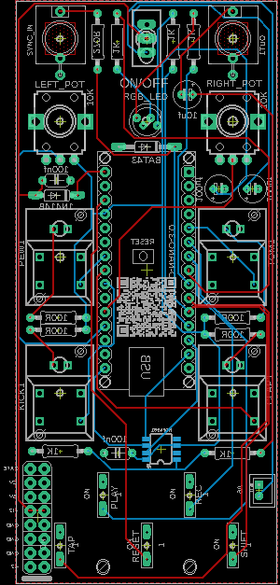
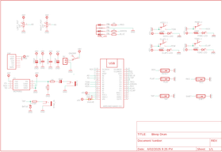
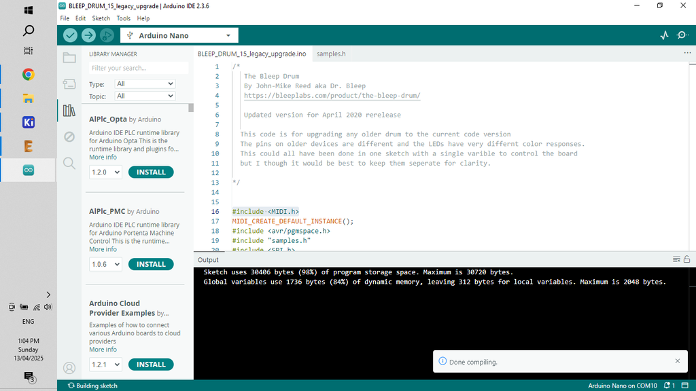

# Bleep Drum Synth - Powered by Arduino

Source: https://www.instructables.com/Bleep-Drum-Synth-Powered-by-Arduino/

---

## Introduction

In this build I recreate the fantastic Bleep Labs 'Bleep Drum' into a Eurorack format module. I'm working on building my own 'simple' 9v Eurorack which this synth will be a part of.

Check out my other recent builds to see the other modules already designed.

So what is the Bleep Drum Synth? Well it's an Arduino based drum machine that allows you to play drum tracks using 4 different samples and record them so you can layer them them up and create some great drum beats.

I have also added a Sync in which allows you to connect to other modules and play along with them.

Here's a rundown of the features:

– Four sounds, two with pitch control

– Sync in

– You can reverse the samples

– Record patterns just by playing them. The built in quantizer keeps hits where you want them.

– Click track

– Tap tempo

– Reverse mode

– Noise mode

– 9V battery powered

The main goal with building this module is to create my own 'simple to build' modular synth. I wanted to keep everything as easy as possible with each module built with the following aims:

- Can be powered by 9V (and 12V)
- Easy to build with minimum components
- Use Arduino to keep it simple (plus it helps to keep the components down and everything in tune)
- Can fit into any modular synth Eurorack (include the ability to power the module via normal module power sources)
- Has to sound great!
Let's get building!

## Supplies

I've created a parts list which can be found in my GitHub page and in the PDF file attached to this step. The PDF includes links and images of each of the parts which will make it easy to order the correct ones for this build.

The parts list attached doesn't included the PCB or front panel. You'll need to jump to the next step which goes through how to get yours printed.

## Step 1: Getting the PCB & Front Panel Printed

We all have different levels of knowledge, so when it comes to a build like this I want to make sure that I'm providing enough information so anyone with some basic soldering skills can make it. That includes ensuring there are instructions on how to get your own PCB's printed (which is super easy!)

So with that said, the first thing you will need to do is to get the front panel and PCB printed. I use JLCPCB (not affiliated) to get this done. The front panel is actually just a PCB without any components included! The front design is done in a program called Inkscape (available free) and the panel including the drilled holes is done in Fusion 360 (also free!)

The files that you need to build your own Bleep Drum Synth can be found in my GitHub page. This includes the parts list, Gerber files for the PCB & front panel, schematic, Arduino script etc.

STEPS:

- Send the Gerber files to a PCB manufacturer like JLCPCB who will print the PCB and front panel for you. Download all of the files from my GitHub page to your computer and send the zipped Gerber files off to the PCB manufacturer of choice.
- If you have no idea what any of the above means , then check out the Instructable I made on how to get your broads printed which can be found here.
- NOTE: The manufacture will include an order number on both the PCB and front panel. It doesn't really matter where it is on the PCB but you don't want it on the front on the front panel!
- Over at JLCPCB you can 'specify a location' once the Gerber files have been loaded so click this for the front panel and specify in the comment section that you want the order number on the back of the panel. The manufacturer will add it to the back where indicated.

## Step 2: Adding the Components Part 1

As the PCB is 2 sided, the order you add the components does matter. If you get it wrong it's not the end of the world but it might make it a little harder to add some component.

STEPS:

- As always, start with the lowest profile components, in this case it's the resistors and diodes. Its always good practice to check your resistors values before soldering in case you have to troubleshoot later on.
- I've included a mini JST connector to power the board. Solder the connecter next into place.
- A quick note on powering the synth. As I only need positive and ground I have used a JST connector to connect it to power. However, I have included space to add a Eurorack 16 pin adapter in case you want to power it using traditional Eurorack power sources
- You can now add the capacitors, start with the polyester caps and then add the electrolytic caps.

## Step 3: Adding the Arduino

STEPS:

- Now it's time to add the Arduino. I always include header pins so the Arduino is removable. It helps if you have to replace the Arduino and also allows you to program it when it isn't in the board. Plus, if the Arduino fails for whatever reason, you can easily remove and replace it.
- Add the header pins to the Arduino and then place them into the board and solder into place.
- You can then remove the Arduino Nano from the header pins to make it easier to add the rest of the components to the other side of the board

## Step 4: Adding the Components Part 2

Now it's time time to add the components to the front of the PCB.

STEPS:

- First, place the RGB LED into place, making sure that it's sitting up a little bit from the board. This way it will poke through the front panel
- Now you can add the 5 momentary switches. I usually put them all into place and then solder the legs into place. Flip the PCB over and make sure that they are all sitting fat. If not, then just re-heat the solder and push down on the switch
- Next add the audio jacks and then the larger momentary switches
- Lastly, solder the pots into place

## Step 5: Adding the Front Panel

STEPS:

- The front panel has been designed so it fits perfectly onto the PCB. Carefully place the front panel so it aligns with the components and push it into place. I usually start with the on/off switch and then align the pots and LED with the holes in the front panel.
- You may need to trim the little tabs on the pots if they have them.
- As there is nothing to secure the bottom of the front panel to the PCB, I have added a couple holes so you can add some spaces (M2) and ensure that the bottom section is connected.
- You can add the nuts to the pots, audio jacks and on/off switch to secure the front panel to the PCB.
- Now that the front panel is in place, you can either make an individual case to house it in or add it to your Eurorack.

## Step 6: Uploading the Sketch to the Arduino

If you are new to Arduino and want learn how to upload a sketch to Arduino - then check out this link. It's really straight forward and doesn't need any special tools - just a computer and a USB cord.

STEPS:

- Open the sketch in the software folder which will take you to Arduino IDE. This cane be found on my GitHub page
- Connect your Arduino and upload the sketch
- Once the sketch is loaded to Arduino you can connect it to the PCB for testing.
- Connect the PCB to a 9V to 12V power source and check that the Drum synth works. Plug a speaker in to the out jack and hit the start button. Check out the 'How to Play' in the last step and start to create some beats. if you hear sounds then you have successfully loaded the sketch and solder the PCB correctly.
- If you're not hearing anything, then you might need to do some troubleshooting.

## Step 7: How to Play

Play – Stop and start playback of selected sequence. Light will blink white on the beat.

Record – Start and stop additive recording. Any pad played will be added to the sequence.

Light blinks red.

Beat – Tap to increase/decrease tempo

Click track - Hold shift for 4 seconds to turn on and off click while the device is playing

Shift + pad - Change to that color sequence. Light will change to that color.

Shift + tap + right knob = Change tempo with knob.

Shift + Play = Reverses samples

Play + Record = Erase current sequence.

NOISE MODE

Hold shift while turning on the device. The light will turn green. Hitting shift again will turn it pink and blinky

Green – Pots control the pitch just like normal

Pink – Pots control noise.

All other controls are the same.

---
*37 images archived*
