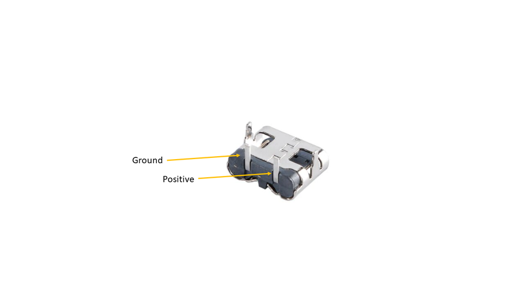

# Book Light Inside a Book!

Source: https://www.instructables.com/Book-Light-Inside-a-Book/

---

## Introduction

This build came about after my nephew asked for a new book light. I took it literally and decided to build him one made from a book!

Actually, this isn't the first time I've used a book to make a book light. I made one a few years ago where you opened the front cover and it had a [light inside.](https://www.instructables.com/LED-Book-Light-Inside-a-Book/) However, this time I had the idea of making the pages illuminated. I did play around with using the actual pages to help diffuse the light but in the end went with some opal acrylic to stand in place of the pages.

This build is relatively simple and only needs a couple of electronic parts to build. Initially I went all out and included a battery but decided against it and just kept it simple. It includes a dimmer module which allows you to dim the LED's and also has a built in switch in the potentiometer which is handy. Basic soldering skills is all that is needed to make your own.

## Supplies

PARTS:

1. Book. So this is probably the most important part to the build. You will want to find a hard cover book, something that has a good looking cover and is not too damaged. You will also want to make sure that you check to see if the book is worth anything before you pull it apart! I scout around op shops (thrift stores) where you can find them for cheap.
2. Wood. This is used to make the Frame. I used 30mm x 10mm pine strips which I got from the local hardware store. The width of the wood will need to be the same or larger than the width of the book.
3. Opal Acrylic A3 - eBay
4. LED's - 5V LED strips - [Ali Express](https://www.aliexpress.com/item/1005002932247185.html?spm=a2g0o.order_list.order_list_main.11.20be1802W8vr6H). I went with the 120 LED's per meter
5. LED Dimmer - [Ali Express](https://www.aliexpress.com/item/1005004858794449.html?spm=a2g0o.productlist.main.45.6df15fbb9noIIC&algo_pvid=6cf55a65-f67f-4f7b-8dda-f80aab8c3ac4&aem_p4p_detail=202402211758521234265912889140001683650&algo_exp_id=6cf55a65-f67f-4f7b-8dda-f80aab8c3ac4-22&pdp_npi=4%40dis%21AUD%211.27%211.27%21%21%210.82%210.82%21%402103247917085671321266330e90c5%2112000030776980820%21sea%21AU%21135072183%21&curPageLogUid=bjYFvE5vpCr6&utparam-url=scene%3Asearch%7Cquery_from%3A&search_p4p_id=202402211758521234265912889140001683650_23) It might come up as 'motor controller' but they also work for LED's
6. USB C - Adapter - [Ali Express](https://www.aliexpress.com/item/1005006140199994.html?spm=a2g0o.order_list.order_list_main.202.71611802vGtCHP)
7. Wire - I use computer ribbon which you can get for free from most E-waste places

## Step 1: Removing the Cover From the Book

Most book covers - especially hardbacks, are attached in the same way. They are usually stitched into place, glued, taped or maybe even all 3!

Remember that most books end up as waste so you're not destroying a book - you're re-purposing it and giving it a new lease on life!

STEPS:

1. Open up the front cover and take a look how the cover is attached tot he pages of the book. You might see that there is some fabric tape connecting the cover to the book. If so use a exacto knife or similar blade and carefully cut through it. You don't want to cut through the cover of the book.
2. There might also be stitches holding the pages to the cover so you'll also need to cut these away as well.
3. Flip over the book and do the same thing to the back section of the cover
4. Remove the pages and trim away any left over tape etc from the inside of the cover
5. Keep the pages. We'll use these a little later on!

## Step 2: Making the Internal Wood Frame - Part 1

The next step is all about creating the wood frame inside the book. This will support the cover and help you mount the LED's and electronics.

STEPS:

1. The first thing to do is to measure the width of the pages of the book. This will determine the width of the wood that you need to use to support the cover. Mine was 25mm and the wood was 30mm in width.
2. To enable the wood to fit I had to trim off 5mm which I did on my band saw. You could use a hand saw to do this or even a sander if you don't mind a bit of sawdust.
3. Next, place a piece of the wood in the bottom section of the cover and another into the spine. You can just cut to approximate size for now and trim up later. The one in the spine should be sitting on top of the one on the bottom. The bottom piece of wood also helps to stand up the cover better.
4. At this stage I actually trimmed a piece of acrylic to 25mm width and used this as a guide. I positioned it into place on top of the cover, worked out where I wanted it to sit and then marked the wood in the spine and cut to size. I did the same thing for the front section of the book.
5. Lastly, secure the 2 pieces of wood together into a 'L' frame. I used a bradder nail gun but you could use an old fashioned nail and hammer and or wood glue

## Step 3: Making the Internal Wood Frame - Part 2

The next section is used to hold the LED's into place. It also adds some structure inside the book and supports the cover even more!

STEPS:

1. The LED's need to be about 25mm away from the acrylic so you'll need to measure 25mm from the outside of the wood frame you just put together.
2. Measure and cut 2 pieces of wood. Nail these together to make a L frame like you did for the first section
3. Lastly, nail this section to the main L frame. You should now have the final internal structure of the book light. Do a final fit into the cover to ensure everything goes together as it should

## Step 4: Cutting & Bending the Acrylic

If you have a band saw then cutting acrylic is pretty straight forward. For those that don't have one, a table saw can also work or even just a fine tooth hand saw will do the trick as well

STEPS:

1. Cut a 25mm (or whatever width your book is) length of acrylic from an A3 sheet
2. Sand the cut edge if necessary. It should be the same width as the wood cut for thewood frame
3. Place the wood frame into the book cover and then place the piece of acrylic so it is sitting on top of the frame. You need to work out where you need to bend the acrylic to make the 90 degree bend. Mark the acrylic where the bend needs to go.
4. Place the acrylic on a flat surface with the marked section hanging over the edge of the surface
5. Heat with a heat gun (or even a hairdryer will work - it will just take a little longer) until the acrylic starts to bend.
6. Use 2 pieces of wood to make the bend. One piece holding the top section and the other to push the acrylic down to make the bend. Hold for 20 seconds or until the acrylic starts to stiffen up
7. Now you can place the acrylic back on top of the wood frameand trim up the acrylic where needed.

## Step 5: Adding the Electronics - Dimmer Module

I mentioned in the intro that you could make a simple version of this and I'll explain what I mean. You could just add the USB-C adapter section into the frame, connect this up to the LED strips and you are done. There is no 'on/off' switch so you'd have to turn it on/off from the wall switch and you can't dim the LED's but it is def a simple solution. However, if you want to add a battery and dimmer - then continue on.

STEPS:

1. You can locate the dimmer module under the top horizontal piece of wood that makes up thewood frame. I put mine on top first then realized that it would interfere with the LED's. Doh!
2. Place the dimmer moduleinto place and mark where the potentiometer handle hits the wood.
3. Drill a hole in the marked section and make sure the dimmer module pot fits into place.
4. Secure the dimmer module with a couple small screws to the frame. There are a couple mount holes in the module which makes it easy.
5. Now, to work out where to make a hole in the spine of the book cover do the following. Add some black marker to the end of the potentiometer and then push the cover into place on the wood frame. This will leave a mark on the inside of the cover where to drill. I used a stepper drill piece to make the hole as these leave a clean finish around the drilled hole
6. Check and make sure the potentiometer and wood frame fit onto the book cover

## Step 6: Adding the Electronics - USB-C Adapter

You may be wondering why I just didn't use the USB-C adapter on the charging module. Well - for the simple reason that I wouldn't have been able to access the one on the charging module as it is too short. Using a separate adapter allows you to place it inside the wood frame and connect it separately to the charging module later on.

STEPS:

1. Solder a couple of wires to the solder points on theUSB-C adapter. These wires need to be long enough to reach the dimmer module which is located in the tpop section of the frame. Note the leg polarity on the USB-C Adapter in the attached image. You'll need to make sure that these are connected to the right solder pads on the charging module later on
2. Use a small drill bit the same diameter as the USB-C adapter and drill 3 small holes into the wood frame section where the spine is. I placed mine low as this seemed the best place to locate it.
3. Clean up the drilled section with a small file and place the USB-C adapter inside the hole. You want the front section of the USB-C adapter to be poking out of the frame by about 2 to 3 mm
4. To secure into place you can use some hot glue.
5. You will also need to make a slot in the spine of the book cover so you can access the USB-C adapter. The easiest way to do this is to add some black marker around the ebtrance of the USC-C adapter, push the inside of the spine against it and it will mark exactly where you need to make the slot. Iused a step drill piece ot make the holes and cleaned it up with an exacto knife.
6. Now you can connect the wires to the dimmer module. Glue them to the inside of the frame and secure the ends to the module.
7. I also added a 100uf capacitor between positive and negative on the dimmer. You don't have to do this but I could hear a little humming coming from the dimmer module and adding the cap stopped this.

## Step 7: Adding the Led Strips to the Frame

I used 2 strips of LED's to ensure the book light was bright enough. Also, my LED strips I used have 120 LED's per meter so plenty to ensure good illumination through the Opal Acrylic.

STEPS:

1. First, drill a small hole through the vertical part of the frame near the bottom. This is where the wires will be threaded through and connected to the dimmer module
2. De-solder the wires on the LED's and add longer ones to bioth positive and negative solder points on the LED Strips
3. Thead the wires through the hole you just drilled and start to stick the LED's to the wood frame. Place these slightly to the right when sticking on as you will need to add another strip beside it
4. Cut the LED strip when it reaches the top horizontal part of the frame making sure you cut them where there are 2 solder points
5. Add another strip to the left side of the frame
6. Connect the 2 strips via the solder points with some small lengths of wire
7. Lastly, connect the wire from the LED's to the dimmer module. I glued the wire to the inside of the frame to keep it out of the way
8. Now you can test to make sure the LED's and everything else is working properly.

## Step 8: Gluing the Book to the Frame - Part 1

Time to glue down the spine and one side of the frame to the book cover!

STEPS:

1. First, add some superglue to the inside of the book spine. Try not to get it too close to the potentiometer and USB-C holes in the book.
2. Place the frame against the spine, making sure the potentiometer is aligned with the hole in the spine. Push the pot through the hole and check to make sure the USB-C adapter is also aligned correctly.
3. Put some pressure against the spine of the book against the frame until the glue as dried
4. Use superglue again and add a little all around the top of the wood frame
5. Carefully push the cover against the frame and add some pressure. The best way to do this is to lay the book flat and add pressure from the top.
6. Leave the other side for the moment.

## Step 9: Adding the Pages to the Inside of the Book

To give some weight to the book light, I decided to add the pages back inside the book! Well, back inside the wood frame. You don't have to do this but it does help with keeping the book light secure when it's standing up

STEPS:

1. As the pages are now too big to fit inside the wood frame , you'll need to cut the pages in order for them to fit. I used my belt saw to do this but you could also use a stanley knife to cut the pages. Actually the belt saw worked better then I expected and made short work of trimming the book down
2. Place the pages back into the book. You might have to remove a few pages or trim up the spine a little in order for it to fit right
3. Check and make sure evrything is still working once the pages are in place.

## Step 10: Gluing the Acrylic Into Place

This is a critical step as you need to make sure the acrylic is aligned right before the glues sets hard!

STEPS:

1. Add glue to the top and bottom section of the frame where the acrylic will set against and also add some glue to the inside of the book cover where the acrylic will sit against.
2. Place the acrylic into place, making usre it is aligned correclty and sitting agauinst the top and bottom of the frame.
3. Add some pressure until the glue is dried.

## Step 11: Gluing the Book to the Frame - Part 2

Double check that everything is working before you glue down the front cover of the book. You won't get a chance later on!

STEPS:

1. Add glue all around the top of the wood and also add some glue to the inside of the cover where the acrylic will sit against.
2. Carefully close the front cover and add pressure until the glue is dry
3. Test again to make sure everything is working as it should be. If it isn't then you'll need to try and opent the book up and check to see if any wires came out.
4. If everythings good then you are done!

---
*70 images archived*
