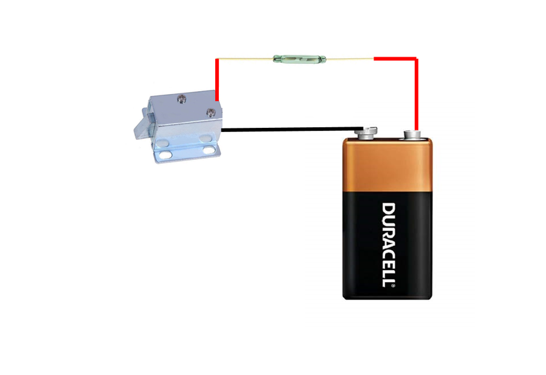

# Book Safe With Hidden Magnet Lock

Source: https://www.instructables.com/Book-Safe-With-Hidden-Magnet-Lock/

---

## Introduction

Over the years I’ve made a whole bunch of book safes. A couple of them I posted on Instructables and can be found [here](https://www.instructables.com/id/Book-Safe-With-Lock/) and [here](https://www.instructables.com/id/Super-Secret-Book-Safe/). To make the book safes that little more secure, I like to incorporate locks into them. Admittedly, the locks that I have designed in the past are simple and are easily located on the book. Plus, you need to take into consideration that a book after all is only paper, if you really wanted to get into it you could probably just rip it open!

This time I wanted to disguise the lock so you wouldn’t know that the book even had one. This way if someone was looking for a secret book, then hopefully a cursory glance wouldn’t arouse any suspicions. I also have a petty large library so I can easily hide the book amongst my books.

The lock is a Solenoid Electromagnetic Lock which has a small reed switch and is opened by running a magnet over the switch. This way I can keep the lock mechanism, switch etc inside the book and hidden from view.

There is a slight danger though in making a lock like this though. If the battery goes flat then you are going to have a hell of a time trying to get it open again and would probably have to destroy the book!

I also discovered a new way of gluing all those pages together which is a million times easier than trying to glue every page.

The project is quite simple and anyone with basic woodwork and soldering skills will be able to make one easily.

## Step 1: Parts and Tools

Parts:

1. Book. Make sure that you use a hard back book and it ok condition. That’s really all the stipulations there are (you might want to check that the book you are using isn’t valuable – you don’t want to wreck a rare 1st ed!)

2. 6v Solenoid lock – [eBay](http://www.ebay.com.au/itm/DC-5V-6V-Mini-Solenoid-Electromagnetic-Electric-Control-Cabinet-Lock-DIY-Project-/132259233458?var=&hash=item1ecb43beb2:m:muwvy94JVi-LubsL4moudlQ)

3. 9V battery

4. 9V battery holder – [eBay](https://www.ebay.com.au/sch/i.html?_from=R40&_trksid=p2047675.m570.l1313.TR11.TRC1.A0.H0.X9v+battery+holder.TRS0&_nkw=9v+battery+holder&_sacat=0)

5. Reed switch – [eBay](https://www.ebay.com.au/sch/i.html?_from=R40&_trksid=p2380057.m570.l1313.TR0.TRC0.H0.Xglass+reed+switch.TRS0&_nkw=glass+reed+switch&_sacat=0)

6. Wires

7. Magnet – [eBay](https://www.ebay.com.au/sch/i.html?_odkw=9v+battery+holder&_osacat=0&_from=R40&_trksid=p2045573.m570.l1313.TR12.TRC2.A0.H0.Xrare+earth+magnet.TRS0&_nkw=rare+earth+magnet&_sacat=0)

8. Wood. I just used some straight edging purchased from a hardware store.

9. Small screws

10. Modge podge glue – [eBay](https://www.ebay.com.au/sch/i.html?_odkw=rare+earth+magnet&_osacat=0&_from=R40&_trksid=p2045573.m570.l1313.TR12.TRC2.A0.H0.Xmodge+podge.TRS0&_nkw=modge+podge&_sacat=0)

Tools

1. Small paint brush (for adding the modge podge to the book pages)

2. Box cutter knife

3. Saw

4. Sander

5. Screwdriver/Phillips head

6. Soldering iron

7. Hot glue

## Step 2: Making the Secret Compartment

First thing you need to do is to hollow out the book that you have chosen to use. This isn’t very hard to do but you need to take your time and make sure that you get the sides of the secret compartment as straight as possible. You can however go back later and tidy up if your secret compartment sides are a little wonky.

Steps:

1. First work out the dimensions that you want to make the compartment . I use the borders of the paragraphs to determine the size of the secret compartment. This way the cuts you make should be the same all the way through.

2. Use a ruler to make sure your cuts are straight and start to cut out the compartment with the box cutter.

3. Remember to keep your hand and fingers out of the way when cutting. It’s easy to slip and cut yourself as you need to put some pressure on the blade to cut through the pages.

4. Keep on cutting and checking to make sure the sides are straight.

5. Once you have removed the pages for the compartment, it’s then time to glue them all together

## Step 3: Gluing the Pages

I used to glue each page at this step and it was a very long process. I discovered a better way recently which takes only a fraction of the time and also gives you a better final finish.

Steps:

1. Grab the modge podge and the small paint brush

2. Start by adding glue to the outside pages and make sure you add a generous amount of glue to each of the sides

3. Next add glue to the inside walls of the compartment.

4. Place a piece of ply wood or something similar on top of the wood and then add a heavy weight to the top. Leave to dry for a few hours

5. Check and see if all of the pages are glued. If there are any loose ones (the top page was a little loose for me), then just add some modge podge to the page and glue down.

6. That’s it! The finish is excellent and there is no need to glue every page.

## Step 4: Adding Wood to the Inside Compartment

To ensure that the compartment is secure and also to enable the lock to catch onto something, you need to add some wood sides to the inside of the compartment.

Steps:

1. Measure and cut 4 pieces of wood out to fit into the compartment. I did the sides first and then the top and bottom bits. You will probably find that the compartment isn’t square. Don’t worry too much about it as you will be gluing the sides later into the book so if it isn’t square you won’t have issues with securing them in place.

2. The wood that I used was a little too high so I had to reduce the height. I used a bench sander to reduce the size. You want the wood pretty much flush with the top of the compartment

3. Next cut out another piece of wood about the same size as the top/bottom sections. This will be used to secure the lock to.

4. I rounded the edges to finish it off.

5. Before you secure the wood into place, you need to attach the lock to the book.

## Step 5: Adding the Lock

Steps:

1. Find the middle of the piece of wood with the rounded edges and secure the lock to the wood with some small screws.

2. Next you need to attach the wood to the book. To determine the exact position to attach it to the inside front cover, you’ll need to do some measurements.

3. With the compartment pieces of wood in place, measure the distance from the outside of the book to the edge of the wood.

4. Next measure how much the edge of the cover goes past the pages of the book.

5. Lastly add a couple mm to the final number you get. This will give you the exact distance the lock should be located to the front cover.

6. Mark the centre of the book and glue the wood and lock to the inside cover with some modge podge.

7. Add some weight and leave for a minute or 2.

8. Take the weights off and close the cover. The glue will have dried enough for the wood to hold in place and this way you can check to make sure the lock is in the right position. The lock should hit the top of the wood and you should be able to close the cover of the book. If the lock hits the top of the wood or you can’t here the lock hit the wood, then you will need to adjust where the wood and lock is attached to the book. As the glue isn’t dried you can just pull it off and reposition.

## Step 6: Making the Hole for the Lock.

Steps:

1. First close the cover so the lock is touching the top of the wood. Mark where it touches on the lock.

2. Measure the distance between the inside cover and the lock. This will be the distance that you will need to make the hole in the wood for the lock mechanism to go into.

3. Mark where the lock will engage and drill a hole into the wood

4. With a small square file, square the edges of the hole

5. Place all of the wood sides back into the book and shut the cover of the book. If the hole is in the right position the lock will engage in the hole. I have to push down on the lid slightly to engage the lock but this is how I wanted it. It ensures that the cover is tightly closed. If the lock doesn’t engage, then remove a little more wood from the hole and try again.

## Step 7: ​Gluing the Wood to the Inside of the Book

Steps:

1. Add some modge podge to the sides and bottom of each piece of wood and glue into place

2. Leave to dry for a few hours

3. REMEMBER, don’t close the cover once the wood is dried if you can’t connect a battery to the relay lock, you’ll never get it open again if the lock engages!

4. To test, make sure that the wires from the lock are showing on the outside of the book. Close the lid and engage the lock. Add the battery to the wires and the lock should retract and you should be able to open the cover. If you don’t hear the lock retract, push slightly on the cover and this will retract the lock.

## Step 8: Wiring the Battery, Reed Switch and Lock

The first thing you’ll need to do is to determine where to attach the reed switch. It needs to be in a place where it won’t get damaged and also somewhere close to the cover page of the book so the magnet will activate the switch.

Steps:

1. Add 2 lengths of wire to the ends of the reed switch

2. Next, find a good position for the reed switch. I placed mine beside the 9V battery holder. Add a little glue to hold it in place

3. Work out where you are going to attached the battery holder. Make sure it’s close to the reed switch.

4. Attach one of the wires from the reed switch to the positive battery terminal.

5. Attach the other wire from the reed switch to the positive wire from the relay lock.

6. Solder the negative wire from the lock to the other battery terminal. Attach a battery to the holder and test with a magnet to make sure the lock opens when you pass the magnet over the switch.

7. Lastly, make sure that when you close the book that the wires clear the edge of the wood. It’s not super important that they don’t but if you can get them to clear the edge, then the book will close better. I just added some cloth tape to the wire and slightly bent it so when you close the cover, the wire bends out of the way.

## Step 9: Finishing Touches

Before you close the cover of the book and engage the lock, test first with a magnet to make sure the lock works. The last thing you want to happen is to close the cover, the lock engages and the switch doesn’t work for some reason. You would probably have to rip off the cover to be able to open again!

If everything works, then close the cover and engage the lock. Place the magnet near where the reed switch is sitting and you should hear the lock open. If you don’t, push slightly on the book cover as there might be a little pressure on the lock which is causing it to stick in the hole in the wood.

I decided to add a small loop to the magnet in order to hang it somewhere. You could get a small locket or something similar and keep the magnet inside for safe keeping.

I would also probably change the battery every 12 months as well - just to be on the safe side.

Don’t forget to post a picture if you make your own.

---
*48 images archived*
