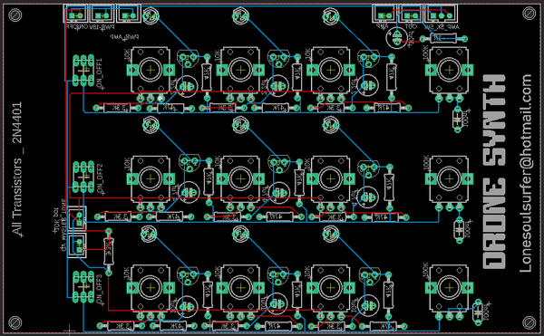
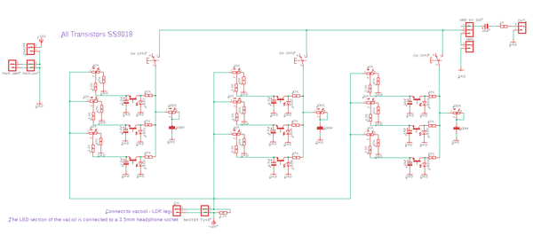
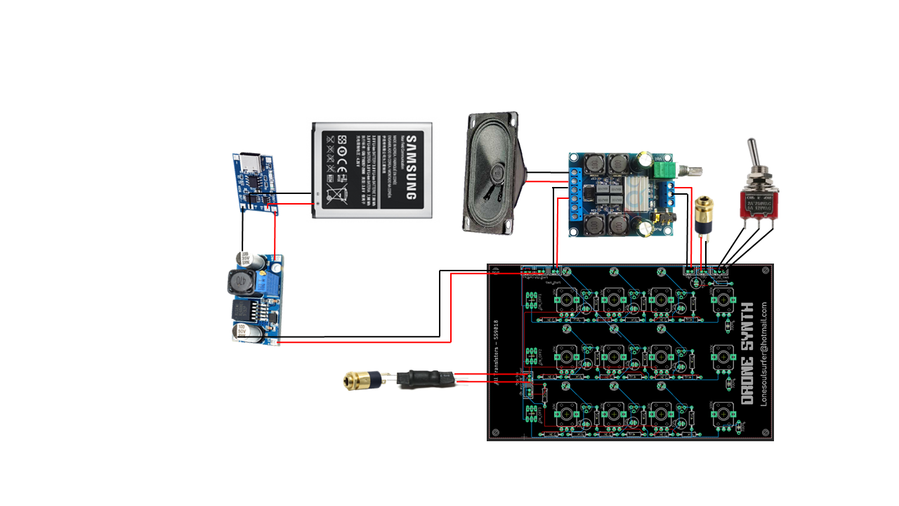

# Box of Beezz - Drone Synth

Source: https://www.instructables.com/Box-of-Beezz-Drone-Synth/

---

## Introduction

This is my 'Box of Beezz' drone synth using transistors as simple oscillators!

This build uses what is known as a relaxation oscillator. A relaxation oscillator is an oscillator that repeats itself over and over again from the charging of a capacitor to some event threshold and then the discharging of the capacitor. So basically the repetitive charging up of the capacitor and discharging of the capacitor creates oscillations via a transistor.

There are 9 in total built into the circuit and by using different capacitor values you can get different oscillations. The recharge and discharge time of the capacitor determines the time period and frequency of the oscillations

The LED connected to each oscillator acts as an output and these flicker on and off depending on the output signal. Plus, every project needs LED's!

Sawtooth oscillations are produced and they actually sound great. When you add 9 of them in total then you really get some interesting sounds generated.

There is also a master tone knob and I've included a control voltage output so you can hock the drone synth up to a sequencer.

The project was inspired by 'Look Mum No Computers' super simple oscillator build which I have linked below

[Super Simple Oscillator](https://www.lookmumnocomputer.com/projects#/circledroneofdoom)

Oh and hackaday did a review of this project which you can find[here](https://hackaday.com/2022/05/29/relax-and-enjoy-this-simple-drone-synthesizer/)

## Supplies

Components for the circuit board

1. PCB - See the next step on how to get your PCB printed
2. Tactile 7x7mm switches - [Ali Express](https://www.aliexpress.com/item/32985880305.html?spm=a2g0o.order_list.0.0.7bb21802Fdp9kU)
3. Tactile push button caps - [Ali Express](https://www.aliexpress.com/item/32891579029.html?spm=a2g0o.order_list.0.0.7bb21802Fdp9kU)
4. JST Connector mini
5. 2 pins X 6 [Ali Express](https://www.aliexpress.com/item/32828414999.html?spm=a2g0o.productlist.0.0.18044784kWjGNS&algo_pvid=5dfbb9c1-94f4-4cff-b61e-8657a8ae27f2&algo_exp_id=5dfbb9c1-94f4-4cff-b61e-8657a8ae27f2-22&pdp_ext_f=%7B%22sku_id%22%3A%2264992858497%22%7D&pdp_npi=2%40dis%21AUD%21%212.35%21%21%21%21%21%402101e9d416532854085127665efc59%2164992858497%21sea)
6. 3 pins X 1 [Ali Express](https://www.aliexpress.com/item/4000898605030.html?spm=a2g0o.productlist.0.0.12724ca9HQFmtK&algo_pvid=a4588927-af8a-48ed-ae67-70bce4981b1e&algo_exp_id=a4588927-af8a-48ed-ae67-70bce4981b1e-11&pdp_ext_f=%7B%22sku_id%22%3A%2210000010469613342%22%7D&pdp_npi=2%40dis%21AUD%21%211.23%21%21%211.78%21%21%400bb0623d16532856736751867e512f%2110000010469613342%21sea)
7. Capacitor Polarized [Ali Express](https://www.aliexpress.com/item/1005003217967608.html?spm=a2g0o.productlist.0.0.5383a549eNb9Hi&algo_pvid=19cea181-0a76-4a8d-ae3b-b8e565418771&aem_p4p_detail=20220522230301721145109342840059391218&algo_exp_id=19cea181-0a76-4a8d-ae3b-b8e565418771-2&pdp_ext_f=%7B%22sku_id%22%3A%2212000024708472323%22%7D&pdp_npi=2%40dis%21AUD%21%210.26%21%21%212.78%21%21%40210318bb16532857811005385e9354%2112000024708472323%21sea)
8. 2.2uf X 3
9. 4.7uf X 3
10. 10uf X 4
11. Capacitor Poly 100nf X 3 [Ali Express](https://www.aliexpress.com/item/1005003649560151.html?spm=a2g0o.productlist.0.0.4ada357crKofPu&algo_pvid=732f2d09-6507-4d7a-9fe1-36ffeced0171&aem_p4p_detail=2022052223041910578676285903680059383201&algo_exp_id=732f2d09-6507-4d7a-9fe1-36ffeced0171-4&pdp_ext_f=%7B%22sku_id%22%3A%2212000026647727895%22%7D&pdp_npi=2%40dis%21AUD%21%213.32%21%21%212.04%21%21%402101fd4b16532858596622643e180a%2112000026647727895%21sea)
12. LED 3mm white X 9 [Ali Express](https://www.aliexpress.com/wholesale?catId=0&initiative_id=SB_20220522221515&isPremium=y&SearchText=3mm+led+white&spm=a2g0o.productlist.1000002.0)
13. Resistors - Buy them in assorted lots - [Ali Express](https://www.aliexpress.com/premium/resistor-assorted.html?d=y&origin=y&catId=0&initiative_id=SB_20220522221640&SearchText=resistor%20assorted&spm=a2g0o.detail.1000002.0)
14. 47K X 18
15. 3.3K X 10
16. 1K X1
17. Transistors 2N4401 X 9 [Ali Express](https://www.aliexpress.com/wholesale?catId=0&initiative_id=SB_20220525180232&SearchText=transistor+4401&spm=a2g0o.productlist.1000002.0)
18. Potentiometers 9mm Vertical [Ali Express](https://www.aliexpress.com/wholesale?catId=0&initiative_id=SB_20220522221833&isPremium=y&SearchText=potentiometer+9mm+vertical&spm=a2g0o.productlist.1000002.0)
19. 10K X 10
20. 100K X 3

Other components

1. Speaker - eBay
2. Speaker Mesh - [Ali Express](https://www.aliexpress.com/item/4000087549083.html?spm=a2g0s.9042311.0.0.27424c4debfuno)
3. Amplifier Module - [Ali Express](https://www.aliexpress.com/item/32847729011.html?spm=a2g0o.order_list.0.0.7bb21802Fdp9kU)
4. Pot knobs -[Ali Express](https://www.aliexpress.com/item/32954107409.html?spm=a2g0o.order_list.0.0.7bb21802Fdp9kU)
5. USB C Charging module - [eBay](https://www.aliexpress.com/item/32930640893.html?spm=a2g0o.order_list.0.0.7bb21802Fdp9kU)
6. Battery - I used an old mobile battery to power everything which worked fine. You can usually find them for free or you can can buy one - [eBay](https://www.ebay.com.au/sch/i.html?_from=R40&_trksid=p2380057.m570.l1311&_nkw=samsung+mobile+phone+battery&_sacat=0)
7. Voltage step up module - [Ali Express](https://www.aliexpress.com/item/1005001622004014.html?spm=a2g0o.productlist.0.0.72ea1b5f1O41Tz&algo_pvid=f4a6b564-adaf-4dc1-b424-5f7634c9725b&aem_p4p_detail=202205181559142981785717844500018549615&algo_exp_id=f4a6b564-adaf-4dc1-b424-5f7634c9725b-0&pdp_ext_f=%7B%22sku_id%22%3A%2212000016846792106%22%7D&pdp_npi=2%40dis%21AUD%21%211.07%21%21%211.95%21%21%402103255a16529147544003345e9b6a%2112000016846792106%21sea)
8. 3.5mm Headphones Jack Socket X 3 - [Ali Express](https://www.aliexpress.com/wholesale?catId=0&initiative_id=SB_20220518145551&isPremium=y&SearchText=3.5mm+Headphones+Jack+Socket+Connector&spm=a2g0o.productlist.1000002.0)
9. SPDT Toggle Switch X 2 - [eBay](https://www.aliexpress.com/wholesale?catId=0&initiative_id=SB_20220518150557&isPremium=y&SearchText=SPDT+6MM+Reset+Latching+Toggle+Switch+&spm=a2g0o.productlist.1000002.0)
10. Vactrol - 5mm white LED & LDR See [this Instructable](https://www.instructables.com/How-to-Make-a-Optocoupler-Vactrol/) on how to make one

Case & Front Panel

1. Clear, adhesive paper - [eBay](https://www.ebay.com.au/sch/i.html?_from=R40&_trksid=p2334524.m570.l1313&_nkw=clear+transparent+glossy+self+adhesive+sticker+paper&_sacat=0&LH_TitleDesc=0&_odkw=Clear+Transparent+Glossy+Self+Adhesive+Sticker+Paper+Label+Laser+Print&_osacat=0)
2. Opal Acrylic - [eBay](https://www.ebay.com.au/sch/i.html?_from=R40&_trksid=p2047675.m570.l1313&_nkw=opal+acrylic+a3&_sacat=0)
3. Hard wood for the case - I use edging 40mm X 8mm X 1M

## Step 1: The Schematic, PCB & Getting Your PCB Printed

If you want a deeper insight on how this circuit works, then check out [this link](http://www.learningaboutelectronics.com/Articles/Relaxation-oscillator-circuit-with-a-transistor.php)

The board is actually 2 sided. On one side are all of the components like capacitor, resistors, transistors etc. On the other side are the potentiometers and switches.

Due to the size limitations on circuit design in Eagle (100mm X 100mm) I had to jam a lot onto a small sized board. However, you can make the board bigger to add screw mounting holes so the actual size is ...

The oscillators are lined-up in 3 rows of 3 for a total of 9. I've also added tone pots for each row and there is also a master tone pot. There is a on/off switch for each row so you can turn each one off when tuning.

If you would like to play around with the schematic and board in Eagle, well I have also provided these in my [GitHub Page](https://github.com/lonesoulsurfer/Box_of_Beezz---Drone_Synthhttps://github.com/lonesoulsurfer/Box_of_Beezz---Drone_Synth) You can also find a PDF of the schematic in this step.

There are actually 2 versions available of the PCB. Both are available in my Google Drive

Version 1

This is the one I used ion this build. It has a tone pot for each line of drones (3) plus a master one. I don't use the tone pots very often so decided to do a version 2

Version 2

This has the tone pots removed (only has the master one) and an extra drone circuit for a total of 12 drones!

Getting Your Board Printed

To have the board printed, save the gerber zip file in the [GitHub Page](https://github.com/lonesoulsurfer/Box_of_Beezz---Drone_Synth) files to your computer and email it to your favourite PCB manufacturer. I use JLCPCB (not affiliated) who do a good job of printing the boards and are quick as well. If you are thinking 'what the hell is a gerber file!', then[check this 'ible out](https://www.instructables.com/How-to-Get-a-PCB-Printed-Using-Gerber-Files/) which is a step by step guide on how to get a PCB manufactured.

- [Box of Beezz - Drone Synth V1 - Schematic](pdfs/Box of Beezz - Drone Synth V1 - Schematic.pdf)
- [Box of Beezz - Drone Synth V2 - Schematic](pdfs/Box of Beezz - Drone Synth V2 - Schematic.pdf)

## Step 2: Adding the Components to the PCB - Part 1

Adding the components is pretty straight forward. However, you should start with adding the components first. Oh and you need to modify the transistors as well slightly!

STEPS:

1. As usual, start with the lowest profile parts - in the case it's the resistors
2. Next add the JST connectors
3. Before you add the transistors, you need to remove the middle leg of each one. I used some wire cutters to snip these away. Once the legs have been removed you can solder them in place
4. Now you can add the capacitors

## Step 3: Adding the Components to the PCB - Part 2

1. Flip the board over and add the LED's. I used white and but you could use different colours which might even give you different outputs.
2. Add the switches next. Note that the switches have an orientation and how you add them to the PCB will either mean they are normally on or normally off. Just make sure that you orientate them the 3 switches the same way on the board.
3. Lastly, add the pots to the PCB.
4. You should now go ahead and test the board to make sure everything is working. You'll need to put 18V through it and connect to an amp to hear anything.

## Step 4: The Front Panel

I use [inkscape](https://inkscape.org/) to design my front panels. You can find the raw files in my [GitHub Page](https://github.com/lonesoulsurfer/Box_of_Beezz---Drone_Synth)in case you want to play around with it. As I have mentioned, I have made 2 versions of the PCB and have also done a panel design for version 2 which is in my Google drive. I've also come up with a neat way to easily create front panels that match up perfectly to a PCB. Check out the YouTube clip if you are interested in learning how.

STEPS:

1. Use the attached PDF copy of the front panel design. Pick whether you want to include the one with the cutout for the speaker or not. You may have a different style of speaker than mine
2. The front panel needs to be printed on clear, adhesive paper. You can get this from eBay and have added a link to the parts page.
3. Cut out the image and carefully place onto the opal acrylic and remove any air bubbles. I peal away the top section and lay this onto the acrylic. I then use something flat like a ruler and carefully run it down the adhesive paper to ensure no creases or air bubbles are introduced.
4. Cut the acrylic to size if you haven't already.
5. To ensure the colours on the front panel don't get scratched, spray a few coats of clear acrylic onto the front panel. Make sure you give it a good coating each time and leave for an hour to dry before applying the next one. I used a satin finish clear coat on the final design.

- [Drone Synth 1](pdfs/Drone Synth 1.pdf)
- [Drone Synth 2](pdfs/Drone Synth 2.pdf)

## Step 5: Drilling & Making Cut-outs on the Front Panel

Time to drill out the holes for the pots and switches and also cut out the section for the speaker

STEPS:

1. I like to use a stepped drill bit to make the holes in the front panel. Carefully drill out each of the holes for the pots and switches
2. To cut out the speaker section, use a hole drill piece and drill out the 2 round sections.
3. Attach a small cutting wheel to the dremel and carefully cut away the straight sections
4. Tidy up the edges of the speaker hole with a file or a sanding drum attached to the Dremel.
5. You'll also need to mark out and drill 4 holes in order to mount the speaker
6. Place the PCB into the front panel, mark on the acrylic where to drill the 4 mounting holes to mount the PCB and drill away.
7. Don't secure the PCB to the front panel yet - first you need to sort out the case

## Step 6: Making the Case

I have made a simple box shaped case for this build. It's similar to the ones I have previously built but gives a great finish to the project. The case does require either a router or a dremel with a special attachment. If you don't have any of these then you can just attached the panel directly on top of the wood! The finish won't be the same but it'll be close.

STEPS:

1. The first thing you need to do is to cut a groove along the wood in order to secure the panel into. I use a dremel with a router attachment to do this.
2. Secure the wood with some clamps and run the bit near the top of the wood. Take your time and make sure you keep the dremel nice and straight.
3. I also used a larger router bit to remove some of the material on the inside of the case. this will allow me to add the switches, audio sockets so they protrude through the wood and I can secure them easily.
4. Measure and cut the wood to size. The best way to do this is to just slip in the front panel into the groove of the wood and measure where to make the cuts
5. Place the front panel into the grooves of the wood. You can either use some some PVC or a brader nail gun to secure the case together.
6. Lastly, you should make a back for the case before you start to sand. I used some thin ply wood and secure it into place with some small screws. If you add the back now, you can sand it to shape in the next step and it makes things a lot easier.

TIP If you find the panel is a little big and the wood doesn't right then just remove a little of the acrylic along the edge with a sander.

Sanding & Painting

1. Time to clean up the edges. I use a belt sander to do this which is the quick way. You could also just do it by hand sanding as well.
2. You can also round off the edges of the case with the sander as well which I did.
3. Paint or stain the case. I used a clear varnish to give it a clean finish
4. Leave it to dry for 12 hours (it's hard I know)

## Step 7: Adding the PCB & Speaker

Now that you have the front panel secured into the case, it's time to add the PCB

STEPS:

1. Place the PCB into the front panel. if you haven't already, mark out the PCB mounting holes on the back of the panel and drill.
2. Secure them in place with some small screws and nuts
3. For the speaker, also mark and drill out the mounting holes if not already done.
4. I also added some speaker grill mesh. Just cut it to shape and drill some holes for mounting to the speaker and case
5. Put it all together with 4 screws and nuts

## Step 8: Adding the Components to the Case

I have included an amp on this build along with a voltage boosting module, USB C charging module, vactrol (for the control voltage) and a couple other components which will all need to be added to the case.

STEPS:

1. Let's start with the charging module. Remove the back from the case
2. with a file, make a groove in the bottom section of the case big enough for the module to sit in.
3. Super glue the module into place
4. Next, place the volume potentiometer into the case and secure into place
5. Add the switches, audio sockets and secure into place
6. Lastly, add the 10K 'master tone' potentiometer into the front panel and secure.
7. The vactrol I used is made from an LED and an LDR. You can easily make your own following [this Instructable](https://www.instructables.com/How-to-Make-a-Optocoupler-Vactrol/)
8. Secure the LDR legs to the 'CV' section on the PCB The LED legs need to be connected to the CV out socket. Make sure that you attached the positive leg of the LED to the L and R terminals on the audio socket and the ground of the LED to the ground on the socket

## Step 9: Wiring Everything Up!

I've included a wiring schematic to help you wire everything up. Note that I have slightly revised the PCB and have included a power JST connector for the amp and also a connection to add the vactrol LDR legs too. My goal when I'm designing something like this is to have the least amount of wires possible. Unfortunately, there is quite a bit of wiring due to the fact that I had to remove the volume pot from the amp and there are wires needed to connect the vactrol and amp up to everything.

STEPS:

1. First, connect the out 3.5mm audio socket to the out on the PCB
2. You will notice that there is a switch to either have the speaker and amp on or to have it play on an outside amp. Connect the wires next for this switch
3. Add the vactrol to the other 3.5mm audio socket. You need to add the LED section of the vactrol to the solder points on the socket. Make sure you have the cathode leg (ground) connected to the ground on the audio socket and the anode (positive) to the left and right solder points on the socket
4. the LDR section of the vactrol gets connected the the 'vactrol' connection on the PCB
5. Next connect the amp up to the speaker and 'amp' connection point on the PCB along with the 'amp power' connection on the PCB.
6. There is a spot to connect an on/off switch on the PCB. However, if you just add a switch to this then it won't turn off the amp. What I did was add a solder blob between the two connections on the PCB and then added a on/off switch from the battery. This way you are turning everything off from the battery.
7. To be able to charge the battery you need to add a li-po charging module. I just make a small groove in the case, glue it into place and connect the battery.
8. To increase the voltage from 3.7v to 18v, I used a step up module. Connect this to the out on the charging module and then connect it to the power connection on the PCB.
9. Once you have wired everything together, add the knobs to the potentiometers.

That's it! Now go and make some noise.

## Downloads

- [Box of Beezz - Drone Synth V1 - Schematic](pdfs/Box of Beezz - Drone Synth V1 - Schematic.pdf)
- [Box of Beezz - Drone Synth V2 - Schematic](pdfs/Box of Beezz - Drone Synth V2 - Schematic.pdf)
- [Drone Synth 1](pdfs/Drone Synth 1.pdf)
- [Drone Synth 2](pdfs/Drone Synth 2.pdf)

---
*69 images archived*
