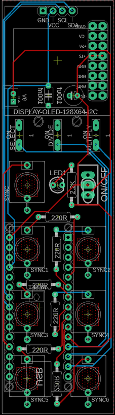
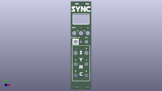
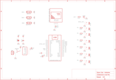
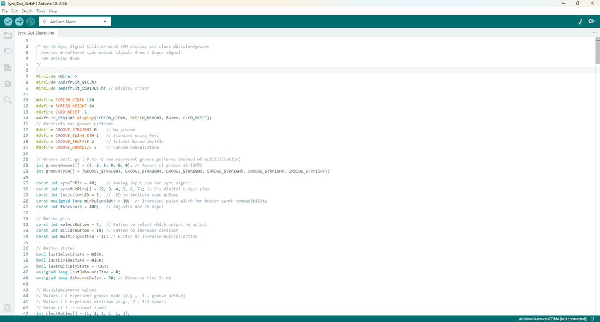

# Buffered Multiple for Modular Synths - Powered by Arduino

Source: https://www.instructables.com/Buffered-Multiple-for-Modular-Synths-Powered-by-Ar/

---

## Introduction

For those who have been following; you'll know that I have been putting together my own modular synth - primarily based around the Arduino Nano.

If not, then check out my projects for a quick update.

A buffered Multiple is a module that allows you to add a sync in from say a drum machine, and use that signal to sync up other modules via the 6 Sync in's.

Initially, I got a little stuck on this project as I couldn't find a good schematic without having to use negative voltages which my build doesn't use. I put out a call to Reddit and came up with a version using the 4050 chip which worked fine. However, I wanted to add a couple more features which an Arduino was perfect for.

So what does it do?

This project creates a 1-to-6 sync signal splitter for synthesizers with the following features:

- Takes one sync input signal and produces six individually configurable outputs
- Shows current BPM on OLED display
- Each output can be configured with:
- Normal sync (1:1)
- Clock division (1/2, 1/4, 1/8)
- Three groove patterns:
- GS: Swing (delays off-beats by fixed amount)
- GF: Shuffle (creates triplet-based rhythm)
- GH: Humanize (adds random timing variations)
Groove patterns can be adjusted from 50 to 75%% intensity, providing subtle to a more extreme timing effects. The device maintains accurate timing with non-blocking code and offers visual feedback through the display and indicator LED.

Perfect for synchronizing multiple synthesizers, drum machines, or sequencers while adding rhythmic variety to your setup. More details on the last step.

## Supplies

All of the parts needed to build your own can be found below. I have also included a PDF of all of the parts as well which is attached to this step. The PCB and front panel can be found on the next step.

PARTS:

Capacitor Polypropylene X 1 - Ali Express

Capacitor Polarized X 1 - Ali Express

Switch - Momentary X 3 - Ali Express

Switch - Toggle X 1 - Ali Express

Female Header Pin Socket X 2 - Ali Express

Arduino Nano X 1 - Ali Express

Audio Socket X 7 - Ali Express

Mini JST Connector and wire X 1 - Ali Express

LED X 1 - Ali Express

OLED Display 128X64 X 1 - Ali Express

Resistors - Ali Express

220 X 6

2.2K X 1

## Step 1: PCB & Front Panel

We all have different levels of knowledge, so when it comes to a build like this I want to make sure that I'm providing enough information so anyone with some basic soldering skills can make it. That includes ensuring there are instructions on how to get your own PCB's printed (which is super easy!)

So with that said, the first thing you will need to do is to get the front panel and PCB printed. I use JLCPCB (not affiliated) to get this done. The front panel is actually just a PCB without any components included! The front design is done in a program called Inkscape (available free) and the panel including the drilled holes is done in Fusion 360 (also free!)

The files that you need to build your own Bleep Drum Synth can be found in my GitHub page. This includes the parts list, Gerber files for the PCB & front panel, schematic, Arduino script etc. Download the files to your computer

STEPS:

- Send the Gerber files to a PCB manufacturer like JLCPCB who will print the PCB and front panel for you. Download all of the files from my GitHub page to your computer and send the zipped Gerber files off to the PCB manufacturer of choice.
- If you have no idea what any of the above means , then check out the Instructable I made on how to get your broads printed which can be found here.
- NOTE: The manufacture will include an order number on both the PCB and front panel. It doesn't really matter where it is on the PCB but you don't want it on the front on the front panel!
- Over at JLCPCB you can 'specify a location' once the Gerber files have been loaded so click this for the front panel and specify in the comment section that you want the order number on the back of the panel. The manufacturer will add it to the back where indicated.

## Step 2: Adding Components to the PCB - Part 1

The PCB is 2 sided with the Arduino and caps being soldered on the reverse side.

STEPS:

- The first thing to do is to solder the resistors to the PCB.
- Now you can solder into place the JST connector. This is how I power muy modules. I have also included a 16 Pin Eurorack connector which you can use to power the synth via 12V
- At this stage it’s best to flip the board over and add the Arduino. If you don’t and add the rest of the components, you’ll find it tricky to add the Arduino later.

## Step 3: Adding the Arduino to the PCB

Next step is to add the Arduino to the PCB. There is a way to do this that ensures it fits perfectly each time.

STEPS:

- First, add the header pins to the pins on the Arduino.
- Now, put the header pins into the PCB and add some solder to the corner legs to hold it into place. Make sure that the rest of the header pins are sitting correctly in the PCB.
- Now you can solder the rest of the pins to the PCB.
- Remove the Arduino once done so you can get at the legs of the components that need to be soldered on next
- Oh, and you may as well solder into place the 2 capacitors on the reverse side

## Step 4: Adding Components to the PCB - Part 2

Now it’s time to add the rest of the components.

STEPS:

- Solder the audio 3.5 connectors into place – all 7 of them
- Now do the momentary switches and the toggle switch
- The last thing to solder is the OLED screen. Add a female header pin to the PCB and the solder into place 4 X male header pin to the OLED.
- Remove the little plastic spacer on the 4 X male header pin and trim each leg about the same height as the spacer.
- Now push the OLED into place. It should now be the exact right height to go flush onto the front panel.

## Step 5: Adding the Sketch to the Arduino & Testing

It’s always good practice to test the PCB first before adding the front panel. Before we can test, we need to load the sketch into the Arduino.

If you are new to Arduino and want learn how to upload a sketch to Arduino - then check out this link. It's really straight forward and doesn't need any special tools - just a computer and a USB cord.

STEPS:

- Open the sketch in the Arduino folder which will take you to Arduino IDE. This can be found in the folder that you downloaded from my GitHub page
- Connect your Arduino and upload the sketch
- Once the sketch is loaded to Arduino you can connect it to the PCB for testing.
- Connect the PCB to a 9V to 12V power source and check that the buffered multi works. The screen should come on with 'Sync' and if you push select, the screen should change to the BPM and menu for changing the speed of each Sync in

## Step 6: Adding the Front Panel

Right – now it’s time to add the front panel to the PCB.

STEPS:

- Place the front panel on top of the PCB and push into place. It’s a nice, snug fit so just give it a wiggle to make sure that the components push through the holes
- Add the nuts to the audio 3.5mm jacks and secure them into place. You can actually make your own tool to easily secure these if you want to – check out this build
- Now add the nut to the on/off switch.
- Once the front panel is in place, you can do a final test before sticking it into your Eurorack case

## Step 7: So What Does It Do?

- Takes one sync input signal and produces six individually configurable outputs
- Shows current BPM on OLED display
- Each output can be configured with:
- Normal sync (1:1)
- Clock division (1/2, 1/4, 1/8)
- Three groove patterns:
- GS: Swing (delays off-beats by fixed amount)
- GF: Shuffle (creates triplet-based rhythm)
- GH: Humanize (adds random timing variations)
Groove Implementation

- Swing (GS) = consistent delayed off-beats
- Delays off-beats by shifting timing up to 66% through beat
- Very classic swing feel at 50-75% intensities
- Clean implementation with consistent timing
- Shuffle (GF) = polyrhythmic feel with specific timing ratios
- Creates 2-against-3 feel using weighted offset timing
- Distinct from swing - pushes toward triplet territory
- At 75%, approaches dotted 8th feeling (funkier)
- Humanize (GH) = unpredictable variations
- Adds random timing variation around off-beats
- Much stronger randomization (up to 40% of beat)
- More chaotic/organic feel compared to others
Each mode serves a distinct musical purpose, and the intensity levels (50%/75%) allow meaningful adjustment.

The two intensity levels (50% and 75%) offer enough adjustability without overcomplicating the interface. This gives users six distinct groove feels to choose from (three types × two intensities)

---
*35 images archived*
