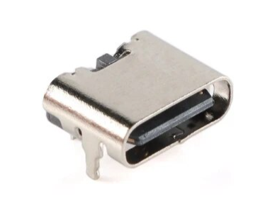
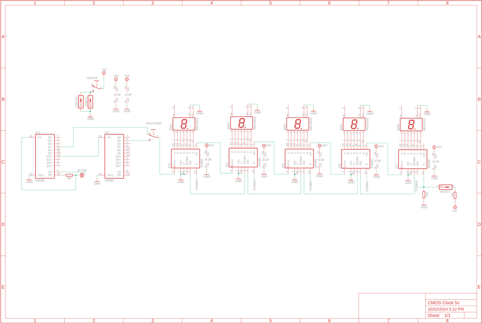
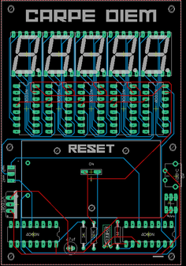
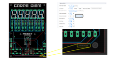

# CMOS Counter Clock

Source: https://www.instructables.com/CMOS-Counter-Clock/

---

## Introduction

"Time is what stops everything happening all at once!" - anonymous

It's a strange little quote but the more you think about it - the more it rings true. The one thing we can't deny is we are all affected by time. Sometimes it goes by fast, other times (pun intended!) it flies by. I wanted to create a little reminder for myself that the seconds are always ticking by and there are only 86,400 in each day - so get busy!

This little clock counts the seconds up to 99,999 (1.15 Days) and then starts over again. I wanted it to be a visual reminder of the seconds ticking by and to try and not waste to many of them.

I started to do some research into how best to represent this and all of the designs were quite complicated. I then stumbled onto the 4060 Binary counter CMOS chip and discovered that it could keep accurate time using a crystal oscillator! The crystal oscillator I used is the same one that is found in a lot of digital watches and uses a vibrating crystal of piezoelectric material to accurately keep time! mind blown.

Anyhow the basic circuit is ridiculously simple and only needs a handful of parts to make an LED flash each second for as long as it has power. The circuit can be used to generate a pulse at 1 second intervals which in turn can be used as a clock input to drive some 4033 Decade Counter CMOS chips to control some 7 segment displays.

The great thing about the 4033 IC is you can string them together in as many rows as you wanted to, meaning you could build a googol clock (1 followed by 100 zeros!) if you felt like it! Most of it would be blank until the end of the universe but it would still be pretty cool thing to build.

I designed a PCB to keep everything neat and tidy and also added some red transparent acrylic across the front to help diffuse the light from the 7 segment displays.

Initially I built this so it could power off a 9V battery along with 5V from an adapter. I decided to re-degn the PCB and just have it powered with 5V's via a USB-C adapter. You can still find the Gerber files for the battery version and also parts list in the next step

No time to waste - let's get building!!

## Supplies

PCB info can be found on the next step

The parts below are for the 5V all adapter version. The battery version parts list and Gerber files can be found in my Google drive

PARTS:

- Resistors (metal Film)
- [1M X 1](https://www.aliexpress.com/w/wholesale-1m-Resistor.html?spm=a2g0o.productlist.search.0)
- [1K X 1](https://www.aliexpress.com/w/wholesale-1k-Resistor.html?spm=a2g0o.productlist.search.0)
- [22K X 1](https://www.aliexpress.com/w/wholesale-22k-resistor.html?spm=a2g0o.productlist.auto_suggest.1.4bbb41a6O8fMLp)
- LED Display 7 Segment [5101AS X 5](https://www.aliexpress.com/w/wholesale-5101AS.html?spm=a2g0o.productlist.search.0)
- IC's
- [Decade Counter 4033 X 5](https://www.aliexpress.com/w/wholesale-4033-ic.html?spm=a2g0o.productlist.search.0)
- [Binary Counter 4060 X 2](https://www.aliexpress.com/w/wholesale-4060-ic.html?spm=a2g0o.productlist.search.0)
- Switches
- momentary switch [SKRCADD010 X 1](https://www.aliexpress.com/w/wholesale-SKRCADD010.html?spm=a2g0o.productlist.search.0)
- micro slide switch [MSK-12D19 X 2](https://www.aliexpress.com/item/1005005877515591.html?spm=a2g0o.order_list.order_list_main.386.503d1802HJPTn8)
- [USB C X 1](https://www.aliexpress.com/item/1005006140199994.html?spm=a2g0o.order_list.order_list_main.65.65691802z57dr5)
- Crystal Oscillator [32.768kHz X 1](https://www.aliexpress.com/w/wholesale-32.768kHz.html?spm=a2g0o.detail.search.0)
- Red Translucent [acrylic X 1](https://www.ebay.com.au/sch/i.html?_from=R40&_trksid=p4432023.m570.l1313&_nkw=red+transparent+acrylic&_sacat=0)

## Step 1: Designing the Circuit & Getting Your Own PCB Printed

When designing this PCB I wanted to make sure that it was a complete unit with no need for added wires or external components to make it work. It can be powered directly via USB C.

All of the information including the Gerber file, Eagle files and schematic can be found on my [GitHub Page](https://github.com/lonesoulsurfer/CMOS_Clock_Counter)

There are 2 versions available - one that is powered by 5V USB C and the other by a 9V battery and USB C - you choose which one you want to build

Getting the PCB Printed – Steps

- Download the ‘Gerber file’ folder from my [GitHub Page](https://github.com/lonesoulsurfer/CMOS_Clock_Counter) and save it somewhere on your computer
- You’ll need to send the Gerber files to a PCB manufacturer like JLCPCB (Not affiliated) who will print the boards for you. Just follow the steps and download the Gerber files to the website.
- You will see the PCB once it has been loaded. Now you can choose your colour by ticking which one in the list below
- Every PCB printed has an order number automatically added. However, you can opt to have it added to a ‘specific’ spot.  Make sure you click the specific tick box and it will be located on the back of the PCB.
- Now sit back and wait for your 5 boards to arrive.

## Step 2: About the Integrated Circuits Used in This Build

The circuit used in this build can be broken up into 2 sections. The first is the 4060 binary IC’s which generate the 1 second pulse output and the other is the 7-segment display section with the 4033 Decade counters.

So let’s start with the 4060’s.

To be able to generate a 1Hz clock frequency I’ve used a 32.768 Khz quartz crystal oscillator. These are the same ones you find in digital watches etc.  The crystal oscillator needs to oscillate at 32768 Hz so to be able to do this we use a couple 4060 binary counters. The reason why we need to use 2 is 1 won’t be able to divide the input frequency of the crystal oscillator enough to reach 32768 Hz whist using 2 gets us there

The pulse output (1 second) and pin 5 of the 2nd 4060 IC, can be connected to an LED which will flash at 1 sec intervals. Nice but boring. So what if we use this pulse to drive a 7 segment display? Well this takes us to the second part of the circuit

If you connect the output pulse to the clock input of a 4033 decade counter and then wire up a 7 segment LED display to the 4033 IC you’ll be able to get it to count to 10 over and over at 1 second intervals.

The next logical step is to start to string a few 4033 and 7 segment displays together so they trigger each other in a way that makes them count. This is pretty straight forward as all you need to do is to is connect pin 5 from the first 4033 IC to pin 1 (clock) of the next 4033 and so on. In theory you could connect 100 or more this way and build a gargantuan counter.

So that’s a really quick rundown on how this works. Note - I’m far from an expert so if I don’t get it quite right don’t worry – you get the gist.

## Step 3: Adding Components to the Board

Whenever you start to add components to a PCB it is best practice to add them from lowest profile to the highest. This way when you flip it over to solder the legs into place you don’t have parts falling out because they aren’t sitting against the table. So with that, lets start with the resistors

STEPS

- I don’t think I have ever built an electronic project with such few resistors!  Anyhow, add the 3 of them into the PCB and solder the legs into place
- Now you can go ahead and add the crystal oscillator. Be careful here as the legs are thin and you don’t want them twisted when adding it to the PCB.
- Usually now I’d say it’s time to add the IC sockets. However, I decided not to add them to this build. They raise the IC’s quite a bit off the board and I wanted a cleaner look. Up to you if you want to add them or not
- Solder into place all of the 7 IC’s
- You can now solder in the 7 segment displays. Make sure that they are up the right way and sitting flat on the PCB before soldering into place
- The last thing to do is to solder the 2 right angle slide switches and momentary switch into place

## Step 4: Adding the Red Acrylic Front

This isn't necessary but it does give a great finish to the build so You should consider doing something similar

STEPS:

- Place a blank circuit board onto the red acrylic and measure out the size on the backing of the acrylic
- If you have a band saw then use this to cut the acrylic.  If not you can use a fine tooth saw to cut it out
- Sand and then file the sides to make them smooth.
- Place the board back onot the acrylic and mark out the 4 drill holes in each corner.  Use a 2.5mm drill piece to drill out the holes
- To secure the acrylic into place you'll need to use some spacers.  Check the parts list on where to get these
- Secure the spacers to the board and acrylic using the screws that come with the spacers

## Step 5: Mounting the CMOS Counter

I decided to mount mine to the wall. You could also make a witre stand and have it sit on a desk table.

STEPS:

- Decide where you want to have your clock counter.  Prob best to have it close to a power source so it's easy to power.
- Use a couple snall screws and add them to the 2 small holes about half way up the PCB.  You might need to remove the acrilic cover first if you ahve already added it
- Connect a USB C cord to the adapter on the PCB and power it up

---
*34 images archived*
