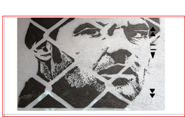

# Cassette Tape MP3 Player

Source: https://www.instructables.com/Cassette-Tape-MP3-Player/

---

## Introduction

I've been trying for some time to come up with a mod for the cassette tape.  Initially I thought it would be cool if I could stick a voice recorder into one of those tiny cassette tapes that used to be used in message machines (trying to ironic!) but it was way too small.

Then I hit upon using one as an MP3 player.  Surprisingly, no-one has completed one yet as an 'ible so I decided to go down [this](http://www.ebay.com.au/sch/i.html?_sacat=0&_from=R40&_nkw=credit+mp3&LH_PrefLoc=2) path.  The hardest part was trying to find the right MP3 to be able to mod.  I finally found this MP3 Player on Ebay which fits really well into a cassette tape once the insides are removed.

The only changes you'll have to do is a bit of trimming to the cassette tape with a dremmel, a little bit of soldering and some design work and your done.

So in the name of irony, I present to you [this](http://www.ebay.com.au/sch/i.html?_sacat=0&_from=R40&_nkw=credit+mp3&LH_PrefLoc=2) Cassette Tape MP3 Player.

Enjoy.

## Step 1: Things to Gather.

Material

1. Cassette Tape (get a few of these if you can, I found mine at a second hand shop, about the only place you can get them now. Make sure it uses screws to hold the case together.
2. Labels - These are used to add your own images to the cassette tape
3. MP3 player. Can be found on E[Bay.](http://www.ebay.com.au/sch/i.html?_sacat=0&_from=R40&_nkw=credit+mp3&LH_PrefLoc=2)
4. 4 momentary push buttons. These you will pull apart and use as replacement switches.
5. Thin black plastic. i.e. from a oil container

Tools

1. Dremmel
2. Screwdriver
3. Drill
4. Stanley knife
5. Hot glue gun
6. Sharp scissors~

## Step 2: Opening the MP3 Player

Initially I was going to put the whole MP3 player into the cassette tape. In the end I decided to remove the insides of the MP3 player and use the cassette tape as the body.

Steps

1. Use a small screwdriver to wedge open the MP3 case. It comes apart pretty easily.
2. Remove the circuit board and battery.
3. Keep the case as you will be using bits of this later.

Notes

* the MP3 player itself is pretty hardy but be careful when opening up the case - you don't want to stick a hole in it!

## Step 3: Modding the Insides of the Cassette Tape

This step involves making some room in the cassette tape. Un-surprisingly there isn't much room inside one of these so you will need to use your dremmel to remove some of the plastic. .

Steps

1. Un-screw the Cassette.
2. Remove all of the parts shown below.
3. The MP3 player should sit pretty flush against one end of the tape with the headphone jack pointing out. The battery will be at the other end of the tape.
4. Make sure you keep on trying the MP3 player inside the cassette so you don't remove too much plastic.~

## Step 4: Making the Buttons and Drilling Holes.

View 3 more
The buttons that come with the MP3 player are quite delicate and small. I decided to not use these and went for some larger momentary switches.
Steps:

Buttons

1. You need to remove the button from the switches. This is done easily by using a pair of pliers to bend off the small metal plate on top of the switch. Do this for the 4 switches.

Making Holes in the Cassette Tape

1. Next make some holes in the cassette tape for the buttons to go through. Use the MP3 cover as a template and mark-out the        buttons
2. Drill the holes.
3. Make sure that the buttons can move easily in the holes.
4. Next line-up the MP3 player in the cassette tape and buttons and mark-out where the headphone jack will be on the cassette. Drill a hole big enough to allow headphones to be pushed in.

Adding the buttons to the Cassette Tape.

1. As the buttons move around a bit I used the cover of the MP3 as a bit of a brace
2. Cut around the holes that the buttons went through on the MP3 cover
3. fit these onto the buttons on the cassette. This will stabilize them and stop them from wobbling around.~

## Step 5: Adding Longer Wire to the Battery

To be able to have the battery on one side of the cassette and the MP3 player on the other, you will need to extend the wires.

Steps:

1. De-solder the wires from the MP3 and battery.
2. Solder on some longer wires. I used ribbon wire from an old computer I had but anything will work. The wires need to be long enough so the battery is at one end and the MP3 is at the other of the cassette tape.~

## Step 6: Covering Up the Tape Holes

You will need to cover-up the 2 holesin the cassette that the tape is wound on. This way you won't see the battery or MP3 player through them!

Steps:

1. Find some thin, black plastic. I used some from an old plastic oil container.
2. Cut some small pieces out, enough to cover the holes.
3. Glue on with some hot glue.~

## Step 7: Close Everything Up

Your almost there!

Steps:

1. Place the MP3 player and battery into the cassette tape.
2. Hot glue the battery into place.
3. Align the MP3 up with the buttons and make sure that all buttons "click" the switches on the MP3 player
4. Here's the tricky bit - you now need to screw back into place the other side of the cassette. This took me some time to make sure that everything was aligned but once it is test the buttons again to make sure that they are making contact.
5. Screw the cassette tape back together.
6. Test - Go and stick some of your favourite music into it and make sure all is ok.

## Step 8: Designing Your Cassette Tape

View 3 more
Most of the tapes that you will find at second hand stores are either classical music or artists that you have never heard of before. I wanted to have some cool designs on the front of the cassette player so I decided to add my own.

Steps:

Choosing Your Images

1. Once you have a cassette that you want to use, you need to work out how it’s going to look. I went to Google images and found some pictures that I thought would look good. I have included these in the PDF files below. I picked quite a few images so I had a range to choose from.
2. Next I added these to labels which I printed the images onto. I used the following labels: Avery J8171

Cutting the Image to Size

1. Next create a template from another cassette. This way, when you go to cut-out the image it will fit perfectly onto the cassette.
2. When I came to the 2 centre holes and the viewing window, I traced around the 2 holes and used this as a guide and cut out the area needed.
3. Once you have cut-out the image, stick it onto one of the sides of the tape.~
[images 2.pdf](https://content.instructables.com/FND/14PX/HBHGJ0QI/FND14PXHBHGJ0QI.pdf)
[Download](https://content.instructables.com/FKF/FLML/HBHGJ0QJ/FKFFLMLHBHGJ0QJ.pdf)
[images.pdf](https://content.instructables.com/FKF/FLML/HBHGJ0QJ/FKFFLMLHBHGJ0QJ.pdf)
Download

## Step 9: Keep on Designing...

View 3 more
I tried a few different images on a few different coloured cassette tapes before I decide on which one I was going to use.

Steps:

1. The final design that I used was some stencil art that i found on the internet.
2. Below are a few of the designs I tested before settling on the stencil design.
3. I re-did the stencil design and turned the images around which I think worked better.
4. I also added some shapes on the image to help determine what button does what~

## Step 10: Finished

Hopefully you should now have a finished product. Adding music is really easy you just copy and paste into the MP3 player.

There is a blue light which comes on when the MP3 is turned on. It is near the play/pause button and shines through the crack where the cassette tape joins.

The overall design is quite strong and the buttons are really prominent and work well.. If you ever get bored with the images, you can easily remove them and add some new ones.

Happy Modding.

---
*42 images archived*
