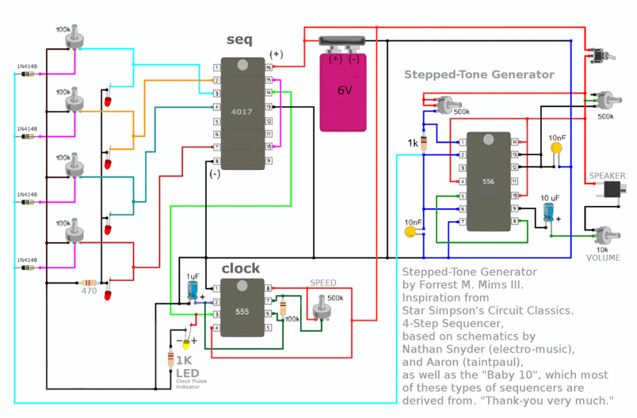

# Cigar Box Synth 

Source: https://www.instructables.com/Cigar-Box-Synth/

---

## Introduction

Here’s my latest synth made from a 555 and 556 timer along with a 4017 ic. A few months ago a build like this would have been way out of my skill level. Over the last few months however I’ve been putting together some simple synths to get a better understanding of schematics and parts.

The circuit design is by a guy called Forrest Mims. I’d never heard of him before this build but some in the US might remember the Engineer's Mini-Notebook which he the author was of. The book was available in Radio Shack once upon a time.

The synth itself is what is known as a 4 stepped sequencer and is based on the baby 10 sequencer. You have a lot of control over the sound produced from the synth. The 4 potentiometers connected to the 4017 Ic allows you to control the tone of each as well as turn them on or off. The other pots allow you to control speed, pitch and tone, allowing you to make some really interesting (and surprisingly nice sounding as well!) sounds.

This project should be tackled by someone who has some skill in soldering and understanding schematics and electronics. If you are a beginner, then I would suggest to start with my first synth ‘Ibles that I made using a 555 timer. These can be found below. I would also suggest you jump on-line and type in 4=555 circuits and make a few of the projects that come up. This will give you a good grounding to start to tackle a larger project like this one.

Link to the YouTube clip

Lastly, a note on the ‘ible itself. I find it quite hard to document builds like this as it isn’t easy to take photos once the build gets to a certain complexity. I’ve tried to create a step by step walk-through of most of the build and if you do get stuck on any section, then please let me know in the comments and I will try and help where I can.

Here are my other 555 builds

LIGHT THEREMIN IN A NES CONTROLLER

FIZZLE LOOP SYNTH - 555 TIMER

EXECUTIVE DECISION MAKER

Hackaday were nice enough to do a review of this project which can be found here

## Step 1: Parts - Circuit

Parts:

Potentiometers

1. 4 X 100K - eBay

2. 3 X 500K - eBay

3. 10K – eBay

4. Knobs for the Pots - eBay I brought these ones and these ones

Capacitors

1. 1uf – eBay

2. 10uf - eBay

3. 2 X 10nf – eBay

Resistors

1. 470R – eBay

2. 1K – eBay

3. 100K – eBay

IC’s

1. 555 – eBay

2. 556 – eBay

3. 4107 - eBay

Other Parts

1. 4 X Red LED’s and 1 X white - eBay

2. 4 X 1N4148 Diode – eBay

3. Speaker Jack – eBay

4. Speaker – eBay

5. Toggle Switches – eBay

6. On/off switch - eBay

6. AA Battery Holder (4 X AA) – eBay

7. Batteries

8. Thin wire

9. Case to store the synth in. I used a cigar box - eBay

10. Prototyping Board - eBay

11. Computer fan cover - I don't think you can get the exact one that I used any longer but you can get similar

## Step 2: The Circuit

Before you even start to think about making this, I strongly suggest that you breadboard the circuit first. I found the schematic a little confusing at first because I couldn’t work out how everything was attached to ground. It wasn’t until I started to put it together that I realised that the designer used black and blue for ground.

Once you breadboard everything up and it’s working, it’s time then to get cracking on the soldering.

## Step 3: Adding the IC's

First thing to do is to solder the IC’s into the Prototyping board. The board that I used was too large and I had to cut some off at the end. However, I’d rather have too much board then not enough…

Steps:

1. Solder on the 4017 IC first. I orientated all of the IC’s with the notch on the left so make sure you do the same or the steps will be back to front for you.

2. Next, solder on the 555 IC. Leave yourself a little room between each IC.

3. Lastly, solder on the 556 IC.

## Step 4: Adding the Connectors on the 4017 IC

The following steps will go through how to connect all of the IC’s together. A leg on an IC I will call pin and I will start with the 4017 IC. Adding wires to connect the potentiometers will come after all of the IC and components have been added to the board. The jumper wires that I used a solid core wire which I find a lot easier to use then normal wire.

The images in the ‘ible are in sequential order so you can use these to help guide you if necessary. Make sure you have the schematic handy as well.

Steps:

1. First connect pin 8 on the 4017 to pin 1 on the 555.

2. Next connect pins 15 and 10

3. Pin 13 is to be connected to ground. The prototyping board I used has a ground and positive strip around the outside which really makes things easy when connecting all of the ground and positive wires.

4. Connect pin 14 on the 4017 to pin 3 on the 555

5. Lastly, connect pin 18 to the positive section on the prototyping board

6. You will need to add some wires to pins 2, 3, 4 and 7 later which will be connected to the pots. I find that it’s easier to add these wires later as they just get in the way.

## Step 5: Adding the Parts and Connectors on the 555 IC

Steps:

1. Connect the 1 uf capacitor to pin 2 to ground, making sure that the positive wire on the capacitor is connected to the IC.

2. Next you need to add a 1k resistor and an LED to pin 3. As the LED will be connected to the board with wires, I left this off for the time being and connected just the 1k resistor. The resistor needs to be attached to pin 2 and ground. Make sure that you leave a couple of holes between the pin and resistor so you can add the LED wires later

3. Connect pins 2 and 6 together

4. Add a 100k resistor between pins 6 and 7

5. Connect pins 4 and 8 together

6. Lastly, connect pin 8 to positive

7. Adding the Potentiometer will come later

## Step 6: Adding the Parts and Connectors on the 556 IC

Steps:

1. Connect pins 1 and 2 together with a 1k resistor

2. Connect pins 2 and 6 together

3. Connect pin 6 to ground with a 10 nf capacitor

4. Connect pin 7 to ground

5. Connect pins 5 and 8 together

6. Connect pins 14 and 10 together

7. Connect pins 4 and 14 together

8. Connect pin 14 to positive

9. Connect pin 12 to ground using another 10 nf capacitor.

There is 1 more connection to make in the next step on the 556

## Step 7: Adding More Parts and Connectors on the 556 IC

Steps:

1. Connect the negative leg of a 10uf capacitor to pin 9. The positive leg should be soldered also to the board but make sure you solder this to a spot not connected to anything else. You will be soldering a wire to this leg to add a volume pot later on.

2. That’s it for the IC connections and components. You next have to start adding wires for all of the connections that you need to make. These will be attached to the pots, switches etc that first you need to attach to the case.

## Step 8: Adding the Wires

As this step is very hard to show in photographs, I will just go through which pins you need to add wires to for each IC. Make sure that you use long wires as you can always trim them later. Also, make sure you use thin wire. It takes up a surprisingly large amount of space and can cause issues when adding to your case. I pulled my wires from a NES controller copy that I had lying around.

Try and add the same coloured wire for each pot as it it easier to identify them later when you have to solder them to the solder points on the pots.

Steps

4017 IC

1. Attach wires to pins 2, 3, 4 and 7

555 IC

1. Attach wires to pin 3 and to the resistor that is also in line with pin 3. Remember that this is for the LED which will be attached to the case. Actually, I made a slight change on this and decided to connect this LED up to a switch so I could turn it off. It was a little annoying and I used a white LED which was very bright. This LED indicates the speed of the synth.

2. Add wires to pins 7 and 8

556 IC

1. Attach wires to the positive leg of the 10uf capacitor

2. Attach wires to pins 13 and also add one to positive

3. Attach a wire to pin 1 and also another to positive

You will also need to add another wire to the positive which will be connected to the switch.

It's time now to put the circuit board aside and start to work on the case.

## Step 9: Adding the Speaker

Now onto the Cigar box which will be the case to house all the electronics. You could use whatever you want as long as it has enough room to fit all the parts. I dig cigar boxes though. They are ready made, look cool and have plenty of room to add the parts.

Steps:

1. First thing to do is to remove the lid. I find that it’s a lot easier to work with the lid removed.

2. Next have a think about your design and where you want to put all of the components. Once you have a design in mind it’s time to add the speaker

3. Measure and cut a hole out for the speaker. Secure it to the lid with some small screws.

## Step 10: Adding the Pots and On/Off Switch

Next thing to do is to add the potentiometers. As you can see from my design below, I added the 3 main pot to the bottom, the 4 tone sequencers around the speaker.

Steps:

1. Carefully measure and drill out the holes for the 3 main pots.

2. Secure these in place. If you want to use the same ones as me – then you can find them here

3. Next do the same for the sequencers.

4. Add the on/off switch and volume pot.

5. Add the red LED's above the sequencer pots. Drill small holes above each one and super glue into place. orientate the LED's so the short leg is on the left. This will help you to know the polarities and also attached to the pot leg.

6. Lastly, add the white LED above the pot that will be the speed knob.

## Step 11: Wiring the 4 Sequencers

Ok – now it’s time to start to wire-up the sequencers. If you look at the schematic, you can see that there are diodes, LED’s and wires from the 4017 IC attached to the pots. They are also all connected as well.

Steps:

1. The first thing to do is to connect all of the pots together. How you attach the legs of the pots will determine how to tone is controlled. I decided to connect all of the pot legs on the right together. Add a small piece of wire between each one and solder to the right hand side leg of the pot as shown in the images.

2. Next you need to solder the positive leg of the LED (the longest one) to the left hand side leg of the pot. Do this for each of the sequencers. Make sure that you connect a 470R resistor to the last LED and also to the pot.

3. Solder the negative leg of the LED to each other

4. Next you need to add a diode to each of the middle legs of the pots. Connect the other ends of the diodes together

## Step 12: Final Wiring

Now it’s time to do the final wiring. You will need to solder all of the wires from the circuit board to the pots, switches, etc. Take your time when doing this and try not to get too tangled!

Steps:

1. I started with the main pots first. Carefully solder each of the wires to the legs of the pots. If you look at the schematic, it tells you which legs to solder too. However, it’s easy to get the direction wrong and you might find that turning the speed up actually turns it down. If this happens, just de-solder the wire that is connected to the IC and solder onto the other leg of the pot.

2. Next solder the wires to the sequencer pots.

3. Attach the wires for the switch and add the battery holder

Now it’s time for the big test! Add some batteries and see if you get any sound out of your synth. If you don’t, try and turn the volume to full and turn the sequencer pots to mid-way. Also make sure that the circuit board isn’t shorting – there are a lot of solder points and if they touch the back of a pot for example, they can connect and short.

Usually when I do a build like this I get nothing first time and have to go over everything. This time however I managed to get everything right first go! Amazing considering how impatient I am.

If yours doesn’t work, then you will need to go over and check your work – sorry…

## Step 13: Attaching the Circuity Board and Lid

Steps:

1. In order for the board not to shirt, you will need to add plastic or something similar underneath the board.

2. Add some hot glue to the bottoms of the pots and glue the plastic down. Don’t add too much in case you need to get to the wires later on.

3. Next add a small amount of hot glue to the plastic and stick down the circuit board

4. Re-attach the lid to the base of the cigar box.

5. Add a little Velcro to the bottom of the battery holder and stick into place

6. Test again to make sure everything is working as it should.

## Step 14: Final Touches

View 3 more

---
*86 images archived*
