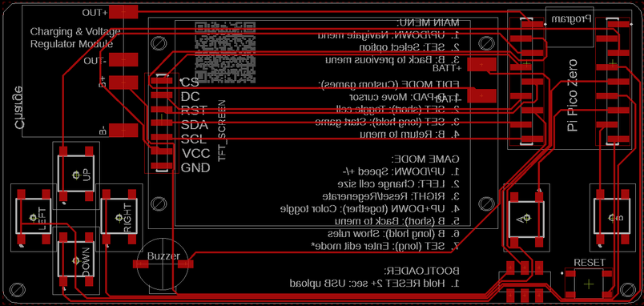
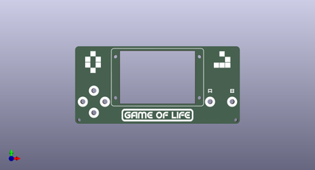
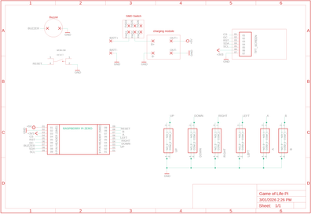
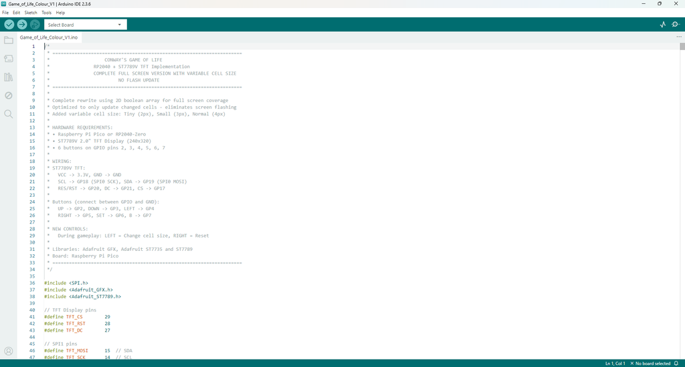

# Conway's Game of Life - Handheld COLOURED Version

Source: https://www.instructables.com/Conways-Game-of-Life-Handheld-COLOURED-Version/

---

## Introduction

I'm back again with a new and improved version of my Conway's Game of Life - Handheld Version This version has a number of improvements including, coloured screen, more games, different cell sizes and a lot cheaper to make! See below for the full game overview

Instead of using a Adafruit Trinket M0 (which are quite expensive), I've used a Raspberry Pi Pico Zero (which are cheap as chips!). I've also used a coloured TFT screen which are also inexpensive and gives the held held game a heap more options to play around with.

For those wondering what the hell is Conway's Game of Life - here's a description I used in my last build

The Game of Life is a cellular automation created by mathematician John Conway. It's what is known as a zero player game, meaning that its evolution and game play is determined by its initial state and requires no further input. You interact with the Game of Life by creating an initial configuration and observing how it evolves.

The game itself is based on a few, simple, mathematical rules consisting of a grid of cells that can either live, die or multiply. When the game is run, the cells can give the illusion that they are alive which is what makes this game so interesting.

There are actually many types of cellular automation and I have included some in this build.

Here is what you get in this updated hand held, coloured version. see the last step for a more detailed runthrough:

Main Menu Navigation

- UP/DOWN: Navigate menu options
- A: Select menu item
- B: Go back to previous menu
Color Modes

- All game modes support color! Press UP + DOWN together to toggle.
Game Rules

- Hold button B down for 2 seconds in any game to bring up the rules for that game
Cell Size

- There are 4 different cell sizes, from tiny to Large. Whist in a game, press left to change the size of the cell
Tools

Tools Menu Breakdown

- Sound: ON/OFF - Toggles all game sounds on or off
- Volume: Low/Medium/High
- World: Toroid/Open - Controls what happens at the edges of the game board
- Toroid = Wraparound edges (cells on the left edge are neighbors with cells on right edge, top wraps to bottom)
- Open = Hard edges (cells at the edge have fewer neighbors, no wraparound)
- Applies to ALL game modes (Conway's Life, Brian's Brain, Day & Night, Seeds, Cyclic CA)
- Default: Toroid (wraparound)
- Grid: ON/OFF - Shows/hides grid lines between cells
- Only visible when cell size is 3px or larger (not on Tiny 2px cells)
- Population: ON/OFF - Shows/hides the population counter overlay during gameplay
- Gen: Current generation number
- Pop: Current number of living cells
- Trail Mode: ON/OFF - Shows fading trails behind cells as they die
- In Mono mode = Gray fading trail (white → light gray → dark gray → black over 12 frames)
- In Color mode = Colored fading trail using age-based colors
Game of Life Games

PRESET - Classic Patterns

- Coe Ship - Spaceship that travels across the board
- Gosper Glider Gun - Continuously spawns gliders
- Diamond - 4-8-12 diamond pattern that evolves
- Pulsar - Achim's p144 oscillator (period-144 pattern)
- Glider - 56P6H1V0 spaceship pattern
RANDOM - Chaotic Evolution

SYMMETRIC - Creates symmetric initial patterns with different sizes

CUSTOM - Draw Your Own games

ALT GAMES - Alternative Cellular Automata

BRIAN'S BRAIN

DAY & NIGHT - Complementary rule set where birth/survival rules mirror each other.

SEEDS - "Exploding" automaton where cells live for exactly 1 generation.

CYCLIC CA - Multi-state cellular automaton where cells cycle through 6 states.

RULE EXPLORER - Create Custom Rules

Choose from 9 famous rule variations:

- Conway (B3/S23) - Classic Game of Life
- HighLife (B36/S23) - Like Conway, with replicators
- Maze (B3/S12345) - Creates maze-like patterns
- Coral (B3/S45678) - Grows coral-like structures
- Seeds (B2/S) - Exploding patterns (same as Seeds mode)
- Replicator (B1357/S1357) - Self-replicating patterns
- 2x2 (B36/S125) - Stable 2x2 blocks common
- NoDeath (B3/S012345678) - Cells never die once born
- Diamoeba (B35678/S5678) - Diamond-shaped amoebas
Custom Rules - Create your own rules:

- Navigation:
- UP/DOWN: Switch between Birth and Survival rows
- LEFT/RIGHT: Move cursor (0-8 neighbors)
- A (short): Toggle number on/off
- B (2 seconds): Start game with custom rules
- B: Back to preset menu

## Supplies

I have included a PDF of the parts list with links for all of the parts which you can find on this step in case you want to print it out etc. The PCB and front panel information can be found on the next step

PARTS:

Raspberry Pi Pico Zero X 1 - Ali Express

Charging & voltage step-up module X 1 - Ali Express

TFT Display 2.0 inch OLED LCD Drive IC ST7789V 240 X 320 X 1 - Ali Express

Battery -

Tactile Switch - Ali Express

On/Off Switch - Ali Express

Buzzer - Ali Express

Micro Momentary Switch - Ali Express

SMD Male Pin Headers - Ali Express

M2 Screws - Ali Express

M2 Spacers - Ali Express

Ribbon Wire - Ali Express

## Step 1: Getting the PCB & Front Panel Printed

We all have different levels of knowledge, so when it comes to a build like this I want to make sure that I'm providing enough information so anyone with basic soldering skills can make it. That includes ensuring there are instructions on how to get your own PCB's printed (which is super easy!).

So with that said, the first thing you will need to do is to get the front panel and PCB printed. I use JLCPCB (not affiliated) to get this done. The front panel is actually just a PCB without any components included! The front design is done in a program called Inkscape (available free) and the panel including the drilled holes is done in Fusion 360 (also free!)

The files that you need to build your own Game of Life can be found in my GitHub page. This includes the parts list, Gerber files for the PCB & front panel, schematic, Arduino script etc. Download the files to your computer

STEPS:

- Send the Gerber files to a PCB manufacturer like JLCPCB who will print the PCB and front panel for you. Download all of the files from my GitHub page to your computer and send the zipped Gerber files off to the PCB manufacturer of choice.
- If you have no idea what any of the above means , then check out the Instructable I made on how to get your broads printed which can be found here.
- NOTE: The manufacture will include an order number on both the PCB and front panel. It doesn't really matter where it is on the PCB but you don't want it on the front on the front panel!
- Over at JLCPCB you can 'specify a location' once the Gerber files have been loaded so click this for the front panel and specify in the comment section that you want the order number on the back of the panel. The manufacturer will add it to the back where indicated.

## Step 2: Adding the Momentary Switches

The momentary switches used are SMD ones. Actually, I've ensured that all of the components on the PCB are not through hole ones. This keeps the back of the hand held game clean, stops you from getting pricked by sharp pins etc, and stops any potential grounding of pins that shouldn't be grounded. Plus it just looks a whole lot better!

STEPS:

- You need to make sure that you add the ‘up’ and ‘down’ switches first. It just makes it easy if you do it in this order.
- Add a little solder to one of the solder pads for the ‘up’ switch.
- Place the switch on top of the pads and then heat up the solder to secure it into place. If it looks good, you can then secure the other 3 feet on the switch
- Now do the same for the down switch
- You can now add the left and right switches into place along with the A and B switches
- There is one more momentary switch to add. This is a mirco momentary switch which is to be a rest for the raspberry Pi. I added this so you could easily reset the Pi and put it in Boot mode for when you want to update the sketch

## Step 3: Adding the Charging/boost Module

The charging and voltage booster module is a great little board. It allows you to add say a 3.6V battery like a mobile one, and you can increase the output voltage via a small potentiometer located on the board.

STEPS:

- First, lets set the output voltage to 5V from the Charging & voltage booster module. Connect the module up to a power source (this could be mobile phone battery, variable power source or whatever you have around, as long as it is lower than 5V’s)
- Now with a multimeter, check the voltage output. You need to try and get as close as possible to 5V’s so turn the potentiometer until you reach 5Vs.
- Now you can add the module to the PCB. I added a little superglue to the bottom of the board to ensure it was secured into place
- Add some solder to each of the solder points on the module and then add some wire from a resistor leg to each solder point.
- Bend the wire down so it is touching the solder pad on the PCB and trim.
- Add solder to the solder pad on the PCB and connect the wire to each. This will give you a good strong connection.

## Step 4: Adding the Raspberry Pi Zero

The raspberry Pi Zero is another great little board. It has less GP pins then a normal Raspberry Pi Pico but the same amount of Ram. Plus, as I mentioned earlier, they are pretty cheap at about $4 each.

STEPS:

- As everything is surface mount on the PCB, you need to first solder into place some SMD header pins. Add these to both sections on the PCB
- Now, you can solder the Raspberry Pi Pico Zero into place on the header pins. Make sure that the USB connector is facing up.
- If you wanted to, you could add small, male header pins to the Raspberry Pi so it is removeable

## Step 5: Adding the Rest of the Components to the PCB

Now you can go ahead and add the rest of the components to the PCB

STEPS:

- Solder the toggle switch into place. You will note that this has 6 solder points. You can trim off the 3 solder points next to the actual switch if you want to and just solder this into place via the 3 at the back.
- Next, lest solder the SMD male header pins for the screen. Now, you need to make sure that you solder these on straight or they won't line up with the female header pins on the screen.
- Solder the buzzer into place.
- To add the battery, first add some solder to the positive and negative solder points on the battery. Make sure your soldering iron is hot when doing this
- Now add a resistor leg to each solder point and bend so they are lying flat with the battery.
- Add a little superglue to the battery and glue into place.
- Trim the wire if necessary and then solder onto the solder points on the PCB

## Step 6: Adding the Screen to the Front Panel

The screenis not directly connected to the PCB! It is first connected to the front panel using the M2 screws and spacers and then ribbon wire connects the screen to the PCB. Initially I wanted to have the screen connected via header pins but I couldn't get this to work due to the header pins being SMD and the sizing of the ones I had were wrong. I think I'll re-visit this part sometime and look at including ribbon cable connectors to both the PCB and bottom side of the front panel.

STEPS:

- The TFT screen that I purchased had the header pins already soldered into place. You will need to remove these if yours is the same. Just heat up the solder on the pin and use a pair of pliers to pull out each of the pins. Make sure you remove as much solder from the top of the holes as well.
- Place the screen against the front panel and secure it into place using some M2 X 8mm screws and nuts.
- Now add a M2 X 6mm spacer onto each of the screws.
- Add an M2 X 4mm screw to the holes in each corner of the front panel in each bottom corner. Don’t add nuts to these, just add a M2 X 8mm spacer to each one.
- Now, to test fitment, place the PCB into place and push the screws through the holes in the PCB.
- If the buttons fit ok, then you can now move onto attacheding the screen to the PCB.
- I used computer ribbon wire to make the connections between the TFT screen and PCB. Trim the wire and tin the ends.
- Now make small cuts between each wire - about 8 mm should be fine.
- spread the wires out so they align with the solder points on the TFT screen.
- Add some solder to the solderpoints on thescreen and then solder each wire to the solder points.
- Now you can do the same thing for the solder points onthe PCB. To work out how long you need the wire, place the screen next to the PCB and then cut the wire where it meets up with the solder points on the PCB.
- Now test fit the front panel and PCB again. You might need to squeeze the wire and bend it so it lays flat and doesn't add to much pressure to the inside components.
Now you are ready for testing so lets go and load up the Game of Life code to the Raspberry Pi

## Step 7: How to Upload to Raspberry Pi Zero

In you haven't installed Arduino on your computer, then this is the first thing you should do. Just follow the below instructions which are straight forward and you wont have any issues with loading the code to the Raspberry Pi Zero.

STEPS:

- Install Arduino IDE. Download from https://www.arduino.cc/en/software
- Install version 2.0 or newer (recommended)
- Install RP2040 Board Support
- Open Arduino IDE
- Go to File → Preferences
- In "Additional Board Manager URLs", add:
https://github.com/earlephilhower/arduino-pico/releases/download/global/package_rp2040_index.json

- Click OK
- Go to Tools → Board → Boards Manager
- Search for "pico"
- Install "Raspberry Pi Pico/RP2040" by Earle F. Philhower
- Install Required Libraries
- Go to Sketch → Include Library → Manage Libraries and install:
- Adafruit GFX Library
- Adafruit ST7735 and ST7789 Library
- Time to upload the code
- Select the Board
- Go to Tools → Board → Raspberry Pi RP2040 Boards
- Select "Waveshare RP2040-Zero" (or "Raspberry Pi Pico" if Zero isn't listed)
- Configure Settings. These need to be set under tools befoe youupload the sketch
- Tools → CPU Speed: 133 MHz (default)
- Tools → Optimize: Small (-Os) (default)
- Tools → USB Stack: "Pico SDK"
- Connect Your Board to the computer
- Plug USB cable into RP2040-Zero
- Board should appear as a COM/serial port
- Select Port
- Go to Tools → Port
- Select the port that appears (usually shows as "RP2040" or similar)
- Click the Upload button (right arrow icon)
- Wait for "Done uploading" message

## Step 8: Attaching the PCB & Front Panel Together

Once the code is loaded, it’s then time to connect the front panel and PCB. Don't worry, once the front panel is connected into place, you can still access the Raspberry Pi

STEPS:

- Make sure that the front panel and PCB are correctly pushed together with everything lining-up right.
- Now you can add a 4mm M2 screw to each of the holes in the PCB and screw them into the M2 spacers.
- That’s it – you have now completed your very own Game of Life – Handheld game console

## Step 9: How to Use the Handheld Game of Life Coloured Version

Conway's Game of Life - Complete User Guide

Main Menu Navigation

- UP/DOWN: Navigate menu options
- A: Select menu item
- B: Go back to previous menu
During Gameplay

- UP: Increase speed (faster generations)
- DOWN: Decrease speed (slower generations)
- LEFT: Change cell size (Tiny → Small → Normal → Large)
- RIGHT: ReB/Regenerate current pattern
- UP + DOWN (together): Toggle COLOR/MONO mode
- B (short press): Return to menu
- B (2 second press): Show/hide game rules overlay
RESET Button (hold 2 seconds): Enter bootloader mode for updates

Edit Mode (Custom games)

- D-Pad: Move cursor
- A (short press): Toggle cell on/off
- B (2 second press): Start game
- B: Return to menu
Tools

Tools Menu Breakdown

- Sound: ON/OFF - Toggles all game sounds on or off
- Volume: Low/Medium/High
- World: Toroid/Open - Controls what happens at the edges of the game board
- Toroid = Wraparound edges (cells on the left edge are neighbors with cells on right edge, top wraps to bottom)
- Open = Hard edges (cells at the edge have fewer neighbors, no wraparound)
- Applies to ALL game modes (Conway's Life, Brian's Brain, Day & Night, Seeds, Cyclic CA)
- Default: Toroid (wraparound)
- Grid: ON/OFF - Shows/hides grid lines between cells
- Only visible when cell size is 3px or larger (not on Tiny 2px cells)
- Population: ON/OFF - Shows/hides the population counter overlay during gameplay
- Gen: Current generation number
- Pop: Current number of living cells
- Trail Mode: ON/OFF - Shows fading trails behind cells as they die
- In Mono mode = Gray fading trail (white → light gray → dark gray → black over 12 frames)
- In Color mode = Colored fading trail using age-based colors
Main Menu Options

PRESET - Classic Patterns

- Coe Ship - Spaceship that travels across the board
- Gosper Glider Gun - Continuously spawns gliders
- Diamond - 4-8-12 diamond pattern that evolves
- Pulsar - Achim's p144 oscillator (period-144 pattern)
- Glider - 56P6H1V0 spaceship pattern
RANDOM - Chaotic Evolution

- Unpredictable patterns emerge
- May stabilize into oscillators
- May die out completely
- Game shows statistics when it stabilizes or dies
SYMMETRIC - Creates symmetric initial patterns with different sizes

CUSTOM - Draw Your Own

- Step 1: Choose Cell Size
- Tiny (2px cells): 160x120 grid
- Small (3px cells): 106x80 grid
- Normal (4px cells): 80x60 grid
- Large (8px cells): 40x30 grid
- Step 2: Edit Mode
- Red crosshair shows cursor position
- Cursor blinks at 4Hz for visibility
- White cells = alive, Black = dead
- Move with D-pad, toggle cells with B
- Step 3: Run
- Hold B for 2 seconds to start
- While running, hold B for 800ms to return to edit mode
- Press B to return to menu
ALT GAMES - Alternative Cellular Automata

- BRIAN'S BRAIN
- Small: Compact symmetric cluster
- Medium: Larger symmetric pattern (35% density)
- Large: Very large sparse pattern (18% density)
- Random: Scattered center-weighted distribution
- Custom: Draw your own pattern
- DAY & NIGHT - Complementary rule set where birth/survival rules mirror each other.
- Very stable, creates intricate patterns
- Day/Night metaphor in color mode
- Often runs indefinitely
- SEEDS - "Exploding" automaton where cells live for exactly 1 generation.
- Random: Auto-generated 4-way symmetric pattern
- Custom: Draw your own (choose cell size first)
- CYCLIC CA - Multi-state cellular automaton where cells cycle through 6 states.
- VrtclSym: Vertical mirror symmetry
- 4WayRot: 4-way rotational symmetry
- Random: Random pattern type and size
RULE EXPLORER - Create Custom Rules

- Choose from 9 famous rule variations:
- Conway (B3/S23) - Classic Game of Life
- HighLife (B36/S23) - Like Conway, with replicators
- Maze (B3/S12345) - Creates maze-like patterns
- Coral (B3/S45678) - Grows coral-like structures
- Seeds (B2/S) - Exploding patterns (same as Seeds mode)
- Replicator (B1357/S1357) - Self-replicating patterns
- 2x2 (B36/S125) - Stable 2x2 blocks common
- NoDeath (B3/S012345678) - Cells never die once born
- Diamoeba (B35678/S5678) - Diamond-shaped amoebas
- Custom Rules - Create your own rules:
- Navigation:
- UP/DOWN: Switch between Birth and Survival rows
- LEFT/RIGHT: Move cursor (0-8 neighbors)
- B (short): Toggle number on/off
- B (2 seconds): Start game with custom rules
- B: Back to preset menu
How It Works:

- Birth row: Select how many neighbors cause birth (0-8)
- Survival row: Select how many neighbors keep cell alive (0-8)
- Example: Conway's Life is B3 (birth on 3) / S23 (survive on 2 or 3)
Color Modes

- All game modes support color! Press UP + DOWN together to toggle.

---
*46 images archived*
