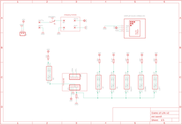
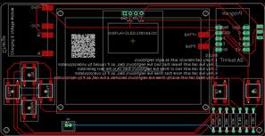
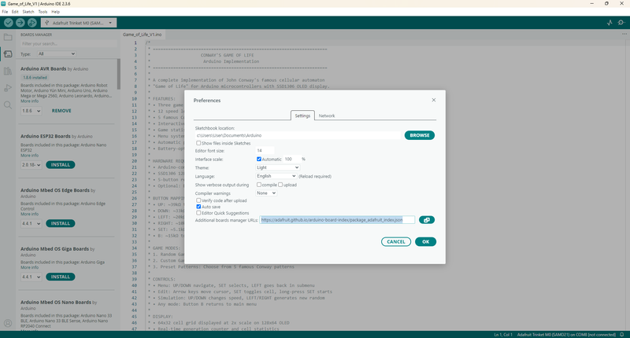
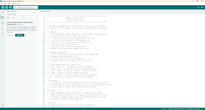
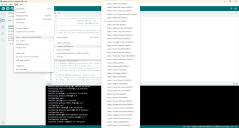
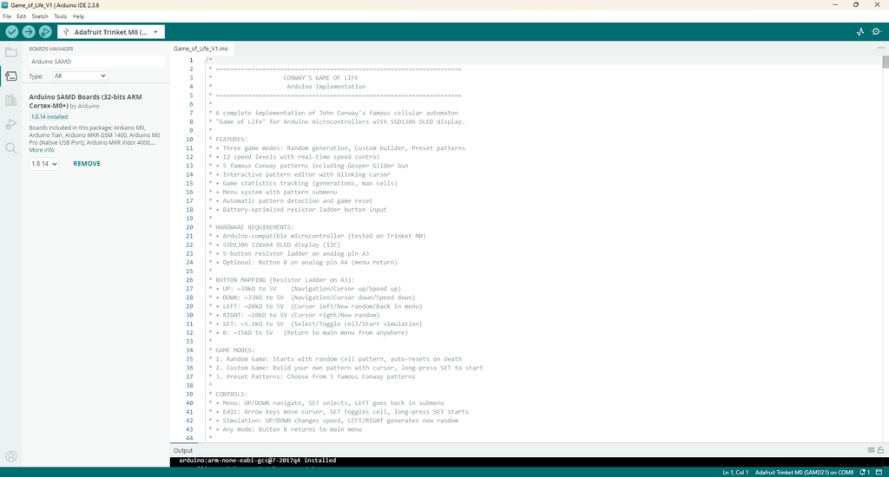

# Conway's Game of Life - Handheld Version, Powered by Adafruit Trinket M0

Source: https://www.instructables.com/Conways-Game-of-Life-Handheld-Version-Powered-by-A/

---

## Introduction

I’ve been fascinated with Conway’s Game of Life ever since I read ‘The Recursive Universe’ way back in 2012. Since then, I wanted a way that I could play the game just like you would play a Nintendo ‘Game & Watch’ – a pocket-sized version that I could whip out anytime and start to explore & build my own patterns.

Fast-forward to 2025 and that idea has become reality! Arduino AI Assistant has been a massive help in building the code and there is absolutely no way that I could of done it without AI’s assistance. If you haven’t used it before and don’t know much about coding, then I strongly recommend that you give it a try.

So, what is Conway’s Game of Life (or GOL for short!). I recently gave the below description in another GOL project which might help those that haven’t heard of it before:

The Game of Life is a cellular automation created by mathematician John Conway. It's what is known as a zero player game, meaning that its evolution and game play is determined by its initial state and requires no further input. You interact with the Game of Life by creating an initial configuration and observing how it evolves.

The game itself is based on a few, simple, mathematical rules consisting of a grid of cells that can either live, die or multiply. When the game is run, the cells can give the illusion that they are alive which is what makes this game so interesting.

Now you know what it is – what does my hand held game version do?

Core Game

Conways 'Game of Life' based on toroidal world: Edges wrap around (top connects to bottom, left to right).

Game includes the following menus:

- Preset patterns - 5 famous Conway patterns including Coe Ship, Gosper Glider Gun, 4-8-12 Diamond, Achim's p144, 56P6H1V0
- Random generation - Starts with random cell pattern, auto-resets when pattern dies/repeats
- Symmetric pattern generator - Generate symmetric patterns with 3 sizes Small, Medium, Large & Random. Symmetry type: Vertical, Horizontal, or 4-way Rotational
- Custom builder - Interactive editor to design your own starting patterns
Alternative Games

Four Alternative cellular automata available to play in the Alt Menu. These include:

- Brian's Brain - 3-state automaton (alive/dying/dead) 5 modes: Small/Medium/Large/Random/Custom Visual: solid pixels (alive), blinking pixels (dying)
- Day & Night - Inverse Conway rules creating dense patterns 2 density options: Medium Start (~35%), Dense Start (~50%) Birth: 3,6,7,8 neighbors | Survival: 3,4,6,7,8 neighbors
- Seeds - Birth-only automaton creating explosive patterns 2 modes: Random (symmetric center pattern) and Custom. Birth with exactly 2 neighbors, all cells die each generation
- Cyclic CA - Multi-state cycling automaton 3 pattern types: Vertical Symmetry, 4-Way Rotational, Random 6 visual states with different blink/display patterns
- Alt Games - See below
Features

- Interactive pattern editor with blinking cursor
- Real-time generation counter and cell statistics (some modes)
- Comprehensive menu system with multiple submenus
- Smart Detection: Automatically detects when patterns die out or start repeating
- Automatic pattern detection and game reset (some modes)
- Menu System: interface with pattern submenu

## Supplies

I have included a PDF of the parts list with links for all of the parts which you can find on this step in case you want to print it out etc. The PCB and front panel information can be found on the next step

PARTS:

Adafruit Trinket M0 X 1 - Ali Express

Charging & voltage step-up module X 1 - Ali Express

OLED Screen - 2.42 inch X 1 - Ali Express

Resistors - Ali Express

1K X 1

5.1K X 1

10K X 1

15K X 1

20K X 1

33K X 1

39K X 1

Battery - Ali Express

Tactile Switch - Ali Express

On/Off Switch - Ali Express

M2 Screws - Ali Express

M2 Spacers - Ali Express

## Step 1: PCB & Front Panel

We all have different levels of knowledge, so when it comes to a build like this I want to make sure that I'm providing enough information so anyone with some basic soldering skills can make it. That includes ensuring there are instructions on how to get your own PCB's printed (which is super easy!)

So with that said, the first thing you will need to do is to get the front panel and PCB printed. I use JLCPCB (not affiliated) to get this done. The front panel is actually just a PCB without any components included! The front design is done in a program called Inkscape (available free) and the panel including the drilled holes is done in Fusion 360 (also free!)

The files that you need to build your own Bleep Drum Synth can be found in my GitHub page. This includes the parts list, Gerber files for the PCB & front panel, schematic, Arduino script etc. Download the files to your computer

STEPS:

- Send the Gerber files to a PCB manufacturer like JLCPCB who will print the PCB and front panel for you. Download all of the files from my GitHub page to your computer and send the zipped Gerber files off to the PCB manufacturer of choice.
- If you have no idea what any of the above means , then check out the Instructable I made on how to get your broads printed which can be found here.
- NOTE: The manufacture will include an order number on both the PCB and front panel. It doesn't really matter where it is on the PCB but you don't want it on the front on the front panel!
- Over at JLCPCB you can 'specify a location' once the Gerber files have been loaded so click this for the front panel and specify in the comment section that you want the order number on the back of the panel. The manufacturer will add it to the back where indicated.

## Step 2: Adding the Screen to the Front Panel

I decided not to directly connect the screen to the PCB. Instead, I connected the screen to the front panel and added some male header pins to the screen which connect to the PCB via some female headers.

STEPS:

- The first thing to do is to add male header pins to the screen. When adding them, you need to make sure that the pins don't stick out the top as they will interfere with the front panel.
- Put the header pins in place and whist holding onto the plastic pin holder, place the pins onto a flat surface and push down so the pins become level with the top of the screen.
- Now add some solder to each to secure them into place.
- Place the screen against the front panel and secure it into place using some M2 X 14mm screws and nuts.
- Now add a M2 X 5mm spacer onto each of the screws.
- Add another 2 M2 screws to the holes in the front panel in each bottom corner. Don’t add nuts to these, just add a M2 X 7mm spacer to each one
- Now, to test fitment, place the PCB into place and push the screws through the holes in the PCB. You may need to grab a pair of plyers and manipulate the screws a little to ensure they go through the holes. Even though the holes in the front panel and PCB align perfectly, the screws sometimes need to be slightly bent to fit! No idea why this happens

## Step 3: Adding the Momentary Switches

The momentary switches used are SMD ones. In my first version of this PCB, I had through hole versions but found that there was too mush interference from my fingers touching the connectors when playing the game.

STEPS:

- You need to make sure that you add the ‘up’ and ‘down’ switches first. It just makes it easy if you do it in this order.
- Add a little solder to one of the solder pads for the ‘up’ switch.
- Place the switch on top of the pads and then heat up the solder to secure it into place. If it looks good, you can then secure the other 3 feet on the switch
- Now do the same for the down switch
- You can now add the left and right switches into place along with the A and B switches

## Step 4: Adding the Charging/boost Module & Trinket M0

The charging and voltage booster module is a great little board. It allows you to add say a 3.6V battery like a mobile one, and you can increase the output voltage via a small potentiometer located on the board.

STEPS:

- First, lets set the output voltage to 5V from the Charging & voltage booster module.Connect the module up to a power source (this could be mobile phone battery, variable power source or whatever you have around, as long as it is lower than 5V’s)
- Now with a multimeter, check the voltage output. You need to try and get as close as possible to 5V’s so turn the potentiometer until you reach 5Vs.
- Now you can add the module to the PCB. I added a little superglue to the bottom of the board to ensure it was secured into place
- Add some solder to each of the solder points on the module and then add some wire from a resistor leg to each solder point.
- Bend the wire down so it is touching the solder pad on the PCB and trim.
- Add solder to the solder pad on the PCB and connect the wire to each. This will give you a good strong connection.
- Lastly, add the Trinket M0 to the PCB, making sure that you have it orientated correctly ( Micro USB pointing outwards)

## Step 5: Adding the Rest of the Components

Now you can go ahead and add the rest of the components to the PCB

STEPS:

- Add all of the resistors, ensuring you check the values before soldering into place.
- Solder the toggle switch into place
- Before you solder the female header into place, do this first. Trim the legs on the pins in the screen. You only want to take off the same thickness as the plastic sheeve that the pins are in.
- Now place the female header onto the pins and put the front panel onto the PCB.
- If you have trimmed the legs correctly, you will see that the front panel is sitting straight with the PCB. Now solder the female headers into place and remove the front panel.
- To add the battery, first add some solder to the positive and negative solder points on the battery. Make sure your soldering iron is hot when doing this.
- Now add a resistor leg to each solder point and bend so they are lying flat with the battery.
- Add a little superglue to the battery and glue into place.
- Trim the wire if necessary and then solder onto the solder points on the PCB
Now you are ready for testing so lets go and load up the Game of Life code to the Trinket

## Step 6: Arduino IDE Set-up

I went with Adafruit's Trinket M0 as it has plenty of space and capacity to store the code and run the game. You wouldn’t be able to run this from an Arduino Nano for example. Plus, the Trinket is small which makes it great for a project like this.

The first thing you will need to do is to set up Arduino IDE to be able to load code to the Trinket M0. This is straight forward and I have provided a step-by-step guide below. You can also go to Adafruit’s IDE set-up page as well if you need more info – link can be found here

Install Board Support:

Open the Arduino IDE and go to File > Preferences

Add URLs:

Enter the following URL into the Arduino IDE's preferences to add Adafruit's board repositories and hit 'OK' https://adafruit.github.io/arduino-board-index/package_adafruit_index.json

Here's a short description of each of the Adafruit supplied packages that will be available in the Board Manager when you add the URL:

- Adafruit AVR Boards - Includes support for Flora, Gemma, Feather 32u4, ItsyBitsy 32u4, Trinket, & Trinket Pro.
- Adafruit SAMD Boards - Includes support for Feather M0 and M4, Metro M0 and M4, ItsyBitsy M0 and M4, Circuit Playground Express, Gemma M0 and Trinket M0
- Arduino Leonardo & Micro MIDI-USB - This adds MIDI over USB support for the Flora, Feather 32u4, Micro and Leonardo
Install SAMD Boards:

Next go to Tools > Board > Board Manager

In the boards manager, install the latest Arduino SAMD Boards (version 1.6.11 or later)

You can type Arduino SAMD in the top search bar, then when you see the entry, click Install

Restart IDE:

Close and restart the Arduino IDE for the new boards to appear in the Tools > Board menu.

Select Trinket M0 in IDE

Go to Tools > Board > Adafruit SAMD Board and select the Trinket M0 board

## Step 7: Adding the Sketch to the Trinket M0

Loading the code up is simple now that you have down the previous step of setting up the Trinket on IDE.

STEPS:

- I’m sure you would have done this already but if not, download the files from my GitHub page which includes the sketch.
- Open the sketch and ensure that your Trinket M0 is connected
- Find the Trinket M0 board on IDE (Tools > Board > Adafruit SAMD)
- Upload the sketch to your Trinket
- That’s it – it should load perfectly if you have everything set-up right.
- Now you can turn on your Game of Life and see if it works. If you do find that you can’t see anything on the screen, then try this. Turn on the game and load up the code again. You should now see the game appear on the screen. Un-plug the Trinket from the USB and start to explore

## Step 8: Attaching the PCB & Front Panel

If everything is working, then it’s time to connect the front panel and PCB

STEPS:

- Make sure that the front panel and PCB are correctly pushed together with everything lining-up right.
- Add a M2 nut to each of the screws to secure the PCB to the front panel
- You’ll probably find that the screws are too long, you can trim them with a pair of wire cutters or a Dremel. Make sure you file any sharp edges down on the screws
- That’s it – you have now completed your very own Game of Life – Handheld game console

## Step 9: What Next?

I’ve used about 13% of the space in the Trinket so there is plenty of room to add some more features to this game.

If you have never coded before (like me!) and would like to contribute to the code, then I would strongly recommend you check out Arduino AI and Claude. You can add all of the code that I have put together into it and request new features such as the ones below or your own and it’ll take you through how to add it!

It has been a bit of a learning curve, not with the language you need to use, but how and where to add the code suggested by AI. However, you can ask it to show you exactly and step by step where to add the code and it’ll hold your hand and show you exactly what to do!

Even when something goes wrong and the code doesn’t load, it will find solutions and show you exactly what needs to be updated or changed to get the code to load.

I’d love for this project to become a collaborative one where we could all share our updates and changes to the game and build on what I have started. If you would like to be a collaborator, then just hit me up with a DM on Instructables or GitHub and I’ll add you as a collaborator to my GitHub page.

Here's some more ideas to implement:

Pattern Management

• Pattern Save/Load: Store custom patterns in EEPROM with names

• Pattern Library: More famous patterns (pulsar, Penta decathlon, etc.) this is a good source for patterns

• Random Seeds: Different randomization algorithms (sparse, dense, clusters) (done)

• Symmetrical Patterns: Generate symmetric starting conditions (done)

Game Modes

• Survival Mode: Try to keep population above threshold for X generations

• Target Mode: Reach specific cell count goals

• Time Challenge: Fastest to stabilization

• Multi-Rule Mode: Different cellular automaton rules (B36/S23, etc.)

Advanced Controls

• Step Mode: Advance one generation at a time with button press

• Rewind: Store last N generations for backward stepping

• Pause/Resume: Freeze simulation mid-run

• Bookmark Positions: Mark interesting generations to return to

Statistics & Analysis

• Population Oscillation Detection: Identify period-N oscillators

• Stability Analysis: Time to stabilization metrics

• High Score System: Longest-lived patterns, highest populations

• Pattern Classification: Auto-detect gliders, oscillators, still lifes

Hardware Enhancements

• Sound Effects: Beeps for births/deaths, musical tones for populations

• Color Coding: Different colors for cell age or generation born

## Step 10: Bonus - Star Wars Game

Whilst putting this together, I started to code a Star Wars game that would also work on the handheld game console made in this Instructable.

It's a lot of fun and I was initially inspired from the original Star Wars Arcade game that came out in 1983.

You can find a link here to the GitHub page - just download the code and add it to the Trinket.

Here's a rundown of the game:

Star Wars: Trench Run - A Complete Arcade Experience for Arduino

Overview

Experience the iconic Battle of Yavin in this comprehensive Star Wars arcade game for Arduino! This game recreates the climactic Death Star assault from A New Hope, featuring multiple training sequences, intense space combat, and the legendary trench run finale.

Button Configuration

- SET (A Button): Fire/Select
- UP: Move crosshair/ship up
- DOWN: Move crosshair/ship down
- LEFT: Move crosshair/ship left
- RIGHT: Move crosshair/ship right
- B Button: Alternative action
Game Stages

1. Tatooine Sunset (Cinematic)

Watch the twin suns set over Luke's moisture farm in this atmospheric 8-second opening scene featuring desert landscapes and Luke's iconic dome home.

2. Womp Rat Training

Objective: Destroy womp rats in Beggar's Canyon using your T-16 Skyhopper

Goal: Score 200 points to complete training

3. Force Lesson

Brief story interlude where Obi-Wan teaches Luke about the Force before lightsaber training.

4. Blindfold Training (Jedi Training)

Objective: Use the Force to deflect training remote blasts

Goal: Score 200 points in this stage (relative scoring)

Reward: +20% health bonus upon completion

5. Space Battle

Objective: Destroy TIE Fighters approaching the Death Star

Enemy Types:

- TIE Fighters: Basic enemies with single-shot weapons
- TIE Interceptors: Fast, weaving movement with burst fire
- TIE Bombers: Slow but durable with spread-shot weapons
Goal: Score 500 points to proceed to Death Star approach

6. Death Star Approach (Cinematic)

Dramatic flyby as the Death Star grows larger on screen, showing its massive scale and the infamous trench.

7. Death Star Surface Run

Objective: Destroy surface towers and gun turrets

Goal: Score 500 points to reach trench entry

8. Trench Entry (Cinematic)

5-second dramatic sequence showing your X-wing diving into the Death Star trench with motion lines and speed effects.

9. Trench Run

Objective: Navigate the narrow trench while destroying turrets

Goal: Score 500 points to reach exhaust port

10. "Use the Force" (Cinematic)

7-second scene featuring detailed front-view X-wing approaching camera with "USE THE FORCE" message.

11. Exhaust Port Targeting

Objective: Fire proton torpedoes into the 2-meter exhaust port

Success: Triggers missile shaft sequence

13. Death Star Explosion

- Epic multi-phase explosion:
- Chaotic destruction effects
14. Victory!

Congratulations screen with final score.

Controls Tips

- Continuous Fire: Hold SET button for rapid fire in most combat stages
- Precision Targeting: Required for exhaust port - take your time!
- Evasive Maneuvers: Keep moving to avoid enemy fire
- Power-up Collection: Fly through power-ups to collect them

---
*59 images archived*
