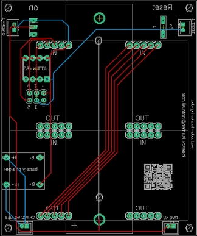

# Conways Game of Life - Running on an ATtiny13!

Source: https://www.instructables.com/Conways-Game-of-Life-Running-on-an-ATtiny13/

---

## Introduction

The Game of Life is a cellular automation created by mathematician John Conway. It's what is known as a zero player game, meaning that its evolution and game play is determined by its initial state and requires no further input. You interact with the Game of Life by creating an initial configuration and observing how it evolves.

The game itself is based on a few, simple, mathematical rules consisting of a grid of cells that can either live, die or multiply. When the game is run, the cells can give the illusion that they are alive which is what makes this game so interesting.

There's plenty of information on the Internet about the Game of Life. If you are interested in learning more then definitely check out the [Wikipedia page](https://en.wikipedia.org/wiki/Conway%27s_Game_of_Life) which has some great resources and info.

This build is based on another Instructable by [Sanuki Udon](https://www.instructables.com/Conways-Life-of-Life-of-1616-Cells-Made-With-ATtin/) who created the code and project.

My contribution is, I created a PCB and front panel for the project and have tweaked some of the parameters in the sketch to make the game run faster and longer.

## Supplies

I've created a parts list which can be found in my GitHub page and in the PDF file attached to this step. The PDF includes links and images of each of the parts which will make it easy to order the correct ones for this build.

The parts list attached doesn't included the PCB or front panel. You'll need to jump to the next step which goes through how to get yours printed.

PARTS:

- Charging Module X 1 - [Ali Express](https://vi.aliexpress.com/item/1005006274938832.html?pdp_ext_f=%7B%22sku_id%22%3A%2212000036569397251%22%7D&sourceType=1&spm=undefined.0.0&gatewayAdapt=glo2vnm)
- USB C connector X 1 - [Ali Express](https://vi.aliexpress.com/item/1005006485428578.html?spm=a2g0o.order_list.order_list_main.176.77ee1802ZMMnWT&gatewayAdapt=glo2vnm)
- 18560 Battery X 1 - [Ali Express](https://vi.aliexpress.com/w/wholesale-18650.html?spm=a2g0o.detail.search.0) (or you can scavenge them from [old computers](https://www.instructables.com/How-to-Get-Free-18650-Batteries/))
- 18650 battery holders X 1(PCB through hole) - [Ali Express](https://www.aliexpress.com/item/1005006949570816.html?spm=a2g0o.productlist.main.19.62ebfuv5fuv5pX&algo_pvid=778e89a6-5d8b-4664-b906-7eabf3ab9804&algo_exp_id=778e89a6-5d8b-4664-b906-7eabf3ab9804-18&pdp_ext_f=%7B%22order%22%3A%2230%22%2C%22eval%22%3A%221%22%7D&pdp_npi=6%40dis%21AUD%214.91%214.91%21%21%2122.32%2122.32%21%402103247917557555304737422ead8d%2112000038826800073%21sea%21AU%21135072183%21X%211%210%21n_tag%3A-29919%3Bd%3Abadc4977%3Bm03_new_user%3A-29895&curPageLogUid=NFbCAQQCouBf&utparam-url=scene%3Asearch%7Cquery_from%3A%7Cx_object_id%3A1005006949570816%7C_p_origin_prod%3A)
- JST 2.0 Micro connectors - [Ali Express](https://vi.aliexpress.com/item/32665588344.html?spm=a2g0o.productlist.main.5.460ea32c2xc6hZ&algo_pvid=9d118418-a9e2-4e46-a506-91f6127c4fe3&algo_exp_id=9d118418-a9e2-4e46-a506-91f6127c4fe3-4&pdp_ext_f=%7B%22order%22%3A%22942%22%2C%22eval%22%3A%221%22%7D&pdp_npi=4%40dis%21AUD%213.62%213.62%21%21%212.34%212.34%21%402101ec1f17510942000531090ed40e%2159941899462%21sea%21AU%21129764711%21X&curPageLogUid=5mWqd02Rx1hI&utparam-url=scene%3Asearch%7Cquery_from%3A) Qty will depend on whether you are planning to locate the switches on the case.
- On/off switch X 1 - [Ali Express](https://vi.aliexpress.com/w/wholesale-on%2525252doff-mini-1-Way-2-Band-Slide-Switch-PCB-Mount-.html?spm=a2g0o.detail.search.0)
- Momentary Switch X 1 - [Ali Express](https://www.aliexpress.com/w/wholesale-SKRCADD010.html?spm=a2g0o.productlist.search.0)
- 8 pin IC socket X 1 (for the ATiiny) - [Ali Express](https://vi.aliexpress.com/w/wholesale-8-pin-ic-socket.html?spm=a2g0o.productlist.search.0)
- ATtiny 13A X 1 - [Ali Express](https://vi.aliexpress.com/w/wholesale-attiny-13A.html?spm=a2g0o.productlist.search.0)
- 8 X * LED Matrix X 4 - [Ali Express](https://vi.aliexpress.com/item/1005006534411895.html?gatewayAdapt=glo2vnm). I went with red but you can also get them in green or blue.
- Male header pins (single row) - [Ali Express](https://vi.aliexpress.com/w/wholesale-male-header-pins.html?spm=a2g0o.detail.search.0)
Parts for the Case and Front Panel

- 2mm Opal acrylic (A4 size) - [eBay](https://www.ebay.com.au/itm/143888953637?_skw=acrylic+opal+2mm+A4&itmmeta=01JZ29BS0QTK51ZMG9SCYKMSEH&hash=item2180733125%3Ag%3AbkcAAOSwGD5knEQy&itmprp=enc%3AAQAKAAAA8FkggFvd1GGDu0w3yXCmi1dR150moow1fbDj0wlaXSB02RXMDHs6NDv7O4mTHNXnSDAAgQF%2FMgSGquv1HBWH1NUY8sw4YdfvSw4gECcMNlFdl6jUMb5vn7NRo%2FtMcQl5Uh9msjX3gzNAtQk20EjiC%2FtIG71ik2wV3X%2FOu6L9pJOcf%2F2h05nM04H1SDTV6UU3gvzBtYoHzmZ%2F1m9keXeMuHBGPvgTEWylnZvJHiVfJMaTiYu0tBK1MGHfxJAe3cn6f5Jq9kbln80MYKgBaFCdiiDn%2BafY8bln4Rq57TtjOzrCIDkd8NW6QBDllSVdKd%2F4sw%3D%3D%7Ctkp%3ABk9SR8yQr8n4ZQ&var=444813646124) or craft stores. This is used as a diffuser for the LED's. It isn't essential but I really like the effect it adds.
- Timber molding to make the case - I get mine from the local [hardware store](https://www.bunnings.com.au/30-x-8mm-1-2m-square-edged-board-tasmanian-oak_p0080189)
- M2 hex bolts and nuts. Buy an assorted pack - [Ali Express](https://vi.aliexpress.com/item/1005007274586605.html?spm=a2g0o.productlist.main.6.62caKgFXKgFXON&algo_pvid=cf894991-9641-44cf-88a3-39e54a2e027f&algo_exp_id=cf894991-9641-44cf-88a3-39e54a2e027f-5&pdp_ext_f=%7B%22order%22%3A%22904%22%2C%22eval%22%3A%221%22%7D&pdp_npi=4%40dis%21AUD%218.59%218.59%21%21%215.55%215.55%21%402103244b17513503915882027e0622%2112000040030168809%21sea%21AU%21135072183%21X&curPageLogUid=8h4svwhwcrnK&utparam-url=scene%3Asearch%7Cquery_from%3A)
- M2 Screws - [Ali Express](https://vi.aliexpress.com/item/1005006525663953.html?spm=a2g0o.detail.pcDetailBottomMoreOtherSeller.1.42baakGqakGqX5&gps-id=pcDetailBottomMoreOtherSeller&scm=1007.40050.354490.0&scm_id=1007.40050.354490.0&scm-url=1007.40050.354490.0&pvid=fe86e2ab-63bf-41e0-b870-bebde45cec34&_t=gps-id:pcDetailBottomMoreOtherSeller,scm-url:1007.40050.354490.0,pvid:fe86e2ab-63bf-41e0-b870-bebde45cec34,tpp_buckets:668%232846%238114%231999&isseo=y&pdp_ext_f=%7B%22order%22%3A%2291%22%2C%22eval%22%3A%221%22%2C%22sceneId%22%3A%2230050%22%7D&pdp_npi=4%40dis%21AUD%212.04%212.04%21%21%211.32%211.32%21%402103245417513506294892232eaea7%2112000037530884675%21rec%21AU%21135072183%21XZ&utparam-url=scene%3ApcDetailBottomMoreOtherSeller%7Cquery_from%3A)
- M2 Spacers (assorted) - [Ali Express](https://vi.aliexpress.com/item/32862529967.html?spm=a2g0o.productlist.main.7.d83ckz6Ikz6Ibg&algo_pvid=c17838ad-a880-4995-9cfa-4638f553b327&algo_exp_id=c17838ad-a880-4995-9cfa-4638f553b327-6&pdp_ext_f=%7B%22order%22%3A%222924%22%2C%22eval%22%3A%221%22%7D&pdp_npi=4%40dis%21AUD%216.27%216.27%21%21%214.05%214.05%21%402101c5b217513501989981567eca4b%2110000000197494051%21sea%21AU%21135072183%21X&curPageLogUid=MHqM4fsjpVqz&utparam-url=scene%3Asearch%7Cquery_from%3A)

## Step 1: Getting the PCB & Front Panel Printed

We all have different levels of knowledge, so when it comes to a build like this I want to make sure that I'm providing enough information so anyone with some basic soldering skills can make it. That includes ensuring there are instructions on how to get your own PCB's printed (which is super easy!)

So with that said, the first thing you will need to do is to get the front panel and PCB printed. I use [JLCPCB](https://jlcpcb.com/?from=VGS&utm_source=google&utm_medium=cpc&utm_campaign=14177189905&gad_source=1&gbraid=0AAAAABS1QqkiD3-WAMC-R-0N6a2KKPawu&gclid=CjwKCAjwwe2_BhBEEiwAM1I7sfAjCecAjlW7BgEzggjBf0WNDCA4-ZMBy2IrNS7NcwcA4naAhj0_2xoCA-4QAvD_BwE) (not affiliated) to get this done. The front panel is actually just a PCB without any components included! The front design is done in a program called [Inkscape](https://inkscape.org/) (available free) and the panel including the drilled holes is done in [Fusion 360](https://www.autodesk.com/products/fusion-360/personal) (also free!)

The files that you need to build your own Bleep Drum Synth can be found in my [GitHub](https://github.com/lonesoulsurfer/Game_of_Life_Attiny13) page. This includes the parts list, Gerber files for the PCB & front panel, schematic, Arduino script etc. Download the files to your computer

STEPS:

- Send the Gerber files to a PCB manufacturer like [JLCPCB](https://jlcpcb.com/?from=VGBA&gad_source=1&gclid=CjwKCAiAjfyqBhAsEiwA-UdzJCxT2LUX1iS0CvS4HVuZlxetrU2JQNyu0nueQUivgEq7MzfoGlH54RoClQ8QAvD_BwE) who will print the PCB and front panel for you. Download all of the files from my [GitHub](https://github.com/lonesoulsurfer/Game_of_Life_Attiny13) page to your computer and send the zipped Gerber files off to the PCB manufacturer of choice.
- If you have no idea what any of the above means , then check out the Instructable I made on how to get your broads printed which can be found [here](https://www.instructables.com/How-to-Get-a-PCB-Printed-Using-Gerber-Files/).
- NOTE: The manufacture will include an order number on both the PCB and front panel. It doesn't really matter where it is on the PCB but you don't want it on the front on the front panel!
- Over at JLCPCB you can 'specify a location' once the Gerber files have been loaded so click this for the front panel and specify in the comment section that you want the order number on the back of the panel. The manufacturer will add it to the back where indicated.

## Step 2: Adding Components to the PCB Part 1

The PCB is double sided so it's important that you add the components in the right order or you might find that you can't add some components. In version 1 of this PCB I had it powered by a 9V battery that was directly soldered to the PCB. It was only when I started to add components that I realized there was no way to solder the battery holder into place and also solder the 8X8 LED matrix's as well! Lucky for you I fixed the issue! Now it run's off a 18650 li-lo battery and there is less components to solder!

STEPS:

- You need to start adding components to the reverse side of the PCB so let's start there. First, add a header pin to each of the holes in the PCB.  You could also just use resistor legs if you wanted to.  Now place the charging module into place (making sure that the micro USB is facing outwards, and solder into place
- Now solder the IC socket into place
- Next add the JST connectors. I've included extra connectors for the switches in case you want to mount them into the top of the case. If you are adding the switches to the PCB, then just connect a JST connector to power and the charging connector.
- Now you can add the switches.
- Lastly, solder the battery holders into place.

## Step 3: Adding Components to the PCB Part 2

Now you can flip the PCB over and add the 8X8 matrix's

STEPS

- You will need to add male header pins to each of the IN and OUT on the matrix. Remove the LED section from the board and trim the header so there is 5 pins.
- I find that the easiest way to ensure that the pins are straight in the PCB is to add a little solder to the soldering iron and dab it onto one of the pins. Check that the pins are sitting straight in the PCB and if so, solder the rest into place. Do this for all 4 matrix's.
- Place the first LED matrix into the top left section of the PCB. IMPORTANT! Make sure you align the 'IN' and 'OUT' pins on the matrix correctly to the PCB. The IN pins on the matrix need to go in the top section of the PCB.
- Solder the rest of the matrix's onto place.
- Now you can test the board by adding the battery and turning it on. If everything has been soldered right, a little glider will make it's way across the screen and then explode!
- If this doesn't happen, check all of the solder joints, especially on the matrix's it doesn't take much to connect a couple of the legs together which will cause you issues.

## Step 4: Adding the Front Panel

After much toing & throwing I decided to add an acrylic diffuser to the front of the LED Matrix's. The LED's are a little raw without the diffusion. However, the movement of the LED's with the diffusion enhances the illusion that they are alive, moving across the screen with purpose.

STEPS:

- Place the front panel on top of the acrylic.
- Mark out the area to cut and drill on the acrylic. I'm lucky enough to have a band saw which makes cutting the acrylic simple. If you don't have a band saw, the you could use a fine tooth say to cut through it.
- To secure the acrylic to the PCB, I used some M2 screws, nuts and spacers (see parts list)
- I can't recall the length of the screw I used to connect everything together. So, place one into the front panel, then into the acrylic and then the PCB.
- Place the acrylic against the front panel. Place a screw though the PCB and then the acrylic and add a nut. Do this each of the 4 holes. This will secure the acrylic to the front panel.

## Step 5: Make a Case

The case is made from pieces of wood trim that you can buy from any hardware store. The wood is 8mm wide by 30mm high. The PCB has been designed to the wood fits perfectly. You could also use a less width wood as well but no more than 8 mm wide.

STEPS:

- Measure and cut the wood for the sides, top and bottom.  I just used the front panel as a template to make my measurements.
- Use a nail gun to secure the wood together.  If you don't have one, you can always just glue them together
- Place the game of life into the wood frame and mark out where to drill the holes to secure the front panel
- Secure the front panel into place using M2 screws.  You can always use a sander to clean up the sides and edges if it isn't a perfect fit.
- Add some wax or stain or whatever you have to the wood to give it a nice finish

## Step 6: Adding the USB C Charger Port

You could always just charge the battery up with a 18560 battery charger if you wanted to. However, It's easy to add the little USC charging port and connect that up to the charging module via a JST connector.

STEPS:

- Mark out where you want to add the USB C port.
- Drill a few holes and then use a file to clean up the edges etc.
- Connect a JST wire connector to the JST connector and push the wires out through the slot you made for the USC C port.
- Trim the wires and solder them to the solder point on the port
- Add a couple of M2 screws to secure it into place.  Now you can charge the battery via the port!

---
*48 images archived*
