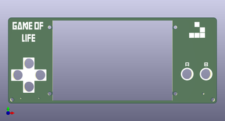
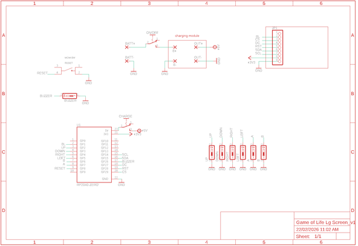
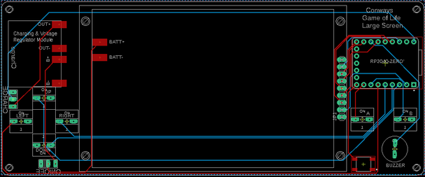
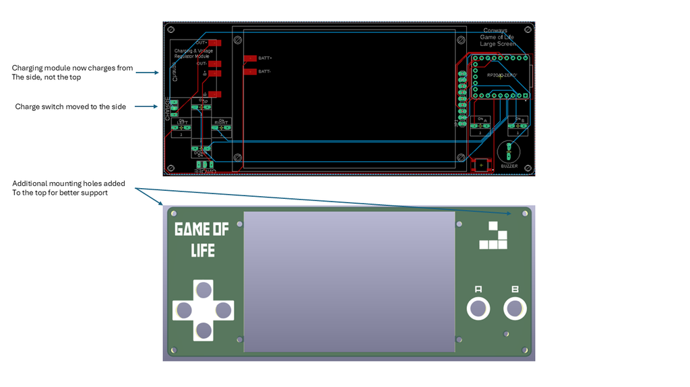
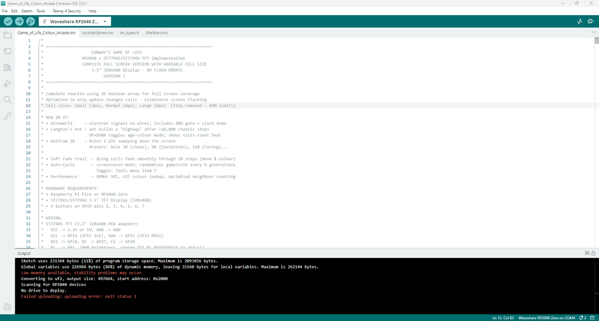

# Conway's Game of Life XL Screen - Raspberry Pi Project

Source: https://www.instructables.com/Conways-Game-of-Life-XL-Screen-Raspberry-Pi-Projec/

---

## Introduction

## Supplies

I have included a PDF of the parts list with links for all of the parts which you can find on this step in case you want to print it out etc. Unlike the last build, I have used more through hole components. Firstly, to make it easier to build, and second, I have included a back to this now which covers the solder joints.The PCB and front panel information can be found on the next stepPARTS:Raspberry Pi Pico Zero X 1 - Ali ExpressCharging & voltage step-up module X 1 - Ali ExpressTFT Display 3.5inch ST7796S/ST7796U LCD Display 1 - Ali ExpressBattery - I like to recycle old mobile batteries on these builds. You can also buy them and this one would work fine - Ali ExpressMomentary switches X 6 - Ali ExpressOn/Off Switch X 2 - Ali ExpressBuzzer - Ali ExpressMicro Momentary Switch - Ali ExpressMale Pin Headers - Ali ExpressLow profile female pin headers - Ali ExpressM2 Screws - Ali ExpressM2 Spacers - Ali ExpressParts List.pdfDownload

## Step 1: Getting the PCB & Front + Back Panels Printed

We all have different levels of knowledge, so when it comes to a build like this I want to make sure that I'm providing enough information so anyone with basic soldering skills can make it. That includes ensuring there are instructions on how to get your own PCB's printed (which is super easy!).So with that said, the first thing you will need to do is to get the front panel and PCB printed. I use JLCPCB (not affiliated) to get this done. The front and back panel are actually just PCB's without any components included! The design on the panels is done in a program called Inkscape (available free) and the actual panel itself (the outline, drilled holes etc) is done in Fusion 360 (also free for now...)The files that you need to build your own Game of Life can be found in my GitHub page. This includes the parts list, Gerber files for the PCB & front panel, schematic, Code etc. Download all the files to your computerSTEPS:Download all of the files from my GitHub page to your computer and send the zipped Gerber files off to the PCB manufacturer of choice such as JLCPCB who will print the PCB and front panel for you.If you have no idea what any of the above means , then check out the Instructable I made on how to get your broads printed which can be found here.

## Step 2: A Note on Changes to Design

This build is the first iteration and I have made a number of improvements to the design which I have listed below.PCB and PanelsI have included 2 extra screw connections in both the top corners. This helps makes the build a lot secure and stronger.Moved components where possible, away from the edge of the PCB. I thought that this might help if someone wants to look at 3D print a case. Switches etc all remain easily accessableI changed the orientation of the charging moduleMoved the slide switch to isolate the charging module to the side of the panel

## Step 3: Adding the Screen to the Front Panel

The following step ensures that you can remove the front panel easily and without having to de-solder anything.  This is important, especially for maintenance, battery changes, troubleshooting etc.  You may notice that in the images,  the screws I used are quite long.  I changed these out to shorter ones that just managed to fit.  You can use long ones but you will need to trim them at some stage.STEPS:First, trim the tops of the header pins where they are soldered.  You just want to remove a small bit of the top of the header pin so they won’t interfere with the front panel.In the front panel, there are 4 holes where the TFT screen will be attached.  Add a 20mm M2 screw (I like to use hex socket head screws) to each and then add a M2 nut to secure the screws into placeNow, place the screen on top of the screws and align it to the front panel.  The screen should sit flat to the front panel as the nuts you added earlier act like spacers. Now - you need to add a small M2 spacer (5mm) to each of the screws. Use the smallest one in the assorted pack that I have recommended to get in the parts listRemove the plastic section off the male header pin.  This will ensure that they fir right in the female header pinYou can now add the low profile female header pins to the male ones on the TFT screen and do a test fit.  You will need to trim the male header pins a little in order for them to sit right in the female header.  What I usually do here is, lay a female header pins on top of the male ones and mark out how much to cut of the male header pins.  It probably about 3mm that you need to remove.Don’t solder the female header pins yet to the PCB, we’ll do that near the end

## Step 4: Adding the Raspberry Pi Zero

STEPS:This is straight forward.  Add male header pins to the Pi.  I like to solder 1 leg into place for each side before I commit to soldering the rest. You can then add it to the PCB and solder the rest of the pins to the Pi.  This will ensure all of the pins are straightNow you can solder the Pi to the PCB

## Step 5: Adding the Switches & Buzzer

STEPS:First, solder both the slide switches to the PCB. you might be wondering why I have added 2 slide switches? One is an on/off switch and isolates the battery. The other is used when charging and isolates the Raspberry Pi. If I just had the switch to the Raspberry Pi, then the voltage regulator used in this build would slowly drain the battery as it draws a very small amount of power in standby.Now you can add the momentary switches. I have changed these from being tactile to silent momentary buttons. Tactile ones can hurt your fingers are some time and the ones in this build are softer and I think gives the game a better finish.There is also a SMD momentary switch that is included to reset the Pi. you don't really have to include this if you don't want to - up to you.Place the buzzer into the holes in the PCB, making sure that it is orientated right ( there is a plus symbol on top of the buzzer which needs to be on the left when soldering it into place.Do a test fit here as well just to make sure everything is going right.

## Step 6: Adding the Charging/boost Module

The charging and voltage booster module is a great little board. It allows you to add say a 3.6V battery like a mobile one, and you can increase the output voltage via a small potentiometer located on the board.STEPS:First, lets set the output voltage to 5V from the Charging & voltage booster module. Connect the module up to a power source (this could be mobile phone battery, variable power source or whatever you have around, as long as it is lower than 5V’s)Now with a multimeter, check the voltage output. You need to try and get as close as possible to 5V’s so turn the potentiometer until you reach 5Vs.Now you can add the module to the PCB. I added a little superglue to the bottom of the board to ensure it was secured into placeAdd some solder to each of the solder points on the module and then add some wire from a resistor leg to each solder point.Bend the wire down so it is touching the solder pad on the PCB and trim.Add solder to the solder pad on the PCB and connect the wire to each. This will give you a good strong connection.

## Step 7: Adding the Battery

Now you can go ahead and add the rest of the components to the PCBSTEPS:To add the battery, first add some solder to the positive and negative solder points on the battery. Make sure your soldering iron is hot when doing thisNow add a resistor leg to each solder point and bend so they are lying flat with the battery.Add a little superglue to the battery and glue into place.Trim the wire if necessary and then solder onto the solder points on the PCB

## Step 8: Soldering the Female Header for the Screen to the PCB

Ok - nearing the end now of the build. The last thing to do is to solder the female pins for the screen to the PCB.STEPS:Carefully place the front panel into place. Make sure that the screws align to the holes in the PCB and once pushed into place, ensure the pins on the female header pins (which should be on the male header pins connected to the TFT screen) align to the holes into the PCB. You might need to push them slightly with a small screwdriver to align them.add 6 X nuts to each of the screws to secure the front panel to the PCB.  You will be adding the back panel in the next stepOnce the screen is in place, do a final check of everything before soldering the female header to the PCB.Now you can solder the legs into place.Before you start to think about adding the bottom panel and adding nuts to the screws, lets go and add the code to the Pi

## Step 9: Adding the Back Panel

In this build, I added a back panel.  So in total there is a front panel, PCB and back panel.  I did this for a couple reasons.  first, it ensures that non of the solder points are being touched with your fingers which can cause shorts, it is more comfortable to hold and I wanted to make this easier to build then the version beforehand which had a lot of SMD parts.  The only concern is the additional cost of getting the back panel printed.  However - I think it is worth it.STEPS:The screws used should just have enough thread left after you add the back panel to attached a nutCarefully screw a nut to each of the ends of the screws.  I found that 2 of the screws were just too short so I didn't bother adding a nut to these.  The back cover is securely on so it won't matter.The other option is to add longer screws and then cut them to size.

## Step 10: How to Upload to Raspberry Pi Zero

Download the GitHub Files.  If you haven't installed Arduino on your computer, then this is the first thing you should do. Just follow the below instructions which are straight forward and you wont have any issues with loading the code to the Raspberry Pi Zero. If you find that you are having issues, then ask Claude (AI) for help. This is what I do when I get stuck and it always manages to sort it out for me!STEPS:Install Arduino IDE. Download from https://www.arduino.cc/en/softwareInstall version 2.0 or newer (recommended)Install RP2040 Board SupportOpen Arduino IDEGo to File → PreferencesIn "Additional Board Manager URLs", add:https://github.com/earlephilhower/arduino-pico/releases/download/global/package_rp2040_index.jsonClick OKGo to Tools → Board → Boards ManagerSearch for "pico"Install "Raspberry Pi Pico/RP2040" by Earle F. PhilhowerInstall Required LibrariesGo to Sketch → Include Library → Manage Libraries and install:Adafruit GFX LibraryAdafruit ST7735 and ST7789 LibraryTime to upload the codeSelect the BoardGo to Tools → Board → Raspberry Pi RP2040 BoardsSelect "Waveshare RP2040-Zero"Configure Settings. These need to be set under tools before you upload the sketchTools → CPU Speed: 133 MHz (default)Tools → Optimize: Small (-Os) (default)Tools → USB Stack: "Pico SDK"Connect Your Board to the computerPlug USB cable into RP2040-ZeroBoard should appear as a COM/serial portSelect PortGo to Tools → PortSelect the port that appears (usually shows as "RP2040" or similar)Click the Upload button (right arrow icon)Wait for "Done uploading" message

## Step 11: In Depth Review of All the Game Functions

In-Game Controls (All Simulation Modes)Up - Increase simulation speedDown - Decrease simulation speedLeft - Cycle cell size (Small 3px → Normal 4px → Large 8px)Right - Reset / regenerate the current patternUp + Down -  colour modeSET (hold) - Start simulation from edit modeSET (hold, running) - Return to edit mode (Custom/Seeds/Brian's Brain only)B (short press) - Return to menuB (hold ~1 second) - Show/hide rules and information panelTools MenuGrid Lines — overlays a faint grid matching the current cell sizePopulation Counter — shows live cell count and generation number during simulationTrail Mode — dying cells leave a soft 20-step fade trail rather than disappearing instantlyColour Mode — age-based colouring (young cells are one colour, older cells shift through the spectrum)Toroidal World — when on, edges wrap around so the board is a torus; when off, edges are hard boundariesBrightness — four levels (25%, 50%, 75%, 100%)Auto-Cycle / Screensaver — automatically switches to a random game mode or Wolfram rule every 300 generations; useful as a display pieceSound settings (enabled/disabled, three volume levels) are also accessible here and saved to EEPROM.Hardware & SetupThe device runs on a Raspberry Pi Pico / RP2040 connected to a 3.5" ST7796S/ST7796U TFT display (480×320 pixels) via SPI. Six buttons handle all navigation and gameplay — Up, Down, Left, Right, SET (A), and B. A buzzer on GPIO 26 provides sound effects and music. Display brightness is PWM-controlled, and all settings (sound, volume, brightness) are saved to EEPROM so they persist between power cycles.Main MenuOn startup the device boots directly into the main scrolling menu with eight sections:Presets — hand-crafted Conway's Life patternsRandom — randomised Conway's LifeSymmetric — procedurally generated symmetric patternsCustom — draw your own patternRule Explorer — define custom birth/survival rulesAlt Games — alternative cellular automataTools — display and simulation settingsArcade — three built-in arcade gamesNavigate with Up/Down, select with SET, go back with B.Conway's Life ModesPresets (13 patterns)Each preset loads a famous Life pattern centred on screen. Press SET once to open it, then A to start the simulation. While paused you can press Left to change cell size (the pattern rescales and redraws) or Right to reset it back to its starting state.1 - Coe Ship.  Puffer-type spaceship that leaves debris trails2 - Gosper Gun.  The first glider gun ever discovered — period 303 - Diamond.  Symmetric expanding diamond pattern4 - Achim p144.  Rare period-144 oscillator5 - 56P6H1V0.  High-period spaceship6 - LWSS Convoy.  Three Lightweight Spaceships in formation7 - MWSS.  Middleweight Spaceship — 8 cells, speed c/28 - Pulsar.  Period-3 oscillator with 4-fold symmetry, 48 cells9 - Pentadecathlon.  15 oscillator made from a modified 10-cell row10 - R-Pentomino.  5-cell seed that runs for 1,103 generations11 - Acorn.  7-cell methuselah running 5,206 generations12 - Simkin Gun.  Smallest known glider gun — 36 cells, period 12013 - Queen Bee.  Period-30 oscillator, the first of its kind ever foundRandomFills the board with random live cells at approximately 30% density. Immediately starts running. Press Right to re-randomise.SymmetricGenerates a random pattern with one of three symmetry types — vertical, horizontal, or rotational — in small, medium, or large sizes. Good for producing interesting structured chaos.CustomPuts the board into edit mode with a blinking red crosshair cursor. Move the cursor with Up/Down/Left/Right. Press SET to toggle a cell on or off. When happy with your pattern, hold SET for about a second to start the simulation. Hold SET again to return to edit mode. Press B to go back to the menu.Rule ExplorerLets you define your own cellular automaton by setting custom Birth (B) and Survival (S) rules — the same notation used by Life (B3/S23). Choose from 12 built-in rule presets or enter your own bit-by-bit. The simulation runs with your rules applied to a random starting board.Included preset rules:High Life, 34 Life, Diamoeba, Replicator, Long Life, Maze, Coral, 2x2, Dry Life, Amoeba, Coagulate, GnarlAlternative Cellular Automata (Alt Games)Brian's BrainA three-state automaton (On, Dying, Off) producing a constantly moving stream of light-speed "signals." Choose from small, medium, large, or random seedings, or draw a custom starting pattern.Day & Night (B3678/S34678)A symmetric ruleset where dead and live regions are interchangeable. Dense regions survive and grow in a way that mirrors the original — creating organic, blob-like patterns.Seeds (B2/S)Every live cell dies every generation but any dead cell with exactly two live neighbours is born. Creates explosive, constantly moving patterns that never stabilise.Cyclic CAA multi-state automaton where cells cycle through states 0→1→2→…→N→0. Cells advance only when they have a neighbour in the next state. Produces stunning rotating spiral waves. Choose small, medium, or large seedings.WireworldA four-state automaton (Empty, Wire, Electron Head, Electron Tail) that models digital logic circuits. Electrons travel along wires, interact at junctions, and can form AND gates and clocks. The built-in demo includes a working circuit layout.Langton's AntA single ant on a grid follows two rules: turn right on a white cell (flip it black), turn left on a black cell (flip it white). After ~10,000 chaotic steps it spontaneously builds a repeating diagonal "highway." Toggle age-colour mode with Up+Down to see a heat map of how often each cell has been visited.Wolfram 1D AutomataOne-dimensional elementary cellular automata — a single row of cells evolves downward according to one of 255 possible rules. Each rule produces a unique pattern, from pure chaos (Rule 30) to the Sierpinski triangle (Rule 90) to a Turing-complete system (Rule 110). Seven named presets are provided or you can enter any rule number directArcade GamesAccessed from main menu item 8. Three games are available. In all three, press A + B together at any time to exit directly back to the main menu.Star Wars A first-person Star Wars game inspired by the 80's arcade game. Progress through multiple stages: Womp Rat Training, Space Battle, Death Star Approach, Surface Run, and the Exhaust Port shot. Features full Star Wars music (Main Theme, Binary Sunset, Imperial March, Victory Fanfare), sound effects, TIE fighters, laser cannons, proton torpedoes, and a dramatic finale sequence. Press B on the title screen to exit.Controls:Up/Down/Left/Right — move crosshair / pilot shipSET — fireA + B — exit to main menuUp + Down -  in start up screen will take you into a games menu where you can play any of the games or watch the cinematic shortsBreakout BeyondA feature-rich Breakout variant with a neon aesthetic. The paddle sits at the bottom, bricks at the top. Features include combo multipliers, spin physics, multiball, shield power-ups, bomb bricks, and hard bricks across 20 levels.Controls:Left/Right — move paddleB — speed boostSET — launch ball / pauseA + B (hold) — exit to main menuGyrussA circular shoot-em-up inspired by the 1983 Konami arcade classic. Your ship orbits around the edge of the screen shooting inward at waves of enemies that fly in formation patterns.Controls:Left/Right — rotate ship around the ringSET or B — fireUp (hold) — smart bombA + B (hold) — exit to main menu

---
*56 images archived*
