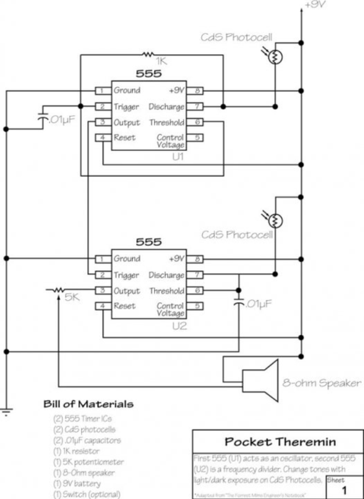

# Crystal Skull Light Theremin

Source: https://www.instructables.com/Crystal-Skull-Light-Theremin/

---

## Introduction

## Step 1: Parts and Tools

Parts:Circuit1.       2 X Photo Cells – eBay2.       1 X 5K Pot – eBay3.       2 X 555 Timers – eBay4.       .01 Capacitor has “104” on it – eBay5.       1k Resistor – eBay6.       8 Ohm Speaker – eBay7.       9v Battery Holder – eBay8.       9v battery 9.       Switch – eBay10.   Perf board – eBay11.   wire12.   Flickering LED – eBay (Optional.  I decided to add an LED so it could be used as a lamp as well)Resin Skull1.       Resin – eBay2.       Skull Mould – Etsy3.       Copper wire – eBay4.       Box for the skull to be mounted on and electronics to be stored in – up to you want you use.Tools1.       Mixing cups for the resin2.       Soldering iron and solder3.       Pliers4.       Wire cutters5.       Drill6.       Ply wood (used to hold the mould in place)7.       Jigsaw

## Step 2: Making the Circuit - Adding the 555 Timers

The first thing to do is to add the 555 timers to the perf boardSteps:1.        Place the timers into the perf board making sure that they are close together as shown below.  Also make sure that the little notch on the side is on the left hand side.  This will orientate the 555 time correctly.2.       Solder all of the legs to the perf board

## Step 3: Making the Circuit - Pins 1, 2 and 6 on the First 555 Timer

The little legs on the 555 timers I will be calling pins and I will start with the 555 timer furthest of the left of the perf board. The perf board that I used has a section for all of the negative and positive connections to be soldered to.  I find that this type of board is best to use in these projectsSteps:1.       Solder a wire to pin 1 and ground2.       Solder the 1k resistor to pins 2 and 73.       Solder the 0.1 capacitor to pin 2 and ground4.       Lastly, solder a wire from pin 2 to 6.  I usually do this underneath as shown in the below images with a leg from a resistor.

## Step 4: Making the Circuit - Pins 3 and 4 on the First 555 Timer

Steps:1.       Solder a wire to pin 3 on the first 555 timer to pin 2 on the 2nd 555 timer2.       Solder a wire from pin 4 to positive

## Step 5: Making the Circuit - Pins 6 and 8 on the First 555 Timer

To be able to connect the photo cells inside the resin skull, you will need to add 2 wires to the first 555 timer and 2 to the other one.  I will do this a bit laterSteps:1. Solder pin 8 to positive section on the circuit boardThat’s all of the wiring for the first 555 timer.  It’s now time to move onto the next one

## Step 6: Making the Circuit - Pins 1 and 3 on the Second 555 Timer

Steps:1.       Solder a wire to pin 1 and ground2.       Solder a long wire to pin 3.  This will be attached to the 5K potentiometer.  To connect a pot, you need to solder the end of the wire to the first 2 solder points on the pot.3.  We will solder the end of the wire from pin 3 to the potentiometer a little later on

## Step 7: Making the Circuit - Pins 4, 6 and 7 on the Second 555 Timer

Steps:1.       Solder a wire to pin 4 to positive2.       Solder the other 0.1 capacitor to pin 6 and ground.  You will have to add a wire in order for the legs of the capacitor to reach both points as shown below.3.       Turn the board over and add some solder to legs 6 and 7 so they connect4.       Add a long wire to pin 7 on BOTH the 555 timers.  these will connect to the Photo cells.  You will also need to add a couple of wires to the positive section which is in the next step

## Step 8: Making the Circuit - Pin 8, 6 and Speaker Connection Second 555 Timer and Testing

Steps:1.       Solder a wire to pin 8 to the positive section2.       Solder 3 long wires to the positive section.  2 will be used for the photo cells and the other to the positive end of the speaker.3.       Lastly solder 2 long wires to both the ground and positive sections on the perf board.  These will be used to power the circuit4.       That’s all of the wiring done.  Now it’s time to test.  Connect a 9v battery to the circuit via the wires added for power.5.       Next, either solder the photo cells to the ends of the wires or used a bread board to make the connections.  6.       Add power and test to make sure that when you cover either photo cell you get different tones from the circuit.  If one doesn’t do anything, check your connections and test again.

## Step 9: Resin Skull - Preparing the Mould

Steps:1.        On a piece of ply board, trace around the base of the mould2.       Next, make the trace outline you just did smaller by about 15mm.  This is so the mould will sit inside the ply wood3.       Drill a hole in the inside of the circle so you can use a jigsaw to cut out the section marked4.       Cut out the area and place the skull mould inside to make sure it fits correctly.5.       Lastly, secure the ply wood so it is raised and also even.

## Step 10: Resin Skull - Adding the Photo Cells

In order to be able to add the photo cells to the inside of the skull, you will need to first solder them to some copper wireSteps:1.       Cut 4 lengths of copper wire.  They will need to be about 150mm each in length2.       Slight bend the ends of each of the wire so when you attach the photo cells, they will face outwards inside the skull3.       Trim the legs on the photo cells and solder onto the ends of the copper wire.  Do this for both

## Step 11: Resin Skull - Adding the Photo Cells

Next thing to do is to work out a way to hold the photo cells into place whist the resin sets hard Steps:1.       Find a small piece of wood that is about 15mm wide and long enough to sit on top of the skull mould2.       Place one of the photo cells against the wood and tape into place3.       Go and check that the photo cell sits where you want it to in the skull and is not touching the sides of the mould.4.       Do the same for the other photo cell5.       Place onto the mould in  preparation for the resin to be poured

## Step 12: Mixing and Pouring the Resin

Your skull mould is ready to pour the resinSteps:1.       Carefully mix the resin as per the instructions.  Make sure you take your time when stirring so you don’t introduce any large bubbles.2.       Once thoroughly mixed, carefully pour the resin into the skull mould.3.       As resin does shrink once it is cured, it’s best to slightly overfill the mould4.       Leave to dry for 24 hours.  If you are like me you will be tempted to start poking around earlier but it really is best to let the resin totally cure before trying to remove it from the mould

## Step 13: Polishing the Skull

When you pull the skull out of the resin it will probablycome out dull looking.  Now it’s time to start polishing

## Step 14: Speaker, Switch and Volume Knob

You could make a box for the skull and electronics if you wanted to.  I went down the path of least resistance and used a wooden box I had lying around.Steps:1.       Decide where you want to add the speaker onto the box.  Mark and cut out the hole using a hole saw drill bit.2.       Next secure the speaker into the hole of the box with some screws3.       Drill a couple of small holes, one for the 5K pot and the other for the on/off switch.  Attach these parts to the box.

## Step 15: Add the Crystal Skull

You don’t actually secure the skull to the box in this part, you just make the holes in the box for the copper wires inside the skull to go through.Steps:1.       Mark on the box where you need to drill for the copper rod to go into.  You will need to drill 4 holes for each of the wires2.       Drill the holes and make sure that the copper rods in the skull fit into the holes correctly and that the skull sits nice and flat.

## Step 16: Wiring the Switch and Battery

The switch is a 3 way switch.  This means that whist in the middle everything is off.  If you move it up or down then you either turn on the Theremin or LED.  First I will wire-up the Circuit board for the Theremin.Steps:1.       Solder a positive wire from the circuit board to one of the solder points on the switch.  It would be on one of the ends2.       Next, solder the positive wire from the battery holder to the middle solder point on the switch.3.       Solder the negative wire from the battery to the negative section on the circuit board

## Step 17: Wiring the Photo Cells

Now it’s time to wire the photo cells to the circuit board.Steps:1.       Place the skull back onto the top of the case and push the copper wires through2.        Wire one of the positive wires from the circuit board to the first copper wire in the skull3.       Next, solder the wire from pin 7 on the first 555 timer to the other copper wire4.       Do the same thing for the other photo cell.5.       To keep the skull in place, bend the copper wires over as shown below.

## Step 18: Adding the Volume Knob and Speaker

Steps:1.       Solder the wire from pin 3 on the 2nd 555 timer to the potentiometer.  When you solder this wire, you need to solder it to the first 2 solder points on the pot.2.       Next, solder a wire from the last solder point on the pot to the negative solder point on the speaker3.       Lastly, solder one of the wires that you soldered to the positive section on the circuit board to the positive solder point on the speakerAt this stage you can test the Theremin and make sure that everything is working.  You should be able to change the pitch and tone of the 555 by waving your hands in front of the photo cells.  If nothing happens try turning the volume switch to full.  If nothing happens still, you may have to go over the circuit board to make sure you have wired everything up correctly.

## Step 19: Adding the LED

Nearly there!Steps:1.       Drill a small hole into the lid of the case under the skull.  Needs to be big enough to fit a 3mm LED2.       Solder a 40K resistor (or whatever you have that is close) to the negative leg of the LED. 3.       Solder a wire to the end of the resistor and to the positive leg on the LED.4.       Add some heat shrink to each of the legs.5.       Super glue into place6.       Attach the positive wire to the other solder point on the switch (the opposite to the one that the Theremin circuit is attached to)7.       Solder the negative wire to the negative solder point on the circuit board8.       Test to make sure the LED come onDONE!

## Step 20: Done

Now that you have finished, it’s time to play with your Theremin.   I find that it works best not in direct sunlight or really bright lights, this could be different however for your build.  Playing your light Theremin is pretty simple, you just wave your hands in front of the photo cells to change the pitch and tones. After a while you start to work out how to make different sound effects by moving your hands slightly to change pitch.  I have managed to get some interesting sounds out of the light Theremin but you definitely wouldn’t use it to entertain your friends unless you want to un-friend them!  Some of the tones generated are pretty harsh to anyone within earshot.

---
*71 images archived*
