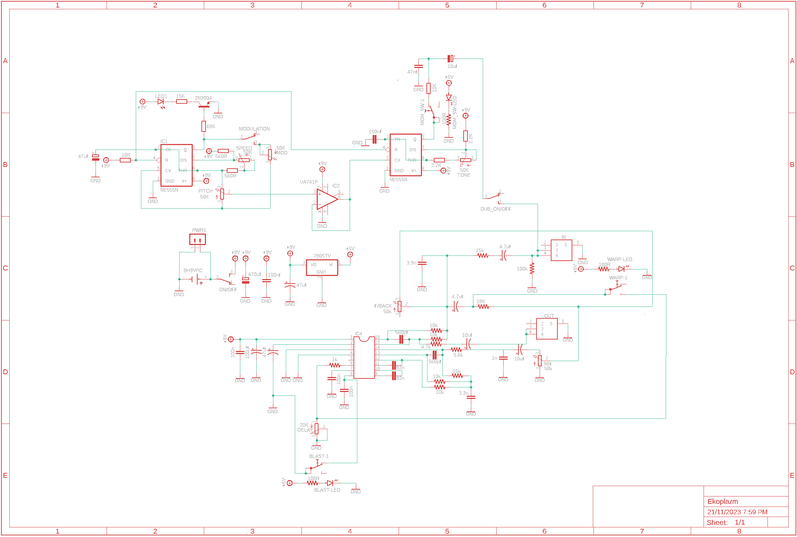
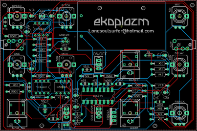
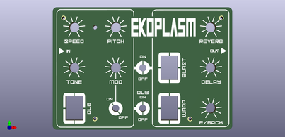
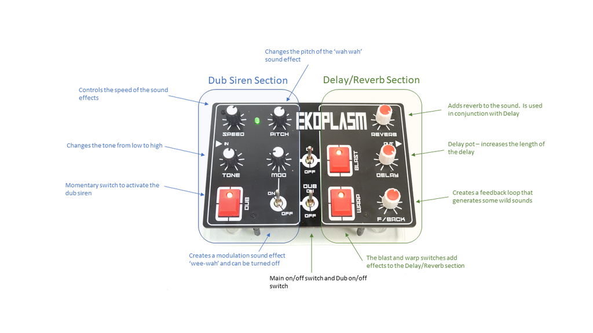

# Dub Siren & Delay/Reverb - 2 in 1 Synth - Little Synths With BIG Sounds #3

Source: https://www.instructables.com/Dub-Siren-DelayReverb-2-in-1-Synth-Little-Synths-W/

---

## Introduction

Welcome to the 3rd instalment to my ‘Little synths with BIG sound’ series. This time around I’ve designed a 2 in 1 synth which I am calling Ekoplazm! The first synth is a classic Dub Siren which I have paired up with a Delay and Reverb synth and includes feedback and a couple other tricks. You can play the Dub Siren through the Delay/Reverb section which gives it a rich and full sound or play other synths like my [Proton](https://www.instructables.com/Proton-Little-Synths-With-BIG-Sounds-2/) & [Elements](https://www.instructables.com/Elements-Little-Synths-With-Big-Sounds-1/) synths through the Delay/Reverb section to add some tasty soundscapes to these synths.

The Dub Siren isn’t a new circuit to me – I’ve actually done 3 iterations of this in the past! The initial build was the first time I designed a board in Eagle and it needed 3 X 9V batteries to run the beast! If you are interested in taking a look – then [check it out here](https://www.instructables.com/Dub-Siren-555-Timer/)

In previous builds I have included Delay/Reverb via a module which you had to modify and wire-up to the board. This time, the Echo/Reverb section is included on the PCB, making it a very straight forward and easy build. Like my other builds in the ‘Little synths with BIG sound’ series, I wanted this to be easy to build, great sounding, to be able to connect to other synths and fun to play.

I've provided all of the Gerber files, schematics etc for this build so all you need to do is to get them printed (I'll go through how to do this as well) and add the components.

So – without further ado, let’s put one together and make some noise :)

[Elements - Little Synths With BIG Sounds #1](https://www.instructables.com/Elements-Little-Synths-With-Big-Sounds-1/)

[Proton - Little Synths with BIG Sounds #](https://www.instructables.com/Elements-Little-Synths-With-Big-Sounds-1/)2

## Supplies

As with my previous 'Little Synths With BIG Sounds' 'Ibles, I have include the parts list as a PDF file which is attached below. The file includes all of the components and auxiliary parts that you will need to put the circuit board together. I have included links and images of each part so you can easily find/buy/identify them. I think it will be handy also as a PDF as you can print it off, visit your local electronics store and tick them off as you get them.

The parts list is also available on my [GitHub Page](https://github.com/lonesoulsurfer/Ekoplazm_-_Dub_Siren_and_Delay-Reverb_Synth) in Excel format

The below parts are the rest that you will need to build the synth.

PARTS (Other than circuit components):

1. 1 X 9V battery
2. Nylon Hex Stand offs Assorted 2mm - [Ali Express](https://www.aliexpress.com/w/wholesale-nylon-hex-standoff.html?catId=0&initiative_id=SB_20230913185757&SearchText=nylon+hex+standoff&spm=a2g0o.detail.1000002.0). These will be used to connect the front panel to the PCB
3. A4 Clear Acrylic (3mm) - eBay This is for the base. It isn't necessary but will protect the electronics and finishes of the build nicely.
4. Potentiometer Knobs (9.5mm) X 7. NOTE: These are quite small knobs which suit the PCB. Make sure you don't get the 'D' type as they won't fit onto the potentiometers- [Ali Express](https://www.aliexpress.com/item/1005002883283709.html?spm=a2g0o.productlist.main.1.25c6ayFKayFKYF&algo_pvid=d22c035f-7b4d-410b-8eca-56a3c118b48f&algo_exp_id=d22c035f-7b4d-410b-8eca-56a3c118b48f-0&pdp_npi=4%40dis%21AUD%211.26%211.17%21%21%210.80%21%21%402101e9a216970929907792349e174e%2112000022606692813%21sea%21AU%21129764711%21&curPageLogUid=cTYyVCt9jrOX)

That's it! You don't have to worry about building a case because it doesn't have one :)

As mentioned above - the rest of the parts can be found in the PDF attached below or on my [GitHub Page](https://github.com/lonesoulsurfer/Ekoplazm_-_Dub_Siren_and_Delay-Reverb_Synth)

- [Ekoplazm - Parts List PDF](pdfs/Ekoplazm - Parts List PDF.pdf)

## Step 1: Front Panel, Schematic & Eagle Files

Firstly, all the files that you need to build your own dub siren and echo/reverb synth can be found in my [GitHub Page](https://github.com/lonesoulsurfer/Ekoplazm_-_Dub_Siren_and_Delay-Reverb_Synth)

The build consists of 2 PCB’s – one is for the components and the other the front panel. You’ll need to send the Gerber files to a PCB manufacturer like [JLCPCB](https://jlcpcb.com/?from=VGBA&gad_source=1&gclid=CjwKCAiAjfyqBhAsEiwA-UdzJCxT2LUX1iS0CvS4HVuZlxetrU2JQNyu0nueQUivgEq7MzfoGlH54RoClQ8QAvD_BwE) (Not affiliated) who will print the boards for you. Jump into my Google Drive link, download the 2 Gerber files to your computer and then send them off to your PCB manufacturer of choice.

If you have no idea how to do this well, I've put together an Instructable on how to get your broads printed which you can find [here](https://www.instructables.com/How-to-Get-a-PCB-Printed-Using-Gerber-Files/).

NOTE: The manufacture will include an order number on both the PCB and front panel. It doesn't really matter where it is on the PCB but you don't want it on the front on the front panel!

Over at JLCPCB you can 'specify a location' once the Gerber files have been loaded so click this for the front panel and the manufacturer will add it to the back where I have indicated.. You can also just hit 'No' when asked if you want to remove the order number. However, this costs $2.

Front Panel

As mentioned, the front panel is actually just a PCB without the components! I use the silk screen on the PCB for printing the design and then include drill holes for the components. All this information is in the Gerber files for the front panel which the manufacturer uses to print the board.

If you are interested in creating your own front panels then I highly recommend watching [this YouTube vid](https://www.youtube.com/watch?v=UOQezMJ560o&t=4321s). I watched it as couple times and also put together a step by step guide for myself which I have also included as a PDF in this step.

In my [GitHub Page](https://github.com/lonesoulsurfer/Ekoplazm_-_Dub_Siren_and_Delay-Reverb_Synth) you will also find the Eagle schematic and board (PCB) files. You can play around and modify these if you like.

- [Ekoplazm](pdfs/Ekoplazm.pdf)

## Step 2: Adding Components to the PCB - Reverse Side

The board is 2 sided, top side has all of the controls such as potentiometers, switches etc . The reverse side has all of the passive components like the resistors, capacitors, IC etc. We'll be starting with the reverse side first. You always want to start with the lowest profile components which in most cases is the resistors.

STEPS:

1. I'm sure you will have a multimeter and if you don't - grab yourself one. Test each resistor before soldering into place to double check the value. It takes a little extra time but it will save you a heap of time in the long run if you have to troubleshoot later on.
2. Keep adding the resistors (i usually do them in little group of about 6) until they are all soldered into place
3. Keep on making your way up with the next highest profile parts - in this case it's the IC socket. It's always good practice to use IC sockets so you can easily change the IC's out if one is faulty.

## Step 3: Adding Components to the PCB Reverse Side - Continued

STEPS:

1. Next add the caps, checking the values and orientation and solder them into place.
2. You can now go ahead and add the IC's into the IC sockets.
3. I've also added a JST connector so you can power the synth externally. It isn't necessary to add this but I find it handy if I don't have a 9V battery at hand!
4. Talking about 9V batteries, I left the battery holder until last. I thought that it might get in the way when adding the components to the front of the PCB. See step 5 on how to connect the battery holder tot he PCB.

## Step 4: Adding the Components to the Front Side of the PCB

Now it is time to flip the PCB over and add the components to the front of the board. These are the control components like the potentiometers and switches

STEPS:

1. Same thing when adding components to the front - start with the lowest profile parts first - in this case it's the jack sockets. The holes in the PCB’s for the jack socket legs are quite large so either use a bit of tape to hold the jack socket in place whist you solder the legs to ensure it doesn’t move.
2. Next solder the momentary switches in place – there are 3 of these to add. This is actually the 2nd iteration of this build, the first one had different momentary switches but they were to ‘clicky’ so I went with the ones in this build.
3. Now you can add all the potentiometers into place, make sure you check the values of each before soldering into place. I also left off soldering the tabs on the potentiometers until I've tested everything first. This way if something is wrong you can easily de-solder them if necessary.
4. Next solder the toggle switches into place. Again, you might need to use a bit of tape to hold them in place whist soldering them.
5. Now add the LED. Note that the LED will need to be raised off the board as in the last image in this step. The reason being, if it is flat with the board, then it won't pock out the top of the front panel.
6. Best to test the board now and make sure everything works. Add a battery (or use a variable power supply), turn the synth on and plug in a portable speaker. You should hear the synth make noise. If not, play around with the pots and switches a little. If you still don't hear anything then you might need to do some troubleshooting.

## Step 5: Adding the Battery Holder

This is a pretty straight forward step but I thought I'd add a few images to show you how the battery holder is secured to the board

STEPS:

1. First, you need to secure the battery holder to the board using some M2 screws and nuts. I used hex type screws and these fitted flush with the bottom of the battery holder.
2. Tighten up the nuts and then use a pair of wire cutters to trim the excess length of screw
3. You can now solder the legs of the battery holder to the PCB.

## Step 6: Adding the Front Panel & Pot Knobs

Adding the front panel to the PCB and watching it fit perfectly over the switches and pots is a great feeling. The design of the synth before this is just a concept so when everything fits just right makes it all worth while.

STEPS:

1. To secure the board to the PCB, you'll need to use some spacers. Buy an assorted pack of them which I have linked in the supply section.
2. Secure each one into place with a 2mm screw which also come with the spacers.
3. Push the ends of the spacers into the PCB and secure with a couple more spacers. They need to be long enough to ensure no components (ie - the battery) are touching the ground.
4. Now at this stage you could leave it as is and be done. The spacers acting like little legs holding the batteries and components away from the table. However, I decided to add some clear acrylic to the bottom to help protect the electronics. It's easy to do and gives the synth a nice finish so check out the next step on how to do it
5. Oh and you can also add the knobs to the pots at this stage as well.

## Step 7: Adding the Clear Acrylic Bottom

1. Place one of the front panels (you would have received 5 of them when ordered) on top of the acrylic, mark out the sides and the screw holes
2. Cut the acrylic to size (I used a band saw to do this) and then drill out the holes with a 2.5mm drill bit.
3. Place the acrylic onto the spacers and secure into place with a 2M screw.
4. Lastly, add some clear, sticky bottom rubber 'feet' to keep everything steady

## Step 8: How to Play the Synth

As mentioned in the intro – this synth is a ‘2 in 1’ as you can play it as a dub siren or use the delay/reverb section to add effects to other synths.

There are 2 on/off switches – one which turns the synth on and off and the other to turn the dub siren off when using the delay/reverb section. However, you can also just leave the dub siren on and play that along with whatever else you have plugged the echo-reverb section into.

Lets start with the delay/reverb section. There are 3 potentiometers the first is reverb and this adds (surprise surprise!) reverb to the sound. You must have reverb on for the delay section to work. The next is delay and the length of the delay can be controlled with this pot. Lastly, you have feedback. This is a really fun control where you can add feedback to what you are playing which gives out some amazing soundscapes. There are also a couple momentary switches to add some sound effects.

The dub siren has 4 pots where you can control the different siren sounds, from speed and tone to modulation and pitch. If you hit the momentary switch the dub siren will sound. Play around with the controls on both the dub siren and echo/reverb section to build some really interesting sounds.

Now – you can plug another synth into the ‘in’ section of the synth and then a speaker to the out section and add echo/reverb to whatever synth you have. You can also play your guitar through it (you’ll need a 6.5mm to 3.5mm jack adapter)

Have fun and I’ll see ya next build

## Downloads

- [Ekoplazm - Parts List PDF](pdfs/Ekoplazm - Parts List PDF.pdf)
- [Ekoplazm](pdfs/Ekoplazm.pdf)

---
*50 images archived*
