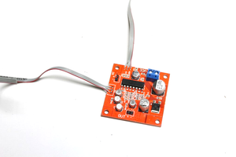

# Dub Siren Synth - 555 Project V2

Source: https://www.instructables.com/Dub-Siren-Synth-555-Project-V2/

---

## Introduction

NOTE: I have done another version of this build which can be found in the below link. It's a better version and makes building this a whole lot easier

https://www.instructables.com/Dub-Siren-V3-555-Project/

My first dub siren build was a little over complicated. Although it worked well, you needed 3 x 9V batteries to power it which was overkill and I had to build the main circuit on a prototype board.

The first video is a demo of the sounds that you can make with the dub siren. The second is a longer one of the build

This time around I designed a PCB for the dub siren and had it printed. This saved a lot of space and pretty much removes any wiring issues. Along with the custom PCB , the dub siren also includes a echo module and a stereo module, both off the shelf.

The great thing about including an echo module is you get a really rich sound out of the dub siren and it add's another sound level altogether.

I also manged to get the battery down to 1 li-po phone battery which is rechargeable. There is still a lot of wires as you need to connect 7 pots to the dub siren and echo module but it's a whole lot easier when you have pins on the PCB's to connect to.

Including a stereo module means you don't have to plug it into a speaker. Although you still can plug it into one if you want to and really get it pumping.

## Step 1: Parts

Parts:

1. Case. You can use anything to house the electronics, as long as it's big enough to do so. I used an old intercom speaker I found at a junk shop.

2. Echo and reverb module - [eBay](https://www.ebay.com.au/itm/PT2399-Microphone-Reverb-Plate-Reverberation-Board-No-Preamplifier-Function/263004532089?hash=item3d3c4aad79:g:iuYAAOSwfpVZJ-Ts)

3. Audio amplifier module - This is the one I used [eBay](https://www.ebay.com.au/itm/AMP-Module-Mini-Amplifier-Board-Power-TDA2822-DC-1-8-12V-3-5mm-Stereo-Qu-5V-I0V1/184328073764?hash=item2aeacf3224:g:1w4AAOSwJLde5da8&frcectupt=true) but you could easily use a smaller one [like this](https://www.ebay.com.au/itm/Power-TDA2030A-Audio-Amplifier-Module-Supply-5-12V-18W-Single-Board/264289188689?hash=item3d88dcfb51:g:QwUAAOSwQxxcuANw&frcectupt=true)

4. Speaker 8 ohm - [eBay](https://www.ebay.com.au/sch/i.html?_from=R40&_nkw=8+ohm+speaker&_sacat=0&_sop=15)

5. Li-po Battery - Get one out of an old phone or [eBay](https://www.ebay.com.au/sch/i.html?_from=R40&_trksid=p2334524.m570.l1313.TR11.TRC1.A0.H0.Xphone+battery+samsung.TRS0&_nkw=phone+battery+samsung&_sacat=0&LH_TitleDesc=0&_sop=15&_osacat=0&_odkw=phone+battery)

6. Charging and voltage regulator module - [eBay](https://www.ebay.com.au/itm/3-7V-9V-5V-2A-Adjustable-Step-Up-18650-Lithium-Battery-Charging-Discharge-I-J3Q3/264335034952?epid=23035413437&hash=item3d8b988a48:g:j~wAAOSw4YZc55Ns)

7. Wires

Dub Siren Circuit

You can find the schematic, Board and Gerber flies in the next step. You'll need to send the gerber files which is in a zip file to a PCB manufacturer like [JLCPCB](https://www.google.com/search?q=jlcpcb&rlz=1C1GCEA_enUS807US807&oq=jlc&aqs=chrome.1.69i57j0l5j69i60l2.2055j0j7&sourceid=chrome&ie=UTF-8) who will print them for you. The parts list is below:

1. LM555n × 2 – [eBay](https://www.ebay.com.au/itm/Useful-10-20-50PCS-NE555P-NE555-DIP-8-SINGLE-BIPOLAR-TIMERS-IC-TOP-Quality-M8Y7/193508715265?hash=item2d0e04ab01:g:u~YAAOSwZbJe4G3M&frcectupt=true)

2. LM741 × 1 operational amplifier – [eBay](https://www.ebay.com.au/sch/i.html?_from=R40&_trksid=p2334524.m570.l1313.TR1.TRC0.A0.H0.Xlm741.TRS0&_nkw=lm741&_sacat=0&LH_TitleDesc=0&_osacat=0&_odkw=555+timer)

3. Momentary on/off button – Normally on - [eBay](https://www.ebay.com.au/sch/i.html?_from=R40&_trksid=p2334524.m570.l1313.TR11.TRC1.A0.H0.Xmomentary+switch.TRS0&_nkw=momentary+switch&_sacat=0&LH_TitleDesc=0&_sop=15&_osacat=0&_odkw=phone+battery)

4. 2 X SPDT On/off switch – [eBay](https://www.ebay.com.au/sch/i.html?_from=R40&_trksid=p2334524.m570.l1313.TR3.TRC2.A0.H0.Xspdt+toggle+switch.TRS0&_nkw=spdt+toggle+switch&_sacat=0&LH_TitleDesc=0&_sop=15&_osacat=0&_odkw=momentary+switch)

5. 3.5mm Output Jack – [eBay](https://www.ebay.com.au/itm/10Pcs-3-5mm-Headphones-Stereo-Audio-Socket-Jack-With-nut-5-Pin-PCB-BDAU/362132587283?epid=24013243930&hash=item5450c8c313:g:j6UAAOSwez5ZzOKb)

6. Knobs – [eBay](https://www.ebay.com.au/sch/i.html?_from=R40&_trksid=p2047675.m570.l1313.TR11.TRC1.A0.H0.Xpotentiometer+knobs.TRS0&_nkw=potentiometer+knobs&_sacat=0)

7. 50K X 5 pots - [eBay](https://www.ebay.com.au/sch/i.html?_from=R40&_nkw=potentiometer+50k&_sacat=0&LH_TitleDesc=0&_sop=15)

8. 47μF × 1 - [eBay](https://www.ebay.com.au/itm/50PCS-25V-47uF-High-Frequency-LOW-ESR-Radial-Electrolytic-Capacitor-5X11mm/264399626299?hash=item3d8f72203b:g:~KgAAOSwT8ZdHsHU&frcectupt=true)

9. 47nF × 1

10. 220μF × 1 - [eBay](https://www.ebay.com.au/itm/20PCS-25V-220uF-High-Frequency-LOW-ESR-Radial-Electrolytic-Capacitor-8X12mm/254298576265?hash=item3b35605589:g:9xkAAOSwzYNdHsHP&frcectupt=true)

11. 150nF × 1

12. 10μF × 1 - [eBay](https://www.ebay.com.au/itm/10V-50V-High-Frequency-LOW-ESR-Radial-Electrolytic-Capacitors-105C-1uF-3300uF/264388201105?var=564005352620&hash=item3d8ec3ca91:g:9xkAAOSwzYNdHsHP)

For the resistors - just by these in assorted lots - [eBay](https://www.ebay.com.au/itm/300x-30-Values-Kinds-1-1-4W-Metal-Film-Resistor-Assorted-Kit-10PCS-Per-Each-New/223222191255?epid=24025613485&hash=item33f9145497:g:-EAAAOSw1KRb46cC&frcectupt=true)

13. 10K X 2

14. 68K X 2

15. 2.2K X 2

16. 560R X 4- you may need to buy these separate as they are not used often - [eBay](https://www.ebay.com.au/itm/100Pcs-1-4W-0-25W-Metal-Film-Resistor-1-360-390-430-470-510-560-620-820-Ohm/192076578770?hash=item2cb8a7ffd2:g:6pcAAOSwjDZYd168&frcectupt=true)

17. Right Angle Male Pin Header - [eBay](https://www.ebay.com.au/itm/10-pcs-1x40-Pin-2-54mm-Right-Angle-Single-Row-Male-Pin-Header-Connector/301924786435?hash=item464c1ea103:g:iBgAAOSwAYtWG7Hy&frcectupt=true)

18. 5mm LED – [eBay](https://www.ebay.com.au/sch/i.html?_from=R40&_nkw=5mm+led&_sacat=0&_sop=15)

19. 2N3904 Transistor - [eBay](https://www.ebay.com.au/sch/i.html?_from=R40&_trksid=p2380057.m570.l1313.TR3.TRC1.A0.H0.X2n3904.TRS0&_nkw=2n3904&_sacat=0)

## Step 2: Dub Siren Schematic and PCB Files

I have started to design my own PCB's using Eagle. If you are interested in getting into designing your own then I highly recommend Sparkfun's tutorials on [schematic](https://learn.sparkfun.com/tutorials/using-eagle-schematic/all) and [board design](https://learn.sparkfun.com/tutorials/using-eagle-board-layout). They are easy to understand and once you get the hang of it, easier than you think.

You can't attach zip files to Instructables pages so I have linked all of the files to my [Google drive](https://drive.google.com/drive/folders/1410Pu0V8KzUc93xflQobwn_AESKFg6e7?usp=sharing). The zip file has all of the gerber files which you need to get the PCB printed. Just save that file and sent it to your favourite PCB manufacture. I use [JLCPCB](https://jlcpcb.com/e?gclid=Cj0KCQjwuJz3BRDTARIsAMg-HxXQlC6JQ_bVu3kRlQAl3ErrFHUAW0t2TbWZCCef_iWWsQPk8QTpZg0aAqOpEALw_wcB) but there are plenty of others you can use.

I've also included a PCB which has all of the pots included on the circuit board. It means that you don't have to solder all of those wires to the circuit board. However, it will limit where you can add the pots to the case. Up to you which one you want to use.

- [Dub Siren Pots Inc](pdfs/Dub Siren Pots Inc.pdf)

## Step 3: Dub Siren Circuit

First thing to do is to put the dub siren together. If you follow the values on the PCB you won't have any issues with getting it going. However, it's always good practice to test out the circuit before you move onto the next step.

Steps:

1. I have included the board layout so you can use this if you need to help identify the value of any of the components.

2. I added right angle pin connectors for any components that aren't connected to the board. They are a great way to test the board once built using jumper leads. I strongly suggest that you take the time to test prior to moving forward to the next steps.

3. I also suggest to connect the echo and audio modules up with the dub siren to make sure it all works. Before you do this though, you need to make a modification to the echo circuit in order to give it the echo effect.

## Step 4: Modifying the Echo Circuit

This mod is one that the manufacturers suggest to do if you want to control the echo. I wish that they would just add the pot but unfortunately they have only have added a reverb pot. I did an Instructable on how to use this module so if you want further info check it out [here](https://www.instructables.com/id/Echo-Reverb-Box/)

Steps:

1. First, locate the R27 resistor. It is labelled R27 and is near 3 small solder points. Those 3 solder points are where you will add the 2nd pot.

2. To remove the SMD resistor you can just use an exacto knife and cut it away. Do it carefully though as you don’t want to damage any of the other components

4. Solder 3 wires to the pot solder points and add a 50K pot to the ends of the wires. Make sure you have more wire than you need so you don't have to re-solder more on later.

5. You might have noticed that the reverb pot (the one the module comes with) is in a position which won't make it easy to mount inside a case. If you want to remove this i would suggest you use a pair of wire cutters and cut it off. The reason being, the solder pads are very fragile and if you try and de-solder the pot you might rip them off (I’ve done it a couple times before). Easier to just destroy the pot and cut it away then take the chance.

## Step 5: How to Put All of the Circuits Together

The dub siren takes 4 circuits altogether. 3 are off the shelf ones you can get from eBay and the 4th is the dub siren PCB you'll need to get printed.

The below image is a guide on how all of the circuits join together. You can see that to power the dub siren i used a mobile phone battery. The charging module that it is connected to is also a voltage regulator (pretty neat hey!). I did an Instructable on how to use one of these modules and wire it up which you can find [here](https://www.instructables.com/id/Reuse-Old-Mobile-Phone-Batteries/).

## Step 6: The Case

For the case I went with an retro style intercom. You could use anything really, as long as it has enough room inside for all of the components. A cigar box would also make a great case.

I'll go through how I modded the case in the following steps

Steps:

1. First thing I had to do was to open it up and remove all of the insides. I was going to utilize the buttons that came with the intercom but in the end i decided to remove them. It was getting tight inside the case with all of the components so easier just to add my own buttons

2. Once it was open I removed all of the parts inside and also cut away any plastic gussets and other pieces inside the case to make as much room as possible

## Step 7: Working Out How Everything Will Fit in the Case

This is always an important step to do. You want to lay out all of the components that need to go inside the case to make sure they will fit. I had to also take into consideration the speaker on the top side of the case as well.

You can see that the audio amp that I used came with a volume pot. As the dub siren circuit already have one, I didn't need to have this outside the case.

## Step 8: Adding the Pots and Echo Module

Once you have the case gutted and have a good idea where the circuits are going to go, next thing to do is to add some pots. You need to add 5 pots for the dub siren (all 50K) and 2 for the echo module. Note that the echo module already has one attached to the circuit board. I decided to use this to secure the circuit board as well to the case.

Steps:

1. Work out where the best place is to add the pots to the case. Take your time with this as you need to ensure that they are easily accessible.

2. Next, I pre-drilled all of the holes for the pots, making sure that the spacing is the same for all of them

3. The plastic on the case was a little too thick for me to be able to attach the nuts on the pots so I removed some of it from the inside of the case with a dremel.

4. I then secured all of the ones for the dub siren and then added the other 2 for the echo module.

## Step 9: Adding an Audio Jack

Ok - so this step isn't necessary but if you want to be able to plug your dub siren into an external speaker, then I highly recommend doing it. You'll also be able to plug it into a mixer as well and play along with any music you want to at the right volumes.

The type of audio jack I used turns off the speaker inside the case when a jack is plugged into it.

Steps:

1. First I drilled a hole in the back of the case and removed some of the plastic around it in order for the audio jack to be secured

2. next I secured it into place with the small nut that comes with it. The wiring will come later.

## Step 10: Adding the Momentary Switch

Making the decision to remove the switches which were on the intercom meant that I had to add my own. To do this I used some opal acrylic which I thought would be good to have the LED blink behind it. I actually turned out way better then I thought it would and I'm happy I made the decision to remove the switches.

The momentary switch is an important part of the dub siren. it give you control of when to add some siren sounds. The other switch turns off the momentary one and the dub siren just plays continuously.

Steps:

1. First, I cut a piece of the opal acrylic to size

2. Next I drilled a couple of holes, one for the momentary switch and one for the SPDT switch. I thin secured these into the acrylic

3. Initially, the glue I used, a rubber type one, didn't do the job very well so I re-did the acrylic again and added some drops of super glue to the back. This did the job well.

## Step 11: Wires!!!

The dub siren circuit board needs a lot of wires to connect up to all the pots etc. It probably would have been easier to just design the board with surface mounts pots which would have cut down on the wiring. I did design a board like this and the board and gerber files can be found in step 2.

Steps:

1. First thing I did was to secure all of the circuit boards to the base of the case with some good, double sided tape.

2. I then started to solder on the wires to the right angle pins that I added to the circuit board. I used thin ribbon cable to do this. I pick this up for free at my local e-waste depo

3. Once all of the wires are soldered into place, I do a double check to make sure that are connected well.

## Step 12: Adding the Wires to the Components

Final stage now - time to connect all those wires to the components. Wire seems to take up a lot of space in any build like this so you need to take into consideration the room that it will take in the case. I tried to keep the wiring as neat as possible as it helps to trouble shoot later on if needed

Steps:

1. Start to connect each of the wires to the pots. The 2 pots that you will prob use the most are speed and pitch so make sure that these pots are in a good position and easy to access.

2. Next you need to wire up the LED, switches and also add a couple of wires from the "out" solder points on the dub siren to the "in" solder points on the echo module. Check out step 5 to see how all the modules are connected together

3. You then need to connect the "out" on the echo module to the "in" on the audio module.

4. The "speaker out" on the audio module then should be connected to the audio jack and so should the speaker.

5. You'll also need to connect power to each of the modules as well - again, check out step 5 to see how to best do this

## Step 13: So Now What?

Well that's all there is to it. Now it's time to start to play around with your dub siren and see what sounds you can get out of it.

As previously mentioned, I use the speed and pitch quite often on the dub siren but it does a bunch more sounds. Playing around with the echo will also give you some really rich, dimensional sound effects that will bring your dub siren playing to the next level.

Download some dub reggae music as well and start to add some sound effects to it. And have fun!

## Downloads

- [Dub Siren Pots Inc](pdfs/Dub Siren Pots Inc.pdf)

---
*50 images archived*
