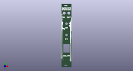
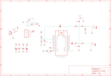
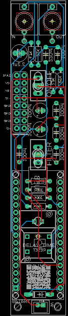

# Echo / Delay Modular Synth - Powered by Arduino

Source: https://www.instructables.com/Echo-Delay-Modular-Synth-Powered-by-Arduino/

---

## Introduction

## Supplies

The following is a list of components needed to build the synth. You can also find attached a PDF of the parts list in case you want to print it off. You can also find all the files in this build on my GitHub page. On the next step you'll find all of the info to have the PCB's printed.PARTS:Capacitor Polyester - Ali Express33nf X 2100nf X 4220nf X 1Electrolyte (ERS) - Ali Express2.2uf X 1100uf X 2Diode - 1N4148 X 1 - Ali ExpressResistor Metal Film - Ali Express10K X 1100K X 14.7K X 22.2K X 26.8K X 1100R X 1Switch Toggle (stitch pin end) X 2- Ali ExpressSwitch momentary PB86-A1 X 1- Ali ExpressAudio Socket PJ301M X 2- Ali ExpressArduino Nano X 1 - Ali ExpressSocket and wire JST PH 2.00mm X 1 - Ali ExpressParts List.pdfDownload

## Step 1: PCB and Front Panel

We all have different levels of knowledge, so when it comes to a build like this I want to make sure that I'm providing enough information so anyone with some basic soldering skills can make it. That includes ensuring there are instructions on how to get your own PCB's printed (which is super easy!)So with that said, the first thing you will need to do is to get the front panel and PCB printed. I use JLCPCB (not affiliated) to get this done. The front panel is actually just a PCB without any components included! The front panel design is done in a program called Inkscape (available free) and the panel including the drilled holes is done in Fusion 360 (also free!)The files that you need to build your own Ekoplasm Synth can be found in my GitHub page. This includes the parts list, Gerber files for the PCB & front panel, schematic, Arduino script etc.STEPS:Send the Gerber files to a PCB manufacturer like JLCPCB who will print the PCB and front panel for you. Download all of the files from my GitHub page to your computer and send the zipped Gerber files (PCB and front panel) off to the PCB manufacturer of choice.If you have no idea what any of the above means, then check out the Instructable I made on how to get your broads printed which can be found here.NOTE: The manufacture will include an order number on both the PCB and front panel. It doesn't really matter where it is on the PCB but you don't want it on the front on the front panel!Over at JLCPCB you can 'specify a location' once the Gerber files have been loaded so click this for the front panel and specify in the comment section that you want the order number on the back of the panel. The manufacturer will add it to the back where indicated.Parts List.pdfDownload

## Step 2: Adding the Components to the PCB - Part 1

As the PCB is 2 sided, the order you add the components does matter. If you get it wrong it's not the end of the world but it might make it a little harder to add some component.STEPS:As always, start with the lowest profile components, in this case it's the resistors and diode.  Its always good practice to check your resistors values before soldering in case you have to troubleshoot later on.I've included a mini JST connector to power the board. Solder the connecter next into place.A quick note on powering the synth. As I only need positive and ground I have used a JST connector to connect it to power. However, I have included space to add a Eurorack 16 pin adapter in case you want to power it using traditional Eurorack power sourcesYou can now add the capacitors, start with the polyester caps and then add the electrolytic caps.I left adding the Arduino in place until I had populated the other side of the board.  I found that it was easier to do this as the header pins wouldn't be in the way.

## Step 3: Adding the Components to the PCB - Part 2

Now it's time time to add the components to the front of the PCB.STEPS:First place the momentary switch into the PCB and solder into place.Now you can add the toggle switches.  Note that you should secure the PCB with a helping hand or something similar to keep it steadyNow you can solder the 2 audio sockets into place.That's it for the components on the front of the panel!

## Step 4: Adding the Arduino

Now it's time to add the Arduino. I always include header pins so the Arduino is removable. It helps if you have to replace the Arduino and also allows you to program it when it isn't in the board. Plus, if the Arduino fails for whatever reason, you can easily remove and replace it.STEPS:Add the header pins to the Arduino and then place them into the PCB and solder into place.If you need to, you can still get under the components under the Arduino by removing it from the header pins.

## Step 5: Loading the Arduino Sketch

If you are new to Arduino and want learn how to upload a sketch to Arduino - then check out this link. It's really straight forward and doesn't need any special tools - just a computer and a USB cord.STEPS:Open the sketch in the Arduino folder which will take you to Arduino IDE. This can be found in the folder that you downloaded from my GitHub pageConnect your Arduino and upload the sketchOnce the sketch is loaded to Arduino you can connect it to the PCB for testing.Connect the PCB to a 9V to 12V power source and check that the synth works. Plug a speaker in to the 'out' jack, connect the 'In' jack to another synth or even to your phone and hit the delay button. You should hear the delay kick in.If you're not hearing anything, then you might need to do some troubleshooting.

## Step 6: Adding the Front Panel

STEPS:The front panel has been designed so it fits perfectly onto the PCB. Carefully place the front panel so it aligns with the components and push it into place. I usually start with the toggle switches facing downwards and then just slide the panel into place.The rectangle hole in the front panel for the momentary switch is a bit of a tight fit.  If you find that it is sticking, then just file down the edge of the front panel where it is getting caught.As there is nothing to secure the bottom of the front panel to the PCB, I have added a couple holes so you can add some spaces (Size - M2) and ensure that the bottom section is connected.The nuts for the audio jacks and toggle switches will hold the top section of the front panel to the PCBNow that the front panel is in place, you can either make an individual case to house it in or add it to your Eurorack.

## Step 7: How to Play

This will probably be the quickest 'how to play' that I have written as the synth is super simple to useSTEPS:Connect a 3.5mm cable to the 'out' on a synth and then connect the other end to 'in' on the Ekoplasm synthConnect the 'out' from the Ekoplasm synth to a speaker or mixer.Now turn the synth on and then the Ekoplasm.  Note that if you turn on the Ekoplasm first, you'll hear a bunch of feedback looping.Now hit the 'delay' button.  There are 6 selectable delay times (63 to 300ms) where the LED will be on. When you get to the reversable action, the LED will be off on the momentary switch.I have also added a 'FX' switch.  This just reduces the delay sound effect and makes it more subtler.That's it!  Check out the vid on the front page to see it in action.

---
*29 images archived*
