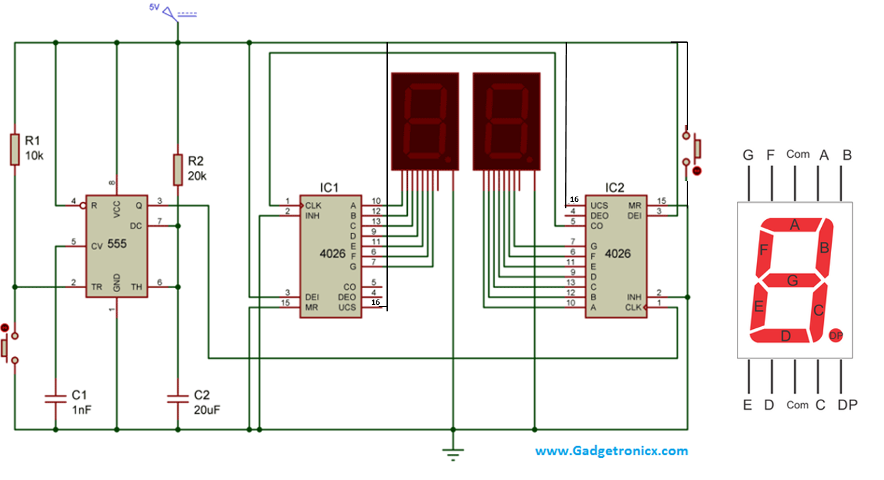
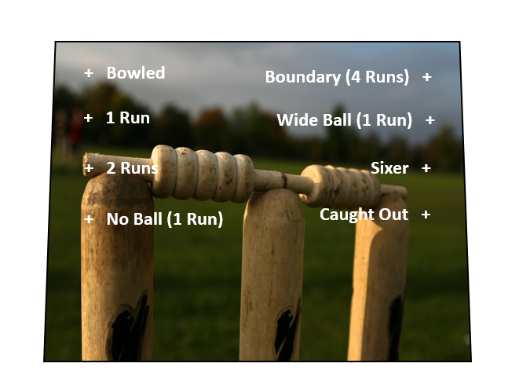

# Electronic Cricket Game

Source: https://www.instructables.com/Electronic-Cricket-Game/

---

## Introduction

Build your own electronic, handheld cricket game. Cricket Test matches are known for being played over 5 days and sometimes there’s still not a winner – 5 days!!!

I think you need to have been brought up watching cricket matches on TV and playing games in the street as a kid to be able to really appreciate it.

These days, it’s very rare that I find the time to watch a whole test match through to the bitter end. I just don’t have the time (or the patience) to sit and watch a whole game. So in honor of the noble game, I decided to build my own electronic cricket match handheld game so I could play it anytime I wanted (with the added benefit of nice, quick matches)

The electronics are built from circuit schematics I found on-line. here are 2 circuits to build for this game, one for the scoring and one for the actual game. I also managed to add all of the parts inside an old battery tester I found at a flea market which made the perfect case for the game.

You could probably build this very easily with an Arduino or something similar. However, I wanted to build it from the ground up as I’m trying to learn more about electronics. The project is for people who have intermediate skills in soldering and electronics. If you are a beginner, I would start with a few 555 timer projects first and then try your hand at this.

## Step 1: Parts and Tools

The project is made up of 2 different circuits. One for the actual cricket game and one for scoring. I have listed the parts for each circuit below

Cricket Game Parts

1. Perf Board - [eBay](https://www.ebay.com.au/itm/Small-Breadboard-Layout-Prototyping-Board/253716091720?epid=944019644&hash=item3b12a85348:g:1mkAAOSwRuVbNFsD)

2. 555 Timer IC – [eBay](https://www.ebay.com.au/itm/10-20-50-100-PCS-NE555P-NE555-DIP-8-SINGLE-BIPOLAR-TIMERS-IC/302152230012?hash=item4659ad247c:m:m0J3yUXSmG3OKjaZZGJ-W3A)

3. 4017 IC - [eBay](https://www.ebay.com.au/itm/10PCS-CD4017-CD4017BE-4017-DECADE-COUNTER-DIVIDER-IC-S/191736127618?hash=item2ca45d2082:g:nDQAAOSwpRRWnZQp)

4. 2 X 12K Resistors – [eBay](https://www.ebay.com.au/sch/i.html?_from=R40&_trksid=p2047675.m570.l1313.TR12.TRC2.A0.H0.Xresistor.TRS0&_nkw=resistor&_sacat=0)

6. 50K Potentiometer - [eBay](https://www.ebay.com.au/itm/50K-Ohm-16mm-Linear-Potentiometer-18T-Spline-Single-Horizontal-PCB-Alpha-B50K/253032237677?epid=24004800694&hash=item3ae9e58a6d:g:Hz0AAOSwgv5ZXtFs). This is used instead of the 100R resistor on the LED's. It gives you the ability to control the brightness of the LED's

7. 1uf Capactor – [eBay](https://www.ebay.com.au/itm/540Pc-24-Value-0-1uF-1000UF-Electrolytic-Capacitors-Assortment-Kit-Capacitor-Set/282961206984?epid=10019256496&hash=item41e1cd5ec8:g:SZ0AAOSwKMRa9UyO)

8. 10p (0.01) Capacitor – [eBay](https://www.ebay.com.au/itm/450pcs-10Value-50V-10pF-100nF-Ceramic-Capacitors-Assortment-Assorted-Kit-Box/163087715384?_trkparms=aid%3D555017%26algo%3DPL.CASSINI%26ao%3D1%26asc%3D20151005190540%26meid%3D0718c1ff640c4470870132e5d5dfefd6%26pid%3D100505%26rk%3D1%26rkt%3D1%26%26itm%3D163087715384&_trksid=p2045573.c100505.m3226)

9. 2.2 uf Capacitor – [eBay](https://www.ebay.com.au/itm/540Pc-24-Value-0-1uF-1000UF-Electrolytic-Capacitors-Assortment-Kit-Capacitor-Set/282961206984?epid=10019256496&hash=item41e1cd5ec8:g:SZ0AAOSwKMRa9UyO) (you may have noticed that this isn’t in the schematic. I use this later in the build so the player has the ability to slow down the LED’s if they wish to. It isn’t necessary to add this if you don’t want to

10. Momentary Button – [eBay](https://www.ebay.com.au/itm/NEW-12PCS-Push-Button-Momentary-Panel-Mount-Switch-Knob-Small-Mini-N-O-6-Color/153017747032?_trkparms=aid%3D555017%26algo%3DPL.CASSINI%26ao%3D1%26asc%3D20160630134829%26meid%3Da1d30390ba6f47b1853ac326ef7dad0b%26pid%3D100507%26rk%3D1%26rkt%3D1%26%26itm%3D153017747032&_trksid=p2045573.c100507.m3226)

11. 2 X red LED’s - [eBay](https://www.ebay.com.au/itm/LED-Diode-Kit-3mm-5mm-LED-Lights-Emitting-Diodes-Assorted-Clear-Bulbs-with-S1Z4/192493442090?epid=2282666457&hash=item2cd180d42a:g:slMAAOSwi4daubov)

12. 4 X Green LED’s

13. 2 X Blue LED’s

14. 50K Potentiometer - [eBay](https://www.ebay.com.au/itm/50K-Ohm-16mm-Linear-Potentiometer-18T-Spline-Single-Horizontal-PCB-Alpha-B50K/253032237677?epid=24004800694&hash=item3ae9e58a6d:g:Hz0AAOSwgv5ZXtFs). This is used instead of the 100R resistor on the LED's. It gives you the ability to control the brightness of the LED's

15. On/off switch - [eBay](https://www.ebay.com.au/itm/10-x-On-Off-On-Momentary-Mini-Toggle-Switch-Car-Motor-Dash-Dash-SPDT-3Pin-Sales/201939647988?hash=item2f048a7df4:g:ztcAAOSwIFtaCleh)

16. 9V Battery Holder - [eBay](https://www.ebay.com.au/sch/i.html?_from=R40&_trksid=p2047675.m570.l1313.TR12.TRC2.A0.H0.X9v+battery+holder.TRS0&_nkw=9v+battery+holder&_sacat=0)

17. 9 V Battery

Scoring Circuit Parts

1. 2 X 7 Segment displays – [eBay](https://www.ebay.com.au/itm/5-Pcs-10-Pin-1-Bit-7-Segment-1-Red-LED-Display-Digital-Tube-Common-Cathode-FT/132687817020?hash=item1ee4cf693c:g:eTwAAOSwkLJbJfUU)

2. 10K Resistor - [eBay](https://www.ebay.com.au/sch/i.html?_from=R40&_trksid=p2047675.m570.l1313.TR12.TRC2.A0.H0.Xresistor.TRS0&_nkw=resistor&_sacat=0)

3. 20K resistor – e[Bay](https://www.ebay.com.au/sch/i.html?_from=R40&_trksid=p2047675.m570.l1313.TR12.TRC2.A0.H0.Xresistor.TRS0&_nkw=resistor&_sacat=0)

4. 2 X Momentary switches – [eBay](https://www.ebay.com.au/itm/NEW-12PCS-Push-Button-Momentary-Panel-Mount-Switch-Knob-Small-Mini-N-O-6-Color/153017747032?_trkparms=aid%3D555017%26algo%3DPL.CASSINI%26ao%3D1%26asc%3D20160630134829%26meid%3Da1d30390ba6f47b1853ac326ef7dad0b%26pid%3D100507%26rk%3D1%26rkt%3D1%26%26itm%3D153017747032&_trksid=p2045573.c100507.m3226)

5. 555 IC – [eBay](https://www.ebay.com.au/itm/10-20-50-100-PCS-NE555P-NE555-DIP-8-SINGLE-BIPOLAR-TIMERS-IC/302152230012?hash=item4659ad247c:m:m0J3yUXSmG3OKjaZZGJ-W3A)

6. 2 X 4026 IC’s – [eBay](https://www.ebay.com.au/itm/5pcs-CD4026-CD4026BE-4026-IC-CMOS-Counters-Decade-Divider-DIP-16/191736128099?hash=item2ca45d2263:g:qzYAAOSwFqJWrvi7)

7. Perf Board – [eBay](https://www.ebay.com.au/itm/Small-Breadboard-Layout-Prototyping-Board/253716091720?epid=944019644&hash=item3b12a85348:g:1mkAAOSwRuVbNFsD)

## Step 2: Bread-boarding the Circuits

First things first - you should always breadboard your circuits first to make sure that the work. The initial schematic that I used for the scoreboard worked really well but I accidentally deleted it and couldn't find it again on-line. I did find another and it seemed to do the trick.

Once you have made the circuits and everything is working as it should be, it's then time to move onto soldering the first one together which will be the actual cricket game.

You can find the original circuit design website for the cricket game [here](https://www.electroschematics.com/6158/electronic-cricket/)

You can find the original circuit design website for the scoreboard h[ere](https://www.google.com.au/url?sa=i&source=images&cd=&ved=2ahUKEwiJ3-n-7pjcAhUCybwKHd9RD7sQjhx6BAgBEAM&url=http%3A%2F%2Fwww.gadgetronicx.com%2Ftwo-digit-counter-circuit-7-segment%2F&psig=AOvVaw1tjz96LktKnE63tb9gXMhF&ust=1531461012268847)

## Step 3: Cricket Match Game - Circuit

This circuit is pretty straight forward but like the scoreboard, it will need a lot of wires to connect all of the LED's together. Note that there is a 100R resistor that connects the negative from the LED's to ground. I decided to replace this with a 50K potentiometer so I could dim the LED's as they were very bright. Up to you though if you want to replace it or not.

Also, this game could be replaced with any game you want. If football is your sport or baseball, then adapting this would be very easy - you just need a different scoring system.

I also added a couple of Capacitors to the 555 IC so I could change the speed of the flashing LED's. You can either have it on fast mode or slow mode in case you keep on going out!

## Step 4: Soldering the IC's and Wiring the 555

I'll go through each of the steps and in most of them I have progressive images to help. However, I did make a coulple of mistakes which I had to fix up later and will highlight these as I go along.

Steps:

1. First solder the 555 and 4017 IC to a perf board. You can see that the perf board that I used has 2 solder strips on either side which I will be using to connect the positive and negative connections.

2. Next solder pin 1 from the 555 to ground

3. The capacitor attached to pin 2 controls the speed of the LED's. To be able to change the speed of the LED's I added a 2.2uf capacitor as well. Solder both positive legs of each capacitor to pin 2 and solder the negative legs to areas on the perf board that aren't used. You will later attach wires to these and then to a switch.

## Step 5: Continuing to Wire the 555

Steps:

1. Pins 2 and 6 need to be soldered together. I just added a small piece of wire to the underside of the circuit as you can see in the image below

2. Next you need to solder pin 4 and 8 to positive

3 The 2 12K resistors need to be added next. solder one to pin 6 and 7 and one to pin 7 and somewhere blank of the perf board. You will attaching a wire to this and to positive later for the switch to play the game

## Step 6: Continuing to Wire the 555

Steps:

1. It's now time to add a wire from the 555 IC to 4017 IC. Solder a wire to pin 3 on the 555 to pin 14 on the 4017

2. Next solder a 10K resistor to pin 3 on the 555 to ground

3. Next you need to solder the 0.01 capacitor from pin 5 to ground.

## Step 7: Wiring the 4017 - Attach the Ground Wires

That's it for the 555, it's now time to move onto the 4017 IC

Steps:

1. Attach pins 8, 11 and 13 to ground

## Step 8: 4017 IC Pin 16, 9 and 15

Steps:

1. Solder pin 16 to positive

2. Pins 9 and 15 need to be attached together. T do this just add a bridging wire to each of the pins.

That's all of the circuit board wiring that needs to be done. Now it's time to add all of the wires for the switches and LED's

## Step 9: Adding the Wires

Steps:

1. First attach the wires for the game switch. You need to attach one to the 12K resistor and also one to positive

2. Next you need to attach wires to the capacitors and also a wire to ground. You might notice that I soldered 2 wires to ground but you only need one.

3. Add a wire to the positive and negative sections. These will provide power to the circuit

3. Lastly you will need to soldered all of the 8 wires for the LED's. Just follow the schematic which shows which pins to solder the wires to.

Done! It's time to move onto the case and add the LEDs switches and knobs for the game

## Step 10: Modding the Case

I was lucky to find an almost perfect case for this game build. It was an old battery tester and had plenty of room inside for all of the electronics. You could use a cigar box which was also something I was considering until I stumbled across this little beauty.

Steps:

1. First I pulled the case apart

2. Next I removed any old electronics and also removed any plastic gussets which were taking up room inside the case

3. Lastly I gave it a good clean

## Step 11: Adding the 7 Segment Displays

You will need to decide where to put the scoreboard. After a bit of thought, I found the best spot was on the clear plastic cover of the battery tester.

Steps:

1. First I made a couple of cuts into the plastic cover. This was so I could push the pins from the 7 segment display though them.

2. Once I was happy with how it was fitting, I added some superglue and secured them to the front of the cover.

Remember, this might be completely different from the way that you attach yours so just work out what is best for you

## Step 12: Front Cover for Game

To make the front cover I just got an image from the net and sized it to fit onto the front of my case. As you case will probably be different to mine, just find the image you want to used and size it for your case.

I went through a few before I decided on the final one. That's because I had some trouble gluing it down. I used spray adhesive first but the paper didn't sit flat. I then added some thin cardboard to the back and glued it down with some modge podge which seemed to do the trick

The little "X's" on the image is where I added LED's. I used a hole punch to make the holes

## Step 13: Switches and LED's

Once you have built the game circuit, it's then time to mod the case. You could make both circuits first I guess but I wanted to make sure the game section worked before starting on the scoring section.

Steps:

1. Drill the holes for the LED's. I used the artwork (a spare one I printed off) as a template and drilled the holes where indicated on the cover

2. Next I super glued the LED's into place making sure that the polarities were all in the same direction.

3. The switches came next. You will need to attach the following switches

- momentary switches, one for the game activation, one for scoring and one to re-set the scoreboard.

- on/off toggle switch to turn everything on and off.

- Lastly, a switch need to be added to be able to change the speed of the flashing LED's. This needs to be a on/off/on switch

4. Work out the best place to add these switches, drill the holes and secure them into place. Wiring everything will come soon.

## Step 14: Wiring the LED's

Steps:

1. First you need connect all of the negative together. Bend the legs over and solder all of the negatives to each other.

2. I had to add a jumper wire to the LED's to each group of 4.

3. Next thing to do is to solder all of the LED wires from the circuit to the positive legs on the LED's. If you solder them in order on the schematic then they will flash in sequence. As I wanted to try and make it as random as possible I mixed the sequence up and just soldered them to random legs on the LED's

## Step 15: Soldering the Switches

Steps:

1. First switch I started with was the change of speed for the LED's. Solder one of the wires from the capacitors to the first solder point on the switch.

2. Solder the wire from the negative section on the circuit board to the middle solder point.

3. Lastly, solder the wire from the other capacitor to the last solder point on the switch. This will allow you now to change the speed of the LED's from very fast, random flashing to more of a slower, repetitive flashing.

4. Attach the positive wire that was soldered on for power to the solder point on the toggle switch. Solder another wire on the other solder point on the switch. This will be connected to the battery

5. Lastly, you need to solder the wires to pay the game to the momentary switch.

Now everything is wired up, test to make sure the game is working by adding a 9v battery to the positive and negative wires and making sure the game works. Are the LED's flashing? good, next hit the game button which will stop the LED's flashing and only have one on. If everything works as it should, move onto the next circuit, if not, faut find the circuit and try and identify the issue.

## Step 16: 7 Segment Display - Score Counter

Now it's time to start the scoring circuit. There were a couple of issues with the design which I have fixed on the attached schematic. Make sure you breadboard the circuit first and make sure you understand the design.

Strangely, the design wasn't quite right and I found that it was missing connections to pin 16 on both 4026 IC's. I have added these in along with a momentary switch on pin 15 on the 2nd IC. the switch is used to re-set the scoreboard but you could also scrap this and just turn the game off and on.

## Step 17: Adding IC 's and Wiring the 555

Steps:

1. First thing to do is to solder on the IC's. Solder the 555 first and then the 2 4026 IC's into place. Give yourself some space between them as you might need to run wires between the IC's

2. I'll start with the wiring of the 555. connect pin 1 to ground

3. Connect pin 2 and positive with a 10k resistor

4. Connect pin 4 and 8 to positive

## Step 18: Wiring the 555 - Continued

Steps:

1. Connect pins 6 and 7 together. I just added some extra solder to the pins

2. Connect the 22uf capacitor to pin 6. for those eagle eyed out there you will notice that I connected it to pin 5! I changed this later but it should of been pin 6

3. Next I added a couple of jumper wires to connect the positive and ground solder runs on the board.

4. Lastly connect pin 3 from the 555 to pin 1 on the second 4026 IC.

## Step 19: Wiring the 4026 IC's

I connected the 2nd 4026 IC up first

Steps:

1. Connect pin 2 to ground

2. Connect pin 3 to positive

3. Connect pin 15 to ground

4. Connect pin 16 to positive

## Step 20: Wiring the 4026 IC's - Continued

Now it's time to wire-up the first 4026 IC. This is connected exactly the same as the 2nd IC, except there is a wire connecting both of the together which is included in the steps.

Steps:

1. Connect pin 1 on the first 4026 IC to pin 5 on the 2nd IC

2. Connect pin 2 to ground

3. Connect pin 3 to positive

4. Connect pin 15 to ground

5. Connect pin 16 to positive

## Step 21: Adding the Wires.

Now it's time to solder on all of the wires for the 7 segment displays and a few other wires for switches and power

Steps:

1. First solder wire to pin 2 on the 555 and then ground. This will be attached to the momentary switch to change the numbers on the scorecard

2. Next it's time to attach the 8 wires needed for the 7 segment displays. I did the first 4026 first and then wired up the second one. Solder each wire to the relevant pins on the 4026.

3. After soldering all of the wires to the circuit board I then put them in order and secured them in place with a thin wire which I soldered into place on the perf board.

4. Do the same for the other 4026.

5. Next, solder a wire from pin 15 on the 2nd 4026 and another to positive. These will be attached to a momentary switch so you can re-set the scoreboard.

6. Lastly, solder a wire to positive and ground. This will be attached the other boards (the game board) to the positive and ground section and will power it.

That's all of the wiring done. Now it's just a simple task of attaching all of the wires to the 7 segment displays and switches!

## Step 22: Soldering the Wires to the 7 Segment Displays

Now the fun part - soldering all of the wires to the solder points on the 7 segment displays!

Steps:

1. Tin all of the solder points on the 7 segment displays.

2. Tin all of the wires on the 4026 IC's

3. Start with pin 6 on the first 4026 IC and solder to the relevant pin on the 7 segment display.

4. Continue to carefully solder the wires to each of the pins on the display making sure that they are correctly soldered to the right pins.

5. Once they are all soldered into place do the same for the other 4026.

6. You also need to attach a wire from the bottom, middle pin on each of the 7 segment displays to ground as well.

## Step 23: Final Wiring

Steps:

1. Solder the wires from the 555 and ground to the momentary switch which will change the scoreboard

2. Solder the wire from pin 15 of the 4026 IC and the positive wire to another momentary switch. This will allow you to re-set the scoreboard.

3. Solder the other positive wire to the positive section on the 555 circuit and do the same for the ground. This will power the scoreboard.

4. Lastly, wire the ground wire from the battery holder to the 555 timer ground section. Solder the positive wire from the 555 circuit to the on/off switch.

5. Attach a battery and see if everything works. If you are lucky (I wasn't) the scoreboard will come on and the LED's will be flashing madly. If not, you'll need to check your connections and make sure there are no short circuits anywhere.

## Step 24: Done

Now it is time to sit back and get a good cricket match started.

I usually make the rule up that you cannot go out first ball and you have to go out twice before it’s the next players turn.

Have fun and don’t forget to post an image if you make your own

---
*100 images archived*
