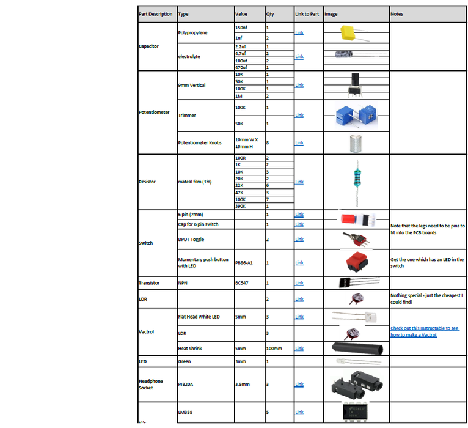
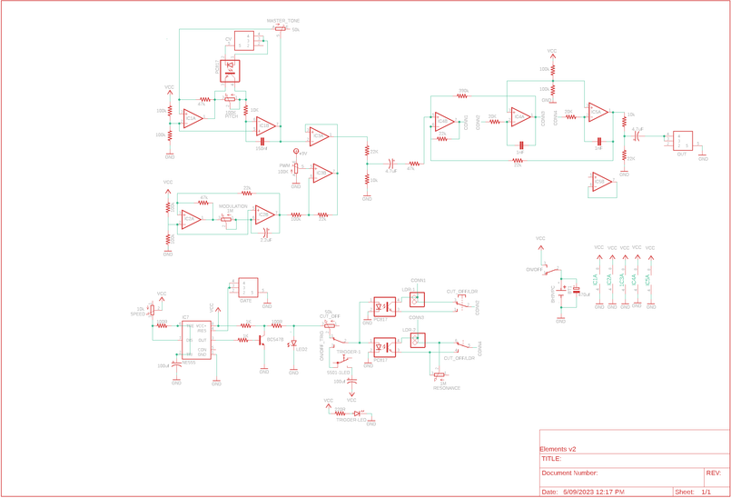
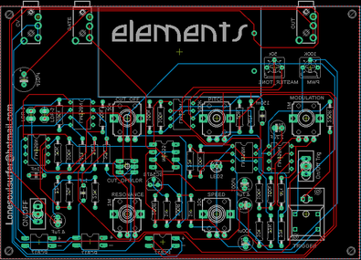
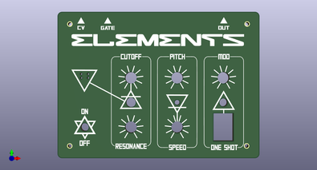

# Elements - Little Synths With BIG Sounds #1

Source: https://www.instructables.com/Elements-Little-Synths-With-Big-Sounds-1/

---

## Introduction

Hello everyone.

This synth which I've called 'elements', builds on a number of other electronic projects that I have published on Instructables. The synth is based around a pulse width modulated (PWM) oscillator routed through a resonant low pass filter. There are a number of ways to control the 'growling' tonality of this synth, either through a couple of light dependent resistors (LDR's) or through LED control via a couple vactrol's (LED and LDR connected together).

But that's not all! There are a bunch of other potentiometers to control cutoff, speed, modulation, and resonance .

The front panel is actually a PCB which you can easily get printed up by a PCB manufacturer. I designed it so it fits perfectly over the board giving the synth a really great finish.

Oh and I forgot to mention that I also included CV and gate outputs so you can hook it up to a sequencer or other synths.

All this means that this synth is a blast to play around with.

I've kept everything as simple as possible on this build so anyone who can solder will be able to make it. I've done away with a case and fancy power supplies to keep the build easy.

I'll be doing a series of 'little synths with big sounds' builds like this so keep an eye out for them.

I had a few goals when building this synth. It had to be fun to play, be able to connect to external inputs like a sequencer and to keep it as simple as possible!

Check out the video to see it in action.

## Supplies

Instead of adding a long list of parts to this step - I decided to instead include the parts list as a PDF file which is attached. The file includes all of the components and auxiliary parts that you will need to put the circuit board together. I have included links and images of each part so you can easily find/buy/identify them. I think it will be handy also as a PDF as you can print it off, visit your local electronics store and see if they have the parts available

The parts list is also available on my [GitHub Page](https://github.com/lonesoulsurfer/Elements-Little_Synths_With_BIG_Sounds_-1) in Excel format

The below parts are the rest that you will need to build the synth.

PARTS (Other than circuit components):

- 9V Battery
- Nylon Hex Stand Offs Assorted 2mm - [Ali Express](https://www.aliexpress.com/w/wholesale-nylon-hex-standoff.html?catId=0&initiative_id=SB_20230913185757&SearchText=nylon+hex+standoff&spm=a2g0o.detail.1000002.0). These will be used to connect the front panel to the PCB
- A4 Clear Acrylic (3mm) - eBay This is for the base. It isn't necessary but will protect the electronics and finishes of the build nicely.
That's it! You don't have to worry bout building a case because it doesn't have one :)

The rest of the parts can be found in the PDF attached below or on my Google Drive

- [Elements - Parts List - Excel](pdfs/Elements - Parts List - Excel.pdf)

## Step 1: PCB, Front Panel & Eagle Files

Firstly, all of the files that you need can be found in my [GitHub Page](https://github.com/lonesoulsurfer/Elements-Little_Synths_With_BIG_Sounds_-1)

To get your own PCB and front panel printed, you will need to send the Gerber files to a PCB manufacturer like [JLCPCB](https://jlcpcb.com/e?gclid=Cj0KCQiAwMP9BRCzARIsAPWTJ_GVdFKX-Hevhd6kw8GeZu3nYS_I10AJjhGupCabeBPJ_yEL6WvauxcaAtqKEALw_wcB) (Not affiliated) who will print the boards for you. If you have no idea how to do this well I've put together an Instructable on how to get your broads printed which you can find [here](https://www.instructables.com/How-to-Get-a-PCB-Printed-Using-Gerber-Files/).

Note the following: Usually you can have JLCPCB remove the order number by adding 'JLCJLCJLCJLC' to the back of the PCB. Unfortunately this didn't work for me and they printed it on the front of the PCB! You can request that a order number is not included by ticking the box indicated. It costs an extra $2 to have it removed.

You can also change the colour of the PCB's so go crazy and pick whatever colour you want to make the front panel and PCB.

In my [GitHub Page](https://github.com/lonesoulsurfer/Elements-Little_Synths_With_BIG_Sounds_-1) you will also find the Eagle schematic and board (PCB) files. You can play around and modify these if you like.

Parts list for the circuit board can be found below and I've also provided the list in excel which can also be found (surprise) in my Google Drive.

- [Elements Schematic - PDF](pdfs/Elements Schematic - PDF.pdf)

## Step 2: Adding the Components to the PCB

STEPS:

- Make sure you start adding the components on the reverse side first and start with the lowest profile parts which are the resistors.
- I'm sure you will have a multimeter and if you don't - grab yourself one. Test each resistor before soldering into place to double check the value. It takes a little extra time but it will save you a heap of time in the long run if you have to troubleshoot later on.
- Keep on making your way up with the next highest profile parts - in this case it's the IC sockets. It's always good practice to use IC sockets so you can easily change the IC's out if one is faulty

## Step 3: Making a Vactrol or 3!

STEPS:

Whats a Vactrol?

Put simply, a vactrol consists of 2 components, an LED and a light dependent resistor (LDR), incorporated into one package. Some heat shrink is used to keep the parts together and so no light can enter or escape. The LED and LDR face each other inside the package and interact when the LED is activated. This build uses 3 of them, one for the control voltage (CV) and 2 to control the PWM. Basically, they are voltage controlled resistors. Neat hey!

I've actually done an 'ible on how to make them which you can find [here](https://www.instructables.com/How-to-Make-a-Optocoupler-Vactrol/). Just make sure you use flat head LED and not the round head ones as they work better.

- Cut a piece of 6mm heat shrink about 15mm long
- Place the white, flat head LED into the heat shrink so it covers all of the LED and hangs a little over the legs
- Heat the heat shrink with a lighter (only over the LED section and with a pair of needle nose plyer, squeeze the end of the tube over the legs so it forms a good seal
- Place the light dependent resistor (LDR) into the other end of the heat shrink, making sure that it is resting up against the LED
- Use the lighter again, heat up the heat shrink around the LDR and crimp the end of the heat shrink around the legs of the LDR.
- Next thing to do is to bend the legs. You want to make sure that the anode (positive leg on the LED (the longer one) is on the right and the cathode (negative) is on the left when bending the legs down
- Lastly, trim the legs on both the LED and LDR and solder into place.

## Step 4: Adding the Vactrols & the Rest of the Components

STEPS:

- On the PCB where the vactrols are connected, you'll see little + and - symbols. This is the side that you add the LED's. As in the previous step, you need to bend the LED legs so the positive (anode) is on the right and the negative (cathode) is on the left. This will align them correctly to the through holes on the PCB.
- Place each one in the PCB and solder into place.
- Next you need to add the trimmer pots. One of these to to fine tune the pitch and the other is to fine tune the PWM. Just have them turned about half way and you should be pretty close to where you need them.
- Next add the caps, could checking the values and orientation and solder them into place
- You can now go ahead and add the IC's into the IC sockets.
- Lastly, solder the battery holder into place.

## Step 5: Adding the Components to the Front of the PCB

Now it is time to flip the PCB over and add the components to the front of the board. These are the control components like the potentiometers and switches

STEPS:

- Same thing when adding components to the front - start with the lowest profile parts first - in this case it's the 6 pin switch. Careful when adding solder to the legs as the solder pads are very close together and you could easily bridge them.
- Next it is best to add the toggle switches into place. The switch is a loose fit so you might have to add a little solder to the soldering iron and get the first leg soldered into place. You can then ensure the position is right and solder the rest of the legs into place
- Add the momentary switch next.
- Now you can add all of the potentiometers into place, checking each of the values before soldering. I also leave off soldering the tabs on the potentiometers until I've tested everything first. This way if something is wrong you can easily de-solder them if necessary.
- After that you can solder the LED. Make sure that the polarity is right and that the LED is is about 15mm above the board. If you do it flush with the board it won't stick out of the hole in the front panel!
Best to test the board now and make sure everything works. Add a battery, turn the synth on and plug in a portable speaker. You should hear the synth make noise. If not, check the PWM trimmer pot and adjust. Also push the 6 pin switch as it could be on for the LDR's. Play around with it and get some sounds playing. IMPORTANT - the resonance will not work until the 2 LDR's are connected to the board so we'll do this next

## Step 6: Adding the Front Panel & LDR's

This is the fun bit! Adding the front panel to the PCB. Give it a test first and make sure all of the components are aligned and that the front panel sits flat. There shouldn't be any issues with fitment.

STEPS:

- To secure the board to the PCB you'll need to use some spacers. Buy an assorted pack of them which I have linked in the supply section. Attach 10mm spacers with male screw ends to the from panel.
- Push the ends of the spacers into the PCB and secure with a couple more spacers. They need to be long enough to ensure no components are touching the ground.
- To add the 2 light dependent resistors first, push the legs from the first LDR through the front panel and then into the holes in the PCB. Do the same for the other one
- Make sure that they are sitting flush with the front panel and then solder them in place on the PCB.
Now at this stage you could leave it as is and be done. However, I decided to add some clear acrylic to the bottom to hep protect the electronics. It's really easy to do and gives the synth a nice finish so check out the next step on how to do it

## Step 7: Adding the Pots

Before we add the clear acrylic, you can now go ahead and add some pot knobs to each of the potentiometers. It isn't totally necessary to do this but I think it finishes off the look very nicely. You may note that in the video the knobs are different. I changed them because these ones were too slippery!

You can also add a couple nuts to the toggle switches as well.

## Step 8: Adding the Clear Acrylic Bottom

STEPS:

- Place one of the front panels (you would have received 5 of them when ordered) on top of the the acrylic and mark out the sides and also the screw holes
- Cut the acrylic to size (I used a band saw to do this) and then drill out the holes with a 2.5mm drill bit.
- Place the acrylic onto the spacers and secure into place
- Lastly, add some clear rubber' feet' to keep everything steady.

## Step 9: How to Play It

I kinda like to not add too many details on how to play the synth as it's fun just working iot all out. However, I've provided a brief rundown on some aspects of playing it

STEPS:

- First, you may need to fine tune the PWM using the 100K trimmer pot. Just turn it until you find the sweet spot
- You can then fine tune the tone as well using the 50K trimmer pot on the back.
- Plug in a good quality portable speaker (you will want to hear the bass growl)
- You should start to hear the synth pulse. If not, push the button switch down.
- Play around with the pots to hear what sounds you can generate. You will find that the modulation pot will only start to work when it is about 3/4 turned.
- Now if you hit the toggle switch next to the momentary switch you can play it as a 'one shot' giving you control on when it kicks in.
- Hit the push button switch and play around with the LDR's. Use a plastic bottle top to help block out the light and slowly lift it up.
- If you have a sequencer you can plug the CV and gate into it and really start to get some interesting sounds out of it!
Thoughts on changes for the next build

- I probably should have added a JST connector to power so you can power externally if required.
- I removed the screw holes in the PCB from the 9v battery holder which wasn't really necessary. I'll add those back in next time.
- You could also add keys to the synth and be able to play it. I think I'll add a key expander and maybe 3 keys next time I play around with this circuit.
- You could even add a small sequencer to the build if you wanted to. As the aim of this project was to keep it little, adding a sequencer would have made it bigger then I wanted. Saying that, a 4 step sequencer wouldn't make it too much larger...
- This synth would sound incredible played through a echo/reverb module. I will be designing a fun one soon which will be part of the 'little synths with big sounds' series
- There are probably some more mods you could do - no I'm sure there is.

## Downloads

- [Elements - Parts List - Excel](pdfs/Elements - Parts List - Excel.pdf)
- [Elements Schematic - PDF](pdfs/Elements Schematic - PDF.pdf)

---
*53 images archived*
