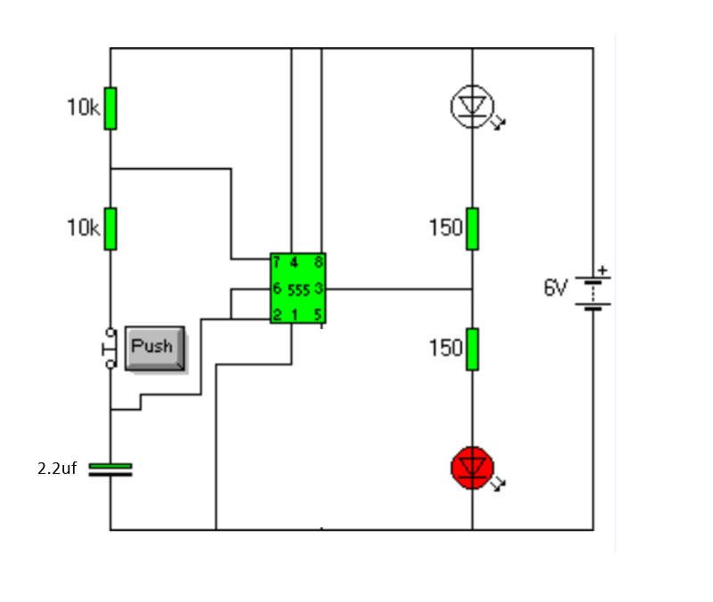

# Executive Decision Maker

Source: https://www.instructables.com/Executive-Decision-Maker/

---

## Introduction

Ever had to make a decision by flipping a coin? Well the Executive Decision Maker takes that to another level!

Based around the ever popular 555 timer, the Exec Decision Maker will help you make all those tricky decisions with the blink of an LED.

Need to decide whether to eat out or just stay in – leave it up to the Exec Decision Maker. Want to work out what movie to watch – the Exec Decision Maker can do that for you too.

Pocket sized, portable and fun – just follow this ‘ible to make your own.

## Step 1: Parts and Tools

Parts:

1. 2 X 150R resistors - eBay

2. 2 X 10K resistor - eBay

3. 1 X 2.2uf capacitor - eBay

4. 1 X red LED - eBay

5. 1 X green LED - eBay

6. 1 X 555 IC – eBay

7. 1 X mercury switch – eBay

8. 1 X momentary switch – ebay

9. Perf Board – eBay

10. Small container (I used a dental floss container)

11. 2 X CR2032 Batteries – eBay

12. 1 X CR2032 battery holder (Holds 2 of the batteries) – eBay

13. wire

Tools:

1. Solder and soldering iron

2. Drill

3. Dremel

4. Wire snips

5. Bread board

6. Super glue

## Step 2: The Circuit

The circuit is quite simple but like any electronic project, it’s best to breadboard the circuit first. I changed a couple of the values on the original schematic which I found on-line. I increased the value of the capacitor as I wanted the LED’s to blink quickly.

Also missing from the schematic is momentary switch which just goes onto the positive wire of the battery

You can play around with the values if you want to on the capacitor. A lower one like 1uf will make the LED’s seem like they don’t flash as they are flashing so fast.

In the following steps I’lll go through step by step how to solder the components together on the perf board

## Step 3:

## Step 4: Soldering the 555 IC

Steps:

1. Place the 555 timer into the perf board

2. Orientate it so the small half circle on the 555 is on the left hand side. This will make sure that you have the timer orientated the same as the images.

3. Carefully solder each leg to the perf board.

## Step 5: Pins 2, 6 and 4, 8 on the 555

There are a couple of pins that you need to connect. These are 2 and 6 as well as 4 and 8. To reduce the amount of wire on the board, i found that it's best to connect these pins together on the solder side of the perf board.

Steps

Pins 2 and 6

1. Cut a leg off a resistor and add a little bit of solder to one end

2. Solder the wire to pin 2.

3. Bend the wire so it is touching pin 6 and add some solder to it.

4. Cut off the excess wire.

Pins 4 and 8

1. You need to do the same thing for pins 4 and 8 but will need to insulate the wire so it doesn't touch the other one.

2. Once you have soldered one end down, add a small piece of shrink tube to the wire and solder the other end down

3. Heat the shrink tube so it contracts around the wire

## Step 6: Pins 1 and 2 on the 555

Steps:

1. Solder a wire from pin 1 on the 555 to where you want to make the ground (negative) point on the perf board

2. Solder the negative leg of the 2.2 uf capacitor to pin 1 (ground) on the 555

3. Solder the positive end of the capacitor to pin 2

4. Lastly, you need to connect pins 2 and 6 together on the 555. Just use a small leg from a resistor and solder this directly to the pins as shown in the images.

## Step 7: Pin 2, 7 and 8, Mercury Switch and Resistors

Steps:

Time to solder the mercury switch and 2 x 10K resistors to the board.

1. Solder one of the wires from the mercury switch pin 2 of the 555.

2. Next solder the 2 resistors in series

3. Solder the other leg of the mercury switch to one of the legs of the resistors

4. The other leg of the resistors needs to be soldered to positive so you need to add a wire to connect this to pin 8

5. Lastly, add a wire from pin 7 to where the 2 resistors are connected together.

Note: just in case you are new to creating circuits. Usually there are a few connections to positive and negative. You can just make an area for these which all positive and negative connections connect

## Step 8: Pin 3 - Adding the LEDs

Pin 3 is connected to both the LED’s. As the LED’s are at either end of the perf board, you will need to add a couple of wires to connect them

Steps:

1. Solder the 150R resistors in series like you did with the 10K ones.

2. Add a wire from pin 7 to the section where the resistors join

3. You will be adding one leg from each of the LED’s to the other ends of the resistors.

4. Attach the negative leg of the LED to the first resistor. (You may need to add wires for all of these connections in order to be able to attach them.)

5. Connect the positive end of the LED to pin 8 on the 555

6. For the other LED, connect the positive end to the other resistor and the negative to pin 1 on the 555

## Step 9: Batteries and Mercury Switch

The battery holder comes with its own little on/off switch which is great as it means you don’t have to add one.

Steps:

1. First decide how long the battery wires will need to be. You will need to stick the perf board onto the bottom of the battery holder so this will help you decide on where to cut them

2. Solder the positive wire to the positive section on the perf board

3. Do the same for the negative wire and negative section on the perf board

4. Add a couple of batteries to the battery holder

5. Test and make sure that it works.

6. To secure the circuit onto the battery holder, just add some hot glue and stick down.

6. You may have to adjust the mercury switch to ensure that it turns off when the battery and perf board are tilted. Just angle it slightly and test until it is at the right angle. Once it works, add some hot glue to keep in place

## Step 10: Done

That’s it!

This version I didn’t add an enclosure as I wanted to show how it looked without one. You can add one easily however if you want to. I used a dental floss container (great for adding electronics to as they usually open right up!) and added the parts inside of it.

Instead of the flat batteries, I used a 6 v battery (4LR44) which fits inside nicely. You will also have to add an on/off switch as well.

I’ve got a couple other projects that I’m working on with the 555 timer so keep a look out for them as well.

---
*36 images archived*
