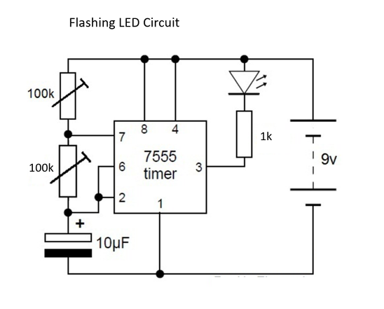
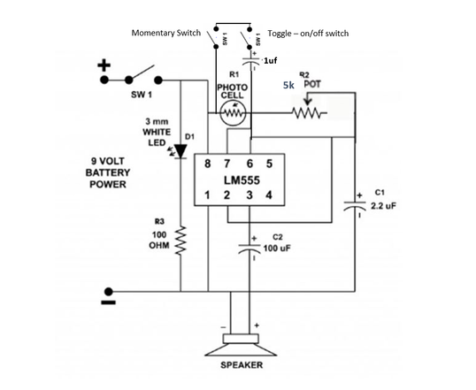
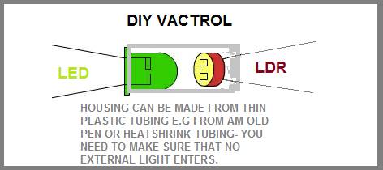
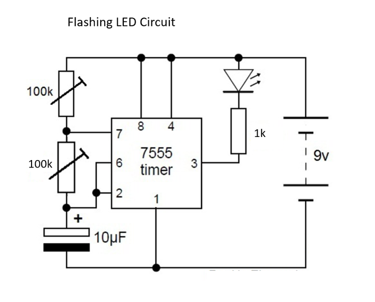

# Fizzle Loop Synth - 555 Timer

Source: https://www.instructables.com/Fizzle-Loop-Synth-555-Timer/

---

## Introduction

The fizzle loop synth came into being after mashing a couple of simple 555 projects together to make one. At the heart of the fizzle loop is a [Vactrol](https://en.wikipedia.org/wiki/Resistive_opto-isolator) – a simple little part that is made from an LED and a photo resister such as a CdS.

Calling this a synth might be pushing it a little - it's more a sophisticated noise maker but it's still a lot of fun to use and play with.

The first 555 project controls a flashing LED and the second utilizes a photo resistor to change the pitch. There are multiple ways to control the sound from the synth and I’m sure that you could easily add a whole bunch more if you wanted to.

So what does it sound like? Well controlling the speed of the flashing LED changes the speed of the sound while changing the pot on the photo resistor changes the pitch. The other controllers also work on changing the brightness and speed of the LED giving you some really cool sounds. There is also an output jack so you can hook-up a amplifier and really get the synth pumping.

Although this utilizes two 555 timers, they are really separate projects married together. Once you build one, you just build the other and connect them together via the vactrol. I also gave each 555 their own poer source as I was getting some noise from using a common ground for both 555 timers.

If you have never done any projects with a 555 timer, then I would suggest you make a couple of these first to get yourself familiar. This isn’t a hard project but you will need some experience in how circuits are put together and to be able to read a schematic.

Lastly, I won’t be going through a step by step guide on how to solder all this together. I’m going to assume that you can understand the schematics and can figure it out for yourself. I’ve taken some images of the important parts and added some explanations where warranted.

## Step 1: Parts and Tools

Parts

The Light Theremin Circuit

1. Photo Cell – [eBay](https://www.ebay.com.au/itm/20PCS-Photoresistor-LDR-CDS-5mm-Light-Dependent-Resistor-Sensor-GL5516-Arduino/222746709589?epid=22011020945&hash=item33dcbd0e55:g:03YAAOSwKytZL-uQ)

2. 555 IC -- [eBay](https://www.ebay.com.au/sch/i.html?_from=R40&_trksid=p2047675.m570.l1313.TR0.TRC0.H0.X555+ic.TRS0&_nkw=555+ic&_sacat=0)

3. Red LED – [eBay](https://www.ebay.com.au/sch/i.html?_odkw=555+ic&_osacat=0&_from=R40&_trksid=p2045573.m570.l1313.TR6.TRC0.A0.H0.Xred+5mm+led.TRS0&_nkw=red+5mm+led&_sacat=0)

4. 100 ohm resistor – [eBay](https://www.ebay.com.au/itm/100PCS-1-4W-Metal-Film-Resistor-0-25W-1-Full-Range-of-Values-0-to-10M/262943308104?hash=item3d38a47948:m:m9AAPzkedx9P_upvXOpgF9Q)

5. 3.3 uf capacitor – [eBay](https://www.ebay.com.au/itm/50V-0-1-0-22-1-2-2-3-3-4-7-6-8-10-22-33-47-82-100-150-uF-Electrolytic-Capacitor/253243249769?hash=item3af6795469:m:mTDA8ibHzNWgXevoOM4m55A)

6. 100 uf Capacitor – [eBay](https://www.ebay.com.au/itm/50V-0-1-0-22-1-2-2-3-3-4-7-6-8-10-22-33-47-82-100-150-uF-Electrolytic-Capacitor/253243249769?hash=item3af6795469:m:mTDA8ibHzNWgXevoOM4m55A)

7. Speaker – 8 ohm 5w (or whatever else you have lying around - try a few different sizes) - [eBay](https://www.ebay.com.au/sch/i.html?_odkw=speaker+8ohm+3w&_osacat=0&_from=R40&_trksid=p2045573.m570.l1313.TR0.TRC0.H0.Xspeaker+8ohm+5w.TRS0&_nkw=speaker+8ohm+5w&_sacat=0)

8. 5K potentiometer – [eBay](https://www.ebay.com.au/itm/2PCS-5K-Ohm-B5K-Knurled-Shaft-Linear-Rotary-Taper-Potentiometer/262875602892?hash=item3d349b5fcc:g:kjUAAOSw32lYto0x)

9. 6V Battery holder – [eBay](https://www.ebay.com.au/itm/4-x-AA-Battery-Holder-Box-6V-DC-Case-For-Receiver-Car-Plane-Boat-DIY-Plug/252452556886?hash=item3ac7585056:g:xBEAAOSwZZ5asfU9)

10. 4 X AA Batterys

11. 2 X on-off switch – [eBay](https://www.ebay.com.au/itm/10-x-On-Off-On-3Pin-Mini-Momentary-Toggle-Switch-Car-Dashboard-SPDT-Pole-Sales/322288826331?epid=940115809&hash=item4b09e937db:g:0ScAAOSwPCVX-wtc)

12. Momentary switch - [eBay](https://www.ebay.com.au/itm/Modern-6Pcs-7mm-Momentary-Push-Button-Press-Switch-On-Off-Push-Switch/122373408432?hash=item1c7e0606b0:m:moGc4OmEnaeSCWzcP_rbFKg)

13. 1uf Capacitor - [eBay](https://www.ebay.com.au/itm/1uF-50V-Electrolytic-Capacitor-20-pcs/302685444075?hash=item46797557eb:g:luUAAOSw0UdXqx4j)

Flashing Light Circuit

1. 1k Resistor – [eBay](https://www.ebay.com.au/itm/100PCS-1-4W-Metal-Film-Resistor-0-25W-1-Full-Range-of-Values-0-to-10M/262943308104?hash=item3d38a47948:m:m9AAPzkedx9P_upvXOpgF9Q)

2. 555 IC - [eBay](https://www.ebay.com.au/sch/i.html?_from=R40&_trksid=p2047675.m570.l1313.TR0.TRC0.H0.X555+ic.TRS0&_nkw=555+ic&_sacat=0)

3. 10uf Capacitor – [eBay](https://www.ebay.com.au/itm/100-Pcs-4-x-5mm-10uF-25V-Aluminum-Electrolytic-Capacitors-CT/302142817648?epid=1369130363&hash=item46591d8570:g:~woAAOSwux5YMCF0)

5. 2 X 100K Potentiometer – [eBay](https://www.ebay.com.au/itm/2PCS-100K-ohm-Linear-Taper-Rotary-Potentiometer-Panel-pot-B100K-15mm-WH148-3-Pin/282614198699?hash=item41cd1e71ab:g:BcYAAOSweC1ZlV-p)

6. 5mm white LED – [eBay](https://www.ebay.com.au/sch/i.html?_from=R40&_trksid=p2047675.m570.l1313.TR0.TRC0.H0.X5mm+white+led.TRS0&_nkw=5mm+white+led&_sacat=0)

7. 9v Battery

8. 9V battery holder – [eBay](https://www.ebay.com.au/sch/i.html?_odkw=5mm+white+led&_osacat=0&_from=R40&_trksid=p2045573.m570.l1313.TR11.TRC1.A0.H0.X9v+battery+holder.TRS0&_nkw=9v+battery+holder&_sacat=0)

Other Parts

1. Enclosure – your choice

2. Perf board

3. Heat Shrink

Tools

1. Soldering iron

2. Bread board and wires

3. Pliers

4. Screwdrivers

5. Dremel

6. Drill

7. Hot glue/super glue

## Step 2: Flashing LED Circuit

The flashing light circuit is quite simple and works by changing the values on the pots. On the original schematic, there is only the 100K pot which is used to speed up or slow down the flashing LED.

Another 100K pot (so there are 2 pots in total) has been added to give more options in changing the speed and brightness of the LED. It isn’t necessary but if you want more sound options, then it’s worth adding it.

## Step 3: Light Theremin Circuit

The second part to the synth is a light Theremin circuit. I made a project recently using this circuit which can be found [here.](https://www.instructables.com/id/Slider-Synth-Light-Theremin-555-IC/)

This uses a photo cell which acts like a resistor, to change the frequency of the sound with light. We will be attaching the 2 circuits together through the LED on the first circuit and the photo cell on the other using a Vactrol.

## Step 4: What Is a Vactrol?

A Vactrol acts like a potentiometer - applying a voltage to the Vactrol's LED has the same effect as turning up the knob on the potentiometer.

It consists of two components incorporated into one package: a light-emitting diode (LED), and a photoresistor (a resistor whose resistance drops when it is exposed to light)

It’s important that the only light that the photo cell can detect is from the LED. If outside light is able to reach the photo cell, then it will interfere with the performance and sound, that’s why you need to add something like heat shrink to protect them.

## Step 5: Making a Vactrol

Steps:

1. Cut a small length of heat shrink tube. The LED and photo cell need to be able to fit inside.

2. Place the LED into the heat shrink with the legs facing out and also the same for the photo cell. Make sure that they are touching inside the heat shrink.

3. Heat the heat shrink and start to shrink it. Start with one end first and when it has shrink enough, grab some pliers and flatten the end of the heat shrink so it is sealed shut.

4. Do the same for the other end

5. That’s it! You have made an important component to the fizzle loop synth

## Step 6: Building the Flashing LED Circuit

I’ve added a few tips below when building the first half of the circuit – the flashing LED.

I added 2 100K pots as I found that this gives me more control over the frequency. You should mix and match yourself to try and get the best sound from your synth. Do this on the bread board and try and few different values to see if one works better than another.

Also, the original resistor for the LED was 3.3K. I brought this down to 1k to make the LED brighter.

I know that this is self-evident but make sure that the LED in the vactrol is correctly orientated when connecting to the circuit. It would be easy to incorrectly connect the polarities.

Make sure that once you have built the circuit, you test and make sure that it’s working. You can do this by touching an LED’s legs to the resistor and one of the LED legs from the Vactrol. If it doesn’t work check over the circuit and see what you missed. I forgot to attach pin 8 to positive!

Steps:
1. Make sure that you add some good lengths of wire to the potentiometers.

2. The LED section is there you solder the LED inside the Vectrol. Make sure that when you solder it into the perf board that the legs from the photo cell are near to where you are going to make the other circuit.

3. I decided to add a separate power supply for both circuits. I found that there was some noise coming from the common ground and this helps isolate it. However you can use the same battery for both circuits if you wish. The Flashing LED takes 9v's

## Step 7: Building the Light Theremin Circuit

Once you have the first section done, you then need to make the light Theremin circuit. I did modify the circuit diagram slightly and it is up to you whether you want to include the capacitor and switch on the photo cell.

I’m sure that there are many more hacks that you could do to get some different sounds out of your synth so experiment by adding different values to the capacitors and photo cell.

If you would like a step by step walk through on this circuit, you can check out this ‘ible which I did a little while back.

Steps:

1. The LED on this schematic is actually the light for the Theremin but I decided to keep it as an “on” indicator. Make sure that you add some longer wires to this so it can be positioned to where you need it.

2. Also add some longer wires for the potentiometers. I usually add all of the pots to the case first and then attach the wires later.

3. Before you add the vactrol, test that the circuit is working first by adding a photo cell to pins 7 and 8. If you get some sounds coming out the speaker when you add a light source to the photo cell then your circuit is good to go.

4. The power source is 4 Aa batteries (6V). I found that 9V's is too much and heats-up the 555 timer

## Step 8: Deciding on a Case

The case could be anything from a cigar box to what I usedwhich is an old electrical meter I found in a junk shop.

I will go through how I put mine together and how I modified the case

Steps:

1. First pull apart your case.

2. Next pull any electronics and parts that you don’t need for your project and empty the box completely.

3. My box had some wires and old potentiometers attached to the front plate so I also removed all of these as well.

## Step 9: Adding the Speaker

You will need somewhere to add the speaker. If you find that there just isn’t enough room you could always just plug the synth into an external amplifier you use that instead. I went for both options.

Steps:

1. Mark where you want to add the speaker and cut the hole. I used a hole cutter on a drill which worked fine although it did slightly melt the top of the lid of the case

2. Measure and drill the holes to attach the speaker.

3. Lastly use some small nuts and screws to attach it to the case

## Step 10: Adding the Potentiometers

You will need to add 3 potentiometers to the front of the case. Decide where the best place for each one. I decided to add the 2 pots from the flashing LED to the bottom of the lid of the case and the pitch changing pot from the Theremin in the middle as my case already had a great knob for it.

Steps:

1. If necessary, drill holes where you want to add the pots. My case already had holes, I just needed to enlarge them slightly.

2. Secure the pots in place.

3. Add some knobs to the tops of the pots

4. Later, when you attach the wires from the circuit to the pots, you will need to join one wire to 2 pins and the other wire to the other pin. The orientation of how you do this will determine the way the knob changes the pitch and speed. For example, if you attach a wire to the pin on the left and the one in the middle and the other wire to the last pin, you will need to turn the pot clockwise to make the pitch and speed increase. I find that this is the best way to attach them together.

## Step 11: Attaching the Wires

Now that you have made the circuit and hopefully all is working correctly, you now need to attach all of the wires.

Steps:

1. Take your time and solder all of the corresponding wires to the pots and switches. I find that the best way to ensure that you are soldering the correct wires to the right pots and switches is to make the wire the same colour. This way you can make sure that you don't get them mixed-up.

2. Use thin wire to make the connections. Wire takes up a surprisingly large amount of space and using thin wire will ensure you reduce the space taken up by it.

3. For the pot that controls the pitch (middle on from the Theremin side) I wired this up so the lowest pitch would be when the dial is facing up and the highest pitch would be on either side. To do this you need to connect the 1st and 3rd pins together on the pot.

## Step 12: Adding the Batteries

Steps:

1. Solder the wires from the battery terminals to the switch and the circuity board.

2. Solder the positive wires from the circuit board to the switch and the corresponding positive wires to the circuit board.

3. Lastly, solder the ground wires to the board, making sure that the correct wire is soldered to the right part of the circuit board. So 6v to the Theremin side and 9v to the flashing LED.

4. Before you close up the case, check and make sure that all of the pots are working right.

5. Close up the case and your done.

---
*44 images archived*
