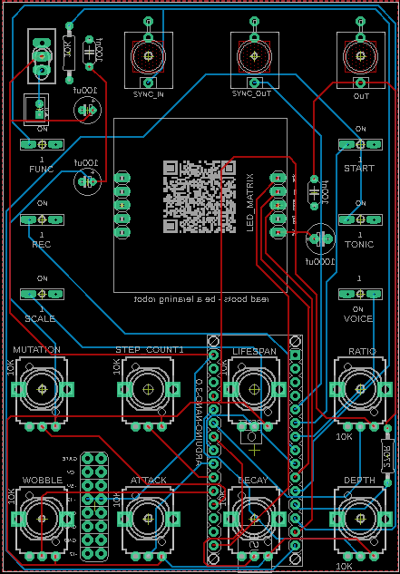
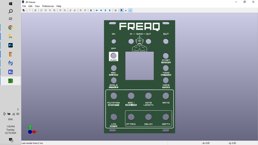
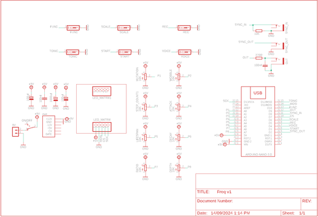

# Freaq FM Synth

Source: https://www.instructables.com/Freaq-FM-Synth/

---

## Introduction

## Supplies

I've created a parts list which can be found in my Github and in the PDF file attached to this step. The PDF includes links and images of each of the parts which will make it easy to order the correct ones for this build.PARTS:PCB - I've designed one for this build with the information on how to print your own in the next stepFront Panel - The panel is also a PCB so you'll also need to get this printed as well - check out the next stepArduino Nano - Ali ExpressCapacitor Polypropylene 100nf X 2Capacitor Polarized 100uf X 1Capacitor Polarized 1000uf X 1Resistor Metal Film 10K X 1Resistor Metal Film 270R X 1Potentiometers 9mm Vertical 10K X 6Switch Momentary (PN SKRCADD010) X 8On/Off Toggle Switch Through Hole version X 1LED Dot Matrix (TZT MAX7219) X 1Female Header Pin Socket 15 Pin X 2Audio Socket 3.5mm (PN - PJ-301M) X 3Mini JST Connector and wire 2 Pin X 11Freaq - List of Parts.pdfDownload

## Step 1: PCB, Front Panel & Schematic

Firstly, all the files that you need to build your own Mutant synth can be found in my Google Drive. This includes the parts list, Gerber files for the PCB & front panel, schematic, Arduino script etc.The build consists of 2 PCB’s – one is for the components and the other the front panel. You’ll need to send the Gerber files to a PCB manufacturer like JLCPCB (Not affiliated) who will print the boards for you. Jump into my Google Drive link, download the 2 Gerber files to your computer and then send them off to your PCB manufacturer of choice.If you have no idea how to do this well, I've put together an Instructable on how to get your broads printed which you can find here.NOTE: The manufacture will include an order number on both the PCB and front panel. It doesn't really matter where it is on the PCB but you don't want it on the front on the front panel!Over at JLCPCB you can 'specify a location' once the Gerber files have been loaded so click this for the front panel and the manufacturer will add it to the back where I have indicated.. You can also just hit 'No' when asked if you want to remove the order number. However, this costs $2.

## Step 2: Adding Components to the PCB

The PCB is 2 sided. The front has all of the active components like the pots and switches and the reverse has the passive components like the Arduino, caps and resistors. As some of the components are underneath the Arduino and (9v battery holder (if you install it), you have to be aware of the order that you solder parts into place.Let's start with the reverse side and add the passive components:STEPS:Always start with the lowest profile components - in this case (in probably all cases!) it's the resistors - all 2 of them!. Solder them all into place and check the values before soldering so you don't have to troubleshoot the parts later if something goes wrong! Solder the JST header into place.Solder the capacitors into place ensuring the polarities are correct on the electrolytic caps.You may have also noticed that there is a double row of holes (16) in the board as well. This is in case you want to power it via a Eurorack power board.Now you can add the header pins for the Arduino. The best way to do this is to connect the header pins to the Arduino and then place them into the PCB and solder into place. This way they will be straight and in the correct position

## Step 3: Adding More Components to the PCB

Now that you have done the back of the PCB, it’s time to move to the front and add all of the active components.STEPS:Let’s start with the LED Dot Matrix.  If you remove the LED matrix from the circuit board it is attached to, you can see indicated ‘In’ and ‘Out’. You can chain these modules together which is why they also have an out. You need to connect the 'In' pins to the RHS solder points in the PCB.   There are solder points to attach header pins to both the 'in' and 'out' on the LED matrix. I included header pins to each to ensure that the matrix was securely in place to the PCBI wanted to make sure that the module wasn't sticking up too much through the front panel so I removed the plastic surrounds on the pins in order for the module to sit lower on the PCB.Also, the LED matrix has a polarity so make sure you put it back onto the circuit board the right way. If you don’t it will turn on a few LED’s but nothing will happen. Next, solder the 3.5mm Jacks into placeNow you can solder all of the momentary switches into place along with the toggle switchLastly, add the pots and solder them into placeThat’s it for the hardware. Before you go and add the front panel, let’s load up the sketch to the Arduino.

## Step 4: Importing an Older Version of Mozzi Library to Arduino IDE

When the sketch was created for the Freaq Synth, it used an older version of Mozzi. The most recent version isn’t compatible and when you try to upload it you get a bunch of error codes. To counter this, you need to install an older version of Mozzi to Arduino IDE.NOTE - the images attached are for the mutant synth but it's the same thing for the Freaq synth1  First, go ahead and uninstall Mozzi 2.0 if you have it installed in Arduino IDE and also uninstall FixMath if you have this as well. If you are unsure how to do this, then check out this link:https://support.arduino.cc/hc/en-us/articles/360016077340-Uninstall-libraries-from-Arduino-IDE\2 You now need to install Mozzi 1.1.2 to Arduino IDE. Look up 'Mozzi' in the library manager search bar and then go to the dropdown and hit version 1.1.2 (see image 1)3  Go ahead & install Mozzi 1.1.2 via the dropdown4  If everything worked you should now have Mozzi 1.1.2 imported to your Arduino library. If not, then have another go at it following the steps above. The screenshots I have provided should help as well so take a look at them if you are confused or a little lost.

## Step 5: Uploading the Sketch to Your Adruino

STEPS:Go to my Github, open the Arduino Sketch folder and download the MutantFMSynth folder onto your computerGo into the folder and hit the MutantFMSynth.ino file. This will open Arduino IDE and will also include the other file extensions such as the header and .ccp files which are also in the folder you downloadedSide note – I didn’t think the .ccp files were needed so I initially deleted these from the folder. Big mistake – they are needed to ensure the header files are detected! The Arduino sketch should have all of the files from the MutanFMSynth like in the image.Hit the upload button and load the sketch to your Arduino Nano.If all goes well, you’ll get the always-good-to-see ‘upload complete’ message.If not, then you’ll need to do a bit of troubleshooting to find out what the root cause of the issue is. Now it's time to add the Arduino to the PCB and give it a test run.If you haven’t already, connect the Arduino to your PCB and power it up. Note that the PCB runs off 9V’s so you can connect a variable power supply or just use a 9V battery if you want.Plug a speaker into the out jack on the synthTurn the synth on via the toggle switch and press the ‘start’ button.You should see a bunch of lights on and hear sounds coming out the speaker. The instructions on how to play the synth can be found in the last step. Now you can play around with the controls and discover a few of the sounds that this synth can make!

## Step 6: Adding the Front Cover & Knobs

If the synth is working as it should and you are hearing some funky tunes, then you are ready to add the front panel on. As mentioned before, I have used the Eurorack form factor on the front panels so they (should) fit into any Eurorack frame. However, You can also make a case for it from wood which I have done for many similar builds or you can make a bare bones case which I have done for this buildSTEPS:Carefully place the front panel over the components on the PCB. It should fit on perfectly!Now you can add the nuts to the potentiometers and also to the on/off switch and 3.5mm jack sockets. This will keep the panel in place!Now add the knobs to the potentiometers. Use small ones as the larger type will take up too much room and will make it hard to get your fingers in there and turn them.I also added some legs to the front panel so it would sit nice and flat when I was playing it.  I'm going to add this synth along with others in a later build to a case.

## Step 7: How to Play the Freaq Synth

InstructionsButtons[Func][Rec] + buttons - Access various secondary functionsStart - Start or stop the sequencer[Func] + Start - Tap tempoTonic - Select tonic through natural notes A - G[Func] + Tonic - Shift base octave from 0 - 5[Func][Rec] + Tonic - Select octave offset to Track 1 (track 1 & 2 can be 0-4 octaves apart)Scales - Select current musical scale[Func] + Scales - Select current generative algorithm[Func][Rec] + Scales - Select the LFO waveform for the current voiceRec + knob - Hold down while moving a knob to record those parameters to the sequence[Func][Rec] + knob - Hold down while moving a knob to delete the recorded sequence for that parameter[Func][Rec] + Start - Select the MODULATOR waveform for the current voiceVoice - Select the active track which can be edited using the parameter inputs[Func] + Voice - Select the FM ratio mode for the current voice[Func][Rec] + Voice - Select CARRIER Waveform for the current voicePotentiometersMutation - Adjust the likelihood that the sequence will change over time[Func] + Mutation - Adjust the likelihood that any given step will be a note or a rest Density - Adjust the number of steps for the active trackSeq 1 – Adjust the steps for track 1[Func] + Seq 1 + 2 - Adjust the number of steps for all tracksNote Length - Adjust the length of the notes (for all tracks)Ratio - Select the carrier--to-modulator FM ratio (based on the current FM mode)LFO - Adjust the amount of LFO to apply to the modulator level for the active track[Func] + LFO- Adjust the LFO rate for the active trackAttack - Adjust the attack time for the modulator level envelopeDecay - Adjust the decay time for the modulator level envelopeDepth - Adjust the amount of envelope to apply to the modulator level for the active track

## Step 8: Last Words

There is so many great sounds that you can get out of this little synth.  Play around, experiment and use the instructions in Step 8 to help you understand all of the functions.You probably noticed I didn't talk at all about a case.  I did add some legs to the front panel to make it easier to play but the plan is to make my own 'poor mans' (I have to come up with a better name) Eurorack that runs off 9V power supply and anyone can build and play.  Next in line to build is my Groove Box synth which you can see in the vids.  After that will be a mixer and power rail and then some type of case.  I'd love to use some vintage tech for the case but I haven't been able to find what I want (at least for the price I want it at).  If I can't I'll build my own.  Oh, I also want to add a looper/sampler module as well which will allow me to add my own little touches to the sound.I'll continue to to publish each part on Instructables so keep a look out for those upcoming projects.

---
*34 images archived*
