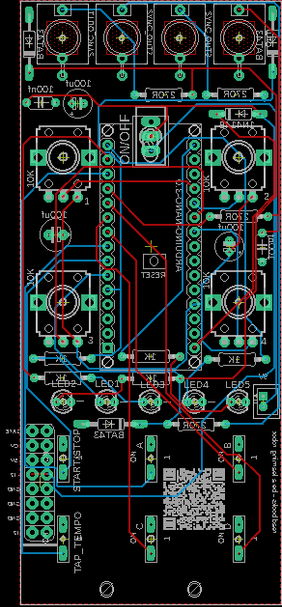
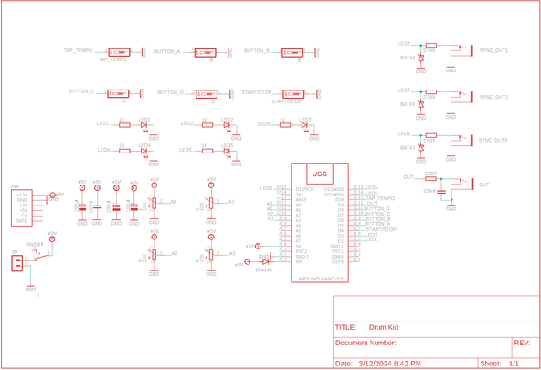
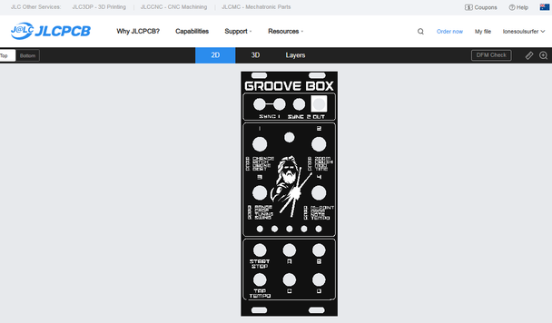
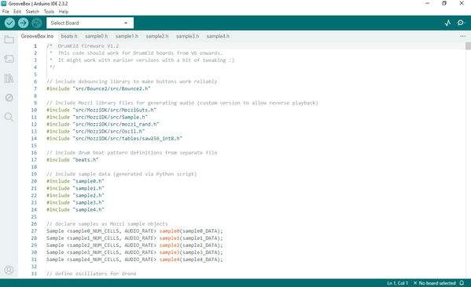

# Groove Box - Arduino Nano Drum Machine

Source: https://www.instructables.com/Groove-Box-Arduino-Nano-Drum-Machine/

---

## Introduction

In this build I recreate the awesome little drum synth called drum kid by Mattybrad. Whilst the original DrumKid had Midi in/out, I wanted a way to be able to use the drum machine as a trigger for my other recent builds. Luckily Mattybrad included a couple of LED's in the build (5 actually in total) that blink to 4/4 and 1/4 which I could tap into and use as tiggers!

I'm a total novice when it comes to coding so this solution wasn't elegant but works perfectly.

So, what the the Groove Box? Well it's a generative drum machine allowing you to control and change the drumbeat on the fly. There are a heap of effects that you can play around with and if you find a beat you like, you an save it and load it up instantly whenever you like!

The original DrumKid is a stand alone drum synth. However, I wanted my version to be able to fit into a Eurorack so have designed it to be modular. This is in line with the last couple of builds I have done which you an find below.

The plan is to build my own modular synth that anyone can make and play and have it powered by 9V's so it is portable. I've put together a small trial case just so I can get a feel for what it could look like which is what you see if the video. This will be scrapped and re-built on once I have done a couple more modules.

As always, I'm keen to get any feedback on what modules or sound effects you think I should add so please let me know in the comments.

## Supplies

I've created a parts list which can be found in my GitHub page and in the PDF file attached to this step. The PDF includes links and images of each of the parts which will make it easy to order the correct ones for this build.

PARTS:

- PCB - I've designed one for this build with the information on how to print your own in the next step
- Front Panel - The panel is also a PCB so you'll also need to get this printed as well - check out the next step
- Arduino Nano - Ali Express
- Capacitor Polypropylene 100nf X 2
- Capacitor Polarized 100uf X 1
- Capacitor Polarized 1000uf X 1
- Resistor Metal Film 10K X 1
- Resistor Metal Film 270R X 1
- Potentiometers 9mm Vertical 10K X 6
- Switch Momentary (PN SKRCADD010) X 8
- On/Off Toggle Switch Through Hole version X 1
- LED Dot Matrix (TZT MAX7219) X 1
- Female Header Pin Socket 15 Pin X 2
- Audio Socket 3.5mm (PN - PJ-301M) X 3
- Mini JST Connector and wire 2 Pin X 11

## Step 1: Getting Your Boards Printed

We all have different levels of knowledge, so when it comes to a build like this I always try my best to provide a clear step by step guide. If however, you're an old hand at this type of thing then you can probably skip a bunch of the steps.

So with that said, the first thing you will need to do is to get the front panel and PCB printed. I use JLCPCB (not affliated) to get this done. The front panel is actually just a PCB without any components included! The front design is done in a program called Inkscape (available free) and the panel including the holes is done in Fusion 360 (also free!)

ll the files that you need to build your own Groove Box can be found in my GitHub page This includes the parts list, Gerber files for the PCB & front panel, schematic, Arduino script etc.

STEPS:

- You’ll need to send the Gerber files to a PCB manufacturer like JLCPCB who will print the boards for you. Jump into the Github folder you downloaded, find the Gerber files and then send them off to your PCB manufacturer of choice. Keep them zipped as well when you send them.
- If you have no idea how to do this well, I've put together an Instructable on how to get your broads printed which you can find here.
- NOTE: The manufacture will include an order number on both the PCB and front panel. It doesn't really matter where it is on the PCB but you don't want it on the front on the front panel!
- Over at JLCPCB you can 'specify a location' once the Gerber files have been loaded so click this for the front panel and the manufacturer will add it to the back where I have indicated. You can also just hit 'No' when asked if you want to remove the order number. However, this costs $2.

## Step 2: Adding the Components Part 1

As the PCB is 2 sided, the order you add the components does matter. Of you get it wrong it's not the end of the world but it might make it a little harder to add some components

STEPS:

- As always, start with the lowest profile components, in this case it's the resistors and diodes. Its always good practice to check your resistors values before soldering in case you have to troubleshoot later on.
- I've included a mini JST connector to power the board. Solder the connecter next into place.
- You can now add the capacitors, start with the polyester caps and then add the electrolytic caps
- Now it's time to add the Arduino. I always included header pins so the Arduino is removable. It helps if you have to replace the Arduino and also allows you to program it when it isn't in the board
- Add the header pins to the Arduino and then place them into the board and solder into place
That's the first side done, next, it's time to add the controls to the reverse side

## Step 3: Adding the Components Part 2

The trickiest part here is to add the LED's. They need to be raised from the board to ensure that the tops poke out the holes in the front panel.

STEPS:

- The LED's need to sit about 10mm off the PCB. I made a little jig/spacer out of some scrap metal to ensure that they are all even and are sitting off the board.
- To find the right height of the LED's, add a couple of potentiometers into the board (don't solder then in place yet) Put an LED into the board and place the jog between the legs so the LED is resting on top of it. Place the front panel into place and have it resting on the potentiometers. If the top of the LED is showing through the front panel then your jig is the right height. Make adjustments where needed.
- Take out the potentiometers, flip the board over and with the jig in place, solder one of the LED legs. Flip over and make sure the LED is sitting straight and then solder the other leg. Do this for all 5 LED's
- Now you can move onto the momentary switches. Solder the legs into place and once done you can heat up the solder pads again and push down on the switches to make sure that they are sitting flat on the board
- Solder the on/off switch into place
- Now you can move onto the 4 audio jacks
- Lastly, solder all of the 4 pots into place.

## Step 4: Uploading the Sketch to the Arduino

If you are new to Arduino and want learn how to upload a sketch to Arduino - then check out this link. It's really straight forward and doesn't need any special tools - just a computer and a USB cord.

STEPS:

- Open the sketch in the software folder which will take you to Arduino IDE
- Connect your Arduino and upload the sketch
- There are a number of libraries that you may have to add if you haven't downloaded these already. This couldn't be simpler to do - just follow the following instructions - https://docs.arduino.cc/software/ide-v1/tutorials/installing-libraries/
- Once the sketch is loaded to Arduino you can connect it to the PCB in preparation for testing.
- You can now connect the PCB to a 9V to 12V power source and check that the groove box works. Plug a speaker in to the out jack and hit the start button. The Groove Box comes programmed already with a number of beats and you should be able to hear the first one play. Try turning the pots and see what changes you can make to the start-up beat.
- If you're not hearing anything then you might need to do some troubleshooting.

## Step 5: Adding the Front Panel

STEPS:

- The front panel has been designed so it fits perfectly onto the PCB. Carefully place the front panel so it aligns with the components and push it into place. I usually start with the on/off switch and then align the pots and LED's with the holes in the front panel.
- You may need to trim the little tabs on the pots if they have them.
- Now you can add the nuts to the pots, audio jacks and on/off switches to secure the front panel to the PCB.
- This is actually the 2nd iteration of the Groove Box, the first one had the audio jacks at the bottom which held the front panel well. However, the 2nd version I found that the front panel wasn't secured as well where the momentary switches are so I've modified the files to include a couple of M2 screws and nuts to help better secure it.
- Now that the front panel is in place you can either make an individual case you house it in or add it to your Eurorack. You can see in the images that I've included it in my little Eurorack synth.

## Step 6: How to Play the Groove Box

Playing the Groove Box is really straight forward (don't be put off by the instructions below!) You can find the full manual on how to play the Groove Box below (thanks again to Matt Bradshaw for putting these together) You can also find the instructions on my GitHub page

Inputs

There are 4 audio inputs included on the Groove Box. 2 of these are Sync outs for 4/4 time signature, 1 is 1/4 time signature and the other is Audio out.

Basic Functions

- Press the start/stop button to start or stop the rhythm
- Press buttons A/B/C/D to select different knob functions (see table below)
- Turn any of the four knobs to alter the parameters in the current selected group (see table below)
- Tap the tap tempo button repeatedly to set the tempo
- Press buttons A+B together to load a session, then choose which session to load by pressing any of the buttons (or press multiple buttons together to cancel)
- Press buttons C+D together to save a session, then choose which slot to save your session in by pressing any of the buttons (or press multiple buttons together to cancel)
- Press buttons B+C together to change the current active memory bank, then choose a specific memory bank by pressing any of the buttons
Other functions

A few extra hidden functions:

- Press buttons A+B+C together to reset your beat to default values. This will not affect any saved beats
- Press buttons A+B+D together to generate a random beat. This will also not affect any saved beats
Parameters

There are 16 different parameters which can be adjusted on DrumKid, split into four groups, with each group's four parameters controlled by the four knobs. The parameters are grouped as follows:

Group A (randomness)

- Chance
- Zoom
- Range
- Midpoint
Group B (effects)

- Pitch
- Crush
- Crop
- Drop
Group C (drone)

- Drone
- Modulate
- Tuning
- Note
Group D (rhythm)

- Beat
- Beats/bar (time signature)
- Swing
- Tempo
You can try out each parameter by starting a rhythm (using the start/stop button), then selecting a group and turning the different knobs. For example, try selecting group B (by pressing the B button) then turning the first knob, which will now control "pitch". You should hear the sound change. Below are descriptions of exactly what each parameter does, and how it can be used.

Chance - The probability of extra drum hits being generated. At zero, the beat will be completely unchanged, while for higher values there will be lots of extra events, usually creating a busier, messier beat. This can be used in conjunction with zoom, midpoint, and range to create drum fills that transition organically from a simple beat.

Zoom - Chooses which subdivision of the beat should be affected by the randomly generated extra hits. When zoom is at zero, beats will only be generated for "whole notes" (i.e. the first beat of the bar). Higher values will affect half notes, quarter notes, eighth notes, and so on. A medium value is a good place to start for zoom, but turning it up can make a beat or fill sound more "urgent". Some of the smaller subdivisions will vary depending on the current "swing" setting.

Range - This is the range of velocities which will be assigned to the random hits, and works in conjunction with "midpoint" (see below). For all the random hits to have the same velocity as each other, keep this value at zero. For a wide range of velocities, turn this up high.

Midpoint - This is the average velocity of the randomly generated hits, and works in conjunction with "range". Note that this control does allow negative values (below halfway). If you set the midpoint to maximum and have range set at zero, all the randomly generated hits will be at max velocity. Conversely, if you set it at zero, some hits will be muted. Setting it somewhere in the middle (with non-zero range) will add some random hits while reducing the volume of others. Try keeping midpoint at a three-quarters setting to add a bustling undercurrent to your beat, or turn it up briefly to create a drum fill.

Pitch - Alters the playback speed of the samples. Will play samples backwards if you turn the knob below halfway.

Crush - Reduces the number of bits used to calculate the audio output, creating a digital distortion effect. Higher values are clean, lower values are more distorted (fewer bits).

Crop - Crops the end of the samples, creating a staccato effect. Lower values are more cropped.

Drop - This control mutes some or all of the drum channels, allowing you to quickly "drop" everything except the hi-hat and snare, for example, or only retain the kick drum. Broadly, this control has "treble-y" channels at one end and "bass-y" channels at the other. The setting corresponding to all the channels being audible is somewhere in the middle.

Drone - generates a drone which can be mixed with the drum sounds. The "drone" parameter controls the amount of raw drone signal added to the mix. Turning to the left adds a single tone, while turning to the right adds two tones, a fifth apart. A halfway value mutes the drone.

Modulation - The drone can also used to modulate the audio signal from the drums, creating a robotic effect. When "modulation" is set at halfway, no effect is heard. Turning the knob to the left modulates the drums with a single drone, while turning it to the right modulates the drums with two tones, a fifth apart. Turning the knob all the way left or right creates an extreme effect, while values closer to halfway will be more subtle.

Tuning - Controls the overall tuning of the drones (both the single and fifth tones).

Note - Alter the root note of the drones, in semitone steps over an octave range.

Beat - Chooses between a series of basic underlying drum patterns (see "preset beat list" below).

Beats/bar - Alters the time signature of the beat, i.e. the number of steps in the pattern. You can have between 1 and 13 beats in a bar, or if you turn the knob all the way to the right, the time signature will be randomised at the start of each bar.

Swing - Creates a swing feel to a beat by altering the timing of certain hits. There are three settings: straight, partial swing, and full (triplet) swing.

Tempo - Alters the tempo (BPM) of the beat. Will override any tempo previously set using the tap tempo function. Has a range of 10BPM to ~1000BPM, with the "sensible" tempos grouped in the middle of the range.

Pre-set beat list

The pre-set beats can be accessed via hitting button D and turning pot 1.

Beat - Chooses between a series of basic underlying drum patterns

Please note that the LED pattern for each beat is illustrated to help you find the correct beat.

1. You can leave your hat on ⚫⚪⚪⚪⚪

2. Johnny Two-Hats ⚪⚫⚪⚪⚪

3. Drum lesson ⚪⚪⚫⚪⚪

4. Half-time rock ⚪⚪⚪⚫⚪

5. There there ⚪⚪⚪⚪⚫

6. Metal ⚫⚪⚪⚪⚪

7. Four to the floor ⚪⚫⚪⚪⚪

8. "Dance" ⚪⚪⚫⚪⚪

9. Blue Monday ⚪⚪⚪⚫⚪

10. Chime ⚪⚪⚪⚪⚫

11. Funk Soul Brother ⚫⚪⚪⚪⚪

12. Amen I ⚪⚫⚪⚪⚪

13. Amen I ⚪⚪⚫⚪⚪

14. Superstition ⚪⚪⚪⚫⚪

15. Derribar el muro ⚪⚪⚪⚪⚫

16. Hips don't lie ⚫⚪⚪⚪⚪

17. Videotape ⚪⚫⚪⚪⚪

18. Videotape (Bonnaroo) ⚪⚪⚫⚪⚪

19. Military ⚪⚪⚪⚫⚪

20. Ballad ⚪⚪⚪⚪⚫

21. Waltz ⚫⚪⚪⚪⚪

22. Take Five ⚪⚫⚪⚪⚪

23. Unsquare ⚪⚪⚫⚪⚪

24. Nihil ⚪⚪⚪⚫⚪

---
*33 images archived*
