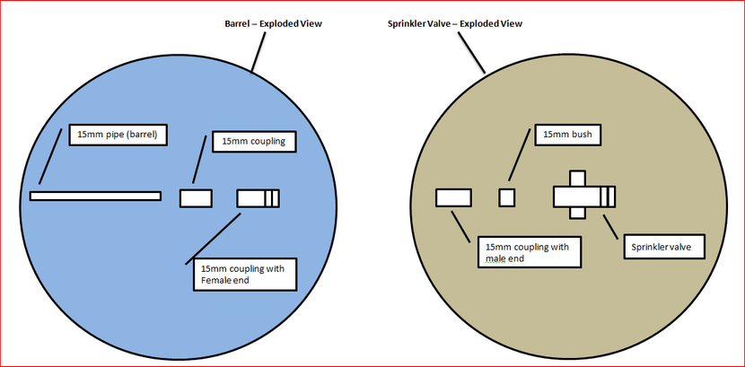

# Hand-held Compressed Air Gun/Launcher

Source: https://www.instructables.com/Hand-held-Compressed-Air-GunLauncher/

---

## Introduction

## Step 1: Step - 1. Things to Gather

Materials

Gun
1. PVC pipe and connections
2. PVC pressure pipe 40mm (length 600mm)
3. PVC pressure pipe 15mm (length 600mm)
4. Coupling 40 x 25
5. Coupling 20 x 15 (other end of pump)
6. 40mm Cap (for handle)
6. Bush 40mm to 20mm
8. PVC Tee 40mm
9. PVC Press Faucet Socket #18 20p x 20 female
10. Bush # 5 - 40p x 25p
11. Bush # 5 - 25p x 20p

	Other Bits
	
	1. Small hand pump
	2. Sprinkler valve
	3. plumbers tape
	4. 2.PVC Pressure cement
	
	Tools
	
	1. Drop saw
	2. Hot glue gun
	3. Black matt spray paint

## Step 2: Step - 2 Design

The drawing below shows an exploded view of the air gun.  It makes it a lot easier to understand how all of the bits go together.

The best advice that I can give to you is to make sure you have all the correct parts before you start.  You might have to change some of the dimensions to suit your hardware.  You might have to use a different sprinkler valve or pump depending on what you can get your hands on.

## Step 3: Step - 3 Let's Get Started

The first thing that I started on was the part of the air chamber that fits into the sprinkler valve.

1. Gather the parts below together

2. Cement the small bush into the adapter

3. Cement the small bush into the larger bush

4. Cement the adapter and bush into the 40mm pipe

## Step 4: Step 4 - Preparing the Sprinkler Valve and Attaching.

For those who don't know what a sprinkler valve is - here's the low down.  The valve is used in sprinkler systems that use a timer that switches on the system periodically.  The valve itself has a relay which opens as soon as a current is activated.  The valve opens virtually instantaneously so the air compressed inside the chamber is released in one huge rush.
	
	
	1. On the valve that I purchased I needed to remove the flanged end to enable the 15mm adapter to be attached.  I used a grinder to remove this.
	
	2. There is also a small metal filter in the other end of the sprinkler valve.  I also removed this to allow for better air flow.
	
	3. Next wrap some plumber’s tape around the thread to ensure an air-tight fit.
	
	4. Install the sprinkler valve into the first part of the air chamber you just built.

## Step 5: Step 5 - Attaching the Tee Section

Next thing to do is to add the "Tee" section.  This is used as the handle and also adds an extra air chamber.

	
		Cement in the first part of the air chamber that you just built into one of the ends of the tee.
	
		 
	
		Cut a 100mm piece of 40mm pipe and cement this into the bottom of the tee.  This is your handle.
	
		 
	
		Cement into place the 40mm cap

## Step 6: Step 6 - Adding the Rest of the Air Chamber and Pump

Next is to add the rest of the air chamber and air pump.  Make sure you don't get a too cheap a pump, the first one I used was from a $2 shop and leaked.

1. Cement in the 220mm piece of 40mm pipe to the other end of the tee.

2. Cement onto the end of the 40mm pipe the 40 x 25 coupling.

3. Cement the end of the pump into the 25mm end of the coupling.  The size of this coupling will depend on the size of the hand    pump you get.  A good idea is to purchase your air pump and take this into the hardware store to make sure you get the right size coupling.  The pump that I used was a small ball pump.~

## Step 7: Step - 7 Making Barrels to Attach to the End.

I wanted the barrel to be removable so I came-up with a system where I could screw different size barrels into the end of the sprinkler valve.  I only came up with this system after I made the gun, you can just stick a barrel on the end and be done with it but if you want to shoot different things out of your gun, I suggest doing the next few steps.

1. Gather the following parts:

- 15 bush (this goes onto the sprinkler valve)
- 15mm coupling (one for each barrel)
- 15mm coupling with male end (one for each barrel)
- 15mm coupling with female end (this goes onto the sprinkler valve)
- 15mm pipe (barrel)
- 20mm pipe (barrel)
- 15mm x 20mm coupling (used to add the 20mm barrel)

Steps

1. Cement the 15mm bush to the sprinkler valve

2. Cement the 15mm female to the bush.

3. Cement the 15mm male coupling into the 15 mm coupling

4. Cement the combine 15mm male/coupling into the barrel

	Now your ready to screw the barrel into the sprinkler valve.

## Step 8: Step 8 - Attaching the Trigger and Battery

Next and final thing to do is to attached the safety swich, trigger swich and battery.  I had some problems working out how to attach the trigger swich initally, but after some hard thinking I came up with the idea below.  Ideally I think it would have been better to have the battery inside the handle, the swich then could have been directly attached to the handle itself which would have saved alot of time.

	
		gather together the parts below.

	- 9 volt battery
	- momentary switch
	- on/off stitch
	- project box
	- some wire
	- cable ties
	- 15mm bush
	
	2.     The first thing to do is to add the momentary switch to the handle.  To do this I glued the switch into a 15mm bush and wired some wires on each of the terminals.  Next I made a couple of slits in the end of the bush so I could put a cable ite through them and attach it to the handle.
	
	3.    Add an on/off switch to the project box.
	
	4.   Next thing to do is to wire the spinkler valve, switches and battery altogether.  Below is a diagram so you can see how this is done
	
	5.   Cable ite the project box to the gun.
	
	THAT'S IT!  Now it's time to make the projectiles :)

## Step 9: Step 9 - Shooting Stuff

What next?

So hopefully you have now been inspired and want to build your own. I have tried to give you as much detail as possible but this is really just a guide. You might not be able to find the exact same parts but this ible' should help you on your way to making one wicked air compressed gun.

What I would have done differently?

- I would have liked to have put the battery on/off switch and momentary switch in the handle and would have hid the project box.
- Adding the bush to the end of the sprinkler valve worked ok but it would have been better to have found something that fitted better. The barrel is just the slightest bit bent because the bush doesn't sit flush on the valve
- Putting the momentary switch in a 15mm coupling worked well but I would have liked this to have sat flush against the handle. This would have meant cutting 2 sides of the end of the coupling with slight curves. I did try to do this but its not flush.

So that’s it. Enjoy and remember to be safe - this is a weapon after all.

## Step 10: Step 10 - Making Paper Rockets

These rockets sound like they blow apart as soon as some compressed air is passed through them.  This couldn't be farther from the truth.  If you make the rocket right they become very stable, light and strong. I did make a video on how to make one but izzy darlow design on Instructables is far superior   The only change that I made was to make bigger fins (check out the PDF file for images of the larger fins.  Also check out the youtube clip below.  It's a pretty damn good explanation on how to make them too.

	

Things to gather:
1.     A4 paper
2.     Tape (I used masking tape for my rocket)
3.     Scissors
4.     Pen
5.     Ruler

Notes:
- Make sure that the rocket isn't too tight fitting around the barrel.  The smoother the better.
- Make the nose-cone strong.  This is the part which will take the most damage.
- Don't forget about the cap at the top of the rocket where the nose cone goes.  Without this the rocket will most likely break at the join.

To see the rocket in action check out the YouTube clup at the start of the instructable.

large fin design.pdfDownload

## Step 11: Step 11 - Plastic Bullets

Ok so I did get a bit bored with paper rockets - as fun as they are.  I decided to take it to the next step and make a bullet out of some plastic pipe and a rubber cork.  The pipe itself is from a halloween pitch fork handle, the plastic pipe fitted perfectly down the barrel.  The rubber cork can be easily brought from anyone store that sells rubber and foam products.

so here's what I did.
1.    First I found some pipe that fitted perfectly down the barrel.  I was lucky enough to find some at a bargain store selling halloween products, one which was a pitch-fork with a plastic pole!
2.    Next I cut the pipe in different lengths and tried various ones to see which would work the best.  I found That a peice of pipe about 150mm worked best as it was stable and went the furthest.
3.    Next a got some rubber corks and stuffed one down the end of the pipe.  Make sure that the cork is right down in the pipe so when put into the end of the barrel the fit makes the bullet just stick.  This will eleviate the friction which will make your bullet go further.

Check out the YouTube clip at the start of the Instructable to see it in action.

## Step 12: Setp 12 - V2 Bigger and Better

So my original gun finally gave up the ghost after the pump fell apart.  I thought that this would be a good time to do some updates so here's what I did:

Batteries - Instead of having a cable-tied box on the gun itself, I now have them in the handle.  It was a little tricky but you can see from the PDF image below how I managed to do it.  It also has 2 9v batteries instead of just one.  I was finding that if I put too much pressure in the air chamber the sprinkler wouldn't activate.

Pump - I used a much better quality pump this time and have also made it removable so when it finally fails I can just replace it.

Sprinkler Valve - I un-did the valve and turned it around so the wires were facing down the gun and not going sideways (see image)

Images to come soon.

Gun V2.pdfDownload

---
*60 images archived*
