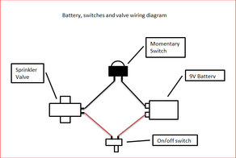

# Hand-held Compressed Air Gun/Launcher

Source: https://www.instructables.com/Hand-held-Compressed-Air-GunLauncher/

---

## Introduction

## Step 1: Step - 1. Things to Gather

Other Bits

1. Small hand pump
2. Sprinkler valve
3. plumbers tape
4. 2.PVC Pressure cement

Tools

1. Drop saw
2. Hot glue gun
3. Black matt spray paint

## Step 2: Step - 2 Design

## Step 3: Step - 3 Let's Get Started

## Step 4: Step 4 - Preparing the Sprinkler Valve and Attaching.

For those who don't know what a sprinkler valve is - here's the low down.  The valve is used in sprinkler systems that use a timer that switches on the system periodically.  The valve itself has a relay which opens as soon as a current is activated.  The valve opens virtually instantaneously so the air compressed inside the chamber is released in one huge rush.

1. On the valve that I purchased I needed to remove the flanged end to enable the 15mm adapter to be attached.  I used a grinder to remove this.

2. There is also a small metal filter in the other end of the sprinkler valve.  I also removed this to allow for better air flow.

3. Next wrap some plumber’s tape around the thread to ensure an air-tight fit.

4. Install the sprinkler valve into the first part of the air chamber you just built.

## Step 5: Step 5 - Attaching the Tee Section

- Cement in the first part of the air chamber that you just built into one of the ends of the tee.
- Cut a 100mm piece of 40mm pipe and cement this into the bottom of the tee.  This is your handle.
- Cement into place the 40mm cap

## Step 6: Step 6 - Adding the Rest of the Air Chamber and Pump

## Step 7: Step - 7 Making Barrels to Attach to the End.

Now your ready to screw the barrel into the sprinkler valve.

## Step 8: Step 8 - Attaching the Trigger and Battery

- gather together the parts below.
- 9 volt battery
- momentary switch
- on/off stitch
- project box
- some wire
- cable ties
- 15mm bush

2.     The first thing to do is to add the momentary switch to the handle.  To do this I glued the switch into a 15mm bush and wired some wires on each of the terminals.  Next I made a couple of slits in the end of the bush so I could put a cable ite through them and attach it to the handle.

3.    Add an on/off switch to the project box.

4.   Next thing to do is to wire the spinkler valve, switches and battery altogether.  Below is a diagram so you can see how this is done

5.   Cable ite the project box to the gun.

THAT'S IT!  Now it's time to make the projectiles :)

## Step 9: Step 9 - Shooting Stuff

## Step 10: Step 10 - Making Paper Rockets

- [large fin design](pdfs/large fin design.pdf)

## Step 11: Step 11 - Plastic Bullets

## Step 12: Setp 12 - V2 Bigger and Better

- [Gun V2](pdfs/Gun V2.pdf)

## Downloads

- [large fin design](pdfs/large fin design.pdf)
- [Gun V2](pdfs/Gun V2.pdf)

---
*61 images archived*
