# How to Build Your 1st Circuit

Source: https://www.instructables.com/How-to-Build-Your-1st-Circuit/

---

## Introduction

Building your own circuits can seem like a daunting task. Circuit diagrams look like hieroglyphics and all those electronic parts make absolutely no sense.

I have put this Instructable together to hopefully help and guide you to ultimately build your own circuits. The 10 tips in this Instructable are ones that I have picked-up over the years through much trial and error. I’m no expert (the great thing is you don’t have to be an expert to learn how to create circuits!) so please don’t expect this Instructable to be a complete guide. Rather, I hope it’s used to help anyone who is interested in learning about electronics and circuits, to pick up a soldering iron and get started.

Please feel free to add any comments or tips that you may have in comments section.

Note: gifs don't work too well when there is something flashing so it's a little hard to show the circuit in action.

## Step 1: Get the Right Tools

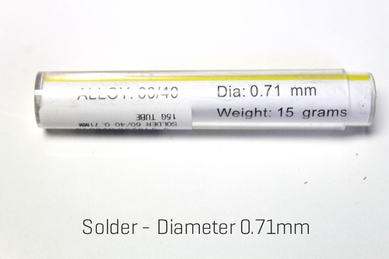

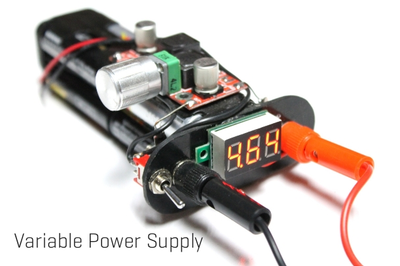

The great thing about getting started in electronics is you don’t need a lot of tools. All you pretty much need is a soldering iron and you are away. However, there are a few other tools which come in handy and will help you build circuits easily

Soldering Iron

The best advice that I can give you about soldering irons is – don’t go too cheap! Buy something half decent. The soldering Irons below would be fine to use

[Soldering Iron 1](https://www.ebay.com.au/itm/NEW-Soldering-Iron-Station-Kit-Desoldering-Pump-Helping-Hand-Adjustable/331785709074?epid=13012810259&hash=item4d3ff82612:g:C1UAAOSwuAVWyAwZ:sc:AU_StandardDelivery!3796!AU!-1:rk:2:pf:0)

[Soldering Iron 2](https://www.amazon.com.au/Yescom-Soldering-Station-Digital-Welding/dp/B075LHQXC9/ref=sr_1_1?ie=UTF8&qid=1539219830&sr=8-1&keywords=soldering+iron)

The cheap ones take ages to heat up and you can’t control the heat so they usually aren’t hot enough. One with temperature control will give you a lot more control, especially with solder flow and heat.

Solder

I know that that this might be self evident but you can't solder without solder. I find it best to use a thin solder as it gives me more control. The solder I use is 0.71mm thick and can be purchased from [eBay](https://www.ebay.com.au/itm/0-71mm-Duratech-Solder-Hobby-Tube/253719307445?epid=1740024783&hash=item3b12d964b5:g:t6IAAOSwjE1bts-O:sc:AU_StandardDelivery!3796!AU!-1:rk:12:pf:0). Anything similar size will do the trick.

Variable Power Supply

When prototyping on a breadboard your circuit, being able to have power is adjustable is very handy. You can buy a variable power supply for pretty cheap or just make your own which I did.

Tip - At a pinch you can also just use a 9v battery and for your power supply as well

[Buy one](https://www.ebay.com.au/itm/DC-Power-Supply-30V-10A-Precision-Variable-Digital-Lab-Adjustable-with-Cable/382586590061?epid=812153397&hash=item5913f0136d:g:H7MAAOSwdjdaA7g9:rk:9:pf:0)

[Make your own](https://www.instructables.com/id/Portable-Variable-Power-Supply-1/)

3rd Hand

If you have ever tried to solder 2 wires together, you will know how hard it is to keep them both aligned. A 3rd hand is literally a helping hand, usually in the form of a couple of alligator clips. These then can hold one of the wires (or any other electrical part) whist you tin (more of that later) and connect the parts together.

A 3rd hand isn’t essential but it will make the job a hell of a lot easier. You can make your own pretty easily like I did. ([ible’ here](https://www.instructables.com/id/DIY-Flexible-Soldering-Helping-Hand/)) or just [buy one](https://www.ebay.com.au/sch/i.html?_from=R40&_trksid=p2334524.m570.l2632.R3.TR7.TRC2.A0.H1.Xthird+hand+.TRS0&_nkw=third+hand&_sacat=182941&LH_TitleDesc=0&_osacat=0&_odkw=helping+hand&LH_TitleDesc=0)

Wire Snips (or a pair of small, sharp scissors)

The first thing you will notice when you start to solder and build your own circuits is you trim off a lot of wire legs and wires. Having a good pair of snips or scissors will ensure that when you trim the legs, they are cut close to the solder point and will help stop short circuits.

## Step 2: Get the Right Tools

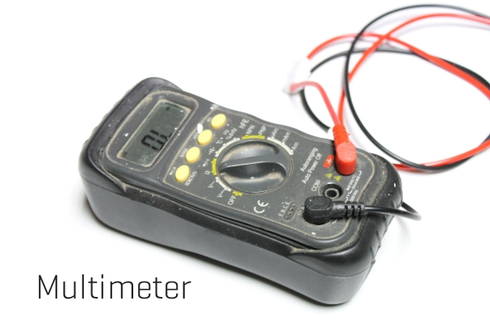

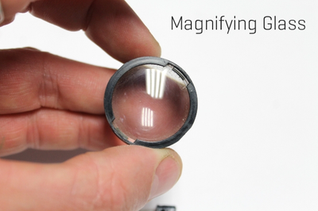

Multi-meter

You really can't live without one of these when you are building circuits. They can measure power in a battery, check the rating of a resistor (very handy), and capacitors and a whole bunch of other things. Grab yourself one and learn how to use it (it's not hard)

[This would be a perfect one to use](https://www.ebay.com.au/itm/Digital-LCD-Multimeter-Voltmeter-Tester-Ammeter-DC-AC-OHM-Auto-Range-8233D-PRO/253837583726?hash=item3b19e6256e:rk:1:pf:0)

Organisers

Actually, the electronic components don’t take up much room, it’s the organising them that is important. There are a lot of different values of resistors, capacitors etc and mixing them together will send you bonkers.

The best thing to do is to have some way to organise the parts so they are easy to find and in some order. At the moment I’m storing my resistors on a container but as they come in strips, this usually is ok. Capacitors on the other hand are usually loose so I keep these in parts bins same with all the odd parts as well.

A Place to Work

Try if you can to have a dedicated space to work in. Having all of the parts and tool close to hand will make the job so much easier. I use an old desk which I have parts bins close to hand and everything organised (well I know where everything is!) Nothing more frustrating trying to find some small part to finish off a project and you have no idea where it is!

However, the great thing about circuit building is you can do it on the kitchen bench! Just make sure that either your organisers are portable or just grab the parts you need and get soldering.

Other Tools That Aren’t Necessary But Come in Handy!

Tweezers - These can help you hold wires etc whist trying to solder in difficult places

Magnifying Glass – I use a lens from an old camera! A magnifying glass will allow you to check the soldering closely and make sure you haven’t bridged any solder points or connected anything that shouldn’t be connected together.

That's pretty much all of the tools you will need to get started.

## Step 3: What Parts You Need to Get Started

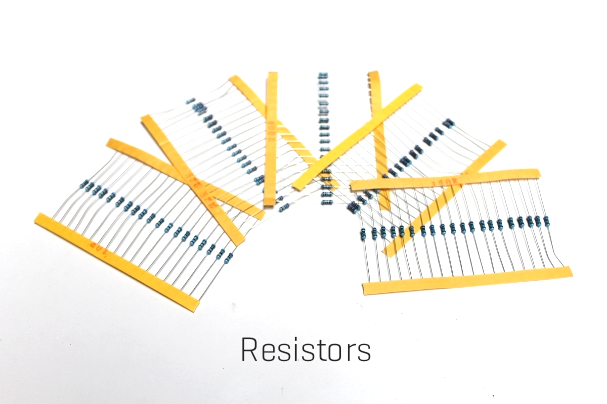

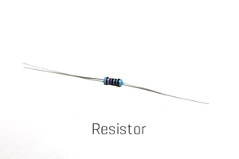

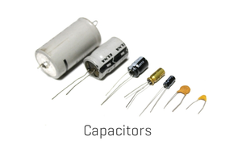

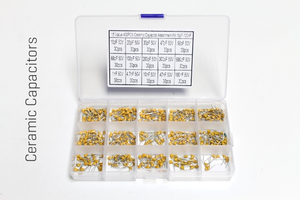

I won’t be going through any in depth descriptions on what each part does and how it works in this ‘ible. I will be however, recommending what electronic parts you should get to start building your first circuits. The great news is, the parts are dirt cheap, easy to get, and you don’t need many types of parts (just many varieties of the same types!).

The other way to get your hands on electronic parts is from used electrical goods. Anything from a video player to a kid’s toy holds treasures inside. Make sure that you pull these old goods apart next time and get out anything that might be useful in builds. Usually I find LED’s motors, wires, audio jacks and a heap of other parts that can be used in your circuits.

Here's my list of electronic parts to get you started

Resistors

So what are these things called resistors? Well basically they add resistance to current flow through a circuit. They can also be used to reduce the voltage as well. Resistors come in a range of “resistance” values which are calculated in Ohms ( Ω ). You can use a multimeter to read the value of the resistor and I find this the easiest way. The coloured bands also can be used to calculate the Ohms as well. Resistors are one of the main electrical parts you will use in a circuit.

The best way to buy these is in [assorted lots](https://www.ebay.com.au/itm/600pcs-30-Kinds-Each-Value-Metal-Film-Resistor-Pack-1-4W-1-Resistor-Kit-Set-Lot/192254900545?_trkparms=aid%3D555018%26algo%3DPL.SIM%26ao%3D1%26asc%3D20140106155344%26meid%3D8924b5af1b63406983d0fc3920cd358e%26pid%3D100005%26rk%3D2%26rkt%3D3%26sd%3D292747747795%26itm%3D192254900545&_trksid=p2047675.c100005.m1851). You can get these on eBay or Ali Express

I recently put together an 'ible on how to store and organise your resistors which can be [found here](https://www.instructables.com/id/Resistor-Organizer-and-Storage/)

[Check out this website](https://www.explainthatstuff.com/resistors.html) for a more comprehensive overview of the resistor

Capacitors

Capacitors are the other main part in most circuits you build. Basically, they are like little temporary batteries that can store an electrical charge. The size of the charge depends on the size of the capacitor. Some are very small whist others can hold enough charge to do some serious damage to you. The charge is used to smooth out current fluctuations, maintain power supply, noise filters – the list goes on.

Capacitors come in two different types; ceramic, which are usually small and don't have a polarity, and electrolytic which are larger and have a polarity.

[Check out this website](https://www.explainthatstuff.com/capacitors.html) for more information on how a capacitor works

Sometimes capacitor values are represented in different ways. The small, ceramic caps have a number on them, while other times you will see a value which is in a value not on the cap. The attached chart will help identify them for you. You can also find the same [chart here](https://www.justradios.com/uFnFpF.html)

You can also buy these in assorted lots. Best to buy both types - [ceramic capacitors](https://www.ebay.com.au/itm/450pcs-10Value-50V-10pF-100nF-Ceramic-Capacitors-Assortment-Assorted-Kit-Box/163087715384?hash=item25f8c90c38:rk:1:pf:0) and [electrolytic capacitors](https://www.ebay.com.au/itm/120pcs-1uF-470uF-12-Types-Electrolytic-Capacitors-Assortment-Kit-Assorted-Set/351774763287?epid=2113501882&hash=item51e768e917:g:knwAAOSwSwpbaUUR:rk:3:pf:0)

## Step 4: What Parts You Need to Get Started

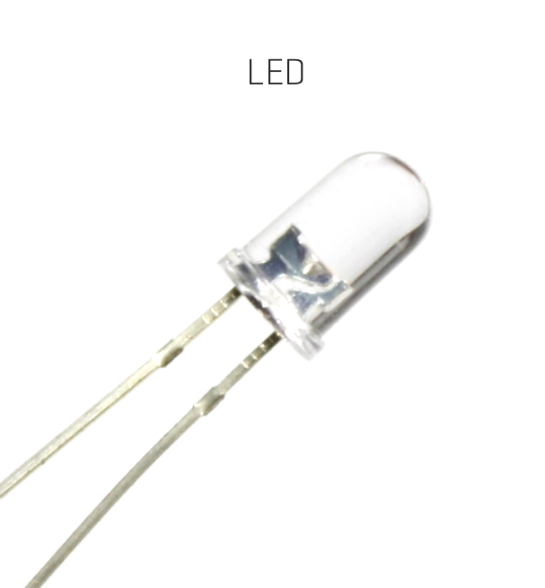

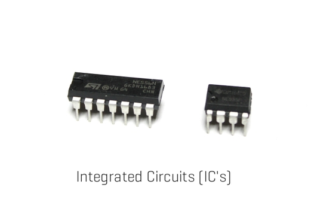

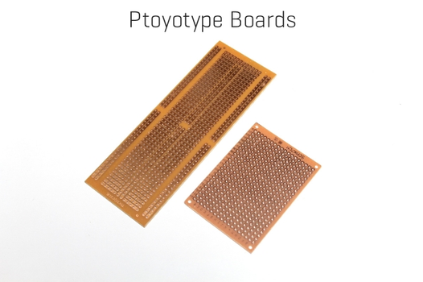

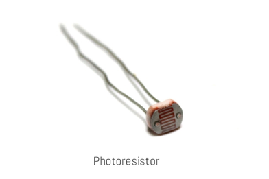

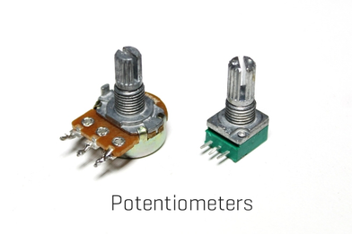

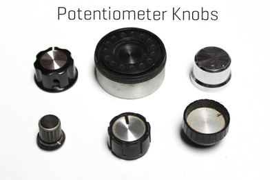

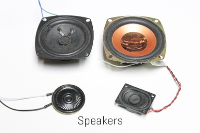

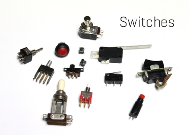

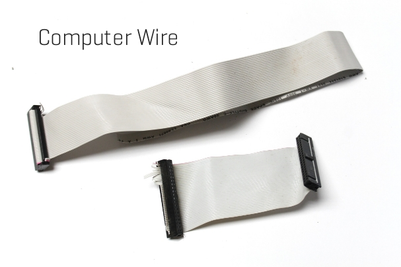

LED’s

LED’s are great to play around with and there is plenty of information on-line about them so I won’t go through how they work. I will mention though that they have a polarity so one leg is positive and one negative. There are 2 ways to determine which is which. First, the LED itself has a small cut-out at the rim of the LED. The leg under this cut-out is the negative one. Also the negative leg is slightly shorter than the positive which make the polarity identification very simple

The other great thing is they are super cheap and come in multiple colours! You can pick-up a 100 of them for a couple of dollars.

[eBay have plenty of them](https://www.ebay.com.au/itm/300-Pack-LED-Diode-3mm-5mm-LED-Lights-Emitting-Diodes-Assorted-Clear-Bulbs-R1E4/282904138367?epid=2282666457&hash=item41de66927f:g:gxEAAOSwUUxavKGQ:rk:7:pf:0) available

Integrated Circuits (IC’s)

These are the brains of your circuits. To start with buy the following ones.

[555 Timer](https://www.ebay.com.au/itm/10-20-50-100-PCS-NE555P-NE555-DIP-8-SINGLE-BIPOLAR-TIMERS-IC/302152230012?hash=item4659ad247c:m:m0J3yUXSmG3OKjaZZGJ-W3A:rk:8:pf:0)

[386 Op Amp](https://www.ebay.com.au/itm/10PCS-IC-LM386N-LM386-AMP-AUDIO-PWR-MONO-8DIP-GOOD/232451320090?hash=item361f2da91a:g:cI8AAOSwhYZZlP2z:rk:6:pf:0)

These will allow you to build a whole gamut of circuits and will keep you busy for ages. I will be using a 555 timer in another tip to show you how to build your own circuit

Prototype Boards

Super important as they are what you build the circuit onto. There are many different types but I like to use these ones which you can [buy from eBay](https://www.ebay.com.au/itm/10x-DIY-Prototype-Paper-PCB-Experiment-Board-Bakelite-Circuit-Board-4-8x13-3cm/142759746052?hash=item213d24da04:g:sFUAAOSwcEha0XL3). They make connecting Integrated Circuits and other parts a breeze

Photo Cells (CdS Photoresistor)

These are pretty much resistors but are controlled by the amount of light in the room! Very cool when you want your circuit to react to the environment

[buy from eBay](https://www.ebay.com.au/itm/20PCS-Photo-Light-Sensitive-Resistor-Photoresistor-Optoresistor-5mm-GL5528/301924802087?hash=item464c1ede27:g:72EAAOSwoydWl5pr:rk:1:pf:0)

Potentiometers

These are also resistors but you can adjust the resistance allowing you more control over your circuit. Like resistors, they come in different resistance values

You can buy them easily [on eBay](https://www.ebay.com.au/sch/i.html?_from=R40&_trksid=p2334524.m570.l1313.TR11.TRC1.A0.H0.Xpotentiometer.TRS0&_nkw=potentiometer&_sacat=0&LH_TitleDesc=0&_osacat=0&_odkw=potentiometers+mixed&LH_TitleDesc=0)

Potentiometer Knobs

Ok so these aren't essential but they are handy and make turning the potentiometer a lot easier. Most of the ones that I use come from old electronics but they can also be purchased [cheaply on eBay](https://www.ebay.com.au/itm/5Pcs-Aluminum-Potentiometer-Knob-6mm-Cap-Inner-Volume-Control-Rotary-Switch/142387618833?hash=item2126f6a411:m:mk-CmZeKA1QScajKjWmkeAQ:rk:3:pf:0)

Speakers

I pull most of mine from old toys. However, you can buy 8 ohm 0.5W ones on eBay for cheap and these will work for most projects you build which have sound.

[eBay](https://www.ebay.com.au/itm/2-Pcs-8ohm-Loud-Speaker-8-0-5W-Small-Trumpet-36mm-Diameter-AU-NEW/302106509576?hash=item4656f38108:g:i84AAOSwZJBYAJFX:rk:9:pf:0)

Switches

There are a heap of different types of switches believe of or not. It would take too long to go through all of them and what they do so here are 2 you can’t live without.

[Tactile Switch](https://www.ebay.com.au/itm/10-Values-180PCS-Tactile-Push-Button-Switch-Mini-Momentary-Tact-Assortment-A7I2/253253341261?hash=item3af713504d:g:tzUAAOSwjodaBo0J:rk:3:pf:0)

[SPDT](https://www.ebay.com.au/itm/5pcs-AC-125V-6A-3-Position-3Pin-SPDT-ON-OFF-ON-Micro-Mini-Toggle-Switch-TE460/232164669648?hash=item360e17b8d0:g:84EAAOSwcSFbMY9L:rk:7:pf:0) (Single Pole, Double Throw) switch

Battery Holders

Most of the circuits use 9V batteries so just grab a couple of these from [eBay](https://www.ebay.com.au/itm/1PCS-9V-Volt-PP3-Battery-Holder-Box-DC-Case-With-Wire-Lead-ON-OFF-Switch-Cover/222002032508?hash=item33b05a2f7c:g:uZ0AAOSw7PBTm86G:rk:20:pf:0) to start with

Wire

I scavenge mine from old computer cables or cords or wherever I can find it. You can find plenty of wire at dumps and tips that have e-waste. The best wire to use is thin wire so computer cables work great. If you can't find any, then use this wire from eBay

## Step 5: Breadboard Every Circuit First

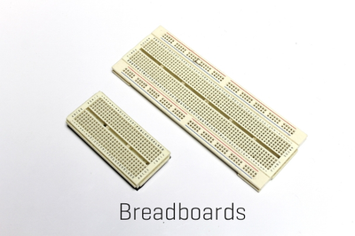

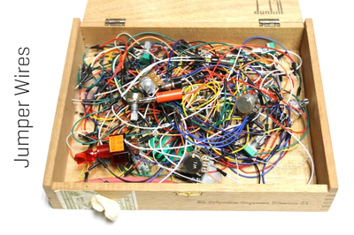

No circuit should be attempted until you have built it on a breadboard first. A breadboard is used to prototype your circuit before you start to solder. It’s the first step in making a circuit and should always be done.

So what is a breadboard? Well it’s a piece of plastic with a bunch of holes in it which are connected inside by copper. You can then stick the legs of IC’s, Capacitors, resistors etc into the holes and make connections. This allows you to build a circuit without soldering and is also great for experimenting.

The holes are aligned in horizontal and vertical rows. Check out the images below to help you visualise how the copper in the holes is aligned. It can be confusing the first time you use a breadboard but after a couple of builds it will become clearer.

Tip a good way to visualise how the connections are made on the breadboard is to look at the below prototype board. This is set-up exactly the same way as the breadboard but with out the plastic so you can see the connections.

Later on in this Instructable I’ll be building a simple circuit and will go through how to add parts to a breadboard.

[Breadboard to buy](https://www.ebay.com.au/itm/Mb-102-830-Point-Solderless-Prototype-PCB-Breadboard-65-bread-board-jumping-line/272750754063?hash=item3f8136390f:rk:1:pf:0)

[Jumper wires to buy](https://www.ebay.com.au/itm/65PCS-Male-to-Male-Solderless-Breadboard-Jumper-Cable-Wires-Kit-For-Arduino/282377647819?hash=item41bf04f6cb:g:X6MAAOSwVGhZiXun:rk:53:pf:0)

## Step 6: Start Simple When Building Your First Circuits

It might be tempting to just jump in the deep end and start on a circuit that is complex and needs a lot of parts. My first try in building a circuit was a lightning detector and it was so frustrating that I gave it all up and didn’t try again until a couple years later.

The best place to start building circuits is with the 555 IC. If you want to do a deep dive on this versatile IC, then check out the below links

There are literally 100’s of projects on line using this IC, from simple synths and blinking LED’s to Police siren and LED chaser circuits. The attached circuits are just a few of the easier ones. Give some of these a try once you have built the first circuit in this 'ible and once you are confident building simple circuits, you can move onto more complex ones.

50 X [555 Projects](http://www.talkingelectronics.com/projects/50%20-%20555%20Circuits/50%20-%20555%20Circuits.html)

other [555 Projects](https://www.google.com.au/search?q=555+projects&safe=active&rlz=1C1GCEA_enUS807US807&source=lnms&sa=X&ved=0ahUKEwiQ68nvzP3dAhWJgLwKHUZ2AKsQ_AUICSgA&biw=1920&bih=920&dpr=1)

## Step 7: Learn What the Circuit Diagram Symbols Mean

Looking at a circuit diagram you will notice that there are a lot of symbols. These represent all the different types of parts needed to build the circuit. Some are pretty straight forward while others are more symbolic and need to be learnt.

Attached are the some of the main symbols that you will come across whist learning to build circuits. Take some time to become familiar with the different symbols that you may come across building your first circuits.

Please note that there are many more symbols which aren’t included on this list that I have provided. You’ll also come across variants of these symbols which will in most cases mean the same thing but could also represent a different configuration.

I have attached an example of this which I usually find on Potentiometers. This can be a confusing one due to the fact that the actual potentiometer has 3 legs and depending on the application, either 2 or 3 legs are connected to the circuit.

To learn more about how to read symbols - [check out this link](https://learn.sparkfun.com/tutorials/how-to-read-a-schematic/schematic-symbols-part-1)

Check out [this link](https://www.electronicshub.org/symbols/) also for more details

## Step 8: Learn to Read a Circuit Diagram

The first circuit I recommend you to build is a flashing LED. The circuit diagram is the first image.

I will take you through step by step how to read the circuit and breadboard it. Later, I’ll go through how to breadboard and experiment with the circuit to get different effects from the LED.

First though lets breakdown this diagram to understand it better. I have added images to help you visualise each section that I am talking about.

Legs 1 and 2 on the 555 Timer

1. First is to understand how the 555 timer is orientated. If you look at the second image you can see that there is a small, half-moon mark on the IC. This is the front of the IC and will allow you to work out how the legs are numbered and how to orientate it into the bread board

2. You will see that there are different components attached to each of the numbered legs. I’ll go through each of these starting with leg 1 on the 555 timer and working around to leg 8. It’s good to start building the circuit the same way in the breadboard

Leg 1

1. Leg 1 on the 555 is connected to ground which is the negative end of the battery. This leg is pretty straight forward

Leg 2

1. Leg 2 on the 555 though looks a little more complex but isn’t really.

2. The first thing you will notice is 2 and 6 look like they are connected. That’s because they are! When building the circuit you will need to connect these 2 legs together

3. Next, you can see that the connection from pin 2 splits into 2. All this means is you need to add 2 different components to leg 2, one a capacitor and one a resistor. The capacitor is connected to ground like pin 1.

4. The resistor you can see is connected between pins 2 and 7. But wait – pins 2 and 6 are joined so if you wanted to you could place the resistor between pins 6 and 7 and this would be exactly the same

## Step 9: Learn to Read a Circuit Diagram

Leg 3

1. Leg 3 has 2 components attached to it, one a resistor and the other an LED.

2. If you follow the connection from leg 3 you can see it joins onto a resistor and that resistor connects to the LED. You need to make sure that the LED though is in the right polarity. You can tell what that is by the symbol for LED. The negative end then is connected to the resistor.

3. The other leg of the LED (The positive leg) is connected to the positive section of the battery

Leg 4

1. This is an easy one – you can see that it is connected to the same section as the positive leg from pin 3 so pin 4 needs to be connected to positive

Leg 5

1. As there is no “5” indicated on the diagram – this means that it isn’t connected to anything

Leg 6

1. This is already connected earlier to pin 2 so you don’t have to worry about this one either

Leg 7

1. Leg 7 has 2 connections, one that you did earlier with a resistor to leg 6 and another that connects to the potentiometer

2. The potentiometer has 3 solder points and can be confusing when you first come across them. The circuit diagram only shows 2 connections so what do you do with the other solder point on the potentiometer? Most of the time nothing, you just leave this as is.

3. You need to attach one of the side legs on the potentiometer to leg 7 and the middle leg on the potentiometer to positive

Leg 8

1. Another easy one – this is connected to the same section as leg 4 – so connect pin 8 to positive

That’s it! You can see that once you break it down it’s pretty easy to understand. The next step is to build one in a breadboard

## Step 10: Breadboarding Your First Circuit

Now that you can hopefully follow the diagram, it’s now time to breadboard. Along with the breadboard you will need your jumper wires (to make all of the connections), and you will also need to solder a couple of the jumper wires to the potentiometer. This will allow you to plug it into the breadboard for testing.

Parts

555 Timer - [eBay](https://www.ebay.com.au/itm/10-20-50-100-PCS-NE555P-NE555-DIP-8-SINGLE-BIPOLAR-TIMERS-IC/302152230012?hash=item4659ad247c:m:m0J3yUXSmG3OKjaZZGJ-W3A:rk:8:pf:0)

Resistors - 10K and 3.3K - By in assorted lots - [eBay](https://www.ebay.com.au/itm/1500-Pcs-75-Values-1-ohm-10M-ohm-5-1-4W-Carbon-Film-Resistor-Assorted-kit-W1K7/153205593054?epid=888020991&hash=item23abc3d3de:g:Ey0AAOSwuPZbteoq:rk:10:pf:0)

Capacitor - 10uf 0 By in assorted lots - [eBay](https://www.ebay.com.au/itm/120pcs-1uF-470uF-12-Types-Electrolytic-Capacitors-Assortment-Kit-Assorted-Set/351774763287?epid=2113501882&hash=item51e768e917:g:knwAAOSwSwpbaUUR:rk:10:pf:0)

Potentiometer [100K](https://www.ebay.com.au/itm/5pcs-Single-Mono-Linear-Potentiometer-Rotary-100K-for-Arduino/142833025445?hash=item21418301a5:g:IO4AAOSwdrlbI5Ul:rk:12:pf:0) - [eBay](https://www.ebay.com.au/itm/2PCS-10K-Ohm-B10K-Knurled-Shaft-Linear-Rotary-Taper-Potentiometer/232907425079?hash=item363a5d4537:g:HyUAAOSwe09Zpnfy:rk:4:pf:0) (grab a 10K one too for experimenting - eBay)

LED - [eBay](https://www.ebay.com.au/itm/10pcs-3mm-5mm-LED-Diode-Lamp-Emitting-Beads-for-DIY-Light-Yellow-White-Red-Green/311672674766?hash=item48912399ce:m:mrYxIXTYqHHfcmrKhXpoMoQ:rk:19:pf:0)

Prototype Board - [eBay](https://www.ebay.com.au/itm/10x-DIY-Prototype-Paper-PCB-Experiment-Board-Bakelite-Circuit-Board-4-8x13-3cm/142759746052?hash=item213d24da04:g:sFUAAOSwcEha0XL3)

9v Battery Holder - [eBay](https://www.ebay.com.au/sch/i.html?_from=R40&_trksid=p2047675.m570.l1313.TR1.TRC0.A0.H0.X9v+battery+holder.TRS0&_nkw=9v+battery+holder&_sacat=0)

You'll also need a breadboard and jumper wires. Here's a good one on [eBay](https://www.ebay.com.au/itm/Mb-102-830-Point-Solderless-Prototype-PCB-Breadboard-65-bread-board-jumping-line/272750754063?hash=item3f8136390f:rk:1:pf:0)

Tip - Always buy in bulk when getting electronic components - they are cheap and you'll definitely use them

Steps:

1. First, add the 555 timer into place. Make sure that the little half-moon cut-out is on the left hand side like mine in the images. Aligning the 555 timer is very important –having it incorrectly aligned will mean the legs will be back to front and the circuit won’t work

Leg 1

2. Next you need to connect leg 1 to ground. Choose one of the vertical bus strips (go back to Tip 3 if you can’t remember) as your ground section and add a jumper wire to connect them

Leg 2

3. Leg 2 and 6 need to be connected which can be done easily with a jumper wire

4. Leg 2 is also connected to ground via a capacitor. Take note of the polarity of the capacitor. The positive leg should be connected to pin 2 and the negative to ground

Tip - It's easy to work out what leg is ground on a polarized capacitor - just look at the side and there will be a negative symbol like in the image

## Step 11: Breadboarding Your First Circuit

Steps:

Leg 3

1. Leg 3 now needs to be connected to a 3.3K resistor. Connected it as shown in the image below.

2. The other leg of the resistor needs to be connected to the negative leg of the LED. You can do this by using one of the horizontal strips on the breadboard

3. The positive leg of the LED then needs to be connected to the positive section on the breadboard. Just choose one of the bus strips to use as your positive

Tip - you can easily work out which leg is positive and which one is negative on an LED by the lengths of the legs. The shorter one is negative.

Leg 4

1. Connect leg 4 to the positive bus strip

Leg 6

1. Leg 6 is attached to 2 legs on the 555 timer, 2 and 7. As leg 6 is already attached to leg 2, you now need to make the connection between 6 and 7.

2. The legs are connected with a 10K resistor add this as shown in the image below

## Step 12: Breadboarding Your First Circuit

Leg 7

1. You will first need to solder on a couple of the jumper wires to the potentiometer. Solder one to either of the legs on the side and then one to the middle leg on the potentiometer - see the image on how to do this.

2. Next, connect the jumper wire on the side to leg 7 and connect the middle one to the positive bus strip on the breadboard

Leg 8

1. Connect this leg to positive

Adding Power

1. Now you have built the circuit, you now have to give it some power.

Tip – you can just connect a 9v battery to the breadboard and this can power most circuits. However, if you want more control you should use a variable voltage controller. They are easy to make and I have done an ‘ible which can be found here if you are keen.

2. Connect the ground wire from the battery to the ground bus strip on the breadboard

3. Do the same for the positive

4. Add the battery or turn on the power – what happens…Well you should see the LED blinking. If you don’t check your connections and try again. It could be that you have a jumper wire in the wrong place or not pushed in fully. Maybe the LED is connected incorrectly. Check the polarities to make sure that these are right.

5. If your LED flashes the next thing to do is to turn the pot (potentiometer) to see what happens. Your LED should either flash faster or slower. Boom! You have built your first circuit!

Now that you have built it - pull it all apart and do it again. I know that this might seem a waste of time but building the circuit a few times will give you more confidence on the next builds and will help you start to understand how the parts are connected together.

## Step 13: Don't Be Scared to Experiment

Now that you have breadboarded the circuit (hopefully a couple of times) it’s time to see what happens if you change the values of the capacitor, resistor or Potentiometer.

Experimenting with a breadboarded circuit is the best way to learn about what the components do. This will help you improve the circuit for whatever application you need it for. The flashing LED circuit great to experiment with. I’ve given a few ideas below but you should try and find other ways to control the LLED.

Note – The Gifs used don’t really show to well the flashing LED due to how Gifs are made.

Change the LED’s speed

1. The capacitor on leg 2 of the 555 timer is what controls the speed of the flashing LED. The original circuit diagram uses a 10uf capacitor. What happens is you use a small one such as 2.2uf?

2. To test it out just remove the capacitor and replace with the 2.2uf Capacitor.

3. Using the Potentiometer to change the speed, you’ll notice that the LED flashes a lot faster. That’s because the 2.2uf capacitor is being discharged faster than the 10uf which in turn makes the LED flash faster

Changing the resistor connected to leg 3 on the 555 timer

1. The 3.3K resistor controls the brightness of the LED. If you connected the LED directly to leg 3 you could blow it due to the amount of volts. What happens though if you add a potentiometer instead of the resistor?

2. To test, remove the 3.3K resistor and replace with a 10K potentiometer.

3. If you turn the 10k Potentiometer you’ll find that the LED now dims and brightens. You now have 2 ways of controlling the LED, its brightness and its speed

Here are a couple of others that you can try and see what happens

1. Change the 100K potentiometer to 50K or 500K – the LED will change speed depending on the value of the potentiometer

2. Change the 10k resistor connected to legs 6 and 7 to a 100K potentiometer. I have no idea what this does but I bet it does something!

## Step 14: Time to Solder Together Your First Circuit

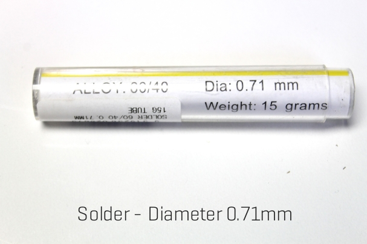

After breadboarding the flashing LED circuit, it's now time to make it a permanent circuit.

Soldering can be a fickle business. Sometimes all your solder joints are on point and other times it can take some work to get good solder joints. I'll go through a few tips and tricks along the way in this part but the best advise I can give you is practice, practice, practice.

The Parts list can be found in step 7

Steps:

1. Grab the 555 timer and the prototype board

2. Place the 555 timer into the board and make sure that the legs are sticking through the copper traces. I know that this might seem self-evident but many a time I have put the IC in the wrong way

3. Give yourself a bit of room on the prototype board as well – don’t place the 555 timer right against the edge – you might need that space later

4. Also make sure that the half-moon cut-out is on the left hand side

5. You can bend the legs out a little to hold the 555 timer into place if necessary

6. Flip the prototype board over and add some solder to each leg. You don’t need to add much.

7. If you bridge a couple of the legs together, just run the tip of the soldering iron through the 2 legs and this should remove the excess solder.

## Step 15: Connecting Legs 1, 2 and 6

Steps:

1. First thing to do is to connect leg 1 on the 555 timer to ground. I always use the inside track as ground on the prototype board.

Tip: keep all of the legs that you trim off capacitors and resistors – these make great connectors.

2. Bend the wire so it connects leg 1 to ground and solder into place

3. Next you need to add the capacitor. I decided to go with a 3.6uf capacitor to make my LED flash faster. Use whatever you found worked best for you in your experimentation.

4. The positive leg is connected to leg 2 and the negative to ground

5. Bend the legs slightly so the capacitor doesn’t fall out

6. Add some solder and secure into place

7. Lastly, you need to connect legs 2 and 6 on the 555 timer. I find the best way to do this is with another resistor leg and just use this to connected the legs under the circuit board as shown in the images

## Step 16: Connecting Legs 3 and 4

Steps:

1. Next you need to add the 3.3K resistor from leg 3 to the negative leg on the LED. First though you have to solder the resistor into place

2. As you can see in the images, I have soldered one leg to leg 3 and the other has been soldered to a trace on the prototype board where nothing else is connected. This will allow you to solder the LED into place and connect it to the other end of the resistor

3. Next is leg 4 on the 555 timer. This leg is connect to positive. I used a leg off a resistor to connect this to the positive section on the prototype board.

Tip: Remember, the bus strips (the long strips of copper running down both sides of the prototype board) are your ground and positive section. Best to make the inside bus strip ground and the outside ones positive.

## Step 17: Adding the LED and Connecting Legs 6 and 7

Steps:

1. The LED now needs to be connected to the end of the resistor on leg 3. Make sure that you solder the negative leg of the LED to the resistor

2. Solder the other leg of the LED to one of the positive bus strips.

Note: If you were making this circuit to add to a toy or project, then you would just solder pieces of wire to the connections and not the LED straight to the circuit board. Then you would solder the LED to the wires and place it where you need it.

3. You now need to add a 10K resistor to legs 6 and 7. Best way to do this is to have the resistor sitting straight up as I have done in the images below. Solder it into place

## Step 18: Connecting Leg 8 and Trimming the Prototype Board

Now it’s time to connect leg 8 up to positive. You may have noticed that I haven’t connected the potentiometer up yet. I decided to do this last but you could do this prior to connecting leg 8 up.

Steps:

1. I decided to only use one side of the positive/ground bus strips. This meant that I needed to attach jumper wires from leg 8 and also the positive leg on the LED.

2. First thing is to connect the end of the wire to leg 8.

Tip: when using your 3rd hand to hold the wire in place, slightly bend it as shown in the images below. This will ensure that the end of the wire is pushed against the top of the prototype board and will make it easy to solder as well.

3. Next, trim the connecting wire and attach to the positive bus strip

4. Lastly, you can trim the board if you wish to. Just use a pair of wires cutters and cut the excess board away.

## Step 19: Adding the Potentiometer

You need to connect one of the side legs of the potentiometer to leg 7 and the middle one to positive. As leg 8 is also connected to positive, you can just connect the middle leg on the pot to leg 8 on the 555 timer. This is what I decided to do. However, as you might be making this circuit for a project, then I would just add a couple of long wires to the circuit and solder the pot to them. This will allow you to attach it to wherever you want to.

Steps:

1. As I was connecting the potentiometer to legs 7 and 8, I was able to solder this directly to the circuit board.

2. One of the pins on the pot doesn’t connect to anything so you just have to make sure that this one is in a copper trace with nothing connected to it – just use the one to the left of leg 8.

## Step 20: Adding Power

Nearly there! Now it’s time to add some power. You could test it first if you wanted to by attaching a variable power supply to the circuit and seeing if everything is working ok. Also, I decided to use a different 9v battery holder in the end. This one has an on/off switch and can be easily brought on eBay.

Steps:

1. Connect the positive wire from the battery holder to the positive bus strip on the circuit board.

Tip: When joining wires together, it’s important that you “tin” both wires first. All this means is adding a little solder to the bare wires. Now when you go to join them, the solder will melt and make a firm join

2. Connect the negative wire from the battery holder to the negative bus strip.

3. Add a battery and test. Hopefully you see your LED flashing and turning the pot increases or decreases the speed of the flashing.

Tip: If your circuit doesn’t work, you’ll need to go over it and check each connection to make sure it is right. Don’t stress if it doesn’t work first try. Many times I have wired-up a circuit and it hasn’t worked straight away. Usually it’s a component incorrectly attached or a wire missing (I forgot to attach the positive leg on the LED to anything!) Just take your time, use the breadboard circuit to help you and go through each connection until you find the fault.

---
*122 images archived*
