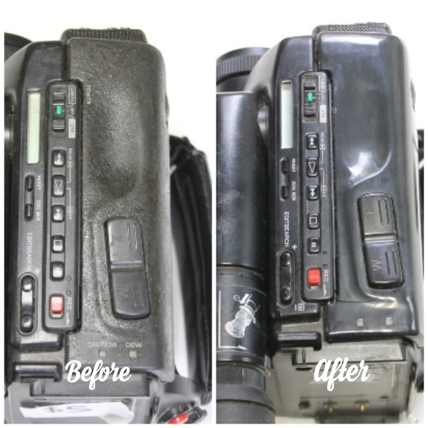

# How to Clean Sticky Rubber

Source: https://www.instructables.com/How-to-Clean-Sticky-Rubber/

---

## Introduction

On many products such as electronics, rubber is added to help with grip. Sometimes, due to environmental conditions like temperature and UV exposure, the rubber can break down and become sticky. You’ve probably come across this yourself as it’s pretty common for rubber to act like this.

This Instructable will go through a couple of methods on how to remove this sticky mess from your products.

So why does rubber do this? Natural or synthetic rubber starts out as a very sticky substance. That’s because the molecules in the raw state are long chains of very weak links to each other. To turn that raw material into the rubber we all know and love, you have to put it through a process called vulcanisation. This involves heating the rubber with some other chemicals, which molecularly transforms the rubber from sticky to stretchy.

The vulcanised rubber though can revert back to it’s original state under certain conditions. It happens when the stronger polymer crosslinks get snipped and the molecules revert back into their original small chains. Once that happens you’re stuck with rubber that has become sticky and tacky.

In the following Instructable I’ll go through a couple of methods to remove this mess and hopefully give you a few pointers on how to do it yourself.

## Step 1: Tools & Preparation

Tools

1. 90% isopropyl solution. You can get this from the chemist or hardware store.

2. I have also used Methylated sprits which can be purchased from a hardware store or even your local supermarket. It seems that methylated spirits is called by a few different names. In the US there's something similar called denatured alcohol (be careful of denatured alcohol though as it has Methanol in it which can be very dangerous). I've also heard that this can be damaging to plastic so be wary using it to remove rubber and do a test first. There is also methyl hydrate, or fondue fuel available in the US as well. Again I would do a test first to see how well these work before using it. In Europe, it may be called spirits. check out this link to find out more

Preparation

1. Make sure that the area that you are working in is clean

2. Place a cloth on the workspace where you will be working.

3. Have some spare cloths handy to remove any excess chemicals

4. It’s good practice to also wear rubber gloves and some safety glasses as well. The isopropyl can be absorbed into the skin, which can cause poisoning in large amounts. Small amounts though isn’t considered dangerous

## Step 2: Method 1 - Using Isopropyl

The first method I'm going to show is using Isopropyl. Isopropyl is what is known as a synthetic alcohol and can be found in things like shaving creme, antiseptic and industrial applications.

Although it's flammable, Isopropyl is pretty benign. However, you should try and wear gloves when using it can readily absorbed into the skin if used in large amounts.

I decided to use the Isopropyl on a Hi 8 camera that I recently purchased. Some rubber on the top section was very very sticky and gummy which I guess was the reason why it was selling for $5!

Steps:

1. Place the camera on a clean surface

2. Next, apply some Isopropyl to the affected area, adding enough to cover the rubber.

3. Be careful to not get too much of the isopropyl into any electronics areas such as switches or small openings. If you do however, don't stress too much, the Isopropyl evaporates quickly and shouldn't effect the electronics (fingers crossed!)

4. Start to wipe the rubber with a clean cloth. How hard you need to wipe will depend on how stubborn the rubber is. On this camera, the rubber came away quite easily.

## Step 3: Method 1 - Re-applying

As the Isopropyl evaporates quickly, you’ll probably need to re-apply a few times

Steps:

1. Once the Isopropyl starts to dry and you find that the cloth is sticking to the rubber, it’s time to add another layer of Isopropyl.

2. Keep re-applying on the rubber and rubbing with a cloth. Use a clean section of the cloth each time.

3. Once all the rubber has been removed, you should end up with just the bare plastic that the rubber was adhered to.

4. Give it a final wipe with a clean cloth and you’re done! You should then power-up the part and ensure it still works ok.

## Step 4: Method 2 - Using Methylated Spirits

My usual go to when removing rubber is Methylated Sprits or if you are in the US, Denatured Alcohol. I find that it works very well with rubber that isn’t so far degraded. This camera that I used it on was sticky but not as degraded as the hi-8 video camera

Steps:

1. Add some Methylated Sprits onto a clean cloth

2. Start to wipe away the rubber. If you find that the rubber isn’t coming off (like I did with this camera) you will need to apply several times

3. Keep rubbing at the plastic and eventually the rubber will start to be removed.

4. Keep applying and rubbing until all of the rubber surface is gone.

5. Give the part a final wipe over and test to make sure it still works

---
*25 images archived*
