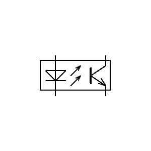
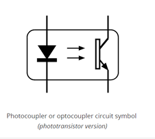
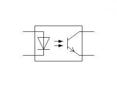

# How to Make a Optocoupler (Vactrol)

Source: https://www.instructables.com/How-to-Make-a-Optocoupler-Vactrol/

---

## Introduction

This is a short ‘ible on how to make an Optocoupler. There’s a whole bunch of names that this little electric component comes under. Others include vactrol, Opto-isolator, photocoupler and optical isolator.

An optocoupler allows you to transmit an electrical signal between two isolated circuits with two parts: an LED that emits infrared light and a photosensitive device (LDR) which detects light from the LED. Both the LED and the LDR are enclosed so no light can reach the LDR. The shop brought ones will be enclosed in plastic. This homemade version uses a small piece of heat shrink.

So what is an optocoupler and why do you need to know how to make one. If you build circuits then at some stage you will come across a weird schematic symbol that is a optocoupler. An optocoupler can be used in many applications such as synths and sound effect circuits, input/output switching, and a bunch of other applications.

Here's a couple of links for those who want to learn more about optocouplers

[link 1](https://www.electronics-tutorials.ws/blog/optocoupler.html)

[link 2](https://circuitdigest.com/tutorial/opto-coupler-types-working-applications)

More Technical [Link 3](http://denethor.wlu.ca/pc300/optoisolators/analogoptoisolatorintroduction.pdf)

## Step 1: Identifying an Optocoupler in a Circuit

Below are some of the more common optocoupler schematic symbols you might come across. You can see that the symbol is made up of an LED and photoresistor symbol.

Actually, the symbol depicts what an optocoupler is quite well. I did find it a little confusing however when I first come across one as I didn’t realize they were connected parts

I have also added a couple of schematics that show you an optocoupler being used

## Step 2: Parts and Tools

Parts List

1. 5mm LED – eBay

2. LDR – eBay

3. Heat Shrink 6 to 7mm – eBay

Tools:

1. Lighter

2. Scissors

## Step 3: How the Optocoupler Goes Together

The images in this step shows how the components go together. You can see that the LED and the LDR face each other inside the heat shrink. The LED acts as an input and the LDR is the output receiver.

## Step 4: Placing the LED and LDR Inside the Head Shrink

Steps:

1. First, grab your heat shrink and cut a 20mm piece

2. Next, Place the LED into the heat shrink. If you have troubles pushing the LED into the heat shrink due to the rim on the LED, you can remove it with a file.

3. Push the LED into the heat shrink so there's about 5mm over the LED legs.

## Step 5: Shrinking the Heat Shrink

Steps:

1. Whilst holding the LED legs, start to add some heat to the heat shrink around the LED section

2. Make sue you only add heat to the section where the LED is as you only want the heat shrink to shrink around it.

3. Once the heat shrink has melted enough, use a pair of needle nose pliers to squash the heat shrink around the LED legs, effectively forming a seal. What you are trying to do is to seal any potential outside light reaching the LDR - you only want the light from the LED to affect it.

4. Do the exact same for the LDR.

## Step 6: Bending and Cutting the Legs

Steps:

1. Take note of which leg is the positive on the LED. A good idea before you trim the legs is to snip a small corner away from the heat shrink next to the positive leg. This way you will always know which one it is.

2. Bend both the legs of the LED and the LDR down

3. Trim the legs on both the LED and the LDR

That's it. You have now made your own optocoupler which will work just as good as any store brought one.

## Downloads

- [Link 3](pdfs/Link 3.pdf)

---
*30 images archived*
