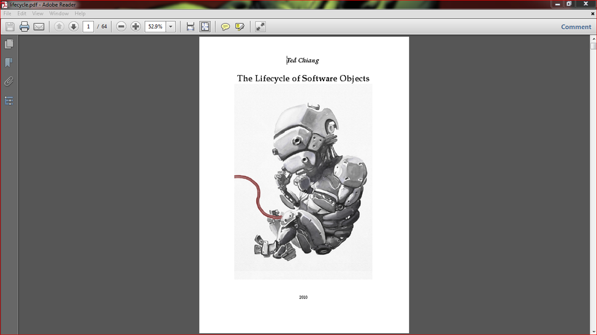
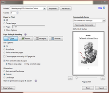
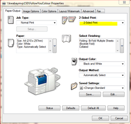
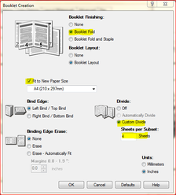

# How to Print and Bind a Book

Source: https://www.instructables.com/How-to-Print-and-Make-a-Book/

---

## Introduction

In this instructable I'll show you how to print and make your own hard cover book.

So why make your own book?

There are many books that have been published for free as a PDF for anyone to download and read. You can just print these off and read as is if you like. If you are like me though, and like to keep the books you read, or just want something better than a bunch of A4 pages stapled together, then making a book is for you.

The other reason for making a book is they can be quite expensive to purchase, especially if rare or out of print. This is not the case for most books but Murphys Law means the one you want will inevitably be the one that you can't find or costs a small fortune.

Binding your own book is also a lot of fun as you get to design it yourself!

The first book I made turned out ok but I made a few rookie mistakes. The second book I managed to get a lot better finish with only a few small changes to the process. Throughout the instructable I have added tips - these are the little things which will help you make a great book.

There are quote a few websites where you can find free books to print.
This one
is quite good and I use it a lot. You can also just do a search of the book that you want and sometimes you'll be lucky and there will be a PDF available.

If you have any questions, please let me know in the comments.

Lastly, I'd like to acknowledge Guido Socher who's instructions on
this
website were invaluable.

## Step 1: Things to Gather

Parts:

1. Paper. You can just use everyday A4 paper if you like or you can spend a little more and get some really nice paper. I used Linen bond paper and just plain, everyday A4 paper.

2. Cardboard - This will be used for the cover. the best card to use is stiff, dense cardboard which can be purchased from art stores.

3. Glue - Acid free, PH neutral, PVC works a treat when gluing the pages together

4. Glue - all purpose

5. Glue - spray adhesive

4. Fabric - Any old curtain material will do.

TIP
- I know that 3 different glues might seem excessive but trust me, each one has a purpose. If you want to get a book that is usable and sturdy then definitely get the similar glues to the above

Tools,

1. Sewing machine

2. Sharp scissors

3. Stanley knife - sharp

4. Rotary knife

5. Clamp

6. Printer

## Step 2: Printing Your Book - Signatures

Pick up any book and you will notice that its not just a heap of pages folded and stuck together. Yes the pages are folded but they are done in signatures. Signatures are really just small booklets and a book is made up of any number of signatures. The reason is if you just folded all of the pages together in the middle then the first and last lot of pages would be a lot shorter then the middle ones. Using signatures allows the pages to be pretty much even. It also makes the book easier to read as the pages open better.

TIP -
There are programs on line which you can download to make signatures but I couldn't get them to work. If youcan't get your printer to make signatures then you may have better luck with
this
website than me.

So to make the signatures you really don't have to work out much as your computer and printer will do all of the hard work.

Steps:

1. First picture - choose your book. It doesn't have the be in PDF but the one I wanted to print was.

2. Second picture - Next go to print, then properties

3. Third Picture - Choose 2 sided print. Hit “select Finishing”

4. Forth picture - Next do the following:

• Click - Booklet Fold

• Tick “fit to paper size

• Click “Custom Divide” and decide how many sheets you want in each “Signature”. This number should try and divide into the number of pages you have. i.e. 4 sheets per subset will go into 64 (64 ÷ 4 = 16)

5. Print

Your computer will have worked out how the pages should go and you will notice that there are lots of 4 booklets which are in page order.

## Step 3: Sewing the Signatures Together

Now you have your book printed it's time to sew them together!

Steps:

1. Fold over each signature and make sure that each one is as even as possible.

2. Make sure that you give a good crease to each fold but not too much. Remember, you have to sew along this line and if it is too folded it will make it hard to sew properly.

3. Next sew along the crease. If you are like me and don’t know the first thing about sewing, get your mum (or someone) to do it for you. You don’t have to sew the whole crease – as you can see from the below, there is a gap of about 30-40mm on each end.

TIP
- Instead of tying the threads on each of the signatures, sew backwards a little at each end and this will hold the stitching together

4. Cut off the excess threads.

TIP
: If you are finding it hard to see the crease when sewing it – then draw a faint line with a grey lead pencil along it.

5. Once sewed, put some pressure along the folds to ensure a good crease.

## Step 4: Gluing the Signatures Together

Steps:

1. First you need a way to hold all of the signatures together. The easiest way is to use a couple of pieces of wood and a vice. You could also just use a couple of clamps and some wood as well.

2. Line-up all of the signatures so the spines are even. Before you glue, make sure that all of the signatures are in the right position – you don’t want to have any upside-down or the pages in the wrong sequence.

3. Clamp together. There should be about 5-10mm of the spines sticking-up.

4. Add some glue. The glue should be acid free, ph balanced and flexible. Any store that sells scrapbook material will have this type of glue. The glue needs to cover all of the spine but not too thick as you don’t want it to run.

5. Next cut a piece of the material. It should be as long as the book and about 60mm wide. Add some glue to the middle of this and attach to the spine.

6. Press lightly along the spine and make sure that the fabric is touching all parts of the spine.

7. Leave to dry for 24 hours.

TIP -
Don't over-do it with the glue - you don't want it to drip down the page and onto the wood that is bracing the signatures together. Just make sure that you have glue covering all of the stitching.

## Step 5: Cutting the Cardboard

Next thing to do is to cut the cover out. The best type of cardboard to use is dense cardboard which you can buy from craft shops. I decided to go with a box that printing paper comes in. These are strong and not too thick.

Steps:

1. Cut your piece of cardboard out. Use the book as a template to work out how big it needs to be. I made my cover about 15mm larger than it needed to be.

TIP
- I left 15mm around the first book but for the second I made the cover better fitting to the actual book which I think looked better.

2. To ensure a good bend in the cardboard for the spine, I used the bottom and side of the cardboard. This gave me one ready-made crease. All you then have to do is put another one in to complete the spine.

3. To make the crease grab yourself a metal ruler. This has a flat, straight edge which works perfectly. Use a hammer and hit the ruler on its side until you have a crease in the cardboard. Bend the covers closed and ensure the spine is bending as it should.

TIP
- This part is really important - you want to make sure that you have a good strong crease on
both
sides of the cardboard. The best way to get a straight line is to draw one on the cardboard. Use the metal ruler and really give it a good hit with the hammer. Once done, bend the cardboard right over so it is in half and do this the other way as well. Do it a few times until the cover sits flat naturally.

## Step 6: Cutting and Gluing the Fabric

Once you have your cover cut out and the spine is creased, the next thing to do is to add the fabric.

Steps:

1. Cut out the fabric that you have decided to use. The best type of fabric is curtain but you can use anything you have on hand. The fabric should be larger than the cover as shown below.

2. Use spray adhesive to attach the cardboard to the fabric. Once flat, add some weight to the cardboard to ensure the fabric stays flat.

3. Once dried, it’s time to glue the sides. Get some all-purpose glue and add a small amount of water. This will allow it to spread easily onto the fabric. Remember, you don’t want to add too much water as you are sticking it to cardboard and you don’t want it to become wet

4. Brush on the glue so it covers all the fabric and fold over.

TIP -
Only do the sides first. The top and bottom will be glued once the actual book has been glued into place. It makes for the better finish.

## Step 7: Adding the Book to the Cover

1. First, lay the cover out flat.

2. Cut 2 tabs on each of the top and bottom flaps as shown below and glue down. Make sure that the fabric has been pushed into the creases.

2. Next, add some glue to one of the fabric wings on the book and glue down onto the cover. It is important to have the cover flat at this stage so then you have finished; the cover is able to open flat. If you don’t have it flat when gluing the book on, then you might find that the cover doesn't open flat which is important when reading the book.

TIP
- you will need to set-up a way to have the pages standing up vertically whilst the glue is drying on the wings of the book. It will also help when centring the book to the cover. I used a pair of grips to hold onto the pages and then strung up some string to the roof and tied it to the grips. This way the paper was hanging vertically and was out of the way

3. Add some glue to the other wing and glue down.

4. Lastly glue down the top and bottom flaps.

4. Put some paper between the cover and book, front and back and add a couple of heavy books to the top of your book. Leave to dry for 6-8 hours.

## Step 8: Final Stretch!

Lastly you need to glue on a front cover and a couple of pages to the inside cover.

Steps:

1. Print and cut to size a picture of the front cover. You don’t have to use the one that came with the book – pricing your own and add images etc. If you can, use a guillotine to cut the paper to size.

2. Next you need to cover the cardboard showing on the inside of the cover. I just used a couple of images I found on the net and glued them into place. Use the spray glue for both the front cover and the inside images.

## Step 9: Done

So now you’re done. Congratulations!

There are plenty of other ways (more complicated though) to bookbinding. These usually need specialized tooling and take a long time to master. I found this way to be very easy and the end finish looks great.

Next one I want to do will be a miniature book – maybe one with blank pages.

---
*61 images archived*
