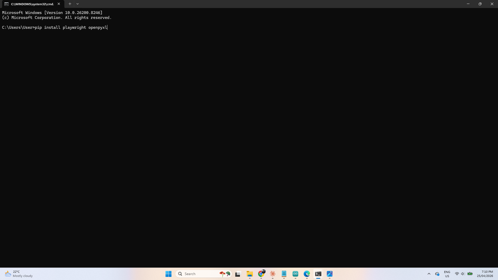
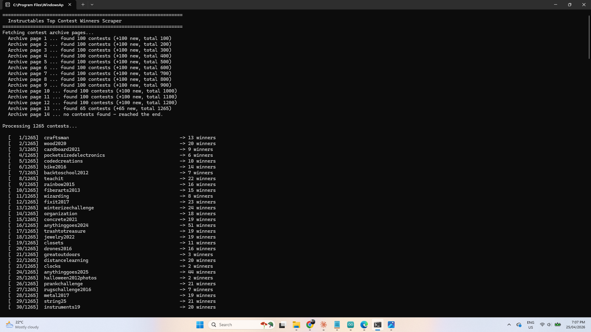
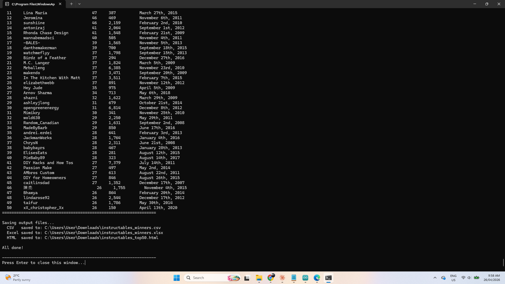
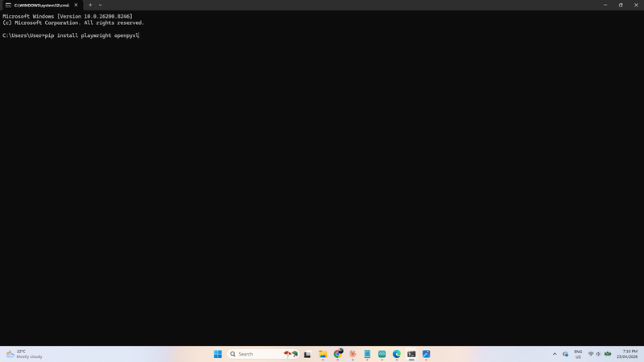
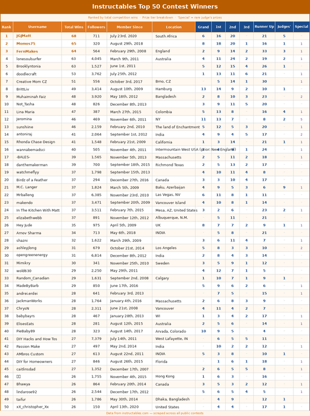
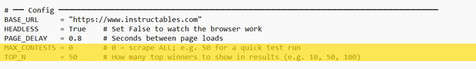

# Instructables Contest Winners - Top 50

Source: https://www.instructables.com/Instructables-Contest-Winners-Top-50/

---

## Introduction

Even wondered who the top 50 prizes winners are on Instructables?

To be honest, I was curious as to where I sit amongst the competition winners and it turns out that I'm in the top 5 (1 off equal top 3!!).

I joined Instructables way back in 2011 and published my first 'Ible in Jan 2012. [The project](https://www.instructables.com/How-to-Make-an-Easy-Electric-Lantern/) got some views and likes and after that I was hooked.

I've pubished 254 255 'Ibles since then and it's been a great journey. I've learnt a tonne of skills and have published a broad range of builds over the years.

A huge thank you to anyone and everyone who has voted for one of my projects thought the years. You are all superstars xx

Also thanks to the Great Instructables team!

Back to the question I first asked. As the internet wasn't helping me and I couldn't find anything relevant, I decided to build a tool that would extract the information from all of the competitions run by Intructables!

After a few hours coding, I ended up with a Python script that runs a program and outputs a list of the top 50 winners and some stats about each one.

The results can be found in Step 1. - Visit the website that I created to check out the winners

In the Supplies step I have provided everything you need to run the script yourself. I looked up the top 50 but you can also change the amount of competition winners to look up as many as you want!

## Supplies

RUN THE PYTHON SCRIPT YOURSELF

It's super easy to run the python script yourself if you want to. Just follow the instructions below and run it on your computer.

***Go to the next step to see the results***

Install Python

- If you don't already have Python installed, download and install it from the official website. Make sure to tick "Add Python to PATH" during installation.
https://www.python.org/downloads/

Download the script

- Download from my [GitHub](https://github.com/lonesoulsurfer/Instructables_Contest_Winners) page file which includes 'instructables_top_winners.py' and save it somewhere easy to find, such as your Desktop or a folder called C:\Instructables.
Open Command Prompt

- Press Windows key + R, type cmd and press Enter. A black window will open — this is the Command Prompt.
Install required packages (one time only)

- Copy and paste these two commands into the Command Prompt, pressing Enter after each one. Wait for each to finish before running the next.
- pip install playwright openpyxl
- playwright install chromium
Run the script

- Double-click the instructables_top_winners.py file to run it. A window will open showing live progress as it works through every contest. This may take some time — there are over 1,300 contests to process so be patient and let the script run in the background.
Find your output files

- When it finishes, three files will be saved in the same folder as the script:
- XLSXFormatted Excel workbook with the full winners table
- CSVRaw data file you can open in any spreadsheet app
- HTMLReady-to-paste table for publishing on Instructables

## Step 1: Results

Check out the link to see the winners

[https://lonesoulsurfer.github.io/Instructables_Contest_Winners/](https://lonesoulsurfer.github.io/Instructables_Contest_Winners/)

The results can also be found on [GitHub](https://github.com/lonesoulsurfer/Instructables_Contest_Winners). You can download 3 different file formats of the list from my GitHub page. There is an Excel, HMTL and CSV files available. These are the outputs you get after the Python script has ran.

The results don't just supply a list of the highest competition winners. It also provides the following:

- Link to the Instructable member so you can go check them out
- How many competitions they have won
- where they rank overall
- Join date
- Total Instructables published
- Total views
- Number of followers
If you want a longer list of competition winners, then check out the next step.

## Step 2: Changing the Amount of Winners for a Longer List

You can change the number of winners that the script outputs. It is very simple and can provide a list of a 1000 winners (or more) if you want that many.

STEPS:

- Go to where you saved the 'Instructable_top_winners' python script
- Click on the script and then - right click / open with / notepad
- go down to about line 60 (see images for exact spot) where you will see the line starting with 'Top_N = 50'
- Just change the number to the amount of winners you want to see
- You can also change the amount of contests the script looks at by change the 'MAX_CONTESTS = 0' number to say 50 just to test the system.

---
*9 images archived*
