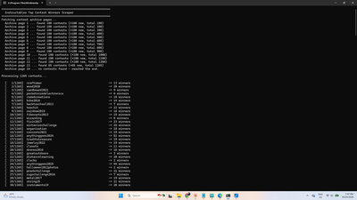
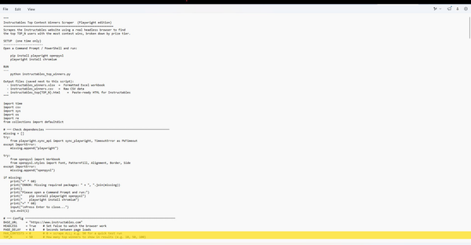

# Instructables Contest Winners - Top 50

Source: https://www.instructables.com/Instructables-Contest-Winners-Top-50/

---

## Introduction

## Supplies

RUN THE PYTHON SCRIPT YOURSELFIt's super easy to run the python script yourself if you want to. Just follow the instructions below and run it on your computer.***Go to the next step to see the results***Install PythonIf you don't already have Python installed, download and install it from the official website. Make sure to tick "Add Python to PATH" during installation.https://www.python.org/downloads/Download the scriptDownload from my GitHub page file which includes 'instructables_top_winners.py' and save it somewhere easy to find, such as your Desktop or a folder called C:\Instructables.Open Command PromptPress Windows key + R, type cmd and press Enter. A black window will open — this is the Command Prompt.Install required packages (one time only)Copy and paste these two commands into the Command Prompt, pressing Enter after each one. Wait for each to finish before running the next.pip install playwright openpyxlplaywright install chromiumRun the scriptDouble-click the instructables_top_winners.py file to run it. A window will open showing live progress as it works through every contest. This may take some time — there are over 1,300 contests to process so be patient and let the script run in the background.Find your output filesWhen it finishes, three files will be saved in the same folder as the script:XLSXFormatted Excel workbook with the full winners tableCSVRaw data file you can open in any spreadsheet appHTMLReady-to-paste table for publishing on Instructables

## Step 1: Results

Check out the link to see the winnershttps://lonesoulsurfer.github.io/Instructables_Contest_Winners/The results can also be found on GitHub.  You can download 3 different file formats of the list from my GitHub page. There is an Excel, HMTL and CSV files available. These are the outputs you get after the Python script has ran.The results don't just supply a list of the highest competition winners. It also provides the following:Link to the Instructable member so you can go check them outHow many competitions they have wonwhere they rank overallJoin dateTotal Instructables publishedTotal viewsNumber of followersIf you want a longer list of competition winners, then check out the next step.

## Step 2: Changing the Amount of Winners for a Longer List

You can change the number of winners that the script outputs.  It is very simple and can provide a list of a 1000 winners (or more) if you want that many.STEPS:Go to where you saved the 'Instructable_top_winners' python scriptClick on the script and then - right click / open with / notepadgo down to about line 60 (see images for exact spot) where you will see the line starting with 'Top_N = 50'Just change the number to the amount of winners you want to seeYou can also change the amount of contests the script looks at by change the 'MAX_CONTESTS = 0' number to say 50 just to test the system.

---
*9 images archived*
