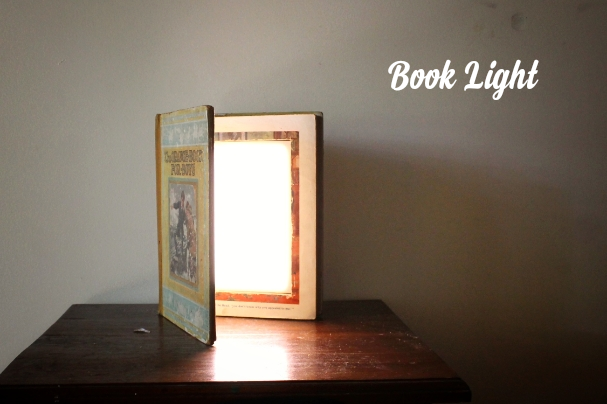

# LED Book Light - Inside a Book!

Source: https://www.instructables.com/LED-Book-Light-Inside-a-Book/

---

## Introduction

Just like the title states, this Instructable will show you how to make a book light inside a book. I was initially thinking of using a very small book for this build so it could be pocket size (still might make one) but I decided to make it easy for myself and used a large book for the project.

the book I used is an old Children's book with thick paper and a very nice, vintage look about it. It was falling apart and the paper that the pages are made from was starting to become flaky. By adding some Mod Podge glue to the book I was able to stabilize it and make a solid casing for the LED's inside.

The LED's are in the strip form and I went with an internal battery source (mobile battery) instead of external mains power. I wanted it to be used anywhere and a cord coming out the back spoils the look.

The build will take some patience and some soldering skills but anyone should be able to build one.

## Step 1: Parts & Tools

Parts:

1. A Book. Make it a large one as it will be easier to do. It will also need to be hardback

2. Glue - I use Mod Podge as it drys clear and works excellent - eBay

3. Some pieces of wood (trim). Get yourself a length of it from your local hardware store.

4. LED strip - eBay

5. Charging Module - eBay

6. Mobile Phone Battery - you can buy them on eBay or just recycle one from an old phone

7. Opal Light diffuser - sheet - Acrylic - eBay

8. Micro USB Adapter - eBay

9. Wires

Tools:

1. Soldering Iron

2. Stanley knife - sharp

3. Ruler

4. Mod Podge glue

5. General purpose glue (a good quality one)

6. Saw. A band saw works well to cut the acrylic and the wood

## Step 2: Picking the Right Book

I added this step as I think it's important to pick the right book for this project. That's doesn't mean that you need some type of special type of book, but it helps to try and find a book with a few, specific properties

Size

The bigger the better really. You want to make sure that when you add the LED's, there is enough space between them and the diffuser or they won't defuse properly. A larger book also makes it easier to add all the parts inside it.

Paper

If you get a book with thin paper then it will take a lot longer to cut out the compartment. Try and find a book with thick paper which the book I used had

Look

Ok so this isn't vital but if you are going to have this book displayed all of the time then it's probably a good idea to have a nice looking book.

Hardback

Make sure that the book is a hardback to ensure rigidity when it is standing up

## Step 3: Gluing the Pages Together

I used to glue every page together and it usually ended up as a hot mess. Someone mentioned on another 'ible I did that you can use Mod Podge glue and just add it to the sides of the book. It makes it so much more easier and the pages sit more naturally when completed.

Steps:

1. The book I used was a little worse for wear so I had to do some running repairs before I started. The cover was coming away from the inside so I added some glue to the inside of the cover and glued the first few pages together.

2. Next, you will need to add a separator like a piece of paper or plastic between the pages. This is to separate the book and create a top and bottom section. The top section will be the front of the book and you only need to separate enough pages to make a type of lid for the booklight.

3. Time to add some glue. Add some glue with a paintbrush to the outside of the pages. Don't lather it on, just add a nice layer initially across the outside of the pages.

4. Add some weights to the top of the book so the pages are squashed together and leave to dry for a few hours

5. Repeat a couple of times until the pages are stuck fast. The glue dries clear so son't worry if it clumps in any spots as you won't see this once dried.

## Step 4: Cutting Out a Compartment in the Book

Time to start cutting and removing the insides in readiness for the LED's.

Steps:

1. First thing is to work out what size you want to make the compartment for the LED's. I usually just use the width of a ruler and place this along the edge of the book.

2. Place the ruler along the edge of the book and with a stanley knife, start to cut the pages. Make sure that the knife blade is a new one as it's a lot easier when sharp. Keep the knife straight and carefully make the cut.

3. Do this for all 4 sides.

4. Once you have gone around a couple of times you can start to remove the pages that you have cut.

5. Keep on cutting and removing the pages until you reach the last couple of pages and the back of the book

## Step 5: Gluing the Inside Pages Together

The next step is to glue all of the inside pages together. This is similar to gluing the page edges together only this time you are doing to the inside of the book.

Steps:

1. With a paint brush, add the mod podge glue to the inside, cut-out section.

2. Maker sure that all the exposed, cut pages are coated and also add some to the bottom as well. This will give the book some strength.

3. Place some weights along the edges of the pages so they are compressed and leave it for a good few hours.

4. Add another coat of glue if necessary

## Step 6: Making a Frame for the Inside Compartment

You will need to add some type of frame to the inside of the compartment. This is what the Acrylic will sit on along with the momentary switch. The wood I used is just a piece of edging that you can buy from any hardware store. The dimensions are 7mm width by 30mm High. The height though will depend on the height of the compartment.

Steps:

1. Measure and cut out 4 pieces of wood so they will fit inside the book and make a "frame" for the acrylic.

2. You will also need to add a small notch in one end for the momentary switch. This can be a little tricky as the switch needs to be in the closed position when the cover is closed and needs to touch the top of the cover in order to turn off. I have to do the cut a couple times to get it right. The first time was too deep.

3. Once you have the cut-out right and you can hear the click of the switch when you close the lip, next thing to do is to glue all of the wood pieces inside the book.

## Step 7: Adding the Acrlic

The acrylic that I used is an opal coloured light diffuser . It does a great job of diffusing the LED's and giving a nice, soft light.

Steps:

1. First measure the dimension of the compartment. You want to have a tight fit for the acrylic so measure twice.

2. Cut the Acrylic. Ok so this isn't as easy as it sounds. Best way to cut acrylic is with a band saw at a stretch but you could use a jigsaw if you use a fine tooth saw. You could also cut it by hand.

3. You next need to make a couple of cuts into the acrylic for the momentary switch and micro USB charging outlet. Make careful measurements and make the cuts.

4. Place the charging module against the wood and mark where the micro USB hits the acrylic. Be extra careful when you are making the USB slot. I drilled a couple holes and then filed the edges to make it but the first time I tried the acrylic chipped away. The second time round I used a small drill bit first and then moved up to a larger one which seemed to work ok.

## Step 8: Preparing the LED's

For the LED's I used warm white strip lighting. It lets off a nice coloured light and it isn't harsh like white LED's

Steps:

1. Measure and cut the LED strips at the solder points. These are indicated by 4 copper points.

2. One end will show positive and negative. These are the ends that I used as it's easier to keep track of the polarities

3. You will need to remove some of the rubber to reveal the solder points. The best way that I found to do this is carefully run a stanley knife or exacto blade between the rubber and copper section. It comes off pretty easily so you shouldn't have to push too hard.

4. Once you have a small amount lifted up, cut it off with some scissors.

5. Tin each of the copper points with some solder

## Step 9: Adding the Battery, Charging Module and Sticking Down the LED's

I did an Instructable a little while ago which go through how to use the charging module and connect it to a battery. The great thing about these little modules is that also have a voltage regulator so you can set the voltage at 12v which is what the LED's need. Check out the link here to learn how to use them

Steps:

1. Connect the battery up to the charging module and set the voltage to 12V. Check the link out above to see how this is done.

2. Use some superglue to hold the battery and module into place.

3. Next, stick down the LED's making sure all of the soldered ends are all up the same end

4. You will need to go over the battery with them but this won't affect the LED light diffusing.

5. Connect all of the negative and positive solder points together. I used some resistor legs to do this but you could also just use some wire

6. Connect the negative from the charging module to negative on the LED's.

7. Connect the momentary switch to the positive terminal on the charging module and also to the positive of the LED's

## Step 10: Testing and Finishing Touches

As soon as you connect the switch you should see the LED's come on. Push down on the little arm of the switch and they should turn off. If everything is working as it should be it's now time to add the acrylic

Steps:

1. If you haven't already, add a little superglue to the back of the switch and stick this into place

2. Place the acrylic into the book and make sure everything is fitting right. test to make sure you can plus in a micro USB through the acrylic and into the charging module.

3. If everything is working as it should then you can glue down the acrylic. Don't use superglue for this as it can leave a residue and mess up the acrylic. Just use some all purpose glue.

4. I also added some fabric tape to the inside of the spine as it was starting to fall apart.

5. That;s it! So what would I do differently? We for starters, i would probably locate the battery and switch at the bottom of the book, not the top. I'm not sure why i did that in the first place - must of had some reason. I'll also add an DC output plug next time so I can just run it through mains if I choose to.

Overall though I'm very happy with how this book light turned out. It has a very lovely soft light and it's dimmable! All you need to do is to open the book slightly for a little light and right up to light up a room.

---
*60 images archived*
