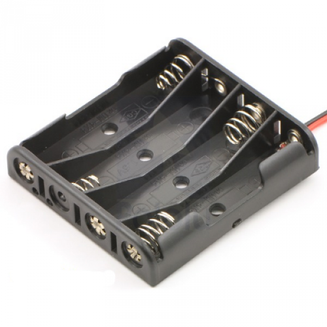

# LED Resin Cube V2

Source: https://www.instructables.com/LED-Resin-Cube-V2/

---

## Introduction

## Step 1: Gather the Bits

Material  1. Clear Resin. I purchased mine from the local hardware store  2. Resin catalyst  3. Mould.   I used a baking soda container that I found at my local supermarket.  You could use virtually any shape mould you like as long as it's plastic.  4. LED Lights and circuit board – Ebay The circuit board is from a fiber optic toy which I pulled apart.  5. LED’s (Red, Blue and White) - Ebay Again you could use any colours you want.  6. 4 x AAA re-chargeable batteries. - Ebay  7. Copper wire.  Try a hobby shop.  8. Wireless re-charging coil – purchase here (this one is a 9V charger), or Ebay (this one is a 5V charger)  9. Mercury switch – Ebay  10. Charger.  I used a 7.5v, 1A charger.  - Ebay  11.  LED  12.  Resister (5K)  13.  Toggle switch    Tools  1. Soldering Iron and solder  2. Pliers  3. Wire cutters  4. Measuring cup  5. Multimeter  6. Wet/Dry Sandpaper 120 grit, 600 grit, 1200 grit  7. Brasso  8. Car polisher

## Step 2: Batteries Part 1

Initially I used copper wire and made  battery holders out of the wire (image below).  The problem was that you had to add heat to the end of the battery to add some solder and this kept on ruining the batteries.  I didn't want to add a lot of plastic to the design but in the end I compromised.  Steps:  Modding the battery holder 1. Cut out all of the excess plastic on a 4 x AAA battery holder.  I used a dremmel to get this done.  2.  Next use a stanley knife to remove some of the rough edges.  3.  Keep on trimming with the stanley knife until you only have a frame as below.

## Step 3: Batteries Part 2

Copper Frame Next is to make a frame out of copper wire.  Without this the batteries will keep on falling out.  1. Bend a piece of copper so it goes all around the battery case as shown.  Make sure that it is a tight fit.  This will ensure that the batteries stay into place.  The plastic battery holder gets a little flimsy once you cut great big holes in it!  2. Solder the 2 ends together using a mini soldering torch and some flux.  If necessary, use a small file to remove any excess solder.  3. Test by pushing the copper frame over the battery holder and placing the batteries into the battery holder.  4. Next add a couple of support copper wires as shown.  This will help with keeping everything in place - plus they look cool.  5.  Next bend a peice of copper as shown and attach across the 2 copper supports.  This is where you will solder the circuit board onto.  6. Attach the positive wire to the frame.  It's pretty important to ensure that the positive end is attached; it will make attaching the circuit board a bunch more easy later on.

## Step 4: Modding (slightly) the Batteries

This step isn't relly necessary but it will make the finished product look a tonne better.  Steps: 1. Remove the outside wrapping on your batteries.  Be aware that once you do this the outside of the battery becomes negatively charged.  It won’t cause any issues, as long as you don’t have the batteries touching inside the frame.  2. Remove the little piece of plastic on the positive end.  This should just slip off.  3. You might have to clean the glue off your batteries.  I used a little acetone which did the job nicely.  4. Now you should have some stella looking batteries.

## Step 5: Adding the Charging Coil

The next thing to do is to attach your charging coil to each end of the battery terminals.  There are a couple of different charging coils available.  I decided to go with the 9v one as it gives me more options in regards to voltage.  The 5v would  work ok if you were only using 3 AAA batteries.   When you are charging batteries you want the voltage higher than the actual voltage of the batteries.  Steps:  1. The first thing to do is to move the circuit board on the charging coil to the inside of the coil. De-solder the ends from the circuit board, trim to size and then re-solder as shown below.  2. The circuit board should be somewhere close to the middle on the bottom of the batteries.  You can hot glue this into place if you want.  I didn't bother.  3. Trim and attach the wires from the circuit board to the battery terminals, making sure that polarities are right.  • At this stage I tested the coli by running the batteries down and then hooking the other coil up to my phone charger to see if everything worked ok.

## Step 6: LED Circuit Borad

In my last version, I didn’t move the LED’s on the circuit board, but this time I wanted to move the LED’s away from the battery, charger and circuit board so they would look like they were suspended in the resin.  Steps:  Romove the Circuit borad from the plastic  1.  Jimmy open the plastic case with a screwdriver  2.  Carefully remove the circuit board and switch.  the battery wires can be cut  Adding the LED’s  1. De-solder the LED’s on the circuit board  2. Solder on the new LED’s.  Obviously make sure that the polarities are correct and that the LED’ sit straight on the board.  This is super important.  Take notice which way the LED's have been attached to the circuit board.  My first couple of tries adding the new LED's were incorrect and I only had 1 light working.  3. Test.

## Step 7: Adding the Mercury Switch

Adding the Mercury Switch  1.Remove both wires for the switch by de-soldering them.  2. Bend the legs to the mercury switch as shown below.  They should be bent at right angles so when you solder the switch in place it is sitting straight up.  3. Solder onto the circuit board.   Attaching the Circuit Board to the Batteries  Remember how you attached the copper battery holder to the positive end of the batteries?  Well the reason why is so the circuit board can be attached to the positive end of the batteries.  I have found that if you solder to the negative end of the circuit board, then for some odd reason the board seems to short somewhere and it won’t work anymore!  This could be just me though.  1. Solder the board onto the positive end of the copper battery holder.  Make sure you add some solder to the copper end and only heat-up the copper when attaching the circuit board.   2. Solder the negative wire from the board to the other battery end.

## Step 8: Resin

Hopefully now you have a working, LED’s which only come on when you tip everything on it’s side.  Each time you tip it over it should change colours.  If it doesn’t then you will need to go and check all of your connections to make sure that everything is soldered correctly.  The worst thing that can happen (believe me I know!) is for the circuit board to short and not work.  If this happens, then I’m afraid it’s time to remove it and replace with another one.  The next step is to add the LED’s into the resin.  Steps:  1. Choose a mould.  I went with the baking soda one below which I found at my local supermarket.  2. Mix a small amount of resin and pure into the bottom of the mould.  This will be your base.  It’s important that you don’t add too much resin because the coil will be too far away from the charger and won’t work.  If you do happen to pour too much don’t worry, you can always sand it back once dry.  Leave for 24 hours.  3. Once dry, place the LED’s into the mould and position where you want them to go.  4. Pour in some more resin until the LED’s are completely covered.  5. Leave to dry for 24 hours then remove from the mould.  6. Leave it to dry again for another 24 hours.

## Step 9: Smoothing and Finishing

Once the resin is completely dry it’s time to polish it.  In my first LED Resin Instructable I went through in detail on how to polish the resin and what materials to use.  I’m going to be really lazy here and ask you to look at step 6 “Smoothing and Finishing” on the other Instructable for how to polish the resin.  The only other info I would like to add is below:   Finishing:  Once you get the resin out of the mould (might need a little coxing!) you can determine how much sanding it will need.  The mould I used was very smooth so I only had to sand back the top a little and used some Brasso to finish it off.  You can also use car polisher before the Brasso as it is slightly more abrasive and should help to get any scratches out.

## Step 10: Docking Station

Now that you have finished your LED Resin Cube you will need a docking station to enable to charge it up.   Steps:  1. First find a suitable project box to store the electronics in.  I found the one I used at my local electronics store.  2. Determine where the middle is on the inside of the box.  This is where you will have to stick the charging coil.  3. Drill a hole for the power cord to go through and tie a knot as shown below.  This will ensure that the cord doesn't pull out.  4. Wire everything up as the below diagram shows. . 5. Drill a hole in the top of the docking station for the on/off switch and attach.  6. Hot glue into place the charging coil.  Don’t put too much glue on first as you want to make sure that you have the coil in the right spot before sticking it down permanently.  7. Hot glue the LED into place.

## Step 11: Finished!

Ok – so now you should have a pretty substantial LED Resin Cube with its very own docking station.  One thing to remember is not to charge for really long periods.  The batteries will need about 2-3 hours to charge, you wouldn’t want to leave them there overnight as they could get pretty hot.  I was in 2 minds about making the resin cube translucid by lightly sandpapering it.  The LED light is better diffused.  In the end I decided to keep it clear as it shows the insides really well.  If I ever do make another one of these I think I’ll use a super cap and attach a charging coil to it.  This way I could keep the size the cube down while keeping the insides of the cube to a minimum.  This cube is better constructed than the first one and I think look better too.  Adding solder to batteries isn’t too clever as I discovered when one of the batteries started to smoke!  I pulled it out of the copper frame and threw it away as quickly as possible but the smoke was very toxic and I couldn’t work in my shed for an hour or so. Using the plastic battery holder really worked well and I liked how it turned out once I had trimmed all of the excess plastic away.  Cheers.

---
*73 images archived*
