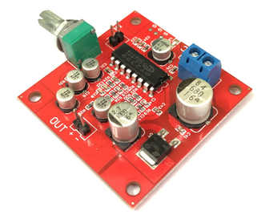
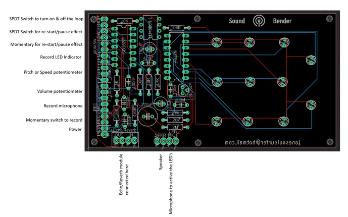
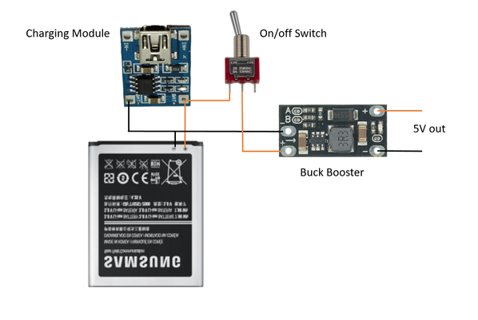

# LED & Sound Bending Machine

Source: https://www.instructables.com/LED-Sound-Bending-Machine/

---

## Introduction

On one of my regular trips to the junk store, I came across an old racing car game. The game itself was pretty lame but what caught my attention was the case. The design was pure retro awesomeness and I knew I had to build something with it.

After a little thought, I decided to combine a few other builds I have done in the past to make a sound bender with dancing LED's.

A sound bender is really just that. You can record sounds into a small IC via a mic and then twist a potentiometer to change the pitch. This can be done quite easily by circuit bending a cheap module from eBay. However, I decided to build a custom PCB which incorporated the voice recorder, dancing LED's and amp.

So what does it do?

Well, you can record a sound and twist and change the pitch. It also has echo and reverb module as well which gives it a whole other sonic dimension. You can pause or restart the sounds as well which gives you the ability to play it (kind of). All the while LED's are dancing around to the sound.

Check out the video of the build and the sound bender in action.

Hackaday have done a review on my project which you can check out [here](https://hackaday.com/2021/02/15/racing-game-crashes-into-its-next-life-as-a-sound-bender/)

Oh - and so Have Hackster which can be found [here](https://www.hackster.io/news/sound-and-led-bending-in-a-retro-toy-enclosure-c43a8bfa3c5d)

## Step 1: Parts & Tools

Parts:

1. Case. Ok - so you might be able to find the exact case that I used. Any old case will work really. You could use a project box and cut out a section for the LED's and use some opal acrylic to diffuse them. I'm sure you can find some old game case that would do the job

2. PCB and Components - Check the next step for the gerber files, parts list etc for the PCB

3. Potentiometer knobs - [eBay](https://www.ebay.com.au/sch/i.html?_from=R40&_trksid=p2380057.m570.l1313&_nkw=potentiomter+knob&_sacat=0)

4. Momentary Switches X 2 - [eBay](https://www.ebay.com.au/sch/i.html?_from=R40&_trksid=p2334524.m570.l1313&_nkw=momentary+switch&_sacat=0&LH_TitleDesc=0&_odkw=potentiometer+knob&_osacat=0)

5 On/Off Switches X 2 - eBay. I used [this one](https://www.aliexpress.com/item/4000065199110.html?spm=a2g0s.9042311.0.0.27424c4dIgsLmy) for the actual on/off switch. It has an LED in it which comes on when you record a sound.

6. Echo & Reverb module - [Ali Express](https://www.aliexpress.com/item/1005001638747835.html?spm=a2g0s.9042311.0.0.2dca4c4dnixKYy)

7. 50K potentiometer X 2 - [Ali Express](https://www.aliexpress.com/item/32977050982.html?spm=a2g0o.productlist.0.0.1db859a9GUdEQZ&algo_pvid=17e05547-5f92-4191-b98e-314442eb51d4&algo_expid=17e05547-5f92-4191-b98e-314442eb51d4-6&btsid=0b0a555a16124986976864426e879e&ws_ab_test=searchweb0_0,searchweb201602_,searchweb201603_). These will be used for the echo and reverb module

8. Battery. I have been using old mobile phone batteries lately in all my builds. you can usually pick them up for free. check out [this 'ible](https://www.instructables.com/Reuse-Old-Mobile-Phone-Batteries/) that i did on how to use the,

9. Buck booster - [Ali Express](https://www.aliexpress.com/item/4000322402819.html?spm=a2g0s.9042311.0.0.42bb4c4dPL4N2a)

10. Charging module - [Ali Express](https://www.aliexpress.com/item/4000124776208.html?spm=a2g0o.productlist.0.0.1ef7b20f6j4WQp&algo_pvid=6904fd2f-04f1-417b-a1e3-87340bddfb73&algo_expid=6904fd2f-04f1-417b-a1e3-87340bddfb73-7&btsid=0b0a555a16124988800436533e870d&ws_ab_test=searchweb0_0,searchweb201602_,searchweb201603_)

11. Speaker 8 ohm - [Ali Express](https://www.aliexpress.com/wholesale?catId=0&initiative_id=SB_20210204202212&isPremium=y&SearchText=8+ohm+speaker+computer)

## Step 2: Schematic and PCB

I designed the schematic and PCB in Eagle and have provided all of the info, including the gerber files in my [Google Drive](https://drive.google.com/drive/folders/1R84zMEe9ORIDCuXV8DiAW33dkEE0c7YB?usp=sharing).

All you need to do is to send the zipped Gerber files to a PCB manufacturer like JLBPCB (not affiliated) and they'll print them up for you. If you know how to use Eagle then you can play around with the circuits and boards as much as you want. If not then check out these 2 tutorials by Sparkfun, [schematics](https://learn.sparkfun.com/tutorials/using-eagle-schematic/all) and [board layout](https://learn.sparkfun.com/tutorials/using-eagle-board-layout) and you'll be on your way to schematic heaven.

I've also provided some info on how the components are conencted to the board.

- [Sound Bender - Schematic](pdfs/Sound Bender - Schematic.pdf)

## Step 3: Pulling Apart the Game

Ok - so in my excitement, I forgot to take some images of the game so I have had to use a dodgy image from the net. You can see that it's a pretty cheap looking racing game. What really caught my eye though was the case. It's such a cool looking design with it's retro angles and colour that as soon as I saw it, it was a forgone conclusion that i'd mod it in some way.

Steps:

1. Remove any screws holding the case together

2. Remove all of the parts inside

3. Once you have the case apart, I like to then give it a good wash. I managed to get most of the gunk off but some was too ingrained into the case. The previous owner has also written their name on the back which I managed to mostly remove with some Isopropyl

4. Last thing to do is to remove any gussets and pieces of plastic inside the case. You want to make as much room as possible to just cut away all those bits and pieces. I use a pair of wire cutters to remove most of these and then an exacto knife to remove the rest.

## Step 4: Working Out Where All the Knobs & Buttons Will Go

Once you have your case nice and clean and empty of any superfluous bits inside, it's time to start working out where all those buttons and knobs will go

Steps:

1. The first thing I wanted to do was to work out what I was going to add to the large hole on the right of the case. After some rummaging I decided to add a on/off switch there. The bonus of the switch I used is it has an LED light inside which I could utilize for the record LED on the sound IC

2. I slightly enlarged the hole and added the switch which I was happy with

3. Next I added the pots to the top of the case to see how much room I would have. It's a little tight but planning it out like this helped me visualize how to design the front panel.

## Step 5: Designing a Front Panel & Adding It to the Case

I wanted to make it as easy as possible to identify what each of the knobs and buttons do. I've made similar sound machines in the past and I always forget what each button and knob does! I decided to create a front panel in [Inkscape](https://inkscape.org/) and print it up on water decal.

Inscape is a vector graphics editor which you can download for free! I found it easy to pick up once you learn the basics. There's a lot of information available on how to use it and I would suggest you do a couple of the basic tutorials to familiarize yourself with the different features.

As my case was pretty unique you might have to play around with my design to suit your needs. I have provided the files in my [Google Drive](https://drive.google.com/drive/folders/1R84zMEe9ORIDCuXV8DiAW33dkEE0c7YB?usp=sharing). I've also provided the front panel in PDF so you can just print this out if you want to and uase it.

- [Sound Bender](pdfs/Sound Bender.pdf)

## Step 6: Adding the Water Decal to the Front Cover

Steps:

1. Once you have your design, you will need to print it up on special paper called water decal. Check out eBay or a stationary provider to get some

2. Cut out the design and place it in some warm water for about 30 seconds

3. Carefully pull it out of the water and slide the decal across the front of the case. Align it as necessary to any holes etc that might be on the front of the case

4. Squeegee out any left over water from the front and leave to dry for an hour

5. Once it it dry, add a few coats of clear coat to ensure it is protected

6. Once the clear coat has fully dried, you can start to drill out the holes into the case. I always use a centre punch to make drilling easier. Once that's done it's just a case of carefully drilling the holes to size. I used a step drill bit to do this.

## Step 7: Adding the Switches and Knobs to the Case

Steps:

1. I started with the bottom section of the case and added the switches and mic to this section

2. Next I added the 3 pots (actually there is a 4th one which is volume but I decided to add this to the side of the case) and secured them in place.

3. I then added the on/off switch and the knobs to the pots

4. Lastly, I added the on/off and momentary switches to the left of the case. i had to add a little superglue to hold the on/off switch into place. Not ideal (switches and glue don't really mix0 but if you just add a little then you should be ok.

## Step 8: Soldering the PCB

You can see in the first image that I designed the PCB to fit into the case. The LED's are at the top section and all of the components at the bottom.

Steps:

1. I always like to start soldering into place the lowest components which is usually the resistors.

2. Once these are al done I usually move onto the IC sockets and other components like transistors etc.

3. Next I did the capacitors but I probably should have done the LED's first - oh well.

4. Once everything is in place I always like to test out the circuit to make sure I haven't messed up anything. The good news it worked first go so now I was ready to start preparing the case for the rest of the parts.

## Step 9: Adding Parts to the Case

Now that I had my PCB all ready I next had to add off of the other parts to the case

Steps:

1. First I added the charging module. This is a small 3.7v micro USB charger which connects directly to the phone battery. To access the micro USB I made a small slit into the side of the case and glued it into place

2. Next I decided to add the speaker. Initially I wanted to add the speaker to the top section of the case but I ran out of room. I decided to add it to the bottom of the case which really didn't effect the sound. I made a few holes into the bottom of the case for the sound and glued the speaker into place

3. Next I added the reverb and echo module next to the speaker. You may notice some wires coming off the module, these are where the echo and reverb pots are connected to. You need to do a couple of mods to the module and I've done an Instructable on how to do this which you can find [here](https://www.instructables.com/Echo-Reverb-Box/)

4. Everything runs off 5v's so in order to increase the voltage on the mobile battery (which is rate to 3.7v's) I had to use a buck booster. i found these tiny ones on Ali Express which did the trick. they are set at 5V but you can increase to 9 or 12V as well.

5. I then wired everything up to the battery - I've included a wiring diagram so you can see how I did this. Note that the buck boosters positive is connect to the on/off switch. I have found in the past that buck boosters can slowly drain power if not disconnected.

## Step 10: Wiring Everything Up

There is a fair chunk of wiring to do to connect all the components up. I used some very thin ribbon cable from a computer to do this as wire seems to take up a lot more room than you think!

Steps:

1. Place the top and bottom pieces of the case next to each other.

2. I like to add solder to all of the solder points first before I start to add wires - makes things a little easier

3. Start to connect the wires up, making them as short as possible

4. Check your work as you go along and carefully make the connections.

5. once everything has been soldered, you are then ready to do a test. Initially I wasn't getting anything and when I rechecked my wiring I found that one of the wires to the switch had come off. I re-solder this and bam I got sound and lights. Record some sound and give it a test run. If everything is working it's time to close up the case and start to play around with the sounds

## Step 11: How Do You Use It?

It's pretty straight forward to use this little sound bender.

Steps:

1. First turn it on

2. flick the 'loop' switch up so the loop is turned off

3. I like to have the 'speed' knob about half way when I record. play around with it though and see what sounds you get with the 'speed knob turned up or down

3. To record a sound, press down the rec button and speak into the mic

3. Turn 'loop' back on.

4. You should hear the sound you made looping.

5. Try and turn the 'speed' knob the pitch can be changed to high or low

6. Next play around with the 'echo and reverb' knobs. You'll hear the sound you made 'echo'. the higher you turn the longer the echo

7. Next push the 'start/pause momentary switch'. This will either restart or pause the sound depending on what you have the 'start/pause' switch tuned to. This gives you the ability to play the sound bender and made some awesome sounds with the echo function.

What next?

1. We'll you could easily add a audio out so you can plug it into an amp and really get it pumping

2. You could also add an audio in easily to the mic section so you can record music or whatever sounds you want and bend to your hearts content.

3. There would also be plenty of circuit bends that you could do to the circuits, especially the echo/reverb module

## Downloads

- [Sound Bender - Schematic](pdfs/Sound Bender - Schematic.pdf)
- [Sound Bender](pdfs/Sound Bender.pdf)

---
*58 images archived*
