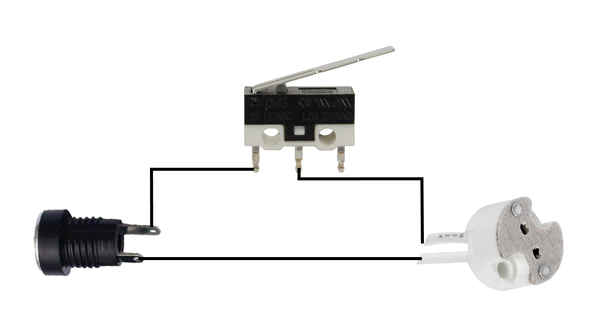

# Lamp Made From Found Objects

Source: https://www.instructables.com/Lamp-Made-From-Found-Objects/

---

## Introduction

I found this Fanta bottle from the 60's whilst digging in the back yard and thought it would be great to use in a lamp build. That's what usually happens with projects like this that I make - I find something and from there I base the build around it.

All the parts in the build are things that I had in my parts bins so it really is a lamp made only from found objects. The base is made from an old fence post, the body from a piece of 50mm copper and the switch is an old lock!

It's always tricky doing a step by step of a build like this as it will be hard to find the exact parts I used. However, hopefully I can give you some ideas how how you can build your own lamp with found objects you might have around your house.

There are 2 video's as well. A very short one of the finished lamp and one that goes for a little longer on the build.

## Step 1: Parts

Below is a list of parts that I used. I have also put some links (where I could find them) to where you can buy some of the parts i used

PARTS:

1. Old soda bottle. I used a Fanta bottle which is made from quite thick glass and is rippled (must be for grip!). eBay

2. Copper tube 65mm (body of the lamp) - You could use a 3" piece which is a similar size

3. Copper tube - 15mm. This piece of copper is used to hold the bulb inside the bottle

4. Small vintage lock - ok so you might have a problem trying to find one of these. However, I did find the exact one on eBay my typing in 'small vintage door lock'

5. Piece of wood for the base. Just find a nice, solid piece of wood to use. Mine was from a fence post and is red wood

6. G4 bulb socket - eBay

7. G4 LED globe - eBay. I used a 200 lumen globe

8. 9v DC power adapter. You could use 12v but I had a 9v one lying around which works fine - eBay

9. Other parts. The rest of the parts are just ad-hoc bits and pieces I had in my parts bin

## Step 2: Making the Base From a Chunk of Wood

The wood I used is red wood and was from an old fence that a friend had pulled down

STEPS:

1. First thing I needed to do was to work out how big to make the base. I put the copper tube on top and marked out where to make the cut

2. Once I had cut the wood to the size I wanted, I next had to give it a good sanding to reveal the beautiful underneath. I used my belt sander to do this which took some time. The wood wasn't square as well so I had to do some extra sanding to get it as square as possible

3. I also rounded the edges to give a better finish to the base. I probably should have used my router to do it but I just sanded them round in the end.

4. Once I had the shape I wanted I used some finer grit sandpaper to give it a smooth finish

## Step 3: Making Some Holes to Add Parts to the Base

There were 3 holes needed in the base in order to be able to add the power socket, on/off switch and the main hole on top which has all the wires etc in it.

STEPS:

1. I made the larger hole in the top first which a 32mm hole bit. It goes about half way through the wood. The hole was made to the centre of the top of the wood as well.

2. I also made 2 other holes, one on the front and back of the base. These holes needed to go right through to the larger hole so I could connect wires up to the switch and power socket

## Step 4: Designing the Body of the Lamp

I had a pretty rough idea on how I was going to build that lamp. However, a build like this is constantly changing (for me at least) as I'm always thinking what else I could add and whether I need to change the design. The body though I knew I wanted to use the copper tube as the Fanta bottle fitted nicely inside.

STEPS:

1. The first thing I did was to give the copper pieces a good polish. I used a metal polish to do this. I also used some clear acrylic on each of them to ensure that the copper wouldn't tarnish again. The finished polish isn't to a high sheen but I didn't want it to look new

2. Next thing I did was to place the large copper pipe onto the wood. I wasn't really happy with the way it looked so I went into the parts bin and found this old wheel. fortuitously, the copper fitted nicely inside the wheel and gave a nice finish to the base section of the lamp.

3. As I'm putting parts together I'm constantly thinking 'how the heck I'm I going to connect all these parts!' I kind of left it for the moment as I had an idea on how to connect the smaller piece of copper tube to the wheel

## Step 5: Connecting the Smaller Copper Tube to the Wheel

Ok - I'm going to stop calling it the 'smaller piece of copper tube' and call it the light rod from now on.

In order to connect the light rod to the base of the wheel, I decided to jam a nut inside the tube which I could then add a bolt through the wheel and connect them together that way

STEPS:

1. I found nut slightly larger then the ID of the tube. To jam it in there I just laid the nut onto a hard surface and with a hammer bashed the top of the copper until the nut was wedged inside

2. I then used a bolt to connect the light rod to the base of the wheel. To tell you the truth I also added some very good quality super glue as well to make sure it would go anywhere. it's only one of the two times I used super glue in this build - promise!

3. To be able to secure the body of the lamp to the wheel, I drilled 3 holes into the side of the wheel, used a die cutter to add some thread to the holes and added 3 small bolts. I reckon I broke about 8 drill bits trying to drill into the hardened steel! Now all I needed to do to secure the body of the lamp (large copper tube) was to place it into the wheel and tighten up the bolts

3. Now I had that done I decided to move onto the on/off switch.

## Step 6: Making an On/Off Switch From an Old Lock

I was just going to add an old switch that I had lying around but after a bit of rummaging around in the parts bin I found this old lock buried deep. After a little messing about I decided that it would be an awesome way to turn off and on the lamp!

STEPS:

1. The first thing I did was to give the lock a bit of a polish. I only wanted to bring out the brass on the lock so only gave those sections a good polish.

2. Next I slightly modified the inside of the lock in order to be able to fit the momentary level switch inside. Once I was happy with how it worked I soldered a couple of wires to the switch and super glued it into place. Yes, this is the second place I added some super glue!

3. I also added a little strip of plastic to the inside of the lock to ensure the switch didn't short on the metal.

## Step 7: Adding Some Brackets to the Body of the Lamp

Initially I wasn't going to add anything on top of the lamp. However, I found this cage in the parts bin and thought it would look great as a surround over the Fanta bottle.

STEPS:

1. After working out how far the brackets had to come out, I bent a piece of copper 90 degrees and then cut them to size.

4. Once I have 4 of them made, the next thing to do was to solder them to the copper tube body. I used a small alligator clip to hold the bracket into place (also added some flux as well) and then placed a strip of silver solder on top. I used silver solder (its about 5% silver) as it holds better then just lead/tin solder.

5. To ensure it melts right, I heated up the metal around the solder and the bracket until the solder just started to melt. I then place the heat directly onto the solder.

6. I did it 3 more times and voila - I had 4 brackets attached to the top of the body of the lamp

## Step 8: Working on 'The Cage' for the Lamp Surround

Here's the cage surround I was talking about in the last step. You can see why now I needed 4 brackets soldered onto the body of the lamp. I wish I could remember what this come off but I have no idea. Suffice to say it was protecting something hot!

STEPS:

1. To jazz up the surround I decided to add some copper from an old light fitting. The first thing I did was to cut out the centre section. I did this with a dremel and filed the edges to ensure they were nice and smooth.

2. I then drilled a couple of holes into the cage on the top and secured the top section of the light fitting to it with a couple of nuts and bolts

3. The other part of the light fitting I also used as well. You'll see where in a couple of steps.

## Step 9: Adding the Fanta Bottle Into the Copper Body of the Lamp

I had to come up with a way to secure the bottle inside the copper tube lamp body. I initially tried some O rings but that didn't work as the O rings were too thick. I then though that a strip of rubber might work and found an old tyre tube which I used to secure it into place. Actually, I was really pleased with the solution I worked out here. Using rubber ensures that the glass is protected and it really makes a great, tight fit.

STEPS:

1. First thing I did was to cut a long strip of rubber from a bike tyre tube.

2. I then wrapped it tightly around the top section of the bottle 3 times. I didn't bother sticking it down once wrapped as it stayed in place once I pushed it into the copper

3. So when I pushed it into the copper, I gave the bottle a bit of a twist until the rubber was hidden inside the copper tube.

4. Last thing to do is to make sure the bottle is sitting straight inside the copper tube.

## Step 10: Adding the Modified Light Fitting to the Lamp

Remember that lamp fitting that I cut the top off? Sure you do - it was like 2 steps ago. Well I used the bottom half as a surround to cover the brackets that i added to the copper tube body.

STEPS:

1. The first thing I had to do was to make sure it would fit over the Fanta bottle and sit nicely on the brackets - it did.

2. If you have a look at the image of the light fitting surround, you will see that there are 3 screws in it. I was going to use these to secure the ring to the body of the lamp but it turns out I didn't have to. The cage section actually golds the surround in place so I got rid of the screws in it.

3. The next thing I did was to secure the cage over the bottle and to the brackets via some nuts and bolts.

## Step 11: Staining the Wood Base

Now that all of the parts that need to be added to the base were done, it was time to then give it a stain

STEPS:

1. The stain I used was called 'aged teak' and I have used it in a lot of builds. It works well on lots of different types of wood and I had no complaints using it on this red wood base

2. With a cloth, I carefully added the stain onto the wood

3. Once it has been covered I left out in the sun to dry.

4. Adding more coats will mean the wood will go darker and take on more of an 'aged' look. However, after 1 coat I was happy with the finish so left it at that

## Step 12: Adding the Lock Switch to the Front

This was pretty straight forward as I had already drilled the holes in the wood and modded the lock into an on/off switch.

STEPS:

1. First, I placed the lock in the position I wanted it on the front of the wood

2. Next I threaded the wires from the lock switch through the hole and out through the large top hole

2. I then drilled 4 holes for the screws and attached the loc

Wiring up everything will come a little later

## Step 13: Adding the Power Jack and LED Globe

STEPS:

1. The first thing I did was to solder a couple of long wires to the G4 socket that the LED globe goes into.

2. These wires were then threaded through the smaller copper tube which is attached to the wheel. I had to drill a hole into the side of the copper tube as the other end was blocked by the bolt which was holding the wheel to the tube

3. I added a little bit of superglue to the socket (ok so I used superglue 3 times, who's counting though...) and glued it to the top of the copper tube

4. Next was to add the power jack to the other side of the base and then wire up the switch, jack and globe. I've added a wiring diagram to make it easy to understand how I did it.

## Step 14: Adding the Light Rod and Body of the Lamp to the Base

So close now. This is the most exciting part of the build for me, getting to the end and seeing the finished build in front of me. I'm always a little nervous though - what happens if it doesn't turn out the way I wanted or doesn't work! Luckily for this build it turned out exactly as I imagined it would.

STEPS:

1. To secure the wheel and light rod to the wood base, I used a couple of small brackets and just screwed it down directly onto the wood

2. To secure the body (large copper tube) to the base, I just place it into the wheel and tightened up the screws in the wheel which keeps the body in place

3. Big moment - drum roll please ............

And we have light!

The LED bulb I used was 200 lumen. It's pretty bright which is fine but if I wanted something a bit less in brightness i could use say 100 lumen globe.

---
*82 images archived*
