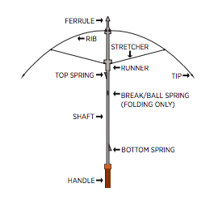

# Light Sensitive Junkbot

Source: https://www.instructables.com/Light-Sensitive-Junkbot/

---

## Introduction

Make your own junkbot that reacts to the amount of light in the room.

The only parts you’ll need to make the actual junkbot is an old shaver and an umbrella. The electronics inside are a little more complicated but I’ve included step by step instructions to help.

The circuit is known as a Knight Rider circuit. Anyone who has been the TV show will instantly recognise. For those who have had the misfortune to have not seen the show I’ve included a link below for your viewing pleasure.

In the original circuit, the LED’s speed is controlled by a Potentiometer. In this build I replaced it with a photo cell so the LED’s speed is relative to the amount of light in the room. Turn the lights down and the Junkbot goes into rest mode and his LED’s slowly move back and forth. Turn a light on and bam! He’s awake and the LED’s move swiftly back and forth.

Let’s get started

[Knight Rider](https://www.youtube.com/watch?v=Mo8Qls0HnWo)

## Step 1: Parts and Tools

Parts:

Junkbot

1. Old Shaver – [eBay](https://www.ebay.com.au/sch/i.html?_from=R40&_trksid=p2380057.m570.l1313.TR12.TRC2.A0.H0.Xvintage+shaver.TRS0&_nkw=vintage+shaver&_sacat=0)

2. Umbrella. You want to use a small, portable type of umbrella as the rib and stretcher assembly is small and makes for better legs.

Electronics

1. 4017 IC – [eBay](https://www.ebay.com.au/itm/10PCS-CD4017-CD4017BE-4017-DECADE-COUNTER-DIVIDER-IC-S/191736127618?hash=item2ca45d2082:g:nDQAAOSwpRRWnZQp)

2. 555 IC – [eBay](https://www.ebay.com.au/sch/i.html?_from=R40&_trksid=p2047675.m570.l1313.TR10.TRC0.A0.H0.X555+ic.TRS0&_nkw=555+ic&_sacat=0)

3. 1uf Capacitor – [eBay](https://www.ebay.com.au/itm/120pcs-1uF-470uF-12-Types-Electrolytic-Capacitors-Assortment-Kit-Assorted-Set/351774763287?epid=2113501882&hash=item51e768e917:g:knwAAOSwSwpbaUUR)

4. cds photoresistor (Photo Cell) – [eBay](https://www.ebay.com.au/itm/30PCS-Photoresistor-GL5516-LDR-CDS-5mm-Light-Dependent-Resistor-Sensor-Arduino/123284262861?hash=item1cb4508fcd:g:0MAAAOSwBgVbEOWL)

5. 68k Resistor – [eBay](https://www.ebay.com.au/itm/500pcs-Resistor-Network-25-Commoned-Resistor-10-680K-Ohm-Various-Values-NEW/222642441421?hash=item33d6860ccd:g:vuMAAOSwvTBZp31M)

6. 120R Resistor – [eBay](https://www.ebay.com.au/itm/500pcs-Resistor-Network-25-Commoned-Resistor-10-680K-Ohm-Various-Values-NEW/222642441421?hash=item33d6860ccd:g:vuMAAOSwvTBZp31M)

7. Prototype Board – [eBay](https://www.ebay.com.au/itm/10x-DIY-Prototype-Paper-PCB-Experiment-Board-Bakelite-Circuit-Board-4-8x13-3cm/142759746052?hash=item213d24da04:g:sFUAAOSwcEha0XL3)

8. 10 X 1N4148 Diodes – [eBay](https://www.ebay.com.au/itm/50-PCS-1N4148-DO-35-switching-signal-Doide-NEW/302269820830?hash=item4660af6f9e:g:OvoAAOSwuTxV~SR~)

9. 6 X LED’s – [eBay](https://www.ebay.com.au/itm/100pcs-Lot-3mm-White-Green-Red-Blue-Yellow-LED-Light-Bulb-Emitting-Diode-LampsQ/372129068208?epid=19015763205&hash=item56a49ef4b0:g:Z7UAAOSwE-laAWhm)

11. 9V Battery Holder – [eBay](https://www.ebay.com.au/sch/i.html?_from=R40&_trksid=p2047675.m570.l1313.TR11.TRC1.A0.H0.X9v+battery+holder.TRS0&_nkw=9v+battery+holder&_sacat=0)

12. Thin wire

Tools:

1. Soldering Iron,

2. Drill,

3. Epoxy Glue

4. Pliers

5. Good wire cutters

6. Stanley Knife

7. Hot Glue

8. Screwdrivers and the usual other basic tools for a build like this

## Step 2: The Circuit and Breadboarding

The first thing to do is to breadboard the circuit. It’s not too difficult but it can get a little tricky when adding all of the diodes in place. If you find that after prototyping the circuit that an LED doesn’t flash, then you probably have a diode round the wrong way.

The original circuit schematic can be [found here.](https://gateway.zscloud.net/auW?origurl=http%3A%2F%2Fschematicboard%2eblogspot%2ecom%2f2015%2f10%2fled-knight-rider-using-4017-and-555-ics%2ehtml&_ordtok=HS43WV3Z6sbVs50jHM0TZ4QD3q) You will notice that I have modified it slightly to simplify and ensure that it works with a photo cell instead of a potentiometer.

Once you have the circuit all worked out and running, it’s then time to build it

## Step 3: Adding the IC's and First Connections

Steps:

1. Solder the IC's to the prototype board. Solder the 555 IC first and then the 417 IC. Leave a small gap between them so you can place wires between them at a later time

2. I first wired the 555 IC up and then the 4017. Attach pin 1 from the 555 to ground

3. Solder pin 2 and 6 together. I usually do this by connecting the 2 pins together with leg from a resistor.

## Step 4: Capacitor and More Wiring on the 555

Steps:

1. Solder the positive leg of the 1uf capacitor to pin 2 and the negative to ground

2. Solder pin 4 to positive

3. Solder the 68K resistor from pin 7 to positive

4. Solder pin 8 to positive

## Step 5: Connecting the Positive, Negative and the 2 IC's

On the prototype board, on either side, there are 2 strips for ground and positive. To connect these together I added some wire to each strip and soldered these to the corresponding one. This way I could have a positive and ground on both sides of the prototype board.

Steps:

1. Attach a wire to each of the positive and ground strips on the prototype board and connect them together

2. Solder a wire from pin 3 on the 555 to pin 1 on the 4017 IC

3. Solder 2 wires to pins 6 and 7 on the 555. On the end of these solder the photo cell.

## Step 6: Connecting the 4017 IC

Steps:

1. Connect pins 8, 13 and 14 to ground

2. Connect pin 16 to positive

## Step 7: Adding the Diodes

You need to connect a bunch of diodes to the 4017 which are then connected to the LED's. There isn't an easy way to describe how to do this so make sure you read the schematic carefully and breadboard the circuit before you start to solder every thing together

Steps:

1. Connect pins 6 and 7 with a diode making sure it is orientated correctly.

2. Solder a diode to pin 1 and pin 10 as shown in the 2nd image

3. Connect pins 4 and 9 together with a diode.

4. Solder a diode to pin 2 and 9

5. Solder a diode between pins 2 and 11

## Step 8: Soldering the LED's

Steps:

1. Cut a strip of prototype board 2 holes wide

2. Place the LED's into the strip and make sure that the polarities are orientated the same way

3. Solder the legs to the strip

4. Solder all of the negative legs together

5. Lastly, solder the 120R resistor to one of the negative LED legs

## Step 9: Attaching the LED's to the Circuit Board

I decided to complete the circuit board to make sure that everything worked correctly before I put it into the Junkbot.

Steps:

1. Solder a length of wire to each of the positive legs of the LED's

2. Follow the schematic and solder each of the wires to the correct diode.

3. You will need to attach an on/off switch later on but to test it out, solder the 9v battery terminal to the positive and ground on the circuit board

4. Attach a battery and test. the LED's should move back and forth. If you cover the photo cell, then the LED's should slow down. If you find that one of the LED's doesn't flash it's probably because you have wired one of the diodes round the wrong way. trace back which one it is and replace it.

If everything works as it should it's then time to add it to the junkbot.

## Step 10: Pulling Apart the Umbrella

The legs are made out of the rib and stretcher parts of the umbrella. I have included a drawing which shows these parts so you know what I’m talking about.

Steps:

1. First cut away the thread that is holding the canopy to the tip, rib and stretcher. You want to remove all of the canopy material so you are only left with the umbrella skeleton

2. Next cut the rib and stretcher on the umbrella as I have done below. These will form the basis of the legs

3. Don’t worry about refining the legs too much, and cutting them to size it’s best to do this once you have the shaver ready for them so you can work out how long you want to make them

4. Remove the tips from the umbrella if you have removable ones – you can use these as feet.

## Step 11: Making the Legs

Steps:

1. First, decide how long you want to make the legs. It's probably to make them longer then necessary so you can trim them later if you want to.

2. Cut each of the ribs (this is the section of the leg that goes from the "knee" to the "foot" the same length on each of he 6 legs

3. Cut the stretcher (This is the section that goes from the shaver to the "knee"). You will also need to cut the thin wire which forms part of the leg. The wire should be longer then the stretcher section by about 20-25mm. You may need to trim them later

## Step 12: Pulling the Shaver Apart

Steps:

1. Remove the blade at the front.

2. Un-screw the 2 screws holding the case together

3. Remove any screws inside the case and remove the motor

4. Also, remove the on/off switch and the plastic blade release. Keep these as you will need to replace them later in a slightly modified version

5. Lastly, Check to make sure that the circuit and battery fit inside the case. If you are also using a Ronson shaver like mine you should be able to fit everything inside. Remember though you need to add a switch and the photo cell as well.

## Step 13: Adding the Legs to the Shaver

Next step is to secure the legs into the shaver. Remember that you need to also fit inside the shaver, a battery and the circuit board so it is important that the legs aren't pushed too deep into the body of the shaver. You can always time though later if you find that there isn't enough room.

Steps:

1. I started with one leg to work out how it would sit and if I needed to reduce the size of the legs at all. Once I figured that the size was right, you can start to drill the holes in the case. Make sure that the holes are a tight fit for the legs.

2. Push the first 3 legs into place and trim the wire if you have to (I did)

3. Next, place the circuit board into the shaver. If you don't you might struggle trying to put it in when all 6 leg are in place

4. Push the other 3 legs int the shaver body

## Step 14: Adding the Switch, Photo Cell and Rest

Steps:

1. I found that the best spot to add a switch is at the back of the shaver. Drill a hole and attach the switch

2. Next I had to pull the switch apart and trim some of the plastic of the release section so they would fit back into the shaver. Glue them into place with some epoxy.

3. Drill a hole into the top of the shaver just big enough to add the photo cell. Add some superglue to hold it in place.

4. Next you have to glue the LED circuit board into place. I just used some hot glue for this as it's quick drying.

5. Lastly, screw the shaver back together and place the shaver head in place

6. That's it! turn him on and what him react to the light.

---
*66 images archived*
