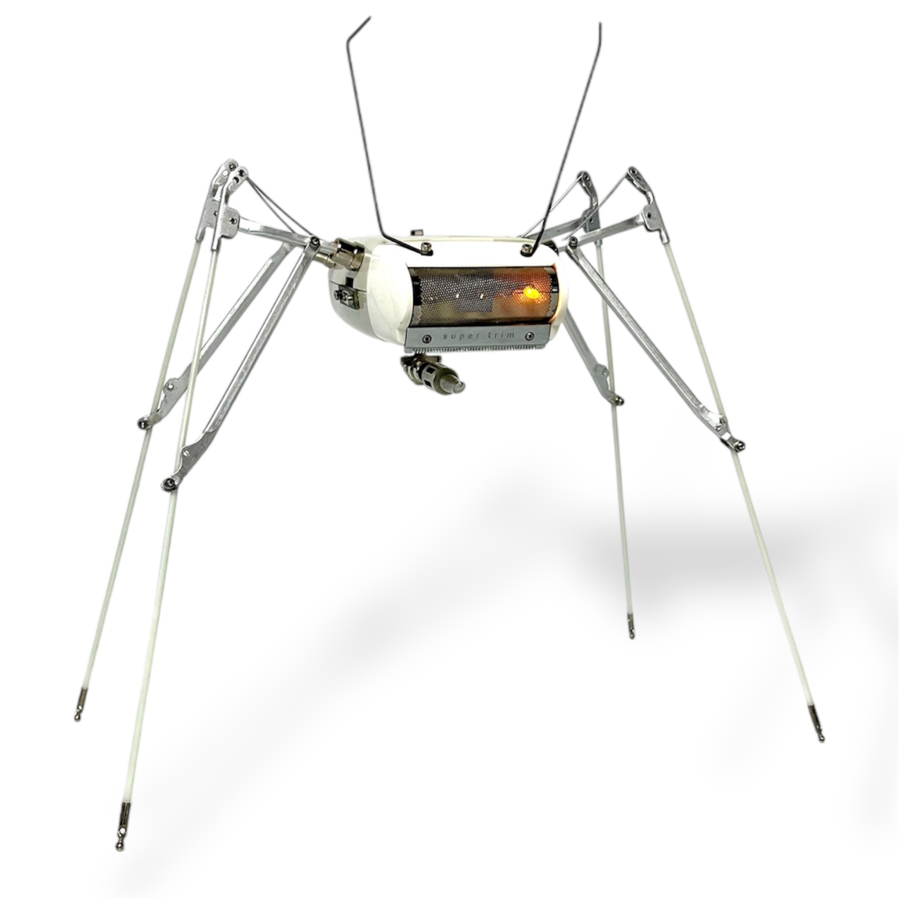
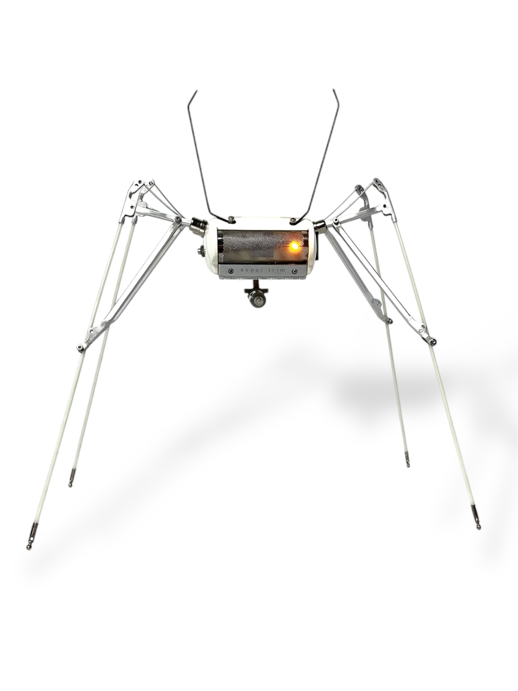
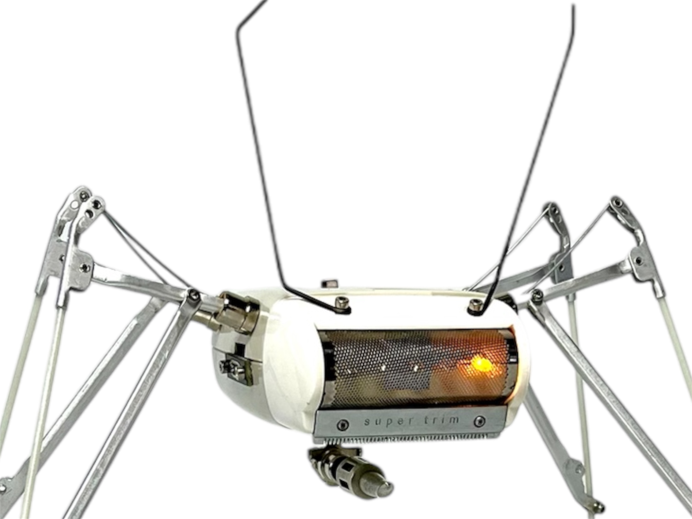
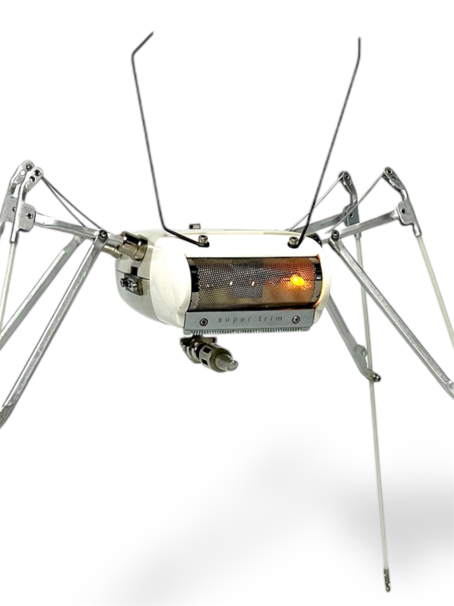
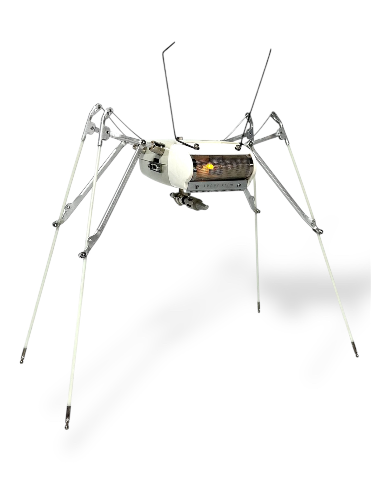
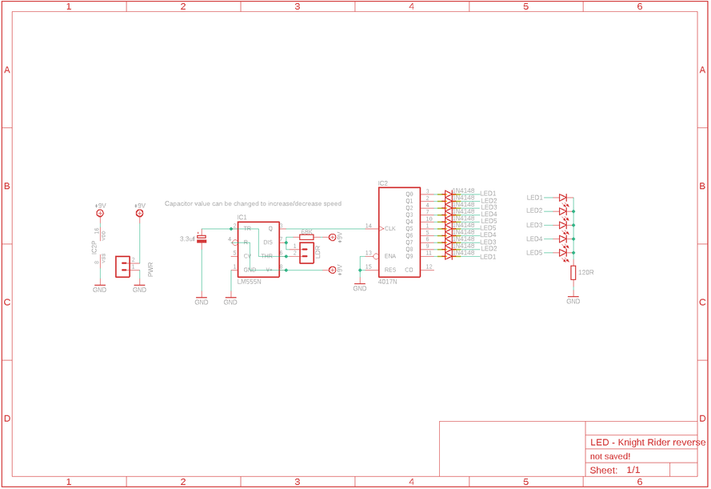
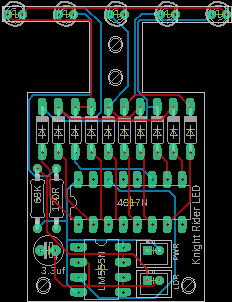
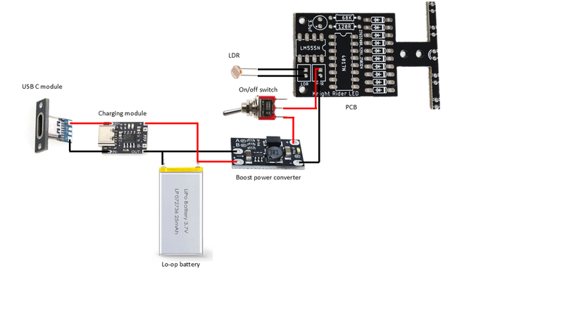
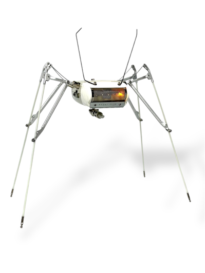

# Make a Junkbot From an Old Shaver & Umbrella

Source: https://www.instructables.com/Make-a-Junkbot-From-an-Old-Shaver-Umbrella/

---

## Introduction

I’ve made a few junkbots over the years – there is something about finding some random part and turning it into a little robot that makes my heart happy.

The junkbot in this ‘ible started life as an electric shaver and a broken umbrella! A couple of non-conspicuous items that would have been probably thrown away and ended up in landfill.

I actually found the vintage shaver at a shop that is located at a tip, so it had been thrown away at one stage in its life.

I also wanted to add some way that the junkbot could interact with the world, so I built a custom circuit board. The PCB is an LED chaser circuit and includes a light dependent resistor (LDR) which is reactive light. The more light the faster the LED’s move!

This isn’t a hard build, but it will take some planning. You might not be able to find the exact parts that I used but that’s what fun about making Junkbots – trying to find just the right part to use!

I have also done an ‘Ible on how to build Junkbots which you can find here.

## Supplies

PARTS:

- Body: Old electric Shaver– mine is a Ronson. Go onto eBay or check out your local junk shops to find one
- Legs: Umbrella. You want to use a small, portable type of umbrella as the rib and stretcher assembly are small and make for better legs. However, there is no reason why you couldn’t use a normal umbrella if you want longer legs
- Leg Mounts: 6 X Panel Mount RCA Female Plug Jack Connector – Ali Express
- I also put together a small phaser gun that sits underneath the junkbot. This is made from bits that I found – if you want something the same then you’ll need to raid your junk bin and make one
- Antenna – still wire taken from a typewriter.
- PCB information inc parts list can be found on the next step
Electronics

- PCB and Parts - see next step
- Voltage boost converter module - Ali Express
- Li-po or old mobile phone battery (see this Ible on how to reuse mobile phone batteries
- USC C Charging module – Ali Express
- Toggle Switch – Ali Express
- Thin wires
TOOLS:

- Drill
- Dremel

## Step 1: PCB

PARTS:

PCB - you will need to get one printed from a company like JLCPCB (not affiliated) I have provided all of the files you will need to get yours printed which you can find in my GitHub page. If you are unsure how to go about getting a board printed, then you are in luck as I have made a 'Ible on how to get it done which you can find here

I have also included a PDF of the parts list which you can find attached to this step

- 4017 IC – Ali Express
- 555 IC – Ali Express
- 3.3uf Capacitor – Ali Express
- Light dependent Resistor (LDR) – Ali Express
- 68k Resistor – Ali Express
- 120R Resistor – Ali Express
- 10 X 1N4148 Diodes – Ali Express
- 5 X LED’s – Ali Express
- Voltage boost converter module - Ali Express
- Li-po or old mobile phone battery (see this Ible on how to reuse mobile phone batteries

## Step 2: Removing the Ribs and Stretchers From the Umbrella

The legs are made up of arms which consist of the rib, rib end (tip) and stretcher parts of the umbrella. I have included a drawing which shows these parts so you know what I’m talking about.

STEPS

- First cut away the thread that is holding the canopy to the tip, rib and stretcher. You want to remove all of the canopy material so you are only left with the umbrella skeleton
- The stretcher and ribs are connected to the runner section of the umbrella. There is usually some wire holding the parts to the runner which you can cut away. This will allow you to remove the rib & stretcher sections. These will form the basis of the legs

## Step 3: Forming the Legs – Part 1

STEPS:

- A leg is made from the rib and one of the stretcher sections. You will notice that there is wire along the stretcher sections. It is used to keep the umbrella arms taut.
- Cut the wire and the stretcher arm away from the rest of the umbrella arm and then trim the stretcher to aprox 40 to 50mm long (see image 2)
- To secure the wire in the stretcher arm you need to bend the stretcher around the wire. I used a pair of plyers to do this. Once you have moved the rib to the position that you want the leg you can then trim the wire (image 3)
- You now have the beginnings for the first leg. – you will be able to adjust the legs later so don’t worry too much about the angle. However, you should at least place it against the body of the shaver and make sure you are happy with the angle as you will be using this leg later as a template for the rest

## Step 4: Forming the Legs – Part 2

STEPS:

- Now it is time to add a stretcher part to the leg to give it some rigidity and a better look!
- First, remove one of the stretcher arms that is connected to the rest of the umbrella arm. I used a drill to drill out the rivet holding it in place
- Now grab a Dremel or small hacksaw and make a slit to the back of each end. This will allow you to open up those sections so they fit onto the leg like you can see in image 6
- Once you have the stretcher in place and your happy with the placement, you will now have to drill a small hole into the stretcher arm that makes up the top part of the leg so you can secure the other stretcher into place.
- You can secure the stretcher into place by using some M2 screws and nuts. Don’t do the nut up too tight around the rib for the moment. You can make adjustments later if you need to to the angle of the legs and then tighten them up when he is standing as you want him to.
Do this another 3 times!

## Step 5: Removing the Guts From the Shaver

STEPS

- This is a pretty straight forward step – removing the insides from the shaver. I don’t have too many images as I removed the insides ages ago, but you’ll be able to work it out easily
- Remove the head section of the shaver and put to one side
- Un-screw the 4 screws holding the shaver together
- Now start to remove the parts from the inside. You won’t need to keep any wires or the actual motor of the shaver so they can be kept for other projects.
- There is a metal chassis inside which has a button attached to the side so you can remove the head section of the shaver. You’ll need to keep this in place, but you can remove any bits that are sticking up with a dermal. You’ll need as much room as possible if you are going to fit the electronics and battery inside

## Step 6: Adding the Leg Holders and USB C Module

You need a way to hold the legs in place. For this I used some audio jack connectors (see parts list). These worked well as they have a screw and nut section which can be used to connect them to the shaver.

STEPS:

- The first thing to do is to position the jack connector against the shaver to determine the best positions to drill the 4 holes for the legs. I added mine to the top section of the shaver as this ensured that the metal chassis that fits into the bottom would be in the way.
- Drill the holes and then attached the audio connectors. You an also now to try and fit the legs into the audio connector holes. You may need to squish then ends of the legs a little more with some plyers to ensure that they fit right.
- To be able to re-charge the battery, you’ll need to be able co connect it to a USC C connector. I decided to attach mine to the switch section on the shaver.
- Place the USB C module against the shaver and mark where you need to drill the holes.
- Use a M2 drill bit to drill a couple holes and secure the module to the side of the shaver using some screws and nuts. We’ll connect it later to the battery.
- Once done, it's time to stick the legs into place and see what he looks like!

## Step 7: Leg Positioning

Now it’s time to put the legs into the body and see how everything looks.

STEPS:

- Pick up a leg and push it into the audio connector hole. You may need to squash the stretcher arm metal a little more in order for it to fit. You want it a good, tight fit, that way you won’t have to use any glue and will be able to move and position the legs whenever you like
- Do the same for the next 3 legs and stand your Junkbot up. If he is little a little wobbly on his feet, then move the legs around until he is standing with all 4 feet on the ground. You can also make the stand of each leg shorter or longer.
- Once you have him positioned in the way that you like, tighten up the screws that are holding the stretcher arm around the rib which will lock the legs into place

## Step 8: Giving Your Junkbot Some Personality

This bit is entirely up to you. You might be happy to keep your junkbot only having the minimal parts attached or you might want to customize yours. Here’s what I did.

STEPS:

- I added some antenna to the head section of the shaver. These were wires that I pulled out of an old typewriter. I secured them into place with some M2 screws and nuts.
- I made a phaser rifle thingy that I attached to the bottom of the shaver. It makes him a little more menacing, but I like the idea that these Junkbots have seen some sh*t!
- That’s really it. I left the original hardware in the back of the shaver which I also liked and also kept the brand name sticker on the top.

## Step 9: Soldering the Circuit Board

The PCB is pretty straight forward to solder. You'll need to make sure that the LED's are orientated right (pos and negative) and also ensure that the cap is lying down to save room.

STEPS:

- As always, start with the lowest profile components - in this case it's the resistors.
- you can now move onto the diodes and solder these into place
- Next move onto the IC's. I decided not to add IC sockets as I wanted to keep the profile as low as possible. There's always a small risk that the IC is faulty but if it is you can always de-solder it.
- Now you can solder the JST connector in place if you are using one. It isn't necessary as you can just solder wires directly to the PCB
- The capacitor can now be soldered into place. As mentioned above, you should lie the cap down to help save room.
- For the LDR, as this will be placed so it can detect light, just add some thin wire to the solder points on the PCB. You can connect the LDR up later
- The last thing is to solder into place the LED's. Place the first LED into place and bend 90 degrees. Make sure that it is orientated right and solder into place. Do the same for the rest of the LED's
- Best to also test your PCB as well once finished to make sure everything is working.

## Step 10: Power

Now that you have your PCB done, it's time to wire up the power section..

STEPS:

- The first thing to do is to mock up where everything is going to go to ensure it all fits inside the Junkbot. Add the battery to the bottom section of the shaver. Place the PCB on top and see if you can close the shaver up. You can? good. If not, then you might have to make some more room inside the shaver by trimming away superfluous bits inside.
- Now that you know everything fits, it's time to wire up everything. I have provided a wiring diagram which will show you how to connect the parts up. Try and use thin wire - I like to use computer ribbon cable, as wire can take up a lot of room
- First - work out the best position for the the charging module to be attached to the battery and superglue it into place.
- I used a couple resistor legs to connect the charging module solder points to the battery terminals
- Now do the same thing for the power converter module. The power converter will increase the voltage from 3.7V to 9V. You need to remove the little 0 ohm resistor in 'section A' on the module. You can use a exacto knife to cut it off - they come of easily and are meant to be removed.
- Note - the power converter module also has a small blue LED which is a power indicator. There is another SMD resistor right next to the LED (indicated by an oval), which you should also remove with an exacto knife.
- Now superglue it also to the top of the battery and connect it to the positive and negative of the charging module
- Add a couple thin wires to the 'input' section of the charging module and connect these to the USB C module. This will allow you to power up the battery externally.
- Plus in a USB C charging cord and charge up the battery.

## Step 11: Connecting the PCB, On/off Switch & LDR

Right! now it's time to connect everything together and close up your Junkbot!

STEPS:

- Use the wiring diagram I made in step 10 to help you work out how to wire everything up.
- Connect the positive from the output of the power booster module to the switch and then connect the other leg of the switch to positive on the PCB
- connect ground from the power booster module to ground on the PCB
- Drill a couple small holes in the top of the shaver for the legs of the LDR to go through. solder the legs to the LDR wire on the PCB
- You'll need to work out the best way to add the PCB into the Junkbot so the shaver closes up. In my initial attempt, I found that the PCB sat too high so had to add a small wedge of wood under the PCB and secure it inside the shaver at an angle. As long as the LED's are in the middle of the shaver head, then it doesn't really matter too much how the PCB is angled.
- I used some glue to secure this into place
- Now you can carefully place the top back onto the shaver and secure to the bottom section with screws.
- Add the shaver head back into place
I think that's everything! how turn on your Junkbot and watch him scan the room for potential enemies to neutralize! As it gets darker, the LED's will slow down but if it gets brighter, they'll speed up. Pretty cool!

---
*71 images archived*
