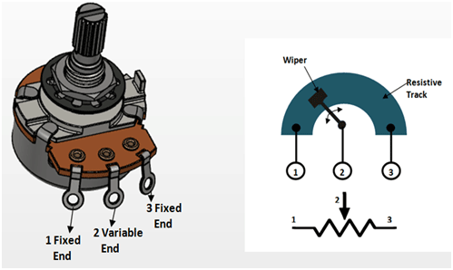

# Make a Ribbon Controller

Source: https://www.instructables.com/Make-a-Ribbon-Controller/

---

## Introduction

Ribbon controllers are a great way to control a synth. They consist of a touch-sensitive strip that lets you control pitch continuously. The electrically conductive strip called 'velostat' that responds to changes in voltage or resistance caused by moving your finger along its surface. These changes in voltage can be applied to any number of voltage-controlled oscillators, filters or amplifiers in analog synthesizers.

The basic design of a ribbon controller is fairly simple. It acts as a linear potentiometer that generates different control voltages depending on where it is touched. Think of it as a rotary knob that has been “unrolled". You could also think of it as a striped down slide pot.

Making your own is pretty simple and you'll only need a few parts to do it. I've also included a schematic for a small synth that I have made that will allow you to test and play the ribbon controller. I haven't explored fully yet what it is capable of but I will definitely be including an output for all the synths i make going forward so I can plug this into them.

Hackaday did a review of the ribbon controller which you can find here

## Step 1: PARTS & TOOLS

Parts:

1. Copper Strip 19mm wide X 215mm long - eBay. Most hobby shops will have it too in 300mm lengths

2. 3 X Copper Strips 6.3mm wide X 300mm long - eBay. Again, most hobby shops will have it in 300mm lengths

3. Velostat Sheet - eBay or Core electronics if you are in Australia

4. Masking Tape - eBay

5. Aluminium or copper tape - eBay or eBay

6. Polystyrene Tube 3.2mm - eBay or hobby shops

7. Clear plastic A4 Binding Cover - eBay or any office supply place

8. Jack input - eBay

9. Length of wood to mount the ribbon controller on. Not necessary but gives a nice finish.

Tools:

1. Stanley and/or exacto knife

2. Double sided tape

3. Good pair of scissors

4. Soldering Iron

## Step 2: The Basic Design

Below is a drawing of the basic design of the ribbon controller. Take some time and look at the image so you get the gist on how this is put together.

You will notice that there is a main copper strip and 3 smaller ones. The smaller ones form a point where you can attach wires. The main copper strip and the 2 smaller ones shown attached to it form the ground. The 2 smaller ones are connected to the main one via some aluminium tape which ensures that they form one complete ground plate

Next there is some masking tape to isolate the ground from the velostat and the other copper strip. It's important that the ground is fully isolated from the rest of the build or your ribbon controller won't work.

To separate the velostat from the ground, a couple small strips of plastic are used which are also stuck to the ground via masking tape.

## Step 3: Measuring & Cutting the Copper for Ground and Wiper Connectors

The first thing that you need to do is to cut 3 small pieces off the thinner copper strip. 2 of these will be connected to either end of the larger copper strip and will act as the ground. As in any potentiometer, you have 2 fixed ends which in this case we'll call ground and one variable end which we'll call the wiper. The image attached will help you visualise what I am talking about.

Steps:

1. First, place the smaller strip of copper (terminal) against the larger piece (ground) and mark its about 5-10mm longer then the width of the ground plate.

2. Cut 3 of the terminals of the same length and if you want to round off the edges like I did.

3. 2 of these will next be attached to the ground plate

## Step 4: Attaching 2 Terminals to the Ground Plate

The easiest way to attach the 2 terminals to the ground plate is to use some conductive adhesive. I went with aluminium tape as it's what I had around. You could also use copper tape as well. Just make sure it's good quality tape.

Steps:

1. Firstly, you might have to trim the main ground strip. Mine is ...and this gives you from 10K too 100k resistance. The longer the ground plate, the higher the resistance.

1. Cut a couple of strips of the aluminium tape. It needs to be as wide as the ground plate and wrap around both sides as the images show below.

2. Place a connector on the ground plate and tape down. Make sure that's it's taped down well and the connection is strong.

3. Do the same with the other end of the ground plate

4. Next you need to isolate the bottom section of the ground plate. To do this just use some masking tape and cover about 70mm on each side.

## Step 5: Adding the Wiper Terminal

Next step is to add the last terminal. This will be your wiper terminal so needs to be isolated from the ground. That's one of the reasons why you added the masking tape at the end of the ground plate. I made a small mistake here and placed the wiper terminal at the wrong end. It meant that I had to have the terminals on the bottom of the build and not the top. No big deal but I would add the wiper terminal on the left so it is on the top of the ribbon controller.

Steps:

1. Place the terminal next to the ground terminal making sure it isn't touching any section of the ground plate.

2. Use some more aluminium tape to secure it into place, again making sure it doesn't touch the ground plate at all.

3. Place another piece of aluminium tape at the other end of the ground terminal. Again making sure it is isolated from ground.

## Step 6: Polish Up the Ground Plate

This isn't really necessary but I wanted to get the best connection as possible so removed any tarnish from the ground plate.

Steps:
1. Grab some metal polish

2. Add some to the ground plate and give it a good polish

3. Wipe off the excess polish and give it a clean

## Step 7: Adding Some Small Strips of Plastic to the Ground Plate

The small plastic strips that are located top and bottom on the ground plate help to isolate the ribbon. You don't want the ribbon to be touching the ground at all.

Steps:

1. The first thing to do is to cut as couple of thin strips from the plastic. If you have a guillotine handy then use this, if not, cut a couple strips with a stanley or exacto knife..

2. A plastic strip will need to go across the top and bottom of the main copper strip. Place the first one one the strips against the main copper strip.

3. Bend the ends around the copper and secure with a small piece of aluminium tape on the back. Do the same for the bottom one

4. Lastly, add a little masking tape to each end of the copper. This will ensure that the ribbon doesn't touch the copper strip at all unless you push down on it.

## Step 8: Adding Some Conductive Plastic (Velostat) to the Copper Strip.

So what's velostat? Well it's a pressure sensitive, conductive plastic that is really the heart of the ribbon controller. The velostat is attached at each end to the terminals via some aluminium tape

Steps:

1. First, you need to cut a strip of the velostat as wide as the main copper strip and 30 mm or so longer

2. Place the velostat on the strip and bend over the ends.

3. Add a piece of aluminium tape to one end of the velostat. When sticking it down to the back of the strip, it shouldn't touch the copper ground strip at all.

4. Do the same for the other end of the velostat, making sure you pull it tight before sticking down.

## Step 9: Adding Some Edging Via Some Polystyrene Tube

You don't have to do this step if you don't want to. I just thought it gave a great finish to the controller. I couldn't find C channel that would work so I went with a rectangle piece of polystyrene tube and cut it in half.

Steps:

1. So to cut the tube in half and straight, I had to make a small, simple jig with a clamp and a piece of stare copper strip. You can see what I did in the images below. I secured the poly tube into place and carefully made a cut with an exacto knife along the tube. Take your time and don't rush as it is easy for the knife to pull away from the copper edge.

2. You will have 2 C channel pieces once cut.

3. To ensure that the plastic was a tight fit all along the copper strip., I added another small piece of the copper strip to the back and secured down with some masking tape.

3. Place the bottom one on first by sliding it along the copper strip. Make sure nothing catches and take your time.

4. For the other one, you will need to make a couple of small slits in the top of the C channel in order to fit the terminals through. I just used as dremel to do this.

5. With this channel, you won't be able to slide this due to the terminals. To fit it, place the terminals through the slots in the channel and carefully push into place. You may need a small screwdriver to help wedge the velostat and tape under the channel.

6. Add some superglue to the back of the channel once you have tested and know everything works.

## Step 10: Making a Base and Adding an Input Jack.

The input jack was a last minute thought but I'm glade I did add it. It allows me to plug the ribbon controller into synths via a 3.5mm jack. I also mounted it on some wood to finish it off. If you want to incorporate the ribbon controller into a synth, then you wouldn't need to do this step.

Steps:

1. First thing to do is to prepare the piece wood that will be used as a base. I used a piece of hard wood that is slightly larger then the width of the ribbon controller.

2. Trim and add a stain to the wood and stick the controller down with some double sided tape

3. For the input jack, first you should connect the left and right legs together which I did with a resister leg. Trim the legs once you have them connected.

4. Solder a couple small wires to the ground and left/right solder points on the jack and add some double sided tape to secure into place on the wood.

5. Lastly, solder the ground wire to the ground terminal on the ribbon controller and the other wire to the other terminal

## Step 11: So Now What?

If you are looking to use the ribbon controller but don't know where to start, then you could build this synth made from a 4049 CMOS chip. I've included the schematic in case you want to get s PCB made. All of the files can be found in my Google drive and includes gerber files, schematic, and Eagle files. If you want to get the PCB printed, just send the zipper gerber files to a PCB manufacturer like JLCPCB (not affiliated) and they will print them up for you.

It's a pretty simple circuit and allows you to play the ribbon controller like a keyboard. You can check out the video at the start of this 'ible on how it sounds.

Parts List

Non-polarized Capacitor

10nF X 1

100nF X 2

Polarized Capacitor

100uF X 1

220uF X 1
Diode

1N4148 X 1

IC

4049 X 1

LM386 X 1

Resistors

470K X 2

10M X 1

Speaker 8 Ohm

One of the reasons why I made a ribbon controller is because of a comment left on another 'ible I made which was a moog style synth. I've created a PCB for this circuit and and look to hook-up the ribbon controller

- [Ribbon Controller Synth](pdfs/Ribbon Controller Synth.pdf)
- [Ribbon Controller Synth](pdfs/Ribbon Controller Synth.pdf)

## Downloads

- [Ribbon Controller Synth](pdfs/Ribbon Controller Synth.pdf)
- [Ribbon Controller Synth](pdfs/Ribbon Controller Synth.pdf)

---
*66 images archived*
