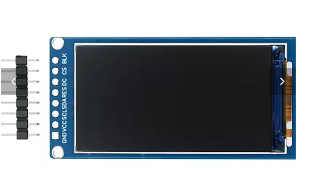
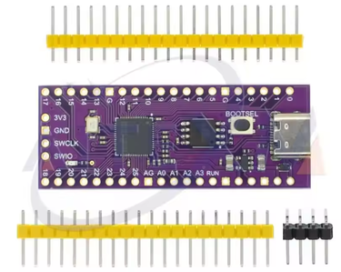
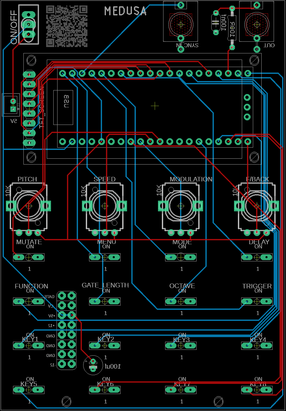

# Medusa - a Sound Effects Synth - Eurorack Module or Stand Alone Synth

Source: https://www.instructables.com/Medusa-a-Sound-Effects-Synth-Eurorack-Module-or-St/

---

## Introduction

This synth started as a humble Dub Siren and grew from there. I wanted a way to add sound effects when playing my modular synth and add some layered soundscapes. I ended up including a total of 4 synths or instruments that have a multitude of features to be able to manipluate and expand the beadth of sound!

It runs off a Raspberry Pi Pico and I used Arduino IDE and C++ to code everything up. I also used Claude AI to help finesse the code and get me out of binds!

Ok - so what does it do? Here is a rundown of what the synth is capable of. Note that I still have some additional features to add.

Instruments:

DUB SIREN - Classic reggae/dub sounds with 6 modes

RAY GUN - Sci-fi laser effects with 4 sound modes

LEAD SYNTH - Generative sequencer with 4 pattern modes

DISCO - 6 classic disco sound effects (orchestra hits, string sweeps, etc.)

These can all be played via the hardware interface:

4 Potentiometers - pitch, speed, modulation, and echo. However, they will change depending on what instrument or function you are using!

8-Key Keyboard

Multiple Buttons - Mode switching, gate control, delay cycling, mutation

mutation allows you to play around with the generative sequencer and musical scales when a sync in is active. - very fun!

Sync Input - trigger input

Real-time waveform visualization

Functions - I have currently 5 functions included with 3 more to come

SEQUENCER MODE (Function + Key 1) - 8-step programmable sequencer with per-step pitch control and enable/disable

LOOP PATTERNS (Function + Key 2) - 7 rhythmic gate patterns (swing, staccato, ratchet, etc.)

RECORD MODE (Function + Key 3) - Record up to 5 seconds of audio with loop playback

REVERSE MODE (Function + Key 4) - Reverse delay with pitch shifting (-2 to +2 octaves)

INFINITE DELAY (Function + Key 5) - Infinite sustain via 100% feedback (this is delay on forever!)

LFO 2 ( Function + Key 6) - Secondary LFO that modulated frequency for vibrato/tremelo effects

Drone ( Function + Key 7) - 5-oscillator additive drone synthesizer with drift and detuning

Sidechain ( Function + Key 8) - Classic "pumping" sidechain compression effect

And there is even more! I'll provide a complete overview and how to at the end of this 'ible.

## Supplies

As usual, I've created a parts list which can be found in my [GitHub](https://github.com/lonesoulsurfer/Medusa_Sound_Effects_Modular_Synth) page and in the PDF file attached to this step. The PDF includes links and images of each of the parts which will make it easy to order the correct ones for this build.

In regards to the Raspberry Pi that I used, Make sure that you get the one with 4 analog inputs. The details are in the part list provided.

The parts list attached doesn't included the PCB or front panel. You'll need to jump to the next step which goes through how to get yours printed.

- [Parts List Medusa](pdfs/Parts List Medusa.pdf)

## Step 1: Getting the PCB & Front Panel Printed

We all have different levels of knowledge, so when it comes to a build like this I want to make sure that I'm providing enough information so anyone with some basic soldering skills can make it. That includes ensuring there are instructions on how to get your own PCB's printed (which is super easy!)

So with that said, the first thing you will need to do is to get the front panel and PCB printed. I use [JLCPCB](https://jlcpcb.com/?from=VGS&utm_source=google&utm_medium=cpc&utm_campaign=14177189905&gad_source=1&gbraid=0AAAAABS1QqkiD3-WAMC-R-0N6a2KKPawu&gclid=CjwKCAjwwe2_BhBEEiwAM1I7sfAjCecAjlW7BgEzggjBf0WNDCA4-ZMBy2IrNS7NcwcA4naAhj0_2xoCA-4QAvD_BwE) (not affiliated) to get this done. The front panel is actually just a PCB without any components included! The front design is done in a program called [Inkscape](https://inkscape.org/) (available free) and the panel including the drilled holes is done in [Fusion 360](https://www.autodesk.com/products/fusion-360/personal) (also free!)

The files that you need to build Medusa can be found in my [GitHub](https://github.com/lonesoulsurfer/Medusa_Sound_Effects_Modular_Synth) page. This includes the parts list, Gerber files for the PCB & front panel, schematic, Code. Download the files to your computer

STEPS:

1. Send the Gerber files to a PCB manufacturer like [JLCPCB](https://jlcpcb.com/?from=VGBA&gad_source=1&gclid=CjwKCAiAjfyqBhAsEiwA-UdzJCxT2LUX1iS0CvS4HVuZlxetrU2JQNyu0nueQUivgEq7MzfoGlH54RoClQ8QAvD_BwE) who will print the PCB and front panel for you. Download all of the files from my [GitHub](https://github.com/lonesoulsurfer/Medusa_Sound_Effects_Modular_Synth) page to your computer and send the zipped Gerber files off to the PCB manufacturer of choice.
2. If you have no idea what any of the above means , then check out the Instructable I made on how to get your broads printed which can be found [here](https://www.instructables.com/How-to-Get-a-PCB-Printed-Using-Gerber-Files/).
3. NOTE: The manufacture will include an order number on both the PCB and front panel. It doesn't really matter where it is on the PCB but you don't want it on the front on the front panel!
4. Over at JLCPCB you can 'specify a location' once the Gerber files have been loaded so click this for the front panel and specify in the comment section that you want the order number on the back of the panel. The manufacturer will add it to the back where indicated.

## Step 2: Adding Components to the PCB - Part 1

There are actually only 3 passive components that need to be added to the board! I probably should have added some voltage protection for the sync in but I haven't had any issues with it so far...

Anyhow lets start adding some components:

STEPS:

1. First - add the resistor into the PCB and solder into place.
2. Now do the same for the capacitors
3. You can also add the JST connector as well. This is where we'll be powering the board. If you are adding this module to a Eurorack, then you can power it via a Eurorack style header pins.
4. That's it for the passive components - now you can flip the board over and start adding the momentary switches which there are 16 of! The trick with these is to add 4 at a time. once they are soldered into place, make sure that they are sitting flat. If not, just hit the legs again with the soldering iron and push down on the button on the switch. This will ensure that they are properly seated.

## Step 3: Adding Components to the PCB - Part 2

Now lets get the Raspberry Pi into place

STEPS:

1. Firstly, if you haven't already, solder some male header pins to the Raspberry pi.
2. Now, connect the female header pins to the male header ones on the Pi.
3. Place the female header pins into the PCB and solder into place. This is the best way to do as it ensures that the header pins are straight and that the Raspberry Pi will fit right.

## Step 4: Adding Components to the PCB - Part 3

Right - now lets add the rest of the components and leave the screen to last

STEPS:

1. Add the on/off toggle switch
2. Solder into place the 2 jack inputs
3. Now add the 4 potentiometers

That was easy! now onto the more tricker part - adding the screen.

## Step 5: Adding the Screen

When adding the screen, you want to firstly make sure that it is secure to the front panel and you also want to be able to take the front panel off for any future changes. I have found that the best way to do this is using female and male header pins. However, it gets tricker as you need to make sure that the header pins are not too big or the screen will make the front panel sit too high.

I used normal header pins to add the front panel and had to modify the female header pins in order to make the short enough so the front panel fitted correctly. I did this by trimming the tops of the female head pins and also the male ones to get them to fit right. I have provided alternative header pins in the parts list which I believe will do the job a lot easier. Note though that I haven't tried this myself yet

STEPS:

1. First, solder the male header pins to the TFT screen. IMPORTANT - you need to make sure that the header pins are sitting flush with the top of the TFT screen PCB. If you don't, then they will hit the front panel and the screen won't sit flat
2. Now secure the screen to the front panel. I used an M2 screen and placed this through the hole of the front panel and screen. I then added a nut to each to secure the screen onto the front panel
3. Now - you need to add a small M2 spacer to each of the screws. Use the smallest one in the assorted pack that I have recommended to get in the parts list
4. This is a good time to test fit the front panel to the PCB. Carefully place the front panel on top of the PCB. If you find that the end of the screw isn't lining up with the hole in the PCB, then give it a little push towards the hole with a screwdriver, keeping pressure on the front panel.
5. Once in place you will see that the pins on the TFT screen just about touch the pin holes on the PCB. You will probably need to trim the male header pin legs to ensure that they fit correctly. leave though for the moment.
6. Remove the front panel and add the female header pins to the male ones on the TFT screen. Now test fit again. How does it look? are the pins making it so the front panel isn't sitting as low as it can go? if so, you will need to trim the male header pins and try again. You want it so the front panel is touching the bottom of the screw section on the toggle switch.
7. If everything looks like it is lining up - then you can go ahead and solder the header pin into the PCB.

I hope that this wasn't too confusing!

## Step 6: Adding a Couple More Spacers to the Front Panel

To ensure the front is secured to the PCB, you need to add a couple more spacer to the bottom section.

STEPS:

1. Find the right sized spacer that fits between the front panel and PCB
2. Push this into place and secure it into place with an M2 screw. You'll need to hold the spacer with a pair of pliers whilst adding the screw into pace
3. Do this for the other side as well.

Ok - now you are ready to upload the code

## Step 7: Adding the Code to the Raspberry Pi

I've added steps to ensure that anyone can load up the code. If you have used Arduino IDE before then you can skip the first coupl steps.

STEPS:

1. Install Arduino IDE - https://docs.arduino.cc/software/ide-v1/tutorials/Windows/
2. Install RP2040 Board Support
3. In Arduino IDE: Go to File → Preferences
4. Find "Additional Board Manager URLs"
5. Add this URL: https://github.com/earlephilhower/arduino-pico/releases/download/global/package_rp2040_index.json
6. Click OK
7. Go to Tools → Board → Boards Manager
8. Search for "pico"
9. Install "Raspberry Pi Pico/RP2040" by Earle F. Philhower, III
10. Wait for installation to complete
11. Install Required Libraries
12. Go to Sketch → Include Library → Manage Libraries
13. Install these libraries:
14. Adafruit GFX Library (by Adafruit)
15. Adafruit ST7735 and ST7789 Library (by Adafruit)
16. Adafruit BusIO (dependency, will auto-install)
17. Hardware Connection
18. Connect Raspberry Pi Pico to Computer
19. Hold the BOOTSEL button on the Pico (white button on the board)
20. While holding BOOTSEL, plug USB cable into computer
21. Release BOOTSEL button
22. A drive named "RPI-RP2" should appear on your computer
23. You're now in bootloader mode
24. Tool menu settings.
25. go to Tools and ensure that the below are set in the menu settings
26. Board: "Raspberry Pi Pico"
27. Flash Size: "2MB (Sketch: 1MB, FS: 1MB)" or "2MB (no FS)"
28. CPU Speed: "133 MHz" Optimize: "
29. Optimize Even More (-O3)"
30. USB Stack: "Pico SDK"
31. Boot Stage 2: "W25Q080 QSPI/4"
32. Now add the code if you haven't aleady and click 'upload'

Note that the code is currently quite long so it will take some time to upload. I still need to clean it up. However, it should work fine (it's just messy!)

## Step 8: How to Play

Now you can connect it up to a 9V power supply along with a speak and start playing!

I've provided below instructions on how to use the synth. However, you can just start playing and work it out yourself if you want. The main point to note is, if you want to play any of the additional functions, then hold down the function key and press any of the 1-8 keys to jump into one of the functions.

Have fun!

4 Main Knobs:

1. Pot 1 (Pitch) - Controls the base frequency/note
2. Pot 2 (Speed) - Controls how fast things move (LFO speed, tempo, etc.)
3. Pot 3 (Modulation) - Controls effect intensity (vibrato, filter, etc.)
4. Pot 4 (Echo Feedback) - Controls how much echo/delay repeats

Main Buttons:

1. TRIGGER - Hold to play sound
2. MENU - Cycles through 4 instruments (Dub Siren → Ray Gun → Lead Synth → Disco)
3. MODE - Changes the sound variation within each instrument
4. DELAY - Cycles delay time (OFF → 50ms → 100ms → 175ms → 250ms → 375ms)
5. GATE - Changes gate length (how long notes are)
6. OCTAVE - Shifts pitch up/down by octaves
7. MUTATE - Cycles mutation modes (makes sound evolve randomly on each trigger)

8 Keyboard Keys:

1. Press keys 1-8 to play different notes in a musical scale
2. Works like a mini keyboard - each key plays a specific pitch
3. Also activates the special features

**1. DUB SIREN (Classic reggae/dub swoops)**

What each pot does:

1. Pot 1 (PITCH) - Base frequency (50-2000Hz) - turn to change the note
2. Pot 2 (SPEED) - LFO speed (0.1-20Hz) - how fast the sound wobbles
3. Pot 3 (MOD) - Modulation depth (0-100%) - how much the pitch sweeps
4. Pot 4 (Echo Feedback) - Echo repeats (0-95%) - for dub delays

6 Modes (press MODE button):

1. CLASSIC DUB - Smooth sawtooth wobble
2. DEEP SUB - Adds sub-bass octave (Pot 3 controls sub mix)
3. SQUARE WAVE - Hollow, aggressive tone
4. LO-FI CRUSH - Bit crusher effect (Pot 3 controls bit depth 1-8)
5. RING MOD - Metallic ring modulation (Pot 3 controls ring mod frequency)
6. PORTAMENTO - Smooth pitch glide (Pot 2 controls glide time)

**2. RAY GUN (Sci-fi laser sounds)**

What each pot does:

1. Pot 1 (FREQ) - Laser frequency (200-4000Hz) - pitch of the laser
2. Pot 2 (SWEEP) - Sweep speed (0.1-20Hz) - how fast it swoops
3. Pot 3 (RES) - Resonance (30-95%) - filter sharpness/brightness
4. Pot 4 (Echo Feedback) - Echo repeats (0-95%)

4 Modes (press MODE button):

1. ZAP - Quick upward sweep (classic ray gun)
2. LASER - Downward sweep with noise burst
3. BLASTER - Rapid fire short bursts
4. PHASER - Modulated pulse (sci-fi phaser)

**3. LEAD SYNTH (Generative melodies)**

What each pot does:

1. Pot 1 (ROOT) - Root note (200-800Hz) - base pitch of the melody
2. Pot 2 (TEMPO) - Step speed (100-1000ms) - how fast notes play
3. Pot 3 (VIB) - Vibrato depth (0-10%) - pitch wobble on notes
4. Pot 4 (Gate) - Gate length (20-100%) - how long each note plays

4 Modes (press MODE button):

1. SEQUENCE - Plays pre-programmed melody
2. ARPEGGIO - Arpeggiator with octave jumps
3. EUCLIDEAN - Euclidean rhythm patterns
4. GENERATIVE - Auto-generates new melodies

**4. DISCO (Classic disco effects)**

What each pot does:

1. Pot 1 (PITCH) - Base frequency (100-2000Hz) - effect pitch
2. Pot 2 (SPEED) - Effect duration/speed - how long the effect lasts
3. Pot 3 (BRIGHT) - Brightness (0-100%) - filter cutoff/tone
4. Pot 4 (Echo Feedback) - Echo repeats (0-95%)

6 Modes (press MODE button):

1. ORCH HIT - Punchy orchestral stab
2. STRINGS - Rising string machine sweep
3. FUNK BLAST - Synth brass stab with pitch bend
4. WHOOSH - Noise sweep (spaceship flyby)
5. BUBBLE - Percussive bubble pop sound
6. LASER - Musical laser sweep with vibrato

Sequencer Mode (Function + Key 1):

1. Creates an 8-step programmable sequence
2. Press keyboard keys to toggle steps on/off
3. Hold a key to adjust that step's pitch with Pot 1
4. TRIGGER starts/stops playback

Record Mode (Function + Key 3):

1. Press Key 3 once to start recording (up to 5 seconds)
2. Press Key 3 again to stop
3. Press Key 3 again to play back
4. Press Key 4 to toggle loop on/off

Reverse Mode (Function + Key 4):

1. Press Key 4 to toggle reverse effect on/off
2. Pot 1 controls pitch shift
3. Pot 3 controls wet/dry mix

Infinite Hold (Function + Key 5):

1. Press Key 5 to toggle infinite sustain on/off
2. Pot 1: Feedback amount (95-100%) when hold is ON
3. Pot 3: Filter cutoff

LFO 2 (Function + Key 6)

1. Secondary LFO that modulates frequency for vibrato/tremolo effects
2. Pot 1: LFO 2 Rate (0.1-20 Hz)
3. Pot 3: LFO 2 Depth (0-100%)
4. Press Key 6 to toggle LFO 2 ON/OFF

Drone (Function + Key 7)

1. 5-oscillator additive drone synthesizer with drift and detuning
2. Press TRIGGER to cycle modes: OFF → KEYS → ON
3. Pot 1: Root Pitch
4. Pot 2: Detune Amount (0-100%) - spread between oscillators
5. Pot 3: Brightness (0-100%) - timbre from dark to bright
6. Pot 4: Drift Speed - slow LFO modulation

1. Press MODE button to cycle chord voicings:
2. UNISON: All oscillators at same pitch
3. OCTAVE: Root + octaves
4. FIFTH: Root + perfect fifth
5. MAJOR: Major chord (root, major 3rd, 5th)
6. MINOR: Minor chord (root, minor 3rd, 5th)

Sidechain (Function + Key 8)

1. Classic "pumping" sidechain compression effect
2. Press Key 8 to toggle SIDECHAIN ON/OFF
3. Pot 1: Ducking Depth (0-100%) - how much volume reduction
4. Pot 2: Attack Time - how fast it ducks
5. Pot 3: Release Time - how fast it returns
6. Syncs with LOOP patterns or SYNC input for rhythmic pumping
7. Auto-retriggering creates continuous pumping effect

## Downloads

- [Parts List Medusa](pdfs/Parts List Medusa.pdf)

---
*34 images archived*
