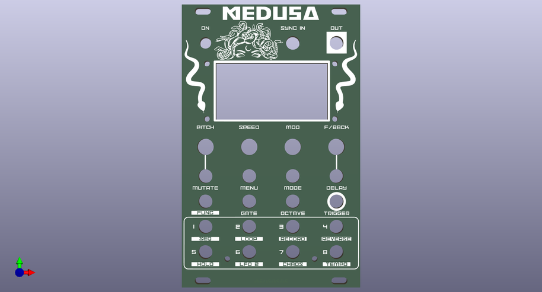
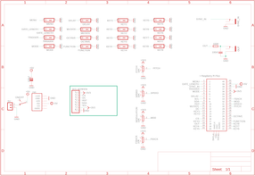
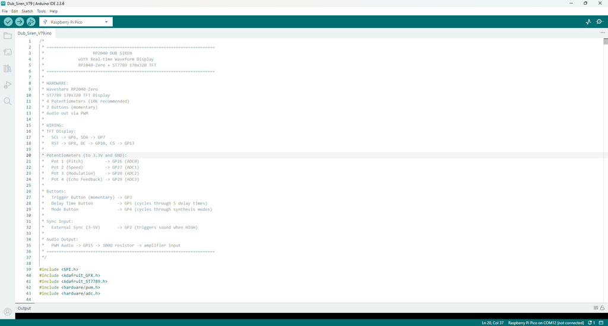

# Medusa - a Sound Effects Synth - Eurorack Module or Stand Alone Synth

Source: https://www.instructables.com/Medusa-a-Sound-Effects-Synth-Eurorack-Module-or-St/

---

## Introduction

## Supplies

As usual, I've created a parts list which can be found in my GitHub page and in the PDF file attached to this step. The PDF includes links and images of each of the parts which will make it easy to order the correct ones for this build.In regards to the Raspberry Pi that I used, Make sure that you get the one with 4 analog inputs. The details are in the part list provided.The parts list attached doesn't included the PCB or front panel. You'll need to jump to the next step which goes through how to get yours printed.Parts List Medusa.pdfDownload

## Step 1: Getting the PCB & Front Panel Printed

We all have different levels of knowledge, so when it comes to a build like this I want to make sure that I'm providing enough information so anyone with some basic soldering skills can make it. That includes ensuring there are instructions on how to get your own PCB's printed (which is super easy!)So with that said, the first thing you will need to do is to get the front panel and PCB printed. I use JLCPCB (not affiliated) to get this done. The front panel is actually just a PCB without any components included! The front design is done in a program called Inkscape (available free) and the panel including the drilled holes is done in Fusion 360 (also free!)The files that you need to build Medusa can be found in my GitHub page. This includes the parts list, Gerber files for the PCB & front panel, schematic, Code. Download the files to your computerSTEPS:Send the Gerber files to a PCB manufacturer like JLCPCB who will print the PCB and front panel for you. Download all of the files from my GitHub page to your computer and send the zipped Gerber files off to the PCB manufacturer of choice.If you have no idea what any of the above means , then check out the Instructable I made on how to get your broads printed which can be found here.NOTE: The manufacture will include an order number on both the PCB and front panel. It doesn't really matter where it is on the PCB but you don't want it on the front on the front panel!Over at JLCPCB you can 'specify a location' once the Gerber files have been loaded so click this for the front panel and specify in the comment section that you want the order number on the back of the panel. The manufacturer will add it to the back where indicated.

## Step 2: Adding Components to the PCB - Part 1

There are actually only 3 passive components that need to be added to the board!  I probably should have added some voltage protection for the sync in but I haven't had any issues with it so far...Anyhow lets start adding some components:STEPS:First - add the resistor into the PCB and solder into place.Now do the same for the capacitorsYou can also add the JST connector as well.  This is where we'll be powering the board.  If you are adding this module to a Eurorack, then you can power it via a Eurorack style header pins.That's it for the passive components - now you can flip the board over and start adding the momentary switches which there are 16 of!  The trick with these is to add 4 at a time.  once they are soldered into place, make sure that they are sitting flat.  If not, just hit the legs again with the soldering iron and push down on the button on the switch.  This will ensure that they are properly seated.

## Step 3: Adding Components to the PCB - Part 2

Now lets get the Raspberry Pi into placeSTEPS:Firstly, if you haven't already, solder some male header pins to the Raspberry pi.Now, connect the female header pins to the male header ones on the Pi.Place the female header pins into the PCB and solder into place.  This is the best way to do as it ensures that the header pins are straight and that the Raspberry Pi will fit right.

## Step 4: Adding Components to the PCB - Part 3

Right - now lets add the rest of the components and leave the screen to lastSTEPS:Add the on/off toggle switchSolder into place the 2 jack inputsNow add the 4 potentiometersThat was easy!  now onto the more tricker part - adding the screen.

## Step 5: Adding the Screen

When adding the screen, you want to firstly make sure that it is secure to the front panel and you also want to be able to take the front panel off for any future changes.  I have found that the best way to do this is using female and male header pins.  However, it gets tricker as you need to make sure that the header pins are not too big or the screen will make the front panel sit too high.  I used normal header pins to add the front panel and had to modify the female header pins in order to make the short enough so the front panel fitted correctly.  I did this by trimming the tops of the female head pins and also the male ones to get them to fit right.  I have provided alternative header pins in the parts list which I believe will do the job a lot easier.  Note though that I haven't tried this myself yetSTEPS:First, solder the male header pins to the TFT screen.  IMPORTANT - you need to make sure that the header pins are sitting flush with the top of the TFT screen PCB. If you don't, then they will hit the front panel and the screen won't sit flatNow secure the screen to the front panel.  I used an M2 screen and placed this through the hole of the front panel and screen.  I then added a nut to each to secure the screen onto the front panelNow - you need to add a small M2 spacer to each of the screws.  Use the smallest one in the assorted pack that I have recommended to get in the parts listThis is a good time to test fit the front panel to the PCB.  Carefully place the front panel on top of the PCB.  If you find that the end of the screw isn't lining up with the hole in the PCB, then give it a little push towards the hole with a screwdriver, keeping pressure on the front panel.  Once in place you will see that the pins on the TFT screen just about touch the pin holes on the PCB.  You will probably need to trim the male header pin legs to ensure that they fit correctly.  leave though for the moment.Remove the front panel and add the female header pins to the male ones on the TFT screen.  Now test fit again.  How does it look?  are the pins making it so the front panel isn't sitting as low as it can go?  if so, you will need to trim the male header pins and try again.  You want it so the front panel is touching the bottom of the screw section on the toggle switch.If everything looks like it is lining up - then you can go ahead and solder the header pin into the PCB.I hope that this wasn't too confusing!

## Step 6: Adding a Couple More Spacers to the Front Panel

To ensure the front is secured to the PCB, you need to add a couple more spacer to the bottom section.STEPS:Find the right sized spacer that fits between the front panel and PCBPush this into place and secure it into place with an M2 screw.  You'll need to hold the spacer with a pair of pliers whilst adding the screw into paceDo this for the other side as well.Ok - now you are ready to upload the code

## Step 7: Adding the Code to the Raspberry Pi

I've added steps to ensure that anyone can load up the code. If you have used Arduino IDE before then you can skip the first coupl steps.STEPS:Install Arduino IDE - https://docs.arduino.cc/software/ide-v1/tutorials/Windows/Install RP2040 Board SupportIn Arduino IDE: Go to File → PreferencesFind "Additional Board Manager URLs"Add this URL: https://github.com/earlephilhower/arduino-pico/releases/download/global/package_rp2040_index.jsonClick OKGo to Tools → Board → Boards ManagerSearch for "pico"Install "Raspberry Pi Pico/RP2040" by Earle F. Philhower, IIIWait for installation to completeInstall Required LibrariesGo to Sketch → Include Library → Manage LibrariesInstall these libraries:Adafruit GFX Library (by Adafruit)Adafruit ST7735 and ST7789 Library (by Adafruit)Adafruit BusIO (dependency, will auto-install)Hardware ConnectionConnect Raspberry Pi Pico to ComputerHold the BOOTSEL button on the Pico (white button on the board)While holding BOOTSEL, plug USB cable into computerRelease BOOTSEL buttonA drive named "RPI-RP2" should appear on your computerYou're now in bootloader modeTool menu settings.go to Tools and ensure that the below are set in the menu settingsBoard: "Raspberry Pi Pico" Flash Size: "2MB (Sketch: 1MB, FS: 1MB)" or "2MB (no FS)" CPU Speed: "133 MHz" Optimize: "Optimize Even More (-O3)" USB Stack: "Pico SDK" Boot Stage 2: "W25Q080 QSPI/4"Now add the code if you haven't aleady and click 'upload'Note that the code is currently quite long so it will take some time to upload.  I still need to clean it up.  However, it should work fine (it's just messy!)

## Step 8: How to Play

Now you can connect it up to a 9V power supply along with a speak and start playing!I've provided below instructions on how to use the synth. However, you can just start playing and work it out yourself if you want. The main point to note is, if you want to play any of the additional functions, then hold down the function key and press any of the 1-8 keys to jump into one of the functions.Have fun!4 Main Knobs:Pot 1 (Pitch) - Controls the base frequency/notePot 2 (Speed) - Controls how fast things move (LFO speed, tempo, etc.)Pot 3 (Modulation) - Controls effect intensity (vibrato, filter, etc.)Pot 4 (Echo Feedback) - Controls how much echo/delay repeatsMain Buttons:TRIGGER - Hold to play soundMENU - Cycles through 4 instruments (Dub Siren → Ray Gun → Lead Synth → Disco)MODE - Changes the sound variation within each instrumentDELAY - Cycles delay time (OFF → 50ms → 100ms → 175ms → 250ms → 375ms)GATE - Changes gate length (how long notes are)OCTAVE - Shifts pitch up/down by octavesMUTATE - Cycles mutation modes (makes sound evolve randomly on each trigger)8 Keyboard Keys:Press keys 1-8 to play different notes in a musical scaleWorks like a mini keyboard - each key plays a specific pitchAlso activates the special features1. DUB SIREN (Classic reggae/dub swoops)What each pot does:Pot 1 (PITCH) - Base frequency (50-2000Hz) - turn to change the notePot 2 (SPEED) - LFO speed (0.1-20Hz) - how fast the sound wobblesPot 3 (MOD) - Modulation depth (0-100%) - how much the pitch sweepsPot 4 (Echo Feedback) - Echo repeats (0-95%) - for dub delays6 Modes (press MODE button):CLASSIC DUB - Smooth sawtooth wobbleDEEP SUB - Adds sub-bass octave (Pot 3 controls sub mix)SQUARE WAVE - Hollow, aggressive toneLO-FI CRUSH - Bit crusher effect (Pot 3 controls bit depth 1-8)RING MOD - Metallic ring modulation (Pot 3 controls ring mod frequency)PORTAMENTO - Smooth pitch glide (Pot 2 controls glide time)2. RAY GUN (Sci-fi laser sounds)What each pot does:Pot 1 (FREQ) - Laser frequency (200-4000Hz) - pitch of the laserPot 2 (SWEEP) - Sweep speed (0.1-20Hz) - how fast it swoopsPot 3 (RES) - Resonance (30-95%) - filter sharpness/brightnessPot 4 (Echo Feedback) - Echo repeats (0-95%)4 Modes (press MODE button):ZAP - Quick upward sweep (classic ray gun)LASER - Downward sweep with noise burstBLASTER - Rapid fire short burstsPHASER - Modulated pulse (sci-fi phaser)3. LEAD SYNTH (Generative melodies)What each pot does:Pot 1 (ROOT) - Root note (200-800Hz) - base pitch of the melodyPot 2 (TEMPO) - Step speed (100-1000ms) - how fast notes playPot 3 (VIB) - Vibrato depth (0-10%) - pitch wobble on notesPot 4 (Gate) - Gate length (20-100%) - how long each note plays4 Modes (press MODE button):SEQUENCE - Plays pre-programmed melodyARPEGGIO - Arpeggiator with octave jumpsEUCLIDEAN - Euclidean rhythm patternsGENERATIVE - Auto-generates new melodies4. DISCO (Classic disco effects)What each pot does:Pot 1 (PITCH) - Base frequency (100-2000Hz) - effect pitchPot 2 (SPEED) - Effect duration/speed - how long the effect lastsPot 3 (BRIGHT) - Brightness (0-100%) - filter cutoff/tonePot 4 (Echo Feedback) - Echo repeats (0-95%)6 Modes (press MODE button):ORCH HIT - Punchy orchestral stabSTRINGS - Rising string machine sweepFUNK BLAST - Synth brass stab with pitch bendWHOOSH - Noise sweep (spaceship flyby)BUBBLE - Percussive bubble pop soundLASER - Musical laser sweep with vibratoSequencer Mode (Function + Key 1):Creates an 8-step programmable sequencePress keyboard keys to toggle steps on/offHold a key to adjust that step's pitch with Pot 1TRIGGER starts/stops playbackRecord Mode (Function + Key 3):Press Key 3 once to start recording (up to 5 seconds)Press Key 3 again to stopPress Key 3 again to play backPress Key 4 to toggle loop on/offReverse Mode (Function + Key 4):Press Key 4 to toggle reverse effect on/offPot 1 controls pitch shiftPot 3 controls wet/dry mixInfinite Hold (Function + Key 5):Press Key 5 to toggle infinite sustain on/offPot 1: Feedback amount (95-100%) when hold is ONPot 3: Filter cutoffLFO 2 (Function + Key 6) Secondary LFO that modulates frequency for vibrato/tremolo effects Pot 1: LFO 2 Rate (0.1-20 Hz)  Pot 3: LFO 2 Depth (0-100%) Press Key 6 to toggle LFO 2 ON/OFFDrone (Function + Key 7)5-oscillator additive drone synthesizer with drift and detuningPress TRIGGER to cycle modes: OFF → KEYS → ONPot 1: Root PitchPot 2: Detune Amount (0-100%) - spread between oscillatorsPot 3: Brightness (0-100%) - timbre from dark to brightPot 4: Drift Speed - slow LFO modulationPress MODE button to cycle chord voicings:UNISON: All oscillators at same pitch OCTAVE: Root + octavesFIFTH: Root + perfect fifthMAJOR: Major chord (root, major 3rd, 5th)MINOR: Minor chord (root, minor 3rd, 5th)Sidechain (Function + Key 8)Classic "pumping" sidechain compression effectPress Key 8 to toggle SIDECHAIN ON/OFFPot 1: Ducking Depth (0-100%) - how much volume reductionPot 2: Attack Time  - how fast it ducksPot 3: Release Time - how fast it returnsSyncs with LOOP patterns or SYNC input for rhythmic pumping Auto-retriggering creates continuous pumping effect

---
*34 images archived*
