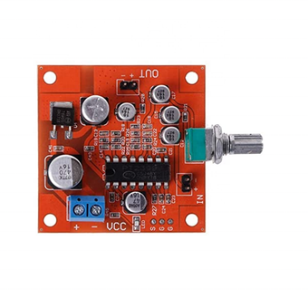
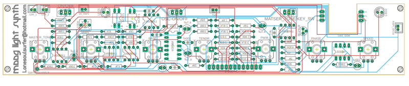
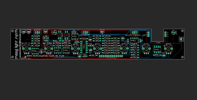

# Moog Light Synth V3

Source: https://www.instructables.com/Moog-Light-Synth-V3/

---

## Introduction

This synth is a pulse width modulated oscillator, routed through a light-controlled resonant low pass filter. The "growling" oscillator tonality is supplied via a PWM and an awesome high-resonance low pass filter. The oscillator is controlled via 2 Light dependent resistors (LDR) and gives you the ability to create amazing musical expression. The 13 “keys” give you different tones and allow you to play it like a 1 octave keyboard.

Also included is 2 Hex inverter drones, supplied via a 40106 IC. The 2 two adjustable drone oscillators give this synth three oscillators in total. You also have the ability to turn off the 2 hex inverter drones and just play around with the other oscillator.

Also included is a delay section via a echo/reverb module that has been modified to include feedback.

Lastly, I've included in this build an arpeggiator (like in the first version I built) which really makes this synth so much fun to play! You also have the ability to play the synth just with one potentiometer and the LDR’s. When all this is combined with the echo/reverb feature you can really get some fantastic sounds from the synth.

Just watch the YouTube clip and you’ll see what I mean

Lastly, I have to give a shout out to Pete McBennett who designed this awesome circuit. Check out his YouTube channel here

You can check out the other versions below

Version1

Version 2

Oh and Hackaday did a bit of a review on this project which you can find in the below link

Hackaday

## Supplies

The Moog Synth

The circuit and board were put together using Eagle and all of the files including the schematic, board, gerber files & parts listing can be found in the next step.

The Rest of the Parts:

Electronics

- Echo/Reverb Board - Ali Express
- Step-up Voltage Regulator - Ali Express
- USB C Charging module - eBay
- Mobile Phone Battery - Ali Express (you could also just use a 9v battery as well but I wanted a rechargeable option.
- 3.5mm Audio Female Socket - Ali-Express
- 3 X 50K Potentiometers - Ali Express
Other Parts

- 13 X momentary switches - Ali Express. I used black and white ones
- Acrylic Opal - eBay
- Clear, Adhesive Decals - eBay
- Hard wood for the case - I use edging sizes 40mm X 8mm X 1M
- Potentiometer Knobs - Ali Express

## Step 1: Schematic, Board and Parts

All of the files including gerber and eagle files can be found in my GitHub Page I've included the shcematic as an attachement ion PDF as well which can be found in this step.

I have designed a PCB for this circuit so all you need to do is to send the gerber files to a PCB manufacturer like JLCPCB (Not affiliated) who will print the board for you. If you have no idea how to do this well I've put together an Instructable on how to get your broads printed which you can find here.

I have also included the Eagle schematic and board files so you can play around with them and modify as you want to

Parts list for the circuit board can be found below and I've also provided the list in excel. which can be found in my Google Drive

PARTS LIST

- Capacitor Polyester
- 150nf X 1
- 1nf X 2
- 100nf X 3
- Capacitor Polarized
- 2.2uf X 1
- 4.7uf X 4
- Potentiometer (vertical, through hole type)
- 100K X 3
- 50K X 2
- 1M X 1
- 10K X 1
- Trimmer - 100K X1
- IC's
- LM358 X 5
- 40106 X 1
- 555 X 1
- Light Dependent Resistor (LDR) X 4 (2 LDR's and 2 LED's are used to make a couple of vactrols. More on this later)
- LED 5mm X 4
- SPDT Switch Toggle - through hole type X 3
- DPDT Switch Toggle X 1
- JST Connector Micro X 4
- Transistor BC547 X 1
- Resistors Metal Film
- 100K X 10
- 47K X 3
- 20K X 2
- 22K X 5
- 120K X 1
- 10K X 1
- 390K X 1
- 33K X 1
- 82K X 1
- 7.5K X 1
*Note that the following resistors make up the resistor ladder for the 1 octave keyboard. They have values which you can either just find something close to or you can add a couple in series to get as close as possible to the values below. The closer you are, the more 'in tune' it will be.

- 4.02K X 1
- 3.83K X 1
- 3.57K X 1
- 3.40K X 1
- 3.24K X 1
- 3.01K X 1
- 2.87K X 1
- 4.32K X 1
- 2.67K X 1
- 2.55K X 1
- 2.43K X 1
- 2.26K X 1
- 38.3K X 1

## Step 2: About the PCB

Before we start to add components to the PCB, I thought I would go through a couple of things that you should know. You can download all of the files for the PCB on my GitHub page

What is that cutout section for?

I always try to add as many components to the board as possible. It means less wiring and less hassle. Unfortunately I couldn't find a DPDT (Double Pole, Double Throw) PCB mounted switch which sat low enough on the PCB. To compensate, I made a cutout on the board and the switch is secured directly into the front panel. It means you have to wire it up but that is straight forward

Why is the PCB double sided?

Most of the components like IC's resistors etc are on one side and the on the other I have the pots, switches etc. This is to ensure the front panel will sit flush and the components don't get in the way

What the hell are those weird resistor values!

To be able to have the keys in tune, you need to create a resistor ladder at very specific values. It's probably the trickiest part as you can either take the easy road and just find close values or add resistors in series and get as close as possible. The closer you are the more 'in tune' the keys will be. It's tricky though because if you are out then this will compound and will mean the rest will be out as well.

## Step 3: Adding the Components to the PCB

As mentioned, the PCB is double sided. Always start with the side with the resistors, caps etc and then move onto the other side which has the pots, switches.

STEPS:

- First thing as always is to start with the lowest profile parts - in this case the resistors
- When you come to the resistors for the keys (the ones with strange values, as previously mentioned, you can either just find a close value and add that or you can add a couple in series to try and get as close as possible to the values. You can see that I have done this in the 2nd image.
- Next add the IC sockets, polyester caps and trimmer pot. The trimmer is used to fine tune the PWM later on.
- Before you flip it over and add the rest of the components, you first need to make some vactrols!

## Step 4: Making a Vactrol

A vactrol (or Optocoupler), are easy to make In actual fact, I've done a separate Instructable on how to make this which can be found here.

I won't go into too much detail as you can always refer to the Instructable I did. All a vactrol is is an LED and a LDR. They are used in this build in the arpeggiator section of the build

STEPS:

- I used a flat head white LED for the vactrols and they worked well. You can also use a round head one as well. Cut a small piece of head shrink, enough to cover the LED and LDR with a little overhang on each side
- Place the LED first into the heat shrink and heat it up. Use a pair of plyers to squash the end up over the LED legs
- Next, place the LDR inside the heat shrink so it is resting up against the LED.
- Hit it again with some heat (I use a lighter) and squish the other end against the LDR legs.
- Bend the legs over. NOTE: make sure that the positive and negative (Anode and Cathode) legs line up with the positive and negative on the PCB. If you look at the vactrol symbols you will see a little positive and negative symbol.
- Place them into the PCB and solder into place
- Now you can solder into place the rest of the components onto the board

## Step 5: Reverb & Echo Board

The echo and reverb board makes up the delay section of the synth. The module is cheap to buy ($3-5) and can be modified a few different ways. Shoutout to mayasfinest who provided the feedback mod.

As I already did the mods to the module (and don't have another spare!) I put together a wiring diagram which shows you what you need to do in order to mod the board.

STEPS:

- First remove R27 resistor on the module. You can use an exacto knife to do this and just flick it off
- Next, you need to remove the potentiometer that is already soldered onto the module. This is the reverb pot and we'll be attaching another one later on wires connected to the solder pads. I have found that the solder pads are easily removed form the module so I just use some wire cutters and cut away the pot.
- You now have to connect some wires to the reverb solder points and also to the solder points for the echo pot. I use computer ribbon wire here and it works great
- Once you have the wires added, solder a 50K pot to each end of the wires.
- For the feedback section, you need to add a little solder to pins 3 and 8 on the IC.
- Connect a couple of wires to each of the pins and then solder the ends to a 1M pot
- the 'in" on the module is connected to the 'out' on the moog PCB
- The 'out' on the echo module is connected to a female audio socket
TIP: Once you have soldered everything onto the Moog PCB, I'd then do the above mods and test it out to make sure everything works as it should.

## Step 6: Adding the Front Panel to the Opal Acrylic

Now that the circuit has been built (and hopefully works as it should), the next step is to add the front cover design to some acrylic. I have used opal acrylic so you can see the on/off indicator LED inside the panel. You could also use white which I'm sure would still allow the LED to be seen

STEPS:

- First thing to do is to print the front panel design onto some clear adhesive. This has a sticky back which allows you to attach it to the acrylic. The front panel design can be found as an attachment in this step.
- It can be a little tricky adding a label this big. It's easy to get wrinkles and air pockets. You need to take your time and use something flat like a ruler to drag around the adhesive to ensure these are kept at a minimum.
- Once the front panel is on the acrylic, use something flat to remove any air pockets. You want to use something which has a soft edge so you don't scratch the ink on the panel. I used a piece of floating floor which has some foam on the back.
- To protect the front panel, you need to spray it a few times with some clear acrylic paint. I use a matt one as it give a nice, clean finish. Let it dry between coats

## Step 7: Drilling and Test Fitting the Front Panel

I use a step drill piece to drill the holes as it works very well and allows you to easily create the correct sized holes for the components.

STEPS:

- Before you start to drill, use a punch to help ensure the holes are centred.
- Place the panel onto some wood and carefully drill each of the holes. I use a piece of wood with a large hole drilled into it already so the stepped drill piece doesn't have any resistance when being drilled into the acrylic.
- Once all the holes have been drilled out, you might find that they need to be cleaned up a little. Use an exacto knife to do this and run it around the edges of each hole.
- Give it another spray with some clear acrylic and leave to dry
- Test fit the PCB to make sure it fits correctly. If there any any sections that seem a little tight, you might need to make that hole in the panel a little bigger

## Step 8: Making the Case

Making the case is pretty straight forward. I use skirting board hard wood to do this and it works well.

STEPS:

- The first thing to do is to secure the wood to a flat surface and make a groove along the top section. This is so you can secure the front panel to the case. If you don't have the tools to do this (router - in my case a dremel and a routing bit - 3mm), then you could just skip this and either just screw or stick the front panel to the case.
- Router out the wood and then cut the wood to size. To do this easily, place the panel into the groove cut and mark where you need to cut.
- Once all the pieces have been cut, place them onto the front panel and make sure everything fits correctly.
- If it does (don't worry about overhang, we'll fix this in the next step) then you can either glue or nail the case together. I use a small nail gun (brader) to do this mainly because I'm too impatient to wait for the glue to dry!

## Step 9: Making the Base & Sanding & Painting the Case

Time to now make the base which is just some thin ply wood. You make the base now so you can sand everything together and make sure it fits perfectly to the case

STEPS:

- Cut a piece of thin ply wood to size and secure it to the base via a couple of screws. You don't have to add all 4 screws if you don't want to yet, just a couple to hold it into place.
- Use a belt sander (if you have one) or just hand sand it until everything is even and smooth
- To protect the wood, I used some clear polyurethane and added a couple of coats to the wood. Make sure you take your time around the top section and don't get any onto the panel.

## Step 10: Adding the Charging Module

Noe that the case has been made and painted, it's time to add the charging module. This little module will allow you to charge up the mobile phone battery.

STEPS:

- With a file, make a cutout in the bottom section of the case
- The cutout should be deep enough for the module to sit flush and the base shouldn't touch it when placed on top.
- Use some superglue to secure the module into place

## Step 11: Wiring the Switches and Securing the PCB Into the Front Panel

This is a pretty exciting step! you get to see how it all looks with the switches and PCB in place. Note that I did include some markings on the PCB where you could drill holes to secure the PCB to the front panel. I decided that I didn't need to add these as the switches held the PCB into place well enough.

STEPS:

- Start to place each of the white switches in first into the bottom holes. There are 8 in total to add. Make sure that the legs on the switches line up as you need to connect a leg from each of the switches together
- Add the black ones next.
- Grab a think piece of wire and start to solder the wire onto a leg of each switch.
- Once the switches have been done, you can then add the PCB. Carefully put it into place and add the washer and nut to each of the switches. As mentioned above, this should be enough to secure the PCB into place.

## Step 12: Adding an LED Filament to the on Switch

This is something I added at the last minute. You could just use an LED and have it coming out of the front panel but I decided to utilize the name of the synth and have that light up when the synth is turned on. I only had a pink filament LED but I think it looks great!

STEPS:

- To keep the LED straight, I used some clear plastic tube. The LED fits nicely inside and keeps it flush to the bottom of the acrylic
- To secure the tube to the acrylic, I used a couple small motor mounts and removed the little legs on it so I could glue them into place onto the acrylic
- Next, add a male JST connector to each leg of the LED, making sure the polarities are right
- Lastly, connect the JST connector to the LED connector on the PCB.

## Step 13: More Wiring and Adding the Pots for the Delay

Now it's time to wire up all those momentary switches to the PCB and also add the DPDT switch and pots for the delay section.

STEPS:

- First, add some solder to each of the solder points on the PCB for the switches (13) and also on each of the legs on the momentary switches
- Solder wire to the left hand solder point for the keys on the PCB. Measure the wire the the momentary switch furthest to the left and trim to size
- Solder on the wire to the switch. Do this another 12 times
- To connect the DPDT switch, first secure the switch into the front panel.
- Next, add a wire to the first solder point on the PCB and connect this to the switch. Keep on going until each of the 6 legs are wired up. Check out the image to see what this looks like
- You now need to add 3 potentiometers to the delay section. The feedback pots value is 1M and the other 2 are 50K. If you have already wired up the echo/reverb module then just use the pots on the module to the front panel.

## Step 14: Adding a Battery and a Little More Wiring

To power everything I used an old mobile phone battery. As previously mentioned, you could just use a 9v battery but then you'll have to open up the case each time you need to replace it and that's just a pain in the butt.

STEPS:

- The little step up module used in this build is set at 5V's. You need to bring it up to 9. To do this, you connect the 2 little solder points indicated on the board.
- Add a dab of superglue and stick it onto the battery near the battery terminals. Make sure that it is orientated correctly so the positive and negative on the module and battery align.
- Connect the battery to the module. i used a couple of resister legs to do this.
- Secure the battery to the bottom of the base. You could glue this into place but I used double sided tape in case I have to remove it at some stage
- Connect the charging module to the battery terminals
- Connect the 'out' on the step up module to the power JST connector on the PCB
- To add the audio socket, drill a hole into the side of the case, add a little glue and push it into place.
- Connect the echo/reverb power to the echo pwr JST connector on the board
- connect anything else that I may have forgotten to mention!
- Now it's time to turn it on and see if all that hard work was actually worth it.
- If it does turn on then plug in a speaker and see if you get any sound. You do! Great! now you can start playing around with the synth and see what sounds you can get out of it. If you don't get anything then you are going to have to check the connections and wiring to make sure everything is correct

## Step 15: How Do You Play the Damn Thing!

Right - now that you have made your synth, the next thing is to start playing it!

Lets' start by playing the synth with the keys

- Make sure that the arpeggiator is turned off and the 'pitch/keys' switch is turned to 'keys'
- The LDR's are quite sensitive so it's best to use a bottle top like from a coke bottle to cover them. Place the bottle top over the LDR's
- Push a key and slowly lift up the bottle top and you'll start to hear the sound modulate. The higher you lift it, the higher the modulation
Tuning

- If you tried to get as close as possible to the resistor values on the PCB for the keys then your synth should be close to being able to be tuned. Admittedly, some of my values were a little off and this compounded and meant that it threw other keys out a little, especially the higher one
- To tune it, download a piano tuner app on your phone and play the first 'C' key. Turn the 'tune' pot until it is in tune with C.
- Now play the rest of the keys to see if they are in tune (or at least slightly in tune)
- I found the hardest ones to get in tune is the black sharp keys
How to turn on and play the arpeggiator

- As I have previously mentioned, it's not a true arpeggiator but you def get some good rhythms out of it
- Turn the arpeggiator on and flick the 'pitch/keys' switch over to pitch
- now use the phase pot and the pitch pot to get different sound effects
- The PWM pot increases the modulation. If you hold your finger down on a key and slowly turn it, you'll hear the modulation increase until it becomes very grungy.
- You can also play the keys at the same time to get more interesting sounds
How to use the Delay section

- The delay section has 3 options, echo, reverb and feedback.
- To use the delay - turn the reverb pot to at least 7 or more
- Turn the echo knob to at least 5 the higher it is the longer the echo sound
- Now play the arpeggiator or keys and you'll hear the echo and reverb. This gives the sound a much richer dimension.
- Turn the feedback pot up to 8 and play a key, the feedback will kick in and you'll get another lot of interesting sounds.
Drone section

- The drone section is best used when play the keys.
- Turn it on and play with the base and tenor until they are in tune
- It give more depth to the overall sound and when played with delay, really opens up the sound effects
The rest you can work out. There are a bunch of different sound effects that you can get so have fun finding them and good luck with the build!

---
*119 images archived*
