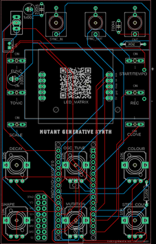
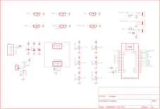
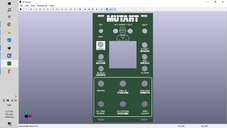

# Mutant - Generative Arduino Synth

Source: https://www.instructables.com/Mutant-Generative-Arduino-Synth/

---

## Introduction

First and foremost - I need to do a huge shoutout to [MeeBleeps](https://github.com/Meebleeps/MeeBleeps-Mutant-Synth) who designed this amazing synth. All I'm doing is creating a PCB and front panel of my own and solving a few issues that I encountered - the software and design is all MeeBleeps.

So what is the Mutant Synth? Well it's a generative synth based around a Arduino Nano and a handful of other components and produces a rich soundscape of sounds.

The synth voice is based around 2 saw oscillators that features:

- Multiple tuning modes for the 2nd oscillator - off, detune, fifths & octaves up/down
- Low pass filter with variable cutoff and resonance
- Variable level ducking/sidechain effects
The display is a 8X8 LED matrix which allows you to visually see where each control level is at. This also includes a 16 step generative sequencer that mutates/evolves at defined rate depending on control inputs.

- Variable sequence mutation probability & note-density
- Sync input & output (Korg Volca compatible)
- Note selection
- Selectable scale quantization (Major, Minor, Pentatonic, Phrygian (GOA!), Octaves, Fifths)
- 16-step parameter-lock recording of synth parameters
- Retrig (clone) button for different fills
- Tap-tempo control
I've designed the PCB and front panel in a modular synth form factor so if you are into modular synths it will fit right into your Eurorack. You can also use it as a stand alone build which runs off a 9V battery.

The Mozzi library used in the script is an older version which isn't a big deal but you do have do do some pre-work before you can load the script to the Arduino. Don't work - I've provided a step by step guide and it's easy to do.

Let's get building!

## Supplies

I've created a parts list which can be found in my [GitHub Page](https://github.com/lonesoulsurfer/Mutant_Generative_Arduino_Synth) and in the PDF file attached to this step. The PDF includes links and images of each of the parts which will make it easy to order the correct ones for this build.

PARTS:

- PCB - I've designed one for this build with the information on how to print your own in the next step
- Front Panel - The panel is also a PCB so you'll also need to get this printed as well - check out the next step
- Arduino Nano - Ali Express
- 9V Battery Holder X 1 (The battery and holder are only needed if you plan to use this to power the synth via a 9V battery. If not then don't worry about this part or the battery.
- 9V Battery X 1
- Capacitor Polypropylene 100nf X 2
- Capacitor Polarized 100uf X 1
- Capacitor Polarized 1000uf X 1
- Resistor Metal Film 10K X 1
- Resistor Metal Film 270R X 1
- Potentiometers 9mm Vertical 10K X 6
- Switch Momentary (PN SKRCADD010) X 6
- On/Off Toggle Switch Through Hole version X 1
- LED Dot Matrix (TZT MAX7219) X 1
- Female Header Pin Socket 15 Pin X 2
- Audio Socket 3.5mm (PN - PJ-301M) X 3
- Mini JST Connector and wire 2 Pin X 11

- [Mutant - List of Parts](pdfs/Mutant - List of Parts.pdf)

## Step 1: PCB, Front Panel & Schematic

Firstly, all the files that you need to build your own Mutant synth can be found in my [GitHub Page](https://github.com/lonesoulsurfer/Mutant_Generative_Arduino_Synth). This includes the parts list, Gerber files for the PCB & front panel, schematic, Arduino script etc.

The build consists of 2 PCB’s – one is for the components and the other the front panel. You’ll need to send the Gerber files to a PCB manufacturer like [JLCPCB](https://jlcpcb.com/?from=VGBA&gad_source=1&gclid=CjwKCAiAjfyqBhAsEiwA-UdzJCxT2LUX1iS0CvS4HVuZlxetrU2JQNyu0nueQUivgEq7MzfoGlH54RoClQ8QAvD_BwE) (Not affiliated) who will print the boards for you. Jump into my Google Drive link, download the 2 Gerber files to your computer and then send them off to your PCB manufacturer of choice.

If you have no idea how to do this well, I've put together an Instructable on how to get your broads printed which you can find [here](https://www.instructables.com/How-to-Get-a-PCB-Printed-Using-Gerber-Files/).

NOTE: The manufacture will include an order number on both the PCB and front panel. It doesn't really matter where it is on the PCB but you don't want it on the front on the front panel!

Over at JLCPCB you can 'specify a location' once the Gerber files have been loaded so click this for the front panel and the manufacturer will add it to the back where I have indicated.. You can also just hit 'No' when asked if you want to remove the order number. However, this costs $2.

Front Panel

As mentioned, the front panel is actually just a PCB without the components! I use the silk screen on the PCB to print the design and then included drill holes for the components. All this information is in the Gerber files for the front panel which the manufacturer uses to print the board.

If you are interested in creating your own front panels then I highly recommend watching [this YouTube vid](https://www.youtube.com/watch?v=UOQezMJ560o&t=4321s). I watched it as couple times and also put together a step by step guide for myself which I have also included as a PDF in this step.

In my [GitHub Page](https://github.com/lonesoulsurfer/Mutant_Generative_Arduino_Synth) you will also find the Eagle schematic and board (PCB) files. You can play around and modify these if you like.

- [Creating Front Panels](pdfs/Creating Front Panels.pdf)

## Step 2: Adding Components to the PCB

The PCB is 2 sided. The front has all of the active components like the pots and switches and the reverse has the passive components like the Arduino, caps and resistors. As some of the components are underneath the Arduino and (9v battery holder (if you install it), you have to be aware of the order that you solder parts into place.

Let's start with the reverse side and add the passive components:

STEPS:

- Always start with the lowest profile components - in this case (in probably all cases!) it's the resistors.  Solder them all into place and check the values before soldering so you don't have to troubleshoot the parts later if something goes wrong! There's only 2 resistors as well!
- Solder the capacitors into place. If you find that the 1000uf cap is sitting up too high you can always solder it into place so it is lying down
- If you are going to power the synth via the 9V battery then you can also solder that into place. If not, then solder the JST header into place.
- You may have also noticed that there is a double row of holes (16) in the board as well. This is in case you want to power it via a Eurorack power board.
- Now you add the header pins for the Arduino. The best way to do this is to connect the header pins to the Arduino and then place them into the PCB and solder into place. This way they will be straight and in the correct position

## Step 3: Adding More Components to the PCB

Now that you have done the back of the PCB, it’s time to move to the front and add all of the active components.

STEPS:

- Let’s start with the LED Dot Matrix. You will notice that there are 5 solder points at the top and the bottom of the module. I included header pins to each to ensure that the matrix was securely in place.
- If you remove the LED matrix from the circuit board it is attached to, you can see indicated ‘In’ and ‘Out’. You can chain these modules together which is why they also have an out.  You need to connect the 'In' pins to the RHS solder points in the PCB.
- I wanted to make sure that the module wasn't sticking up too much through the front panel so I removed the plastic surrounds on the pins in order for the module to sit lower on the PCB.
- Also, the LED matrix has a polarity so make sure you put it back onto the circuit board the right way. If you don’t it will turn on a few LED’s but nothing will happen
- Next, solder the 3.5mm Jacks into place
- Now you can solder all of the momentary switches into place along with the toggle switch
- Lastly, add the pots and solder them into place
That’s it for the hardware. Before you go and add the front panel, let’s load up the sketch to the Arduino.

## Step 4: Importing an Older Version of Mozzi Library to Arduino IDE

I had a bit of trouble when trying to load the sketch initially which was partially my fault and partially due to an update in the Mozzi library. Luckily for you I’ve done the hard work so you shouldn’t have any issues!

The Mozzi library is is an extension to Arduino that allows you to generate interesting growls, sweeps and chorusing atmospheric sounds. These sounds can be quickly and easily constructed from familiar synthesis units like oscillators, delays, filters and envelopes.

Issue with the current Mozzi 2.0.1 library

When the sketch was created for the Mutant Synth, it used an older version of Mozzi. The most recent version isn’t compatible and when you try to upload it you get a bunch of error codes. To counter this, you need to install an older version of Mozzi to Arduino IDE.

STEPS:

1 First, go ahead and uninstall Mozzi 2.0.1 if you have it installed in Arduino IDE and also uninstall FixMath if you have this as well. If you are unsure how to do this, then check out this link:

[https://support.arduino.cc/hc/en-us/articles/360016077340-Uninstall-libraries-from-Arduino-IDE](https://support.arduino.cc/hc/en-us/articles/360016077340-Uninstall-libraries-from-Arduino-IDE)\

2 You now need to install Mozzi 1.1.2 to Arduino IDE. Look up 'Mozzi' in the library manager search bar and then go to the dropdown and hit version 1.1.2 (see image 1)

3 You can also download the zipped file called 1.1.2 from my Google Drive and install via a zip folder in Library Manager if you want to. However, there isn't any need really as it's dead simple to just use the version dropdown in the library manager

4 Go ahead & install Mozzi 1.1.2 via either way above (see mage 2)

4 If everything worked you should now have Mozzi 1.1.2 imported to your Arduino library. If not, then have another go at it following the steps above. The screenshots I have provided should help as well so take a look at them if you are confused or a little lost.

## Step 5: Uploading the Sketch to Your Adruino

The hard part is now over and it's time to upload the sketch to your Arduino.

STEPS:

- Go to my [GitHub Page](https://github.com/lonesoulsurfer/Mutant_Generative_Arduino_Synth), open the Arduino Sketch folder and download the MutantMozziSynth folder onto your computer
- Go into the folder and hit the MutantMozziSynth.ino file. This will open Arduino IDE and will also include the other file extensions such as the header and .ccp files which are also in the folder you downloaded
Side note – I didn’t think the .ccp files were needed so I initially deleted these from the folder. Big mistake – they are needed to ensure the header files are detected!

- The Arduino sketch should have all of the files from the MutantMozziSynth like in the image.
- Hit the upload button and load the sketch to your Arduino Nano.
- If all goes well, you’ll get the always-good-to-see ‘upload complete’ message.
- If not, then you’ll need to do a bit of troubleshooting to find out what the root cause of the issue is.

## Step 6: Testing the Mutant Synth

Now it's time to add the Arduino to the PCB and give it a test run.

STEPS:

- If you haven’t already, connect the Arduino to your PCB and power it up. Note that the PCB runs off 9V’s so if you haven’t used the 9V battery, then you’ll need to either use a variable voltage regulator or a 9V battery connected to the JST connector
- Plug a speaker into the out jack on the synth
- Turn the synth on via the toggle switch and press the ‘start’ button.
- You should see a bunch of lights on and hear sounds coming out the speaker.
- The instructions on how to play the synth can be found in the last step. However, you might need to slow down the sequencer which you can do by holding down ‘Func’ button and tapping the ‘start’ button a couple of times.This sets the sequencer speed so don’t tap it too fast.
- Now you can play around with the controls and discover a few of the sounds that this synth can make!

## Step 7: Adding the Front Cover

If the synth is working as it should and you are hearing some funky tunes, then you are ready to add the front panel on. As mentioned before, I have used the Eurorack form factor on the front panels so they (should) fit into any Eurorack frame. However, You can also make a case for it from wood which I have done for many similar builds or you can make a bare bones case which I have done for this build

STEPS:

- Carefully place the front panel over the components on the PCB.  The section for the dot matrix is a tight fit but a little wiggle of the front panel will help get it into place.
- Now you can add the nuts to the potentiometers and also to the on/off switch and 3.5mm jack sockets.  This will keep the panel in place!

## Step 8: Powering the Synth

Initially I added a 9V battery directly to the PCB but the LED matrix is notorious for creating a low hum and the 9V battery amplified this so I decided to remove it. There is a 1000uf cap connected directly to the power inputs on the LED matrix but the 9V battery seemed to cancel the decoupling cap out. I decided to remove this from the board and just power it via a li-po battery with the voltage stepped up to 9V.

STEPS:

- you will need to boost the power from 3.7V to 9V. You can do this with a voltage booster such as the one I have included in the parts list. This can be stuck directly to the battery and then the positive and negative from the battery is soldered to the input on the voltage booster
- You will also need a way to power the battery! To do this you can use a battery charging module. Make sure it has a input USB like the one I included in the parts list so you can easily charge it up via a 5V wall adapter
- Wire this up to the battery as well and glue it to the top of the battery, making sure that the USB adapter is easy to access
- Now just connect a JST connector to the output of the voltage booster and connect this to the input on the PCB.
- Test everything to make sure it is all working as it should be. Yes? Good! you can now move onto making the case.
In the future I'll be powering this module along with others to my own 'poor man's' Eurorack and powering everything via 9V's.

## Step 9: Making the Case

You have a whole bunch of options on what you can do for a case. I decided for this version to make a striped down one like I did in the 'Little Synths With Big Sounds' builds. This is justb temperary though as this synth will be part of a larger build in the future

STEPS:

- Place one of the front panels (you would have received 5 of them when ordered) on top of some clear, 3mm acrylic, mark out the size and the screw holes
- Cut the acrylic to size (I used a band saw to do this) and then drill out the holes with a 2.5mm drill bit.
- Secure the hex spacers to the front panel (the one with the PCB attached obvs!) and then secure the ends of the spacers to the acrylic
- Now you can work out where you want to attach the battery to the acrylic and stick it into place. Remember, you need to be able to access the USB on the charging module so make sure it is accessible
- Lastly, add some clear, sticky bottom rubber 'feet' to keep everything steady

## Step 10: How to Play the Mutant

Button Controls

Func

- Function – Access alternative control functions by holding the func button down and pushing another button or turning a pot which has ‘alternative functions’
- Alternative Function – NA
Start

- Function - Starts/stops the sequencer
- Alternative Function – Tap tempo for sequencer speed
Scales

- Function - Cycle through available musical scales
- Alternative Function - Cycle through available mutation algorithms
Tonic

- Function -Increase the tonic note
- Alternative Function -Decrease the tonic note
Rec

- Function - Hold to record knob movements
- Alternative Function - Hold while moving a knob to clear the recorded value
Clone

- Function - Retrigger the current step
- Alternative Function - NA
Analog Controls

Osc 2

- Function - Oscillator 2 detune
- Alternative Function – Amount of sidechain/ducking effect
Filter

- Function - Note length
- Alternative Function – N/A
Shape

- Function - Shape of the filter envelope
- Alternative Function – N/A
Mutation

- Function - Probability that sequence will change over time
- Alternative Function - Probability of a note playing on any step
Colour

- Function - Base filter value
- Alternative Function - Filter resonance
Seq

- Function - Number of steps in the sequence 1-16
- Alternative Function – N/A

## Downloads

- [Mutant - List of Parts](pdfs/Mutant - List of Parts.pdf)
- [Creating Front Panels](pdfs/Creating Front Panels.pdf)

---
*57 images archived*
