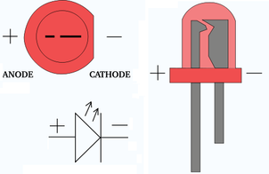

# NES Controller Night Light in Resin

Source: https://www.instructables.com/NES-Controller-Night-Light-in-Resin/

---

## Introduction

## Step 1: Things to Gather

## Step 2: Lets Get Started! Pulling Apart Stuff.

## Step 3: Adding the LED's to the NES

## Step 4: Adding the Circuit and Wires to the LED's

## Step 5: Adding the Solar Panel

## Step 6: Adding the Mercury Switch, Solar Panel and Closing the Case

## Step 7: Emersing in Resin

## Step 8: Polishing the Resin

## Step 9: Finished

---
*55 images archived*
