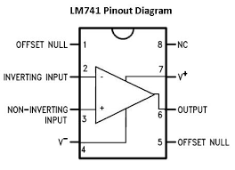
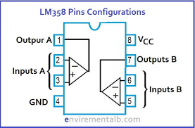
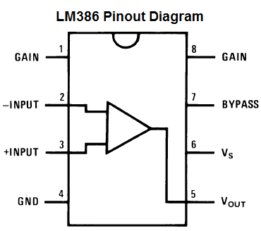

# OP Amp IC Tester

Source: https://www.instructables.com/OP-Amp-IC-Tester/

---

## Introduction

There is nothing more satisfying then building a circuit and having it work as you intended and nothing so infuriating at it failing and not knowing why!

There’s usually a few main culprits that can cause a circuit to fail. There could be a solder bridge or a part missing, maybe you have wired something up incorrectly. All these types of failures can be checked, identified and fixed, but what happens if it’s the IC that fails and how do you check if it is working as it should?

If you use an IC socket, then you could remove the IC and replace with another. The problem though is, you still wouldn’t know if the IC’s faulty or not. To rectify this, I decided to build an IC tester that could test a few common Op amps (along with a Vactrol). The Op amps that it tests are LM358, LM386 and LM741.

Each test uses an LED that flashes to indicate whether the IC is working correctly or not. If the LED stays on or off constantly, then you know that the IC doesn’t function correctly.

I’ve included the Eagle schematics and board design along with the gerber files so you can get a board printed up yourself and make your own.

Let’s get testing!

Hackster did a review on this build also - link below if you want to check it out!

[Hackster Review](https://www.hackster.io/news/a-low-cost-operational-amplifier-tester-to-find-faulty-ics-6dc61a6fe5a6)

## Step 1: Parts & Tools

I have included the parts list in the attached image as well as in a PDF format. You can also find it in the Google drive link I have provided in the next step. Also check out the next step for the PCB printing options.

The links below are to specific parts in the attached parts list

PARTS:

1. 9V Battery holder - [eBay](https://www.ebay.com.au/sch/i.html?_from=R40&_trksid=p2380057.m570.l1313&_nkw=9v+battery+holder+PCB&_sacat=0)

2. 8 dip IC sockets - [eBay](https://www.ebay.com.au/sch/i.html?_from=R40&_trksid=p2334524.m570.l1313&_nkw=8+dip+IC+socket&_sacat=0&LH_TitleDesc=0&_osacat=0&_odkw=9v+battery+holder+PCB)

3. Slider switch - [eBay](https://www.ebay.com.au/sch/i.html?_from=R40&_trksid=p2334524.m570.l1313&_nkw=switch+spdt+PCB+mini&_sacat=0&LH_TitleDesc=0&_osacat=0&_odkw=switch+spdt+PCB)

3. 9 V battery (only if you want to power the tester via a 9V battery. You can also power the board a few other ways.

4.PCB pin headers, Male & female - [eBay](https://www.ebay.com.au/sch/i.html?_from=R40&_trksid=p2334524.m570.l1313&_nkw=pin+male+header+pcb&_sacat=0&LH_TitleDesc=0&_osacat=0&_odkw=pin+male+pcb)

5. The rest of the components like resistors, capacitors, LED's can be found on the attached list of parts

- [Book2](pdfs/Book2.pdf)

## Step 2: How It All Works

I have included 3 IC testers for different Op amp IC’s along with a Vactrol or Optocoupler. I also decided to add a few ways to power the whole circuit, including adding a 9V battery to the back of it! This way there are a few options for me to choose from depending on how I want to provide the power.

All you need to do to test an op amp, is to add it into the IC socket, turn the circuit on and see if the LED/s blink or not. If the LED/s stay on or off, then you will have a fault in the IC. If the IC also starts to heat up, then you will also have a fault.

For the Vactrol/optocoupler, the LED should come on only. If it doesn’t, then it is faulty.

The way the op amp tester’s work is by using the voltage comparator/s inside the op amp. These have an inverting (-) and non-inverting (+) input and an output. You can connect these up in such a way to generate a square wave at the output which results in the LED flashing. The 358 op amp has 2 comparators which is why there are 2 LED’s to test this IC.

The diagrams for each of the IC’s show the inverting and non-inverting inputs along with the output. This is the section of the IC that is tested by the circuit.

## Step 3: Schematic, Board and Gerber Files

I have created a folder in my Google drive which can be found in the below link that has the schematic, PCB and Gerber files

[Google Drive Files](https://drive.google.com/drive/folders/13PytBjeyiZ2nbiYv9zoZ_oaOPXhjzU8L?usp=sharing)

If you wantb to get your own board printed, then just save the gerber zip file and email it to your favourite PCB manufacturer. I use [JLCPCB](https://jlcpcb.com/?gclid=Cj0KCQiA2af-BRDzARIsAIVQUOc5lDybfwXcCif6zTfM1BEXEQ8qkZD-hXFMAUGSv0o-h35Z_iy8m_kaAtcBEALw_wcB) (not affilated) who do a good job of printing the boards and are quick as well.

I think I might do an instucatable soon on how to actually get a PCB printed. It isn't hard but there are a couple steps involved and I remember thinking back when I was starting - what the hell was a gerber file and how do I get one!

## Step 4: Adding the Components to the PCB

This is relatively straight forward and all of the values etc are printed on the board for each component.

STEPS:

1. As always, start with the lowest profile components - In this instance it's the resistors. Solder these into place along with the diodes

2. Next, I like to add the IC sockets as these are low profile as well.

3. Once the IC sockets are in place, add the voltage connectors. For some reason I decided to add 4 different ways to add voltage to this board! I think I wanted to make sure there were options in case I didn't have a certain plug etc. You can also add a 9v battery to the back of you want to as well. You can see that I have done this in the images. However, I had to remove it as I didn't connect it to the switch so power was constantly on. I've fixed this in the schematic and gerber files.

4. Add the capacitors and LED's. That's it! you are now ready to start testing your IC's

## Step 5: Time to Test Some Op Amps!

Now you are all ready to start testing your op amps. This is also a good way to check that the board works as well!

Add an op amp into each of the IC sockets and test to see if: A - the curcuit works, and B - if the op amp is good or not.

The good news is, you can use the tester to test other op amps! For example, if you want to test a 5532 op amp, then just plug it into the LM358 testing circuit. You shouldbe able to test quite a few different op amps with this tester so go ahead and test out what you have and see if you get a blinking LED.

## Downloads

- [Book2](pdfs/Book2.pdf)

---
*26 images archived*
